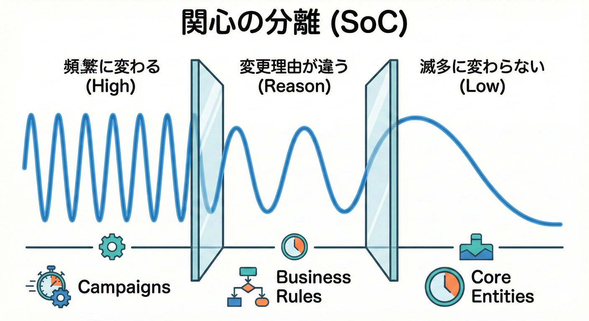
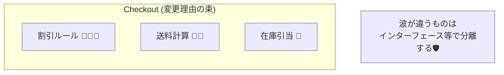
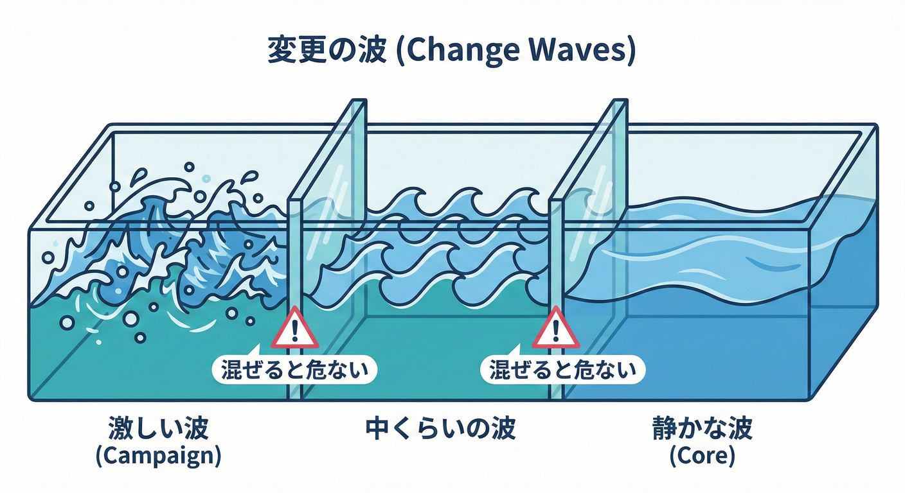

# 第19章：変更理由で切る（SoCの感覚）✂️🌊

## 19.1 今日のゴール🎯✨

この章でできるようになること👇

* ✅ 「どこで変更が起きるか」を“変更理由”で見つけられる
* ✅ 変更の波🌊が違う場所を、境界（BC候補）として切り出せる
* ✅ 「似てるデータ」に騙されずに「責務の違い」で分けられる

---

## 19.2 「変更理由」ってなに？🤔💡

同じ“注文”のコードでも、変わる理由はいろいろあります😵‍💫

たとえば👇

* 🏷️ セール開始で **割引ルール** が変わる
* 🚚 配送会社の改定で **送料計算** が変わる
* 📦 倉庫運用の変更で **在庫引当** が変わる
* 🧾 税制変更で **税計算** が変わる

ここで大事なのはコレ👇

* **変わる理由が違うなら、まとめちゃダメ**🙅‍♀️
* **同じ理由で一緒に変わるなら、まとめてOK**🙆‍♀️

この発想は、SRP（単一責任）の超核心と同じです🧠✨
「1つのモジュール（クラス）は、1つの理由（あるいは1つの“アクター”）で変わるべき」という考え方ですね。([ウィキペディア][1])

---

## 19.3 変更の波🌊ってなに？



変更には「波」があります🌊✨

* 🌊🌊🌊：頻繁に変わる（キャンペーン・運用・UIなど）
* 🌊：たまに変わる（物流契約・一部の業務ルール）
* 🧊：ほぼ変わらない（コアの概念・恒久ルール）

そして理想は👇

* **同じ波（同じ頻度・同じ都合）で変わるものを同じ箱に入れる📦**
* **波が違うものは箱を分ける📦📦**

「同じモジュール内のクラスは同じ“rate of change（変化率）”を持つのが望ましい」みたいな言い方もされます。([tangly Components][2])

---

## 19.4 変更理由で切る：5ステップ手順🧭✍️

### ステップ①：変更が起きそうな点を洗い出す📝

ミニECなら、まずこれが鉄板👇

* 💸 割引（クーポン/会員ランク/キャンペーン）
* 🚚 送料（地域/サイズ/配送業者/無料条件）
* 📦 在庫（引当/戻し/欠品/分割出荷）
* 🧾 請求（税/請求書/締め/支払方法）

### ステップ②：変更の“理由”を書く（ここが主役）🧡

理由は、だいたいこのどれかです👇

* 👩‍💼 どの部署（誰）が言い出す？
* 📣 何の目的で変える？（売上/コスト/法対応/UX）
* ⏰ どのタイミングで変える？（月次/随時/年1など）

### ステップ③：変更の波（頻度）をざっくり付ける🌊

* 🌊🌊🌊：毎週〜毎月
* 🌊🌊：数ヶ月に1回
* 🌊：年1〜数年
* 🧊：ほぼ固定

### ステップ④：影響範囲（壊れやすさ）を付ける💥

* 🔥 影響が大：注文合計/決済/在庫など
* 🌤️ 影響が中：表示/通知/帳票
* 🍃 影響が小：文言/ラベル

### ステップ⑤：波が近いものを束ねてBC候補にする🧺✨

* ✅ “同じ理由”で一緒に変わる → 同じ境界に置きやすい
* ✅ “違う理由”で別々に変わる → 境界を分ける強いサイン

---

## 19.5 「変更の波メモ」テンプレ📒✨

まずはこのフォーマットでOKです😊

* 変更点：
* 変わる理由（誰の都合？）：
* 変更頻度（波🌊）：
* 影響範囲（小/中/大）：
* 関係する用語：
* いま混ざって困ってること：

---

## 19.6 ミニECで実例🛒✨（割引・送料・在庫）

たとえば、同じ「注文合計を出す」でも…中身は別世界です😇

### 例：変更の波メモ（サンプル）🌊📒

**A) 割引（プロモーション）💸**

* 理由：マーケが売上を上げたい📣
* 波：🌊🌊🌊（キャンペーンで頻繁）
* 影響：🔥（合計金額・表示・請求に影響）
* 用語：クーポン、割引率、適用条件

**B) 送料（配送ポリシー）🚚**

* 理由：物流契約やコストが変わる📦💰
* 波：🌊🌊（数ヶ月に1回）
* 影響：🔥（合計金額・配送条件に影響）
* 用語：送料、配送サイズ、地域、無料条件

**C) 在庫引当（在庫ポリシー）📦**

* 理由：倉庫運用・欠品対策が変わる🏭
* 波：🌊🌊（運用改善で時々）
* 影響：🔥（売れる/売れないに直結）
* 用語：引当、確保、戻し、予約

ここでの気づき💡

* “全部注文っぽい”からといって、1つに混ぜると地獄🔥
* **マーケの波🌊** と **物流の波🌊** と **倉庫の波🌊** は、だいたい同期しません🙅‍♀️
  → だから境界候補になる！

---

## 19.7 境界（BC候補）を1回作ってみよう🏷️✨

この章では「候補」でOKです👌（あとで磨く）

たとえば👇

* 💸 **Pricing/Promotion（価格・割引）**
* 🚚 **Shipping（配送）**
* 📦 **Inventory（在庫）**
* 🛒 **Order Management（受注の流れ）**

ポイントはこれ👇

* “注文”という言葉が同じでも、**中のルールが別なら分けてOK**🙆‍♀️
* BCは「言葉とモデルが一貫する範囲」なので、同じ単語でも境界を越えたら別物でいいです✅([Domain Language][3])

---

## 19.8 C#で「変更理由」を分離するミニ例💻✨

### 😵‍💫 変更理由が混ざってる例（悪い香り）

```
csharp
public class OrderService
{
    public decimal CalculateTotal(Order order, Coupon? coupon)
    {
        // 割引ルール（マーケ都合）💸
        var discounted = ApplyDiscount(order, coupon);

        // 送料計算（物流都合）🚚
        var shippingFee = CalculateShippingFee(order);

        // 在庫引当（倉庫都合）📦
        ReserveInventory(order);

        return discounted + shippingFee;
    }

    private decimal ApplyDiscount(Order order, Coupon? coupon) { /* ... */ return 0; }
    private decimal CalculateShippingFee(Order order) { /* ... */ return 0; }
    private void ReserveInventory(Order order) { /* ... */ }
}
```

これ、何がツラい？😵‍💫

* 💸の変更でCalculateTotalが壊れる
* 🚚の変更でもCalculateTotalが壊れる
* 📦の変更でもCalculateTotalが壊れる
  → **“変更理由3つ盛り”** になってて、改修が怖い💥
  （SRPの「理由が増えると壊れやすい」に直撃です）([ウィキペディア][1])

### 😊 変更理由ごとに分ける（小さく分離）

```
csharp
public interface IDiscountPolicy
{
    decimal Apply(Order order, Coupon? coupon);
}

public interface IShippingFeeCalculator
{
    decimal Calculate(Order order);
}

public interface IInventoryPolicy
{
    void Reserve(Order order);
}

public class CheckoutService
{
    private readonly IDiscountPolicy _discount;
    private readonly IShippingFeeCalculator _shipping;
    private readonly IInventoryPolicy _inventory;

    public CheckoutService(
        IDiscountPolicy discount,
        IShippingFeeCalculator shipping,
        IInventoryPolicy inventory)
    {
        _discount = discount;
        _shipping = shipping;
        _inventory = inventory;
    }

    public decimal Checkout(Order order, Coupon? coupon)
    {
        var discountedSubtotal = _discount.Apply(order, coupon);   // 💸
        var shippingFee = _shipping.Calculate(order);              // 🚚
        _inventory.Reserve(order);                                 // 📦

        return discountedSubtotal + shippingFee;
    }
}
```

うれしいこと🎉

* 💸だけ変える → `IDiscountPolicy` の中だけ見ればOK
* 🚚だけ変える → `IShippingFeeCalculator` の中だけ見ればOK
* 📦だけ変える → `IInventoryPolicy` の中だけ見ればOK

つまり👇

* **変更の波🌊を分離すると、壊れる範囲が狭くなる🛡️**
* これがBC設計でも超効いてきます✨

（C# 14 / .NET 10 の最新でも、この“変更理由で分ける”設計原則はずっと有効です✅）([Microsoft Learn][4])



---

## 19.9 ミニ演習（10分）🧩⏱️

次の変更リストを「変更理由（「誰のために直すのか」「どのくらいの頻度で直すのか」を分けるだけで、コードの寿命はグンと伸びるよ💪✨



## 5) まとめ🧡

## 19.9 ミニ演習（10分）🧩⏱️

次の変更リストを「変更理由（誰の都合）」でグルーピングしてみよう💪✨

### 変更リスト📝

1. 新春セール：会員ランクで割引率が変わる💸
2. 送料：沖縄・離島の追加料金が変わる🚚
3. 倉庫：欠品時は“取り寄せ”に回すルール追加📦
4. 税：軽減税率対象の扱い変更🧾
5. 返品：返品可能期間が30日→14日に変更🔁
6. 決済：新しい支払方法を追加💳
7. 配送：日時指定の締切時間が変わる⏰🚚
8. クーポン：併用可否のルール追加🎟️

### やること✅

* A) それぞれ「誰の都合で変わる？」を書いてみる🖊️
* B) 波🌊が近いものを束ねて、BC候補を3〜4個つくる📦
* C) “同じ単語が別物になりそう”な箇所に⚡印を付ける

### 例（答えの一例）🧠✨

* 💸 Promotion/Pricing：1, 8
* 🚚 Shipping：2, 7
* 📦 Inventory/Fulfillment：3
* 🧾 Billing/Tax：4
* 🔁 Returns：5
* 💳 Payments：6

※この“分け方”が正解というより、**変更理由で説明できる**のが正解です🙆‍♀️✨

---

## 19.10 つまずきポイント集🧯😵‍💫

* **「同じデータだから同じ境界」って思っちゃう**
  → 同じ住所でも「配送の住所」と「請求の住所」は別責務、別波🌊の可能性大です📦🧾

* **分けすぎて連携がつらい**
  → 最初は“候補”でOK👌 あとで第23章（粒度）で調整する前提で大丈夫😊

* **“変更理由”が言語化できない**
  → 「誰が文句言う？」「誰が喜ぶ？」で考えると一気に出ます😆

---

## 19.11 お助けAIプロンプト例🤖✨（コピペOK）

* 「この要件一覧を“変更理由（誰の都合）”で分類して。頻度（波🌊）も付けて」
* 「“同じ単語だけど意味が違いそう”な用語を抽出して、衝突ポイントを教えて」
* 「割引・送料・在庫の変更が同じクラスに混ざってる。分離案（インターフェース案）をC#で出して」
* 「この変更の波メモから、BC候補を3〜5個にまとめて。境界名も提案して」
* 「この境界案で“分けすぎ/大きすぎ”のリスクを指摘して、調整案を出して」
  （GitHubのCopilotやOpenAI系の開発支援を想定🙆‍♀️）

---

## 19.12 まとめチェック✅✨

* ✅ 変更点に「誰の都合か」を書けた？
* ✅ 波🌊（頻度・タイミング）が違うものを分けられた？
* ✅ “似てるデータ”じゃなく“責務”で判断できた？
* ✅ 境界候補が「変更理由」で説明できる？
* ✅ 境界内の言葉が一貫しそう？（BCの基本）([Domain Language][3])

（補足：C# 14 / .NET 10 の最新公式情報は Microsoft のドキュメントにまとまっています。）([Microsoft Learn][4])

[1]: https://en.wikipedia.org/wiki/Single-responsibility_principle?utm_source=chatgpt.com "Single-responsibility principle"
[2]: https://blog.tangly.net/ideas/learnings/lectures/swat-literature/11-MicroservicesVsMonoliths%20%28optional%29.pdf?utm_source=chatgpt.com "The Reality Beyond the Hype"
[3]: https://www.domainlanguage.com/wp-content/uploads/2016/05/DDD_Reference_2015-03.pdf?utm_source=chatgpt.com "Domain-‐Driven Design Reference"
[4]: https://learn.microsoft.com/en-us/dotnet/csharp/whats-new/csharp-14?utm_source=chatgpt.com "What's new in C# 14"
