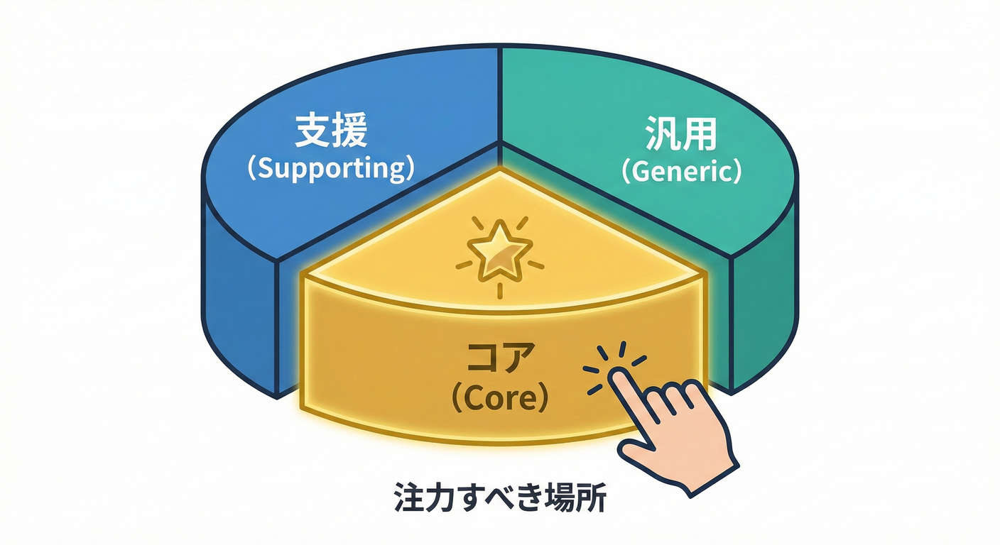
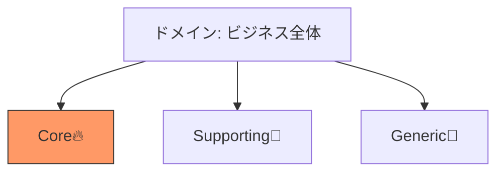
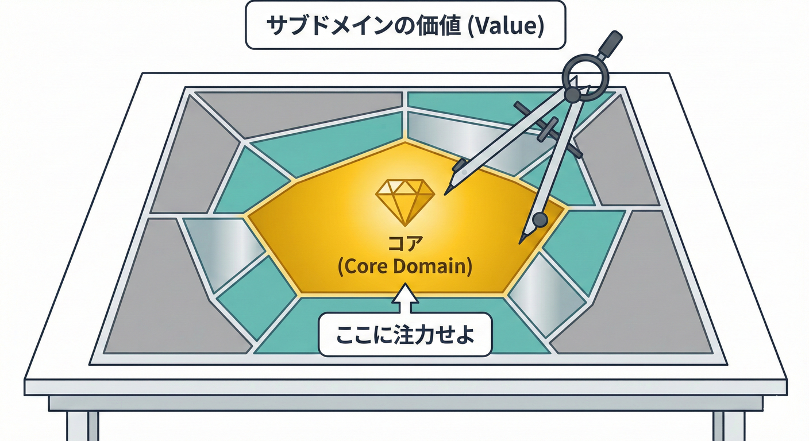

# 第20章：サブドメイン入門A（直感でOK）🧭🍰

## この章でできるようになること 🎯✨

* 「いまのシステムの中で、**どこに力を入れるべきか**」をざっくり見分けられるようになる💪
* サブドメインを **Core / Supporting / Generic** の3つに分けて考えられるようになる🧠✨ ([GitHub][1])
* 「全部大事だから全部コアです😇」を卒業できる🌸

---

## まず超ざっくり：サブドメインってなに？ 🧩

ビジネス全体を「ドメイン」だとしたら、サブドメインはその中の **“仕事のかたまり”** だよ📦✨
ECならたとえば、注文・在庫・配送・請求・会員・決済…みたいに分かれる感じ🛒📦🚚💳

ポイントはこれ👇

* **Bounded Context**：ソフトウェア側の「言葉とモデルが一貫する範囲」🗺️
* **サブドメイン**：ビジネス側の「仕事のまとまり」🏢

この章は、ビジネス側の切り分けで「優先順位」をつける話だよ🧭✨ ([Medium][2])

---

## サブドメイン3兄弟 🍰🍰🍰

サブドメインは、よく **3種類** に分けて考えるよ👇 ([GitHub][1])

| 種類                   | ひとことで          | 例（ECのイメージ）                             | 力の入れ方                |
| -------------------- | -------------- | -------------------------------------- | -------------------- |
| **Core**（コア）🔥       | 勝ち筋そのもの。差別化の源  | 配送体験が命なら「配送最適化」🚚✨／在庫回転が命なら「在庫最適化」📦📈 | 最高の人材＆時間＆テスト🧪💖     |
| **Supporting**（支援）🧰 | 自社っぽいけど勝ち筋ではない | 自社独自の管理画面、社内フロー、簡易な業務処理📝              | シンプルに・早く・壊れにくく🧹     |
| **Generic**（汎用）🧱    | どこでも必要。差別化しない  | 認証/権限🔑、請求書PDF、メール送信✉️、ログ📜            | 既製品・OSS・SaaSでOK🙆‍♀️ |

### 直感で覚えるコツ 🧠✨

* **Core**：ここが強いから会社が勝つ🥇
* **Supporting**：会社に必要だけど、ここで勝つわけじゃない🧰
* **Generic**：世の中に“だいたい正解”がある🧱

（※「Coreは競争優位」「Genericは競争優位になりにくい」みたいな整理がよく説明されるよ） ([モンスターラボエンジニアリング][3])
「どこに注力すべきか？」がわかれば、エンジニアリングリソースの使い方も変わってくるよ🧠✨

---

## 5) まとめ🧡

---

## 「全部コア」になっちゃう理由と、抜け出し方 😵‍💫➡️😊

ありがちなのがこれ👇

* 「売上に関係する＝コア！」
* 「使われる機能＝コア！」

でもね、**売上に関係する機能は全部ある程度関係する**の😇
そこで、コア判定はこうやるとラク👇

### コア判定の3問クイズ 🎲✨

次の質問に「YES」が多いほどCoreっぽい🔥

1. これが強いと**他社に勝てる**？🏁
2. ルールが**自社独自で複雑**？🧠
3. 作るたびに「仕様が変わる・学びが増える」？🔁

逆にこうならGeneric寄り🧱

* 世の中に定番がある（認証、決済、通知など）
* 作っても会社の強みになりにくい
* “ちゃんと動けばよい”寄り

この「戦略と優先順位をそろえる」のが、戦略DDDの大事な狙いだよ🧭✨ ([Medium][2])

---

## ミニECでやってみよう 🛒✨

題材：注文・在庫・配送・請求があるミニECを想像してね📦💳🚚

### ケースA：配送がウリのEC 🚚✨

「翌日配送の精度」「置き配の最適化」「配送コスト最小化」が命！

* **Core候補**：配送計画・配送ルール・例外対応（遅延/再配達）🚚🔥
* **Supporting候補**：社内の出荷指示、倉庫スタッフ向け画面🧰
* **Generic候補**：認証🔑、ログ📜、メール✉️、決済連携💳（既製品や外部連携が多い）

### ケースB：価格・販促がウリのEC 🏷️🔥

「クーポン」「会員ランク」「パーソナライズ割引」が命！

* **Core候補**：価格計算・割引ルール・販促の条件判定🧠🔥
* **Supporting候補**：キャンペーン登録画面、社内承認フロー🧰
* **Generic候補**：認証🔑、メール✉️、請求書PDF🧱

同じECでも「何がコアか」は変わるよ👀✨
つまり **コアは固定じゃなくて、会社の戦略で動く**ってこと🌊 ([Medium][2])

---

## 力の入れ分け、どう変わるの？ ⚖️✨

サブドメイン分類は「設計の美学」じゃなくて、**投資配分の話**💰✨

### Coreに寄せるとこうなる 🔥

* ルールを丁寧に言語化🗣️📒
* “例外ケース”を設計に入れる（ここが価値！）🧠
* テストが増える🧪✨
* 変更を怖くしないために、境界やモデルを大事にする🛡️

### Supportingはこうする 🧰

* できるだけ単純に、手堅く✅
* 凝りすぎない（過剰設計しない）🧹
* 「すぐ直せる」「壊れにくい」を重視🔧

### Genericはこうする 🧱

* まず「買う・使う・のっかる」検討🙆‍♀️
* 自前で作るなら “薄く” 作る（差別化しないので）🥗
* 外部と接続するなら、後で出てくる **ACL** みたいな“翻訳”で中を守る🛡️✨

---

## ミニ演習 ✍️😊

### 演習1：仕分けゲーム 🎮🧩

次を **Core / Supporting / Generic** に分けてみよう👇（理由も1行で！）

* 会員ログイン🔑
* 送料計算🚚💰
* 在庫引当📦
* 請求書PDF出力🧾
* 配送遅延の通知✉️
* キャンペーン割引🏷️

ヒント💡

* “それ自体が強み？”
* “世の中に定番ある？”
* “自社独自の複雑ルール？”

### 演習2：コアにベットする 🎯🔥

「このECは何で勝つ？」を1行で決めて、**Core候補を1つ**選ぼう🧠✨
（例：「配送体験で勝つ！」→ 配送ルールがCore）

---

## つまずきポイントあるある 😇⚠️

* **Genericを自作して消耗する**（例：認証をゼロから作り始める）🔑💦
* **Supportingに凝りすぎる**（社内画面に豪華ドメインモデルを作って疲れる）🧰💦
* **コアが決まってないのにBCだけ分けようとする**（目的が迷子）🗺️😵‍💫

---

## お助けAIプロンプト集 🤖✨

* 「この機能一覧を Core / Supporting / Generic に分類して。理由も1行で」🧩
* 「うちのECの“勝ち筋”を3案出して。勝ち筋ごとに Core候補も」🏁
* 「Genericっぽい領域を、既製品/SaaS/OSSで置き換える案を出して」🧱
* 「Supportingに過剰投資してそうなポイントを指摘して。シンプル化案も」🧹
* 「Coreに入れるべき例外ケース（失敗パターン）を洗い出して」🔥

※IDEのAI支援は、GitHubのCopilotや、OpenAIのCodex系などを想定すると進めやすいよ🤖✨

---

## 今日のまとめ 🎁✨

* サブドメインは「仕事のまとまり」を見て、**Core / Supporting / Generic** に分ける考え方だよ🍰🍰🍰 ([GitHub][1])
* 目的はただ1つ：**限られた時間と才能を、勝ち筋に集中**するため🧭🔥 ([makemeacto.substack.com][4])
* 「全部コア」は卒業して、コアを決める練習をしよう😊✨

[1]: https://github.com/SAP/curated-resources-for-domain-driven-design/blob/main/blog/0002-core-concepts.md?utm_source=chatgpt.com "The Core Concepts of Domain-Driven Design"
[2]: https://medium.com/%40lambrych/domain-driven-design-ddd-strategic-design-explained-55e10b7ecc0f?utm_source=chatgpt.com "Domain-Driven Design (DDD): Strategic Design Explained"
[3]: https://engineering.monstar-lab.com/en/post/2020/05/04/Intro-to-Domain-Driven-Design/?utm_source=chatgpt.com "Introduction to Domain-Driven Design"
[4]: https://makemeacto.substack.com/p/the-benefits-of-strategic-domain?utm_source=chatgpt.com "The benefits of Strategic Domain-Driven Design"
