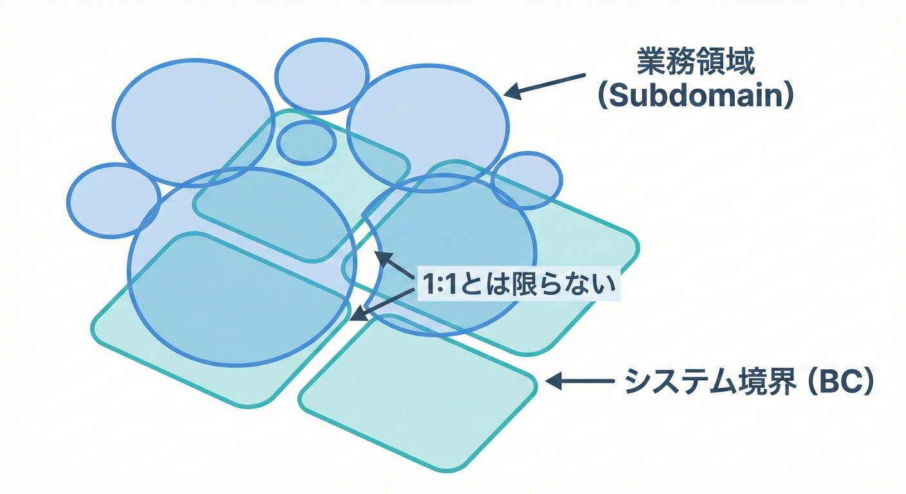
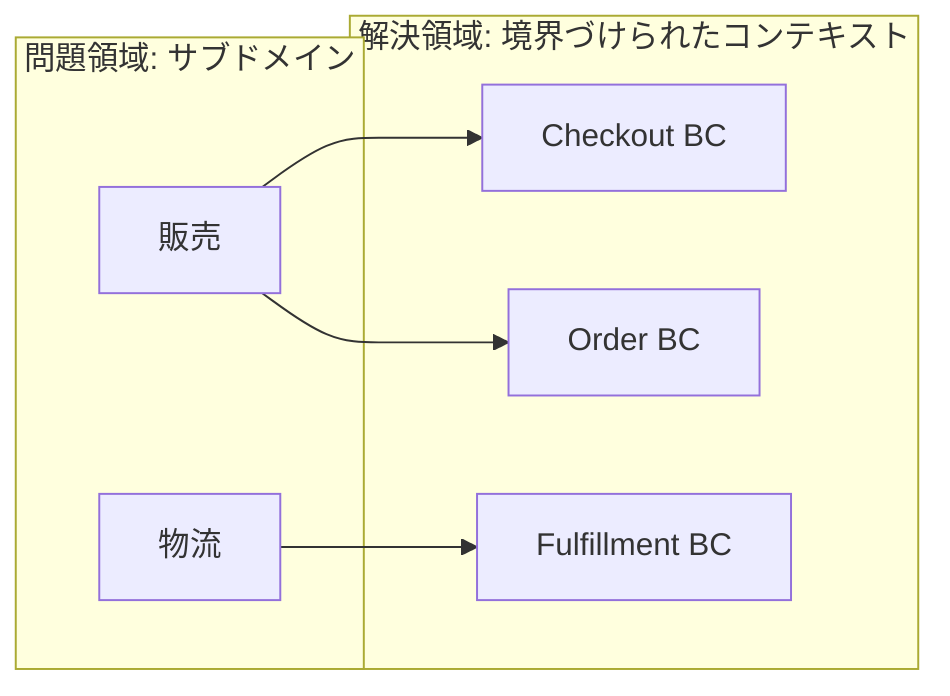
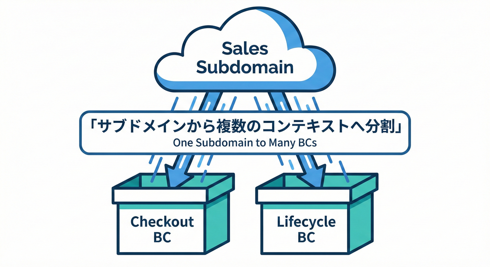
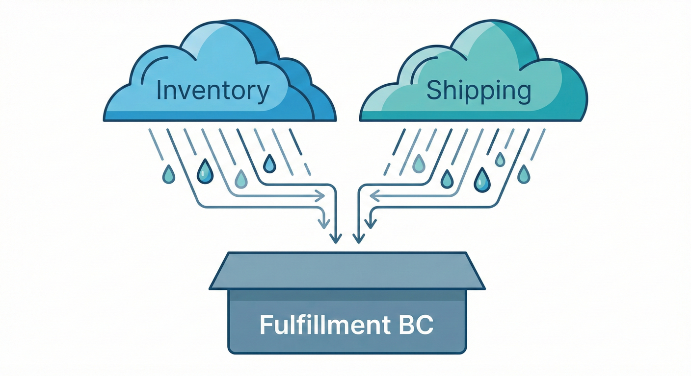
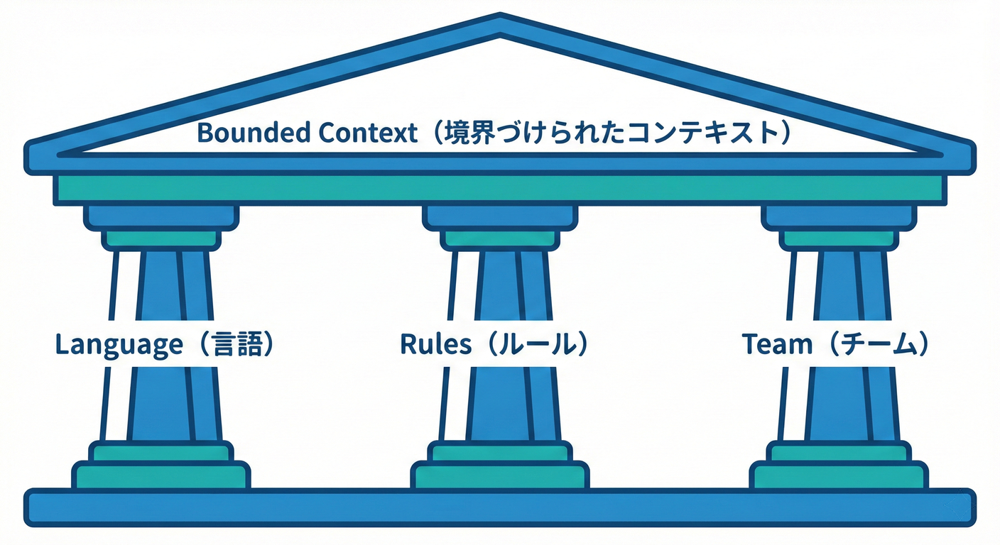
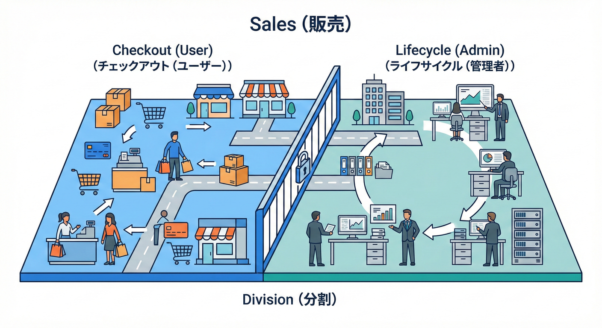
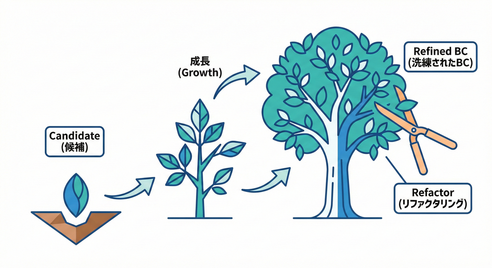
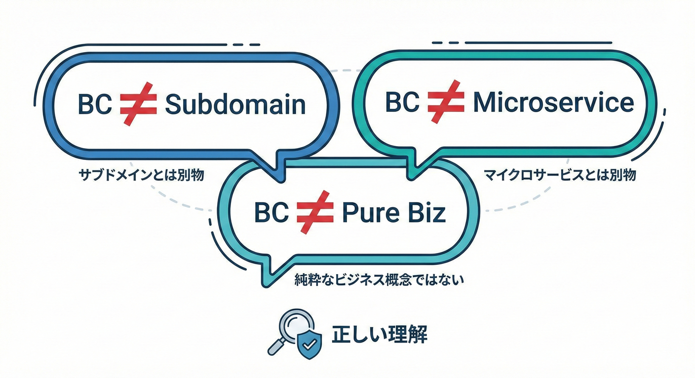

# 第21章：サブドメイン入門B（BCとの関係）🔗

## 1) まず結論：サブドメインとBCは「目的が違う」🧭✨



* **サブドメイン**は「ビジネスの世界をどう区切って理解するか」（問題側の切り方）🍰
* **Bounded Context（BC）**は「ソフトウェアとして、どこまで同じ言葉＆同じモデルでいけるか」（解決側の切り方）🧩

だから……
**サブドメインとBCは、ピッタリ1対1に“なることもある”けど、“決め打ちしない”のが大事**だよ🙆‍♀️✨ ([gorodinski.com][1])



---

## 2) 「1対1じゃない」ってどういうこと？🙅‍♀️➡️🙆‍♀️

よくあるパターンはこの2つ👇

### パターンA：1つのサブドメインが、複数BCに割れる✂️



理由はだいたいコレ👇

* そのサブドメインの中で、**モデル（言葉の意味）が衝突する**💥
* **チームやリリース都合**で、別々に進めたい🏃‍♀️🏃‍♂️
* 「同じ言葉だけど、使い方が違う」が出てきた🌀（例：同じ“注文”でも見たい世界が違う）

「BCは“設計上の選択”」なので、現場の事情で分割するのは自然だよ😊 ([Mathias Verraes' Blog][2])

### パターンB：複数サブドメインを、1つのBCにまとめる🧺



理由はだいたいコレ👇

* まだ規模が小さくて、分けると連携が大変😵‍💫
* 言葉やルールがかなり近くて、**同じモデルで違和感が少ない**✅
* 「まずは動かして学ぶ」フェーズで、境界は後で育てたい🌱

**“いったんまとめる”のも立派な戦略**だよ👌 ([Level Up Coding][3])

---

## 3) じゃあ何を基準に「BC」を決めるの？🔍✨



BCは「この中だけは言葉の意味がブレない！」を守る箱📦
決めるときの見方は、ざっくりこの3つが強いよ👇

### ① 言葉の一貫性🗣️✅

* 同じ単語が**同じ意味**で使われてる？
* 仕様の会話がスムーズ？💬✨
* “翻訳”なしで話せる範囲？📖

### ② ルール（責務）の一貫性🧠✅

* 「何を守るべきか」が揃ってる？
* 似たデータでも、**責任が違う**なら分ける候補📦✨

### ③ 人と組織の都合（現実の壁）👥🧱

* チームが違う、部署が違う、意思決定が違う
* 歴史的事情や、コミュニケーションの摩擦で境界が必要になることもある😇
  ここは「理想」より「事故らない」を優先しがち！ ([martinfowler.com][4])

---

## 4) ミニECで考えてみよう🛒✨（サブドメイン → BCの発想）

題材：注文・在庫・配送・請求があるミニEC📦💳🚚

### (A) サブドメイン（問題側の切り方）例🍰

* **販売**：カート、注文確定、割引など（ここが勝ち筋ならコア寄り🔥）
* **フルフィルメント**：在庫引当、出荷準備など📦
* **請求/決済**：請求書、入金、返金💳
* **顧客対応**：キャンセル、問い合わせ、返品など☎️

### (B) BC（解決側の切り方）例📦

* OrderManagement（注文の世界）🧾
* Inventory（在庫の世界）🏬
* Shipping（配送の世界）🚚
* Billing（請求の世界）💳

この例だと「1サブドメイン≒1BC」っぽく見えるけど……ここからが本番😎✨

---

## 5) “1対1じゃない”を、同じ題材で体験💡

### 例1：販売サブドメインが、2つのBCに割れる✂️🛒



「販売」の中でも、会話が分かれがち👇

* **Checkout（購入手続き）BC**

  * 住所入力、決済手段、クーポン適用、購入確定
  * “ユーザー体験”中心の言葉が多い💖

* **OrderLifecycle（注文ライフサイクル）BC**

  * 受注、キャンセル条件、返品条件、状態遷移
  * “業務ルール”中心の言葉が多い📜

同じ「注文」でも、見たい世界が違って衝突しやすいなら、**割ってスッキリ**があり🙆‍♀️✨ ([Mathias Verraes' Blog][2])

### 例2：在庫＋配送を、1つのBCにまとめる🧺📦🚚

初期フェーズだと、

* 在庫引当と出荷指示がほぼ同じ会話で回る
* 分けるとAPI調整がつらい
  みたいなことが多い😵‍💫

そういうときは **Fulfillment（出荷遂行）BC** としてまとめちゃうのもアリ👌✨ ([Level Up Coding][3])

---

## 6) “境界候補→あとで整える”が強い理由💪🌱



BCって、最初から完璧に当てるのは難しいの🥺
だからおすすめの流れはこれ👇

1. **サブドメインをざっくり置く**（問題の地図）🗺️
2. **イベントや用語の固まりからBC候補を作る**（会話の固まり）🌩️🧺
3. **衝突が出たところを境界として強化**（事故を減らす）🛡️
4. **チーム・リリース都合も含めて調整**（現実に勝つ）👥

BCは「設計上の選択」で、状況に合わせて育てるものだよ🌱✨ ([Mathias Verraes' Blog][2])

---

## 7) ありがちな勘違いトップ3😇💥



1. **「サブドメイン＝そのままBC」だよね？**
   → “そうなることもある”けど、**決め打ちすると危険**⚠️（衝突が出たら割る/まとめるが必要） ([Mathias Verraes' Blog][2])

2. **「BC＝マイクロサービス1個」だよね？**
   → それも決め打ちは危険⚠️（BCはまず“言葉とモデルの境界”） ([Medium][5])

3. **「境界はビジネスだけで決まる」よね？**
   → 実際はチーム・歴史・人間関係も効くよ👥🧱 ([martinfowler.com][4])

---

## 8) ミニ演習🎮✅（10分）

### お題：ミニECの「販売」サブドメインを、BCに落としてみよう🛒

1. 次の言葉を見て、「同じ単語だけど意味がズレそう」なものに印をつけてね🖊️

* 注文 / 顧客 / 住所 / 金額 / キャンセル / 返品

2. 「購入の会話」と「注文の運用の会話」で、登場する言葉を分けてみよう🧺

* 購入：カート、クーポン、支払い方法、購入確定…
* 運用：受注、出荷待ち、キャンセル期限、返品可否…

3. その結果、BC案を2パターン作ってみよう✌️

* 案A：Checkout BC ＋ OrderLifecycle BC（分割）
* 案B：OrderManagement BC（まとめ）

最後に、それぞれのメリット/デメリットを一言で✨

* 速さ🚀 / 分かりやすさ👀 / 変更に強い🛡️ / 連携コスト📨

---

## 9) つまずきポイント救急箱🧰🚑

* **「分けるほどの根拠がない…」**
  → その時点では“仮”でOK👌 まずは衝突ログ（どの言葉が揉めたか）を取ろう📝
* **「分けすぎて連携が地獄…」**
  → まとめるのも正解🙆‍♀️ “今の規模”に合わせよう📏
* **「境界を越えるたびに用語が壊れる…」**
  → それは後半の章でやる **契約（DTO）/ACL** の出番📨🛡️（境界を守る道具！）

---

## 10) お助けAIプロンプト例🤖✨（コピペOK）

（GitHub OpenAI のコーディング支援ツールに投げる想定だよ💬）

```text
ミニEC（注文・在庫・配送・請求）の説明文から、
1) サブドメイン候補を3〜5個に分けて
2) 各サブドメインの「目的」を1行で
3) その後、BC案を2パターン（分割寄り/統合寄り）出して、
それぞれのメリット・デメリットを箇条書きで教えて
```

```text
「注文」という言葉が出てくる文章を渡すので、
“意味が変わっている可能性がある箇所”を指摘して。
さらに、そのズレを解消するBC分割案を提案して。
```

---

## 11) この章のチェックリスト✅✨

* サブドメインは「問題の地図」🍰
* BCは「解決の境界（言葉とモデルの一貫性）」📦
* **1対1は“可能性のひとつ”で、決め打ちしない**🙅‍♀️
* 衝突・責務・チーム都合で「割る/まとめる」を選ぶ✂️🧺
* まず候補を出して、現実の事故から育てる🌱

[1]: https://gorodinski.com/blog/2013/04/29/sub-domains-and-bounded-contexts-in-domain-driven-design-ddd/?utm_source=chatgpt.com "Sub-domains and bounded contexts in Domain-Driven ..."
[2]: https://verraes.net/2025/08/domain-and-bounded-contexts-dont-map-one-on-one/?utm_source=chatgpt.com "No, Your Domains and Bounded Contexts Don't Map 1 on 1"
[3]: https://levelup.gitconnected.com/strategic-ddd-by-example-bounded-contexts-mapping-d94ffcd45954?utm_source=chatgpt.com "Strategic DDD by Example: Bounded Contexts Mapping"
[4]: https://www.martinfowler.com/bliki/BoundedContext.html?utm_source=chatgpt.com "Bounded Context"
[5]: https://medium.com/%40vladikk.com/bounded-contexts-are-not-microservices-ead44b8d6e35?utm_source=chatgpt.com "Bounded Contexts are NOT Microservices"
