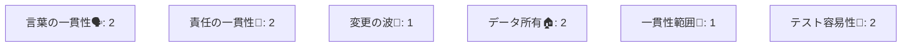
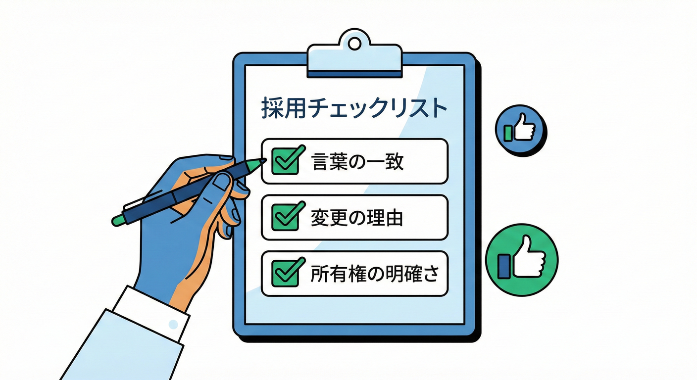

# 第22章：境界候補の絞り込みチェックリスト✅

## この章のゴール🎯💖

* いくつか出てきた「境界候補（BC候補）」を、**迷わず絞り込める**ようになる✅
* 「なんとなく分けた」じゃなくて、**理由つきで分けられる**ようになる🧠✨
* そして、あとで育てやすい「仮置きの境界」を作れるようになる🌱🗺️

---

## 1) まず大事な前提：BCは“完璧に決める”より“壊れにくく仮置き”でOK😊🧡

Bounded Contextは「この範囲では言葉とモデルの意味が一貫するよ」という**意味の境界**だよ〜、というのが基本の考え方。Martin Fowlerも「大きなモデルやチームを扱うために、境界を分けて関係も明示する」と説明しているよ。([martinfowler.com][1])

なので、最初から1発で正解を当てるよりも、**“混ぜないで済む境界”を先に作る**のが勝ち筋✨
この章では、そのための「絞り込みチェック」を手に入れるよ💪💕

---

## 2) 絞り込みの考え方：候補を「テストで壊れない単位」に寄せる🧪🛡️

境界を切ると、変更の影響（爆風💥）が小さくなるのがうれしいポイント！
「境界がしっかりしてると、機能を作る・テストする・デプロイする範囲が閉じる」みたいな話が出てくるよ。([martinfowler.com][2])

だからチェックリストは、ざっくり言うと👇

* **言葉が混ざらない？**🗣️
* **責任が混ざらない？**🎒
* **変更の波が同じ？**🌊
* **境界をまたぐと重い？**🪨
* **テスト単位として成立する？**🧪✅

---

## 3) 境界候補の絞り込みチェックリスト✅（そのまま使える版💎）

## A. 言葉（ユビキタス言語）の一貫性チェック🗣️📘

**Q1. 同じ単語が、ここでは同じ意味？**

* ✅ Yes：OK！その候補は“言葉の一貫性”が強い✨
* ❌ No：赤信号🚨 → **境界を分ける候補**（または用語を分ける必要）

**Q2. 用語を説明するとき「前提」が同じ？**（例：「注文＝出荷対象」なのか「注文＝請求対象」なのか）

* ❌ 前提が違うなら、同居させると衝突しやすい😵‍💫

**ミニEC例🛒**

* 受注側の「注文」：顧客が買った意思決定
* 請求側の「注文」：お金を請求する根拠
  → 同じ “Order” に詰めると、仕様の会話が毎回ズレる💥

---

## B. 責任（やること）の一貫性チェック🎒✨

**Q3. この候補は「何を守る場所」？1行で言える？**

* ✅ 言える：強い💪（例：在庫の引当ルールを守る）
* ❌ 言えない：だいたい混ざってる😇（境界が曖昧）

**Q4. “やる理由”が同じ変更だけが集まってる？**

* 割引の仕様が変わる
* 送料の仕様が変わる
* 在庫引当の仕様が変わる
  この「変わり方」が別々なら、同じ箱に入れると地獄になりがち🔥

---

## C. 変更の波（変更頻度・理由）の一致チェック🌊🔁

**Q5. その候補の中のルールは、だいたい一緒に変わる？**

* ✅ 一緒に変わる：まとめる価値あり🙆‍♀️
* ❌ 別々に変わる：分ける価値あり✂️✨

**コツ💡**

* 「キャンペーン割引」は変更が多い
* 「請求締め」は月次で堅い
  → “波”が違うと、同居すると足を引っ張る😵‍💫

---

## D. 境界をまたぐと重い？チェック🪨⚡

**Q6. 候補Aと候補Bの間に「確認・調整・例外対応」が多い？**

* ✅ 多い：そこは境界っぽい（別チーム/別責任のサイン）
* ❌ 少ない：同一コンテキストでまとまる可能性

**例🛒📦**
「出荷していい？」の確認が毎回必要 → 在庫と配送の境界が濃いかも📌

---

## E. データ所有（どっちのもの？）チェック🏠🔐

**Q7. そのデータの“最終決定権”はどこ？**

* 住所：配送が正？請求が正？
* 金額：注文合計？請求額？（税/手数料/締め処理で変わることあるよね）

**目安✅**

* 「この値を更新していいのは誰？」が1つに決まるなら、そのBCが所有者🏠
* 所有が曖昧なら、境界設計が詰まってるサイン🚨

---

## F. 一貫性（同時に正しくしたい範囲）チェック🔁✅

**Q8. “同時に正しい必要”があるのはどこまで？**

* 例：「支払い確定」と「出荷確定」を**同一トランザクション**でやりたい？

  * ✅ 必要：同じ境界に寄せる候補
  * ❌ いらない（多少のズレOK）：境界を分けやすい🕒✨

**ヒント💡**
境界をまたぐと「すぐ一致しない（最終的整合性）」が起きやすい。だから、UXとして許せるズレを決めるのが大事😊

---

## G. テスト単位として成立する？チェック🧪✅

**Q9. その候補だけで、ルールのテストが書ける？**

* ✅ 書ける：良い境界👏
* ❌ 書けない：境界の中に“外の都合”が入り込んでるかも😵‍💫

**補足📝**
最近の開発環境だと、.NET 10（LTS）＋C# 14の流れで、テストやリファクタ前提の開発がより当たり前になってきてるよ。Microsoftの公式情報でも、.NET 10がLTSとして2028年11月までのサポートで、Visual Studio 2026も同時期に提供されているよ。([Microsoft for Developers][3])
（言い換えると：**長く育てる設計**がしやすい時代なので、境界も“育てる前提”でOK🌱）

---

## H. チームと境界の相性チェック🤝🗺️

**Q10. その候補は「1チームで握れる」サイズ？**

* ✅ 握れる：自律しやすい🚀
* ❌ 握れない：意思決定が遅くなりやすい🐢

チーム境界とシステム境界を近づける発想は、Team Topologiesでも「良い境界の見つけ方」として語られてるよ。Team Topologies ([teamtopologies.com][4])

---

## 4) 迷ったら「点数化」で決める🎲✅（ふわっと議論を終わらせる道具）

候補が3〜8個くらい出ると、「どれもそれっぽい…」ってなるよね😇
そこでおすすめが **簡易スコアリング**✨

## スコアの付け方（例）📊

各項目を **0〜2点**でつけるよ👇

* 2点：かなり満たす😍
* 1点：まあ満たす🙂
* 0点：満たさない😵

| 観点        | 見るポイント               |
| --------- | -------------------- |
| 言葉の一貫性🗣️ | 同じ単語が同じ意味？           |
| 責任の一貫性🎒  | 1行で説明できる？            |
| 変更の波🌊    | 一緒に変わる？              |
| データ所有🏠   | 更新権限が明確？             |
| 一貫性範囲🔁   | 同時に正しい必要は？           |
| テスト🧪     | その候補だけでテストできる？       |
| 連携の重さ🪨   | 境界またぐと重い？（重いなら境界っぽい） |

**合計が高いもの＝“境界として育てやすい候補”**になりやすいよ🌱✨

---

## 5) ミニ演習📝✨：ミニECの境界候補を絞ってみよう🛒📦🚚💳

## お題🎯

次の候補が出てきたとするよ👇

1. 受注管理（Order Management）
2. 在庫管理（Inventory）
3. 配送管理（Shipping）
4. 請求管理（Billing）
5. “全部まとめた注文”コンテキスト（Big Order）😇

この5つを、チェックリストで絞ってみてね✅

## 進め方🧭

1. 「注文」「顧客」「金額」「住所」の意味を、各候補で1行ずつ書く📝
2. 変更の波（割引・在庫引当・配送手配・請求締め）を候補ごとにメモ🌊
3. Q1〜Q10をYes/Noで埋める✅
4. 点数化して上位を残す📊

## 解答例（方向性）🧁

* 「Big Order」は、言葉と責任が混ざりやすく、変更の波も別々なので点が伸びにくい😇
* 受注・在庫・配送・請求は、**言葉がズレやすい単語**（注文/顧客/金額/住所）をそれぞれの意味で持てるので、境界として自然になりやすい🌸
  （この“言葉の一貫性で守る”のがBCの芯だよ🗣️✨）([martinfowler.com][1])

---

## 6) よくあるつまずきポイント集😵‍💫🩹

## つまずき①：「データが似てるから同じBCでいいよね？」

➡️ **似てる＝同じ責任**じゃないよ〜！
住所は「配送の住所」と「請求の住所」で責任が違うことが多い📦💳

## つまずき②：「境界を切ると連携が増えて怖い」

➡️ 連携は増えるけど、**爆風が減る**のが価値💥➡️🛡️
境界が曖昧だと、連携が少なく見えて“内部で大爆発”するタイプになりがち🔥([martinfowler.com][2])

## つまずき③：「外部のモデルがそのまま入り込む」

➡️ それは後で地獄になりやすい😇
外部/別BCとつなぐときは、**翻訳レイヤ（ACL）**で守る考え方が定番だよ🛡️
（Azureの設計パターンやAWSのガイドでも、ACLは“モデルの翻訳で自分を守る”として説明されてる）([Microsoft Learn][5])

---

## 7) この章専用：お助けAIプロンプト例🤖✨（コピペOK）

* 「このイベント一覧を、目的が近い固まりにグルーピングして。固まりごとに“責任を1行”で名付けて」🧺🏷️
* 「同じ単語（注文/顧客/金額/住所）の意味が候補ごとにどう違うか、表にして」🗣️📊
* 「境界候補A/Bの間に発生しそうな“調整・確認・例外対応”を列挙して」🪨⚡
* 「候補ごとに“変更の波”を推測して。割引/在庫/配送/請求で頻度もつけて」🌊📝
* 「点数化（0〜2点）できるように、質問文をYes/Noに整形して」✅🔧

---

## まとめ🎀✨

* BC候補は、**言葉・責任・変更の波**で絞るのが強い🗣️🎒🌊
* 迷ったら **チェックリスト→点数化**で決める📊✅
* “完璧な正解”より、**混ぜない仮置き**で育てる🌱🗺️

次章では、この「境界の粒度（小さすぎvs大きすぎ）」を気持ちよく判断できるようにしていくよ📏✨

[1]: https://www.martinfowler.com/bliki/BoundedContext.html?utm_source=chatgpt.com "Bounded Context"
[2]: https://martinfowler.com/articles/linking-modular-arch.html?utm_source=chatgpt.com "Linking Modular Architecture to Development Teams"
[3]: https://devblogs.microsoft.com/dotnet/announcing-dotnet-10/?utm_source=chatgpt.com "Announcing .NET 10"
[4]: https://teamtopologies.com/key-concepts-content/finding-good-stream-boundaries-with-independent-service-heuristics?utm_source=chatgpt.com "Finding good stream boundaries with Independent Service ..."
[5]: https://learn.microsoft.com/en-us/azure/architecture/patterns/anti-corruption-layer?utm_source=chatgpt.com "Anti-corruption Layer pattern - Azure Architecture Center"
