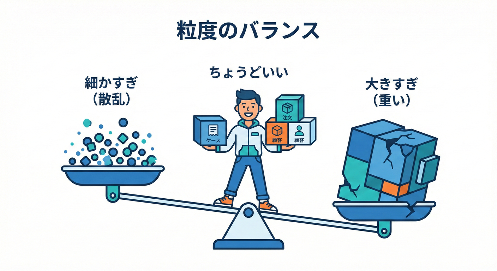
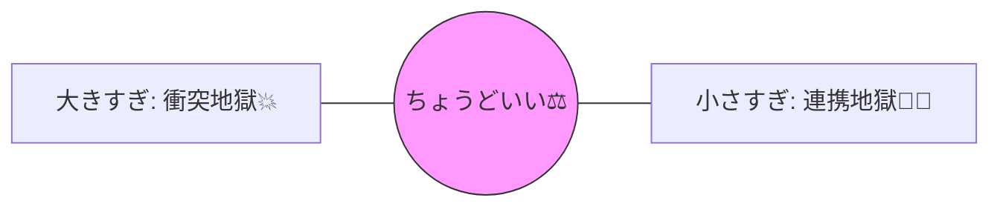

# 第23章：粒度の基本（小さすぎvs大きすぎ）📏

## この章のゴール🎯

* **Bounded Context（BC）の「大きさ（粒度）」をどう決めるか**が分かる😊
* **小さすぎ・大きすぎの“地獄サイン”**を見抜ける👀⚠️
* ミニEC（注文・在庫・配送・請求）を例に、**“ちょうどいい仮置き”**ができる🛒✨

---

## 1) 粒度ってなに？🍰📏



BCの粒度＝「この“会話（言葉）とモデル”が、どこまで同じ意味で通じる範囲にするか」だよ〜🗣️✨

ポイントはこれ👇

* BCは**“ひとつの業務能力（business capability）”**を担当するのが基本の考え方💪
* その代わり、BCをまたぐときは **契約（API/イベント/DTO）**でつながる📨

これは Microsoft のガイドでも、サービス（やモジュール）が**1つの業務能力を、BCの中で自律的に実装する**イメージとして説明されてるよ。([Microsoft Learn][1])



---

## 2) 「大きすぎBC」あるある💥（衝突地獄）

BCがデカすぎると、**同じ言葉が同じ意味で保てなくなる**のがしんどいポイント😵‍💫

### 大きすぎのサイン🚨

* 「注文」「顧客」「住所」「金額」などの言葉が、部署や機能ごとに意味ズレる🌀
* `Customer` が **会員**でもあり、**請求先**でもあり、**配送先**でもあり…万能化💣
* 仕様変更が入るたびに、別領域まで巻き込んで改修が雪崩れる🌨️

さらに、人が増えるほど **同じBC内でモデルと言葉が分裂しやすい**（そして統一が辛い）って話も有名👥💥
Eric Evans の DDDリファレンスでは、BC内で人数が増えるとモデルが断片化しやすく、でも細かくしすぎると統合と一貫性を失う、と注意してるよ。([Domain Language][2])

---

## 3) 「小さすぎBC」あるある😵‍💫（連携地獄）

逆に、BCを細かくしすぎると今度は **“つなぐ作業” が主役**になるよ〜📡💦

### 小さすぎのサイン🚨

* ちょっとしたユースケース（例：注文確定）に **3〜5個のBCが会話**してる📞📞📞
* 連携のたびに DTO が増殖、イベントが増殖、調整が増殖📦🧨
* 「結局どこが責任持つの？」が毎回あいまいになる🤷‍♀️

DDDの考え方でも、細かく分けすぎると **統合や一貫性という“おいしい部分”が失われる**って注意があるよ。([Domain Language][2])

---

## 4) じゃあ「ちょうどいい粒度」ってどう決めるの？🧭✨

コツは **“1個のBCで、会話がスムーズに完結するか”** を見ることだよ💬🚀

### 判断軸はこの5つ（超実戦）✅

1. **言葉が一貫してる？**🗣️

   * そのBCの中で「注文」がブレない？（状態や金額の定義が同じ？）

2. **責任が一貫してる？**🎒

   * “何のためのモデル？”が1行で言える？（例：受注を正しく管理する、在庫を正しく引き当てる）

3. **変更の波が同じ？**🌊

   * 割引・送料・在庫ルール・請求ルール…変わり方が違うなら分ける候補✂️

4. **同時に正しくしたい範囲（トランザクション感覚）**🔁

   * 「ここは同時に確定したい」がBCをまたぐなら、粒度を見直すサイン🧠

5. **連携の重さ（会話の回数）**📞

   * 1ユースケースで、BC間の往復が多すぎるなら“小さすぎ”疑い😵‍💫

そして、Vaughn Vernon は「BCは、その業務領域のユビキタス言語を全部含めるのに十分大きく、でもそれ以上は大きくしない」的な考え方を述べてるよ。([Dokumen][3])

---

## 5) ミニECで「粒度の仮置き」をやってみよう🛒✨

まずは **“会話のまとまり”** で仮置きしてOK👌（最初から完璧はムリ！）

例として、こういう分け方が自然になりやすい👇

* **受注管理（Order Management）**：注文受付、注文状態、注文合計（注文視点）📦
* **在庫管理（Inventory）**：引当、在庫数、欠品、入荷📦📉
* **配送管理（Shipping/Fulfillment）**：出荷、配送先、追跡番号🚚📮
* **請求/決済（Billing/Payments）**：請求書、支払い、返金💳🧾

ここで大事なのは、**同じ「住所」でも意味が違っていい**ってこと🏠✨

* 受注の住所：注文時点のスナップショット（後から変わっても注文は変えない）📦
* 配送の住所：配送ラベルとして必要な項目やフォーマットが主役🚚

---

## 6) C#で“境界の違い”を見える化するミニ例💻✨

「同名だけど意味が違う」を **namespace で分ける**と、衝突が目で見えるよ👀

```csharp
namespace ECommerce.OrderManagement
{
    // 注文のための住所（注文時点のスナップショット）
    public record OrderAddress(string PostalCode, string Prefecture, string City, string Line1);
}

namespace ECommerce.Shipping
{
    // 配送のための住所（配送ラベル向けに項目が違ってもOK）
    public record ShippingAddress(string PostalCode, string FullName, string AddressLine, string PhoneNumber);
}
```

この時点で「住所って1個に統一すべきでは？」って思ったら、それは良い疑問🤔✨
でも **“統一すると会話が混ざる”** なら、分けた方が安全なことが多いよ（混ぜると後で爆発しがち💥）。([Domain Language][2])

---

## 7) 粒度ミスを直す「方向」だけ覚えよう🔧✨

* **大きすぎ**っぽい → **言葉の衝突点（注文/顧客/金額/住所など）**から切る✂️
* **小さすぎ**っぽい → **1ユースケース内の往復（連携回数）**が多いところをまとめる🧲

「BCをどう分けるか」は、最終的には **境界同士の契約をどう作るか**（API/イベント/DTO）にも直結するよ。([Microsoft Learn][4])

---

## 8) ミニ演習📝✨（15〜25分）

### 演習1：イベントを“会話のまとまり”で分ける🌩️🧺

次のイベントを、まずは **3〜5グループ**に分けてみてね👇

* 注文が作成された
* 支払いが承認された
* 在庫が引き当てられた
* 欠品が検出された
* 出荷が作成された
* 追跡番号が発行された
* 請求書が発行された
* 返金が確定した

👉 グループ名（仮）を付けて、「そのグループの目的」を1行で書く✍️✨

### 演習2：小さすぎチェック📞😵‍💫

「注文確定」ユースケースで、BC間の呼び出しが **7回**発生してるとする📞📞📞
👉 “まとめるならどことどこ？”を1案出して、理由を一言で💡

### 演習3：大きすぎチェック💥🌀

`Order` の中に、出荷・請求・在庫の状態が全部入り、ifが増え続けてる💣
👉 “分けるならどこから？”を **衝突しやすい単語**（住所/金額/顧客/状態など）で指定してね🔍

---

## 9) つまずきポイント集🧩（あるある！）

* 「最初から正解のBC分割を当てたい」→ **当てなくてOK**🙆‍♀️
  まずは仮置きして、**衝突（大きすぎ）or 往復（小さすぎ）**で育てる🌱

* 「共通にした方がDRYでは？」→ **DRYより“意味の一貫性”が優先**な場面があるよ📌
  “同じ形のデータ”でも“責任”が違えば別物になりやすい🧠✨

* 「BC＝マイクロサービス？」→ 近いけど、まずは **境界を設計として決める**のが先🗺️
  サービス化は後からでもできる👌（境界が曖昧なまま分散すると余計しんどい💦）([Microsoft Learn][1])

---

## 10) この章の「お助けAIプロンプト」🤖✨

* 「このイベント一覧を、会話のまとまりで3〜5グループに分けて。各グループの目的も1行で」🌩️
* 「“大きすぎBC”のサインを、今回のミニEC例で具体化して列挙して」💥
* 「“小さすぎBC”のサインを、連携回数・データ重複・運用コストの観点で列挙して」📞
* 「この2つの境界案を比較して、結合度/凝集度/変更の波/トランザクション観点で短く評価して」⚖️
* 「“住所”を Order と Shipping で分けるべきか、責任の違いで説明して」🏠

---

## まとめ🎀✨

* **大きすぎ**：言葉が衝突してモデルが混ざる💥
* **小さすぎ**：連携が増えて“つなぐ作業”が主役になる😵‍💫
* まずは **会話のまとまりで仮置き** → **衝突（大きすぎ）/往復（小さすぎ）**で調整🔁✨

[1]: https://learn.microsoft.com/en-us/azure/architecture/guide/architecture-styles/microservices?utm_source=chatgpt.com "Microservices Architecture Style - Azure Architecture Center"
[2]: https://www.domainlanguage.com/wp-content/uploads/2016/05/DDD_Reference_2015-03.pdf "Microsoft Word - pdf version of final doc - Mar 2015.docx"
[3]: https://dokumen.pub/vaughn-vernon-implementing-domain-driven-design-978-0321834577.html?utm_source=chatgpt.com "Vaughn Vernon - Implementing Domain-Driven Design ..."
[4]: https://learn.microsoft.com/en-us/dotnet/architecture/microservices/architect-microservice-container-applications/identify-microservice-domain-model-boundaries?utm_source=chatgpt.com "Identifying domain-model boundaries for each microservice"
