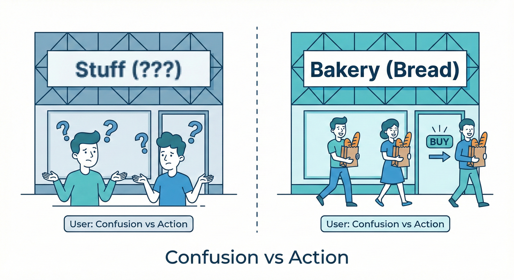
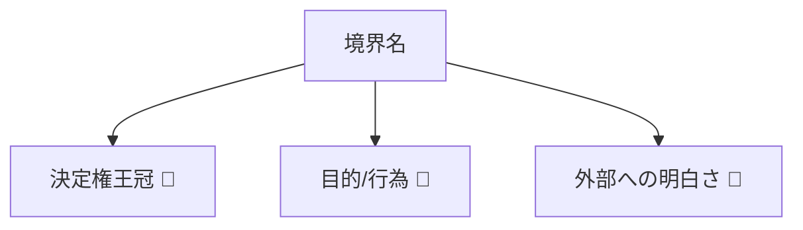
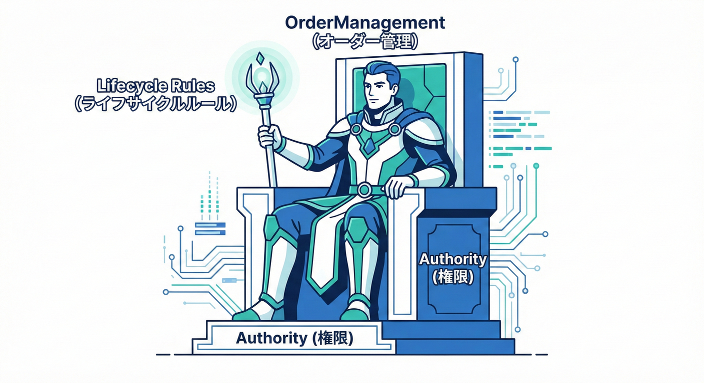
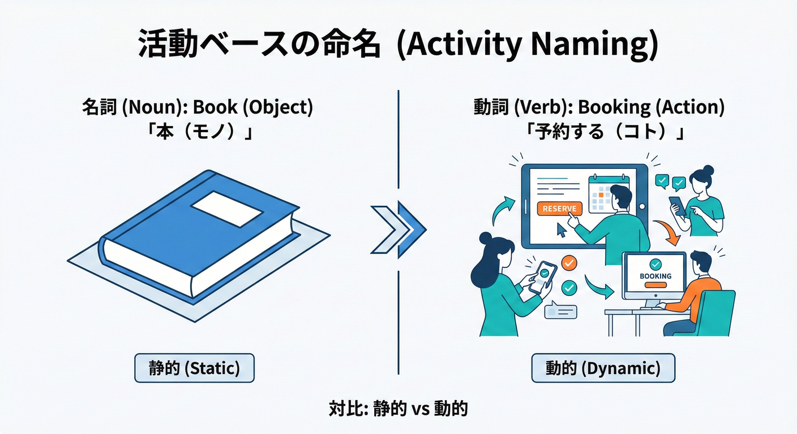
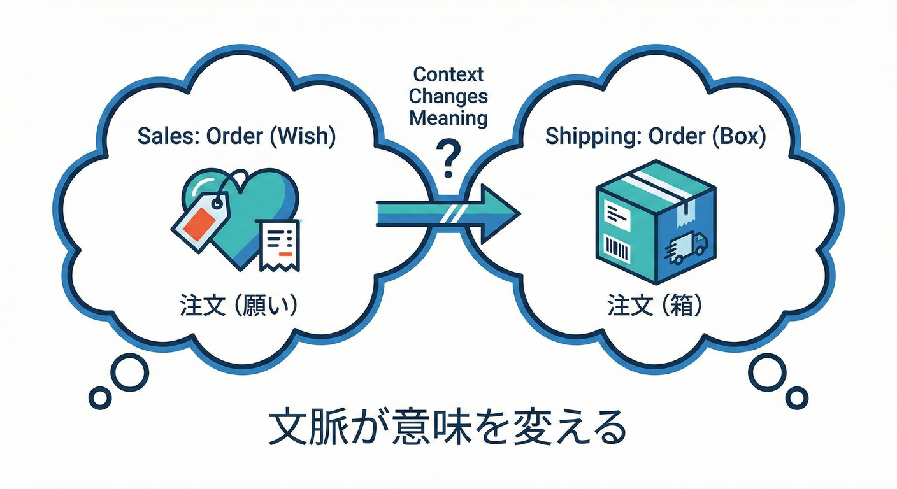
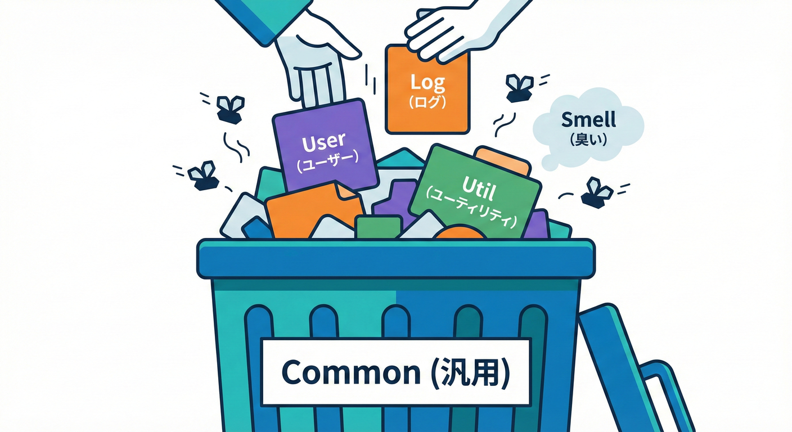
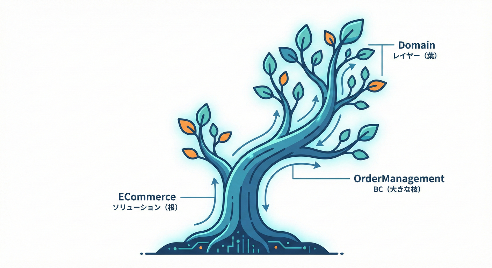

# 第24章：境界の命名ルール（ここ超大事）🏷️✨

## この章でできるようになること🎯

* 「その境界が **何を担当するのか**」が一瞬で伝わる名前を付けられるようになる🙆‍♀️✨
* “注文BC”みたいな **曖昧ネーム事故**を避けられるようになる⚠️
* 名前から **責任・用語・変更理由**が透けて見える状態を作れるようになる🔍💡

---

## なんで「名前」がそんなに大事なの？🥺🧠



Bounded Contextは、ざっくり言うと「ある範囲の中では言葉とモデルの意味が一貫して、外では別物でもOK」という考え方だよね。だからこそ、境界の“看板”になる **名前がブレると、会話もコードもブレる**の…！😵‍💫  ([martinfowler.com][1])

名前が強いと、こんな良いことがあるよ👇✨

* 会話で「それはどっちの注文？」が減る🗣️✅
* 変更の相談が「どの境界の話か」すぐ分かる🔁
* 実装の分割（プロジェクト/名前空間/契約）が迷子にならない💻🧭
* “境界をまたぐ連携”が設計しやすくなる🤝🗺️ ([Microsoft Learn][2])



---

## まず結論：良い境界名の条件はこれ🌟


## ✅ 条件1：**「何を決める場所か」**が分かる（決定権が見える）👑



境界名は、「その境界が持つルール（決めごと）」を連想できるのが強いよ💪
例：

* **OrderManagement** → 注文の受付・ライフサイクルを決める
* **Billing** → 請求・支払い・金額確定を決める
* **Fulfillment** → 出荷・配送の段取りを決める

「注文」って単語が入ってても、**“何の注文なのか”**が伝わるのがポイント🧠✨

---

## ✅ 条件2：**名詞だけじゃなく“行為/目的”の匂い**がある🏃‍♀️💨



DDDの文脈では、境界は「活動テーマ」で名付けられることが多い（例：Booking / Scheduling / Routing みたいに）と言われるよ📌 ([Stack Overflow][3])
だから、**画面名やテーブル名**みたいな “ただの名詞” より、

* 何をする場所？（受付する？確定する？出荷する？）
* 何を最適化する場所？（配送効率？請求確実性？在庫整合性？）
  が見えると強いよ🔥

---

## ✅ 条件3：**境界の外の人が読んでも誤解しない**🧑‍🤝‍🧑

境界名は、別チーム・未来の自分・レビューする人にも効く📣
「注文BC」だと、受注なの？出荷なの？請求なの？って全部に見えちゃう😇
だから、**外部向けの説明**として通用する名前が良いよ✨

---

## ✅ 条件4：**“同じ単語が別意味”を許す前提で、衝突を起こしにくい**💥➡️🛡️



別の境界で同じ単語が使われても、意味が違うのは普通に起きる（むしろ起きる前提）だよ。だから「同じ名前＝同じ意味」と思わせると事故る⚠️
同名でも意味が違う例（よくある）：

* Order（受注側）＝「お客さんの購入意思＋状態遷移」
* Order（配送側）＝「箱詰め・配送指示のためのリスト」
  みたいに、同じOrderでも中身が違うのが自然なんだよね📦🚚 ([Axoniq][4])

---

## ダメな名前あるある集（避けると一気に上達）😇⚠️

## ❌ 1語でデカすぎ：「Order」「Customer」「Product」みたいなやつ

* 便利そうに見えるけど、だいたい境界が混ざる💥
* 「Orderの仕様変更です」って言われたとき、どのOrderか分からない😵‍💫

## ❌ “雑まとめ”ネーム：「Common」「Core」「General」「Master」みたいなやつ



* 何でも入って、何でも参照されて、境界崩壊の温床🧱💥
* “共通化”が進むほど、分割が不可能になる（こわい）😨

## ❌ 組織名・部署名そのまま：「営業」「管理部」みたいなやつ

* 組織改編で名前が死ぬ🪦
* 仕事内容の境界とシステム境界がズレやすい😇

---

## 良い名前を作る「4ステップ」レシピ🍳✨


ミニEC（注文・在庫・配送・請求）でやってみよう🛒📦🚚💳

## Step 1：その境界の“守るべきルール”を3つ書く📝

例（受注まわり）：

* 注文は「作成→確定→キャンセル」みたいな状態遷移がある
* 割引の適用ルールがある
* 注文合計の計算責任がある

➡️ ルールが出るほど、その境界の正体が見えてくる👀✨

## Step 2：境界の“目的”を1行にする🏹

* 「注文のライフサイクルを一貫して管理する」
* 「在庫の引当と増減を正として扱う」
* 「配送の進捗と指示を扱う」
* 「請求の確定と支払い状態を扱う」

## Step 3：名前候補を3つ出す（短く・具体）🏷️

* OrderManagement / Ordering
* InventoryManagement / StockControl
* Shipping / Fulfillment
* Billing / Payments

## Step 4：3つの質問でふるいにかける✅

1. その名前だけで「何を決める場所」か分かる？👑
2. 「Xの仕様変更」と聞いたとき、迷わずその境界だと言える？🔁
3. “同じ単語が別意味”になっても混乱しない？🧠

---

## ミニECの「命名例」💡（なぜその名前が良いの？）

ここではありがちな分割例で、名前のニュアンスを比べてみるよ😊

* **OrderManagement**（受注管理）🧾

  * 注文の受付・状態遷移・合計金額の確定など「注文の正」を持つ
* **InventoryManagement**（在庫管理）📦

  * 在庫数・引当・入出庫の「在庫の正」を持つ
* **Fulfillment**（配送/出荷）🚚

  * 梱包・配送指示・配送進捗の「出荷の正」を持つ
* **Billing**（請求）💳

  * 請求確定・支払い状態・入金の「請求の正」を持つ

ポイントはぜんぶ同じで、**“その境界が正とする決定”が見える名前**にすることだよ✨ ([Microsoft Learn][2])

---

## コード側の命名に落とすコツ（C#）💻✨

2026の最新C#環境だと、Visual Studio 2026 + .NET 10 + C# 14 が前提にできるよ（＝名前空間/プロジェクト分割もやりやすい）🧰✨ ([Microsoft Learn][5])

## ✅ “境界名＝プロジェクト名/名前空間の根っこ”にする🌳



* 境界名が強いと、ソリューションが読書みたいに読める📚✨
* 逆に境界名が弱いと、参照関係もフォルダも迷子になる🧭💦

### 例（プロジェクト/名前空間の雰囲気）

```csharp
// Solution: ECommerce

ECommerce.OrderManagement
ECommerce.InventoryManagement
ECommerce.Fulfillment
ECommerce.Billing

// Namespaces（例）
ECommerce.OrderManagement.Domain
ECommerce.OrderManagement.Application
ECommerce.OrderManagement.Contracts
```

ここで **Contracts**（境界外に見せる言葉）を境界名の下に置けると、
「境界を越える＝契約」って発想が自然に育つよ📨✨

---

## 命名チェックリスト（保存版）✅📌

* 境界名を聞いて「担当の決定（ルール）」が想像できる？👑
* その境界のユビキタス言語が育ちそう？📒🌱
* 似た境界と並べたとき、違いが一瞬で分かる？👀
* “Order”みたいな衝突単語があっても、境界名が助けになる？🛟
* 「Common/Core」みたいな逃げ名になってない？😇

---

## ミニ演習（10分）⏱️✍️

## お題：このイベント固まりに名前を付けてみよう🌩️

次のイベントの固まりに、境界名を1つ付けてね（英語でも日本語でもOK）😊✨

**固まりA**

* 注文が作成された
* 注文が確定された
* 注文がキャンセルされた
* 割引が適用された

**固まりB**

* 在庫が引き当てられた
* 入荷が登録された
* 出庫が確定した

**固まりC**

* 出荷指示が作られた
* 伝票番号が発行された
* 配送状況が更新された

## 自己採点（これを満たせば満点💯）

* “注文BC / 在庫BC” みたいに **雑にしない**
* その固まりの **正（決定権）** が見える名前にする👑
* A/B/Cを並べて見たときに、役割がかぶらない✅

---

## お助けAIプロンプト例🤖✨

* 「このイベント一覧の“目的”を1行で言語化して」📝
* 「境界名の候補を3つ出して、誤解ポイントも添えて」🏷️⚠️
* 「“Order”が複数の意味になりそう。境界名で衝突を減らす案を出して」💥➡️🛡️
* 「境界名をプロジェクト名/名前空間に落とす命名案を出して」💻📁

---

## つまずきポイント救急箱🧰💡

## 😵「名前が決めきれない…」

➡️ まず“仮名”でOK！ただし **仮名でも雑名は禁止**⚠️
「OrderManagement(仮)」みたいに、目的が分かる仮名にしよう😊

## 😵「境界がまだ曖昧で、名前も曖昧になる…」

➡️ それ、超ふつう！🌸
“境界を育てる”前提で、**イベント固まりの目的**から名前を作ると前に進めるよ🏃‍♀️💨

## 😵「同じ単語が別境界で出てきて不安…」

➡️ 正常です🙆‍♀️
同名が起きても混乱しにくいように、境界名で意味の輪郭を作るのがコツだよ🖊️✨ ([Kalele][6])

---

次章では、この「良い名前」を共有DBや所有権の話につなげて、境界が崩れる典型パターンを倒していくよ🧱💥

[1]: https://www.martinfowler.com/bliki/BoundedContext.html?utm_source=chatgpt.com "Bounded Context"
[2]: https://learn.microsoft.com/en-us/dotnet/architecture/microservices/architect-microservice-container-applications/identify-microservice-domain-model-boundaries?utm_source=chatgpt.com "Identifying domain-model boundaries for each microservice"
[3]: https://stackoverflow.com/questions/64794211/ddd-bounded-context-naming?utm_source=chatgpt.com "DDD bounded context naming - domain driven design"
[4]: https://www.axoniq.io/blog/bounded-contexts-with-axon?utm_source=chatgpt.com "Bounded contexts with Axon"
[5]: https://learn.microsoft.com/en-us/dotnet/csharp/whats-new/csharp-14?utm_source=chatgpt.com "What's new in C# 14"
[6]: https://kalele.io/naming-shadow-concepts-across-bounded-contexts/?utm_source=chatgpt.com "Naming \"Shadow\" Concepts Across Bounded Contexts - Kalele"
