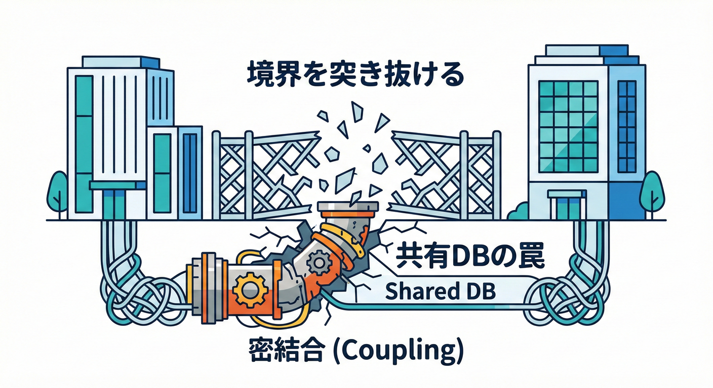
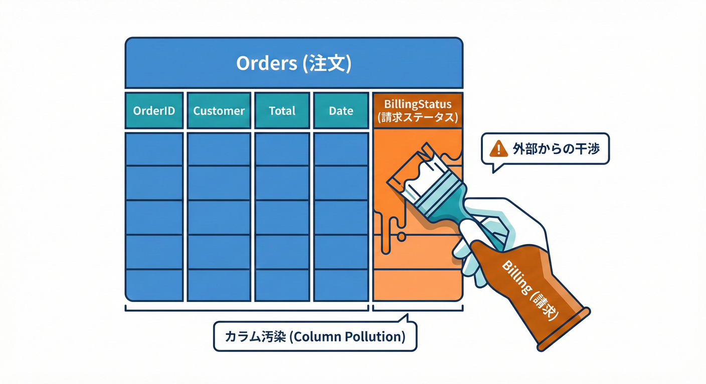
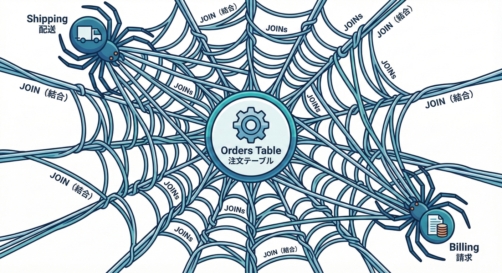
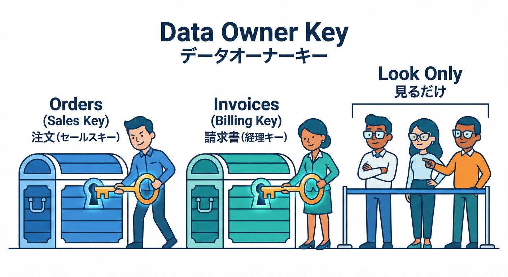
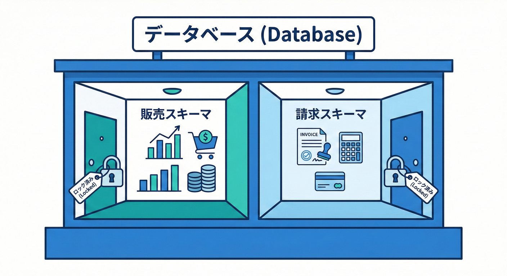
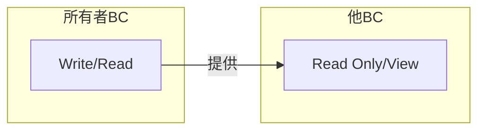
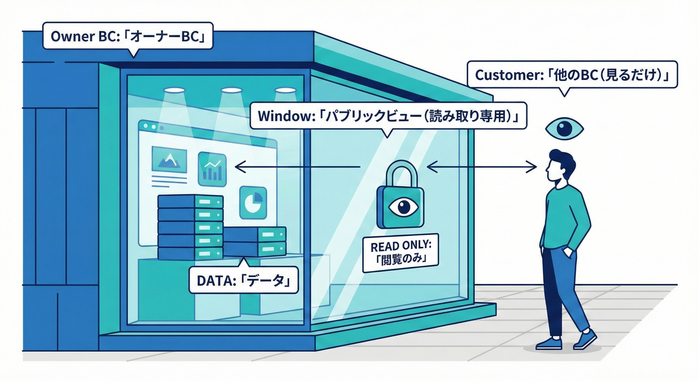
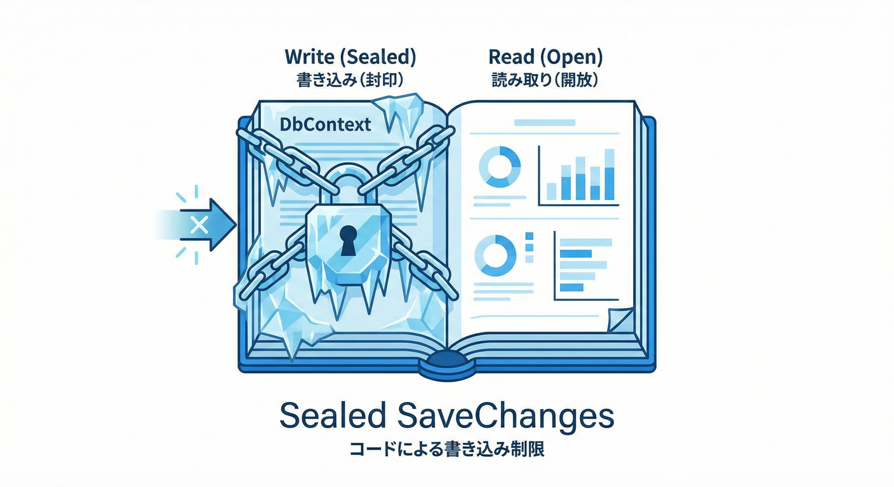
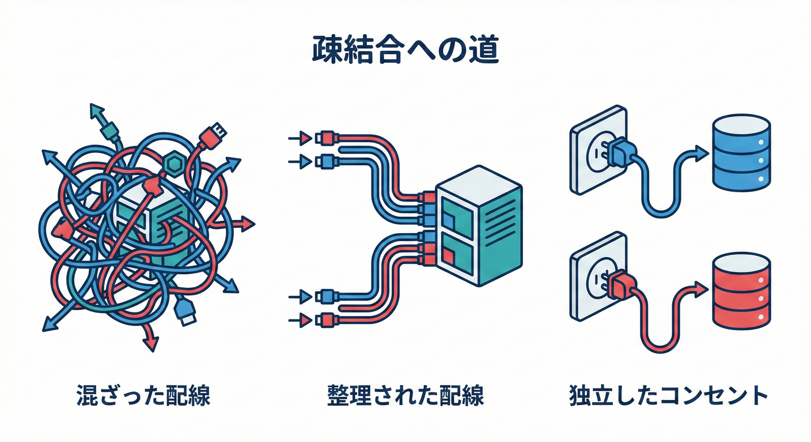

# 第25章：共有DBが境界を壊す（超あるある）🧱💥

## この章のゴール🎯✨

* 「共有DB（同じテーブルを複数のBCが自由に触る）」が **なぜ** ヤバいのかを腹落ちさせる😵‍💫
* 「じゃあどうする？」の現実的な落とし所（段階的な対策）を持ち帰る👜🌸
* C#（EF Core）で **“読めるけど触らない”** をコードと権限で守れるようになる🔒💻

---

## まず結論：共有DBは“境界の壁”に穴を開ける🧨🕳️



共有DBをやると、BCが分かれててもこうなりがち👇

* 片方の都合でテーブル変更 → もう片方が壊れる💥（同時リリース強制）
* 同じ列名でも意味がズレる → バグが“仕様っぽく”見えて発見が遅れる😇
* “ちょっとJOINしたい”が増える → いつの間にか依存地獄🕸️

これは、**統合をDBでやってる** 状態に近いよ〜、という話。Martin Fowlerも「Integration Database（複数アプリが1つのDBで統合される）」として整理してるよ。([martinfowler.com][1])

---

## ミニECで起きる「あるある事故」🛒💥（1分で分かる）

BCをこう分けたとするね👇

* 受注管理BC：注文を受けて状態管理する📦
* 請求BC：請求書を作って支払い管理する💳
* 配送BC：送り状・配送状況を管理する🚚

ところが、みんなが同じ `Orders` テーブルを触れる状態だと…

## 事故①：請求BCが “便利だから” 列を追加する💳➕



`Orders` に `BillingStatus` を追加して運用開始。
→ 受注管理BCは「注文状態だけで完結したい」のに、請求の都合が混ざる😵‍💫

## 事故②：配送BCが “一回で取りたい” からJOINしまくる🚚🔗



「注文＋請求＋顧客＋住所」をJOINして画面表示。
→ いつの間にか「配送BCが、他BCの内部構造に依存」してて、変更できなくなる🧱

## 事故③：緊急対応で “直DB更新” が始まる🧯

「とりあえずSQLで直しちゃえ！」
→ どのBCのルールで直したの？ が分からなくなって、再発祭り🎆

---

## 共有DBがダメになりやすい理由（超重要）⚙️⚠️

## 1) 変更が“連鎖”する（境界の意味が消える）🔁💥

テーブルは“みんなの共有物”になると、**誰も責任を持たなくなる**のがあるある😇
結果：

* スキーマ変更が「全員同時リリース」前提になる
* 小さな改善が大仕事に育つ🌱→🌳

## 2) “同じ単語”が混ざる（意味の衝突）🧨

DBは列名が同じなら同じに見えるけど、BCが違えば意味が違ってOKなはず。
共有DBはこれを無理やり混ぜるので、BCの良さが消えるよ🙅‍♀️

## 3) データの主導権が不明（所有者がいない）🏠❓


「このデータのルールは誰が決めるの？」が曖昧になると、

* 不整合が起きる
* “直した人が正義” になる
* 結果、品質が運に寄っていく🎲

ちなみに、マイクロサービス文脈だと「各サービスが自分のデータを持つ」が基本として整理されてるよ（考え方の参考にしてね）。Microsoftの設計ガイドでも、各サービスが自分のデータを管理する前提で課題（整合性など）を説明してる。([Microsoft Learn][2])

---

## 最初に決める：データの「所有者」ルール🏠🔒



共有DBを避ける第一歩はこれ！

## ✅ ルール：テーブル（または概念）には必ず所有者BCがいる

* 所有者BC：**書いていい（Write）** ✅
* 他BC：原則 **書いちゃダメ** 🙅‍♀️（読むだけなら条件付きでOK）

### 例（ミニEC）

* `Orders` の所有者：受注管理BC
* `Invoices` の所有者：請求BC
* `Shipments` の所有者：配送BC

ここが決まると、「誰の言葉・ルールでそのデータが正しいのか」が固定されてスッキリするよ✨

---

## 現実的な“落とし所”3段階🪜✨

理想と現実の間を、段階で攻めよう💪

## レベルA：BCごとにDB（理想に近い）🏝️

* いちばん境界が強い
* でも運用コストが増える（接続先・バックアップ・監視など）🧰

（この方向性は「各サービスが自分のデータを持つ」の王道に沿うよ）([Microsoft Learn][2])

## レベルB：物理DBは1つでも、スキーマを分ける（現実的）🏢🏠



* `sales` スキーマは受注管理BCの家🏠
* `billing` スキーマは請求BCの家🏠
* `shipping` スキーマは配送BCの家🏠
* それぞれ**権限で壁を作る**🔒



---

「DBは1つで楽したいけど、好き勝手に触るのは防ぎたい」人におすすめ👍

## レベルC：他BCは“読むだけ”＋公開ビュー（Published View）👀📢



* 他BCは **SELECTだけ**（書き込み権限なし）
* 読む対象は「公開用ビュー（または公開用テーブル）」に限定
* 公開ビューは所有者BCが責任を持って提供する

これが、章タイトルにある **“読めるけど触らない”** の実装だよ🔒✨

※「Shared database（複数サービスが同じDBを自由に触る）」自体はパターンとして説明されることもあるけど、自由アクセスにすると結合が強くなりやすい点は要注意だよ。([microservices.io][3])

---

## C#で「読めるけど触らない」を守る（EF Core）💻🔒

ここから実装の形にするよ〜✨

> 参考：EF Core 10 は .NET 10 前提で、2025年11月リリースのLTSとして整理されてるよ。([Microsoft Learn][4])

## 1) BCごとに DbContext を分ける（超基本）📦

* 受注管理BC：`OrderDbContext`
* 請求BC：`BillingDbContext`
* 配送BC：`ShippingDbContext`

これだけでも「境界ごとの“見える世界”」が整理されて事故が減る👍

```csharp
// 受注管理BC（所有者）
public sealed class OrderDbContext : DbContext
{
    public DbSet<Order> Orders => Set<Order>();

    public OrderDbContext(DbContextOptions<OrderDbContext> options) : base(options) { }
}

// 請求BC（所有者）
public sealed class BillingDbContext : DbContext
{
    public DbSet<Invoice> Invoices => Set<Invoice>();

    public BillingDbContext(DbContextOptions<BillingDbContext> options) : base(options) { }
}
```

## 2) “読むだけDbContext” を作って、SaveChangesを封印する🧊🔒



「他BCのデータが必要。でも書いちゃダメ」をコードで強制✨

```csharp
// 請求BCの中で、受注データを読むだけのコンテキスト
public sealed class OrderReadOnlyDbContext : DbContext
{
    public DbSet<OrderReadModel> Orders => Set<OrderReadModel>();

    public OrderReadOnlyDbContext(DbContextOptions<OrderReadOnlyDbContext> options) : base(options) { }

    public override int SaveChanges() =>
        throw new InvalidOperationException("Read-only context: SaveChangesは禁止だよ🚫");

    public override Task<int> SaveChangesAsync(CancellationToken cancellationToken = default) =>
        throw new InvalidOperationException("Read-only context: SaveChangesは禁止だよ🚫");
}

public sealed class OrderReadModel
{
    public Guid OrderId { get; set; }
    public decimal OrderTotal { get; set; }
    public string OrderStatus { get; set; } = "";
}
```

さらに強くするなら、DB側でも「SELECT専用ユーザー」を作って、書き込み権限を剥がすのが鉄板🔐
（コードだけだと、別の手段で書けちゃう可能性が残るからね）

## 3) “公開ビュー”を読む（他BCはテーブル直読みしない）👀📢

所有者BCが「公開用の形」を作ってあげるイメージ✨

```sql
-- 受注管理BCが提供する公開ビュー例
CREATE VIEW sales.vw_orders_public AS
SELECT
  OrderId,
  OrderTotal,
  OrderStatus
FROM sales.Orders;
```

他BCは **このビューだけ** を読む（元テーブルは見えない or 見ない）って運用にすると安定するよ👌

---

## 「でも連携は必要だよ？」問題の解き方🤝📨

共有DBをやめたら、BC同士はこうやって連携するのが王道👇

## 連携の基本セット✨

1. **API**（同期）📞：今すぐ必要な確認だけ聞く
2. **イベント**（非同期）📮：起きた事実を通知する
3. **複製（読み取り用）**📚：表示用に持っておく（正のデータは所有者が持つ）

このへんの「各サービスが自分のデータを持つと、整合性が課題になるよね」って話も公式にまとまってるよ。([Microsoft Learn][2])

---

## つまずきポイントあるある😵‍💫➡️回避法✅

## あるある①：「参照だけならOK」が増殖する👀

* 参照が増えるほど、他BCの都合に引っ張られるよ〜🕸️
  ✅ 回避：参照は **公開ビュー or DTO** に限定して、内部テーブルへ直アクセスを禁止🙅‍♀️

## あるある②：「共通テーブル作れば早い」が毒になる☠️

* “共通”はだいたい境界を溶かす魔法の言葉😇
  ✅ 回避：共通化したいなら、まず **所有者** を決めて「公開」する📢

## あるある③：外部キーでガチガチに結ぶ🔗

* BC跨ぎFKは、変更を鎖でつなぐのと同じ😵‍💫
  ✅ 回避：BC間はID参照に留めて、整合性は契約（API/イベント）で担保する方向へ🧾

---

## ミニ演習（手を動かすよ〜）🧩✨

## 演習1：テーブル所有者マップを作ろう🗺️🏠

次の表を埋めてみてね👇（答えは1つじゃないけど、筋が通ってるのが大事✨）

| データ       | 所有者BC | 他BCが欲しい理由 | 提供方法（API/イベント/公開ビュー） |
| --------- | ----- | --------- | -------------------- |
| Orders    |       |           |                      |
| Invoices  |       |           |                      |
| Shipments |       |           |                      |

---

## 演習2：“書き込み禁止”を権限で作る🔐

* DBユーザーA：受注管理BC用（salesスキーマに書ける）
* DBユーザーB：請求BC用（salesはSELECTだけ）

できたら、「請求BCが sales.Orders にUPDATEしようとして失敗する」状態を作れたら勝ち🏆✨

---

## 演習3：公開ビューだけ読む ReadOnlyDbContext を完成させる👀💻

* `vw_orders_public` を `OrderReadModel` にマッピング
* `SaveChanges()` が必ず例外になるのを確認
* ついでに「読み取り専用の接続文字列」を別にしてみる（事故防止）🚧

---

## お助けAIプロンプト🤖✨（コピペOK）

* 「このDBスキーマで、BC境界を壊してる“共有”ポイントを列挙して」🧱🔍
* 「Ordersテーブルの“所有者BC”を決めて、他BCへの提供方法を3案（API/イベント/ビュー）で」📦📨
* 「このSQL（JOIN多め）を、公開ビュー＋DTOで依存が弱くなる形にリライトして」🔧✨
* 「ReadOnlyDbContextで“更新が混ざる事故”を防ぐ設計チェック項目を10個出して」✅🧪
* GitHub Copilot向け：「このクラスが境界を越えて参照してるか検出するテスト（アーキテクチャテスト）案を作って」🧠🔎
* OpenAI Codex向け：「sales.vw_orders_public に合わせた OrderReadModel とマッピングを生成して」🧩✨
一気にやろうとせず、影響の少ないところから少しずつ「DBの物理的な分離」へ向かうのが現実的だよ🧱➡️✨



---

## 5) まとめ🧡

* 共有DBは「便利そう」に見えるけど、**境界・言葉・変更の自由**をまとめて壊しがち🧱💥 ([martinfowler.com][1])
* まずは **所有者を決める** → 次に **他BCは“読むだけ”** → 最後に **公開（契約）で連携** が安定ルート🏠🔒📢
* コード（ReadOnlyDbContext）＋DB権限（SELECT専用）の二段ロックが超つよい🔐💪

[1]: https://martinfowler.com/bliki/IntegrationDatabase.html?utm_source=chatgpt.com "Integration Database"
[2]: https://learn.microsoft.com/en-us/azure/architecture/microservices/design/data-considerations?utm_source=chatgpt.com "Data Considerations for Microservices - Azure"
[3]: https://microservices.io/patterns/data/shared-database.html?utm_source=chatgpt.com "Pattern: Shared database"
[4]: https://learn.microsoft.com/en-us/ef/core/what-is-new/ef-core-10.0/whatsnew?utm_source=chatgpt.com "What's New in EF Core 10"
