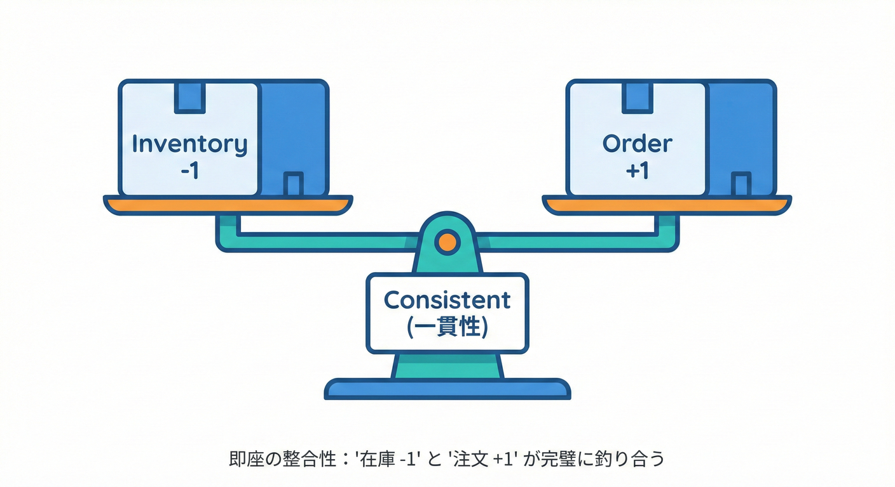
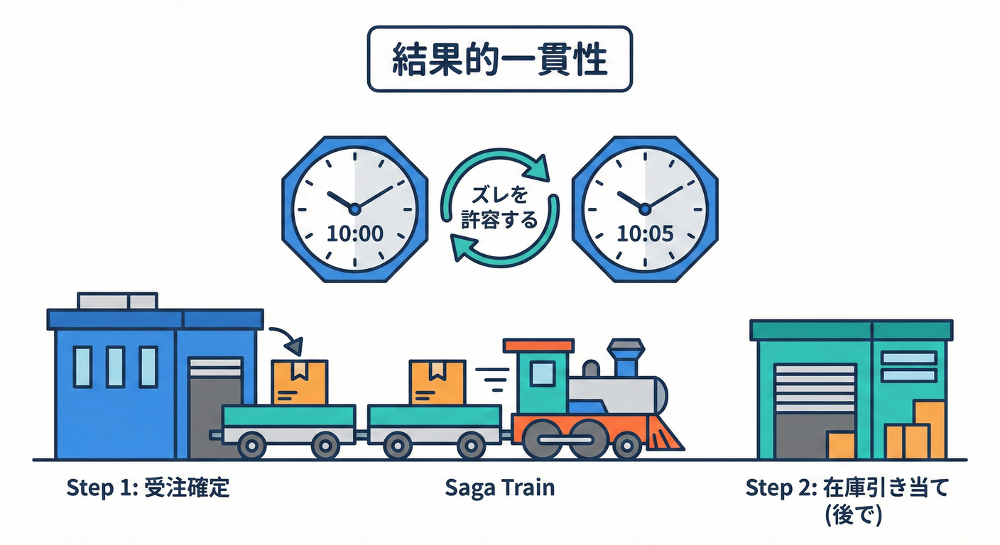
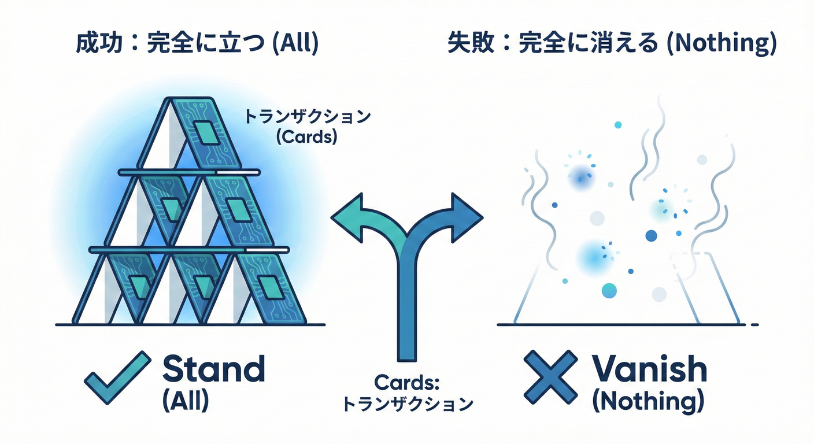
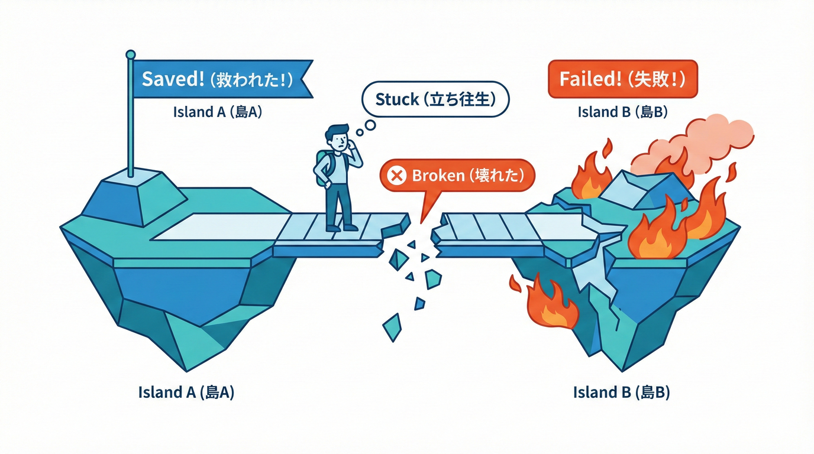
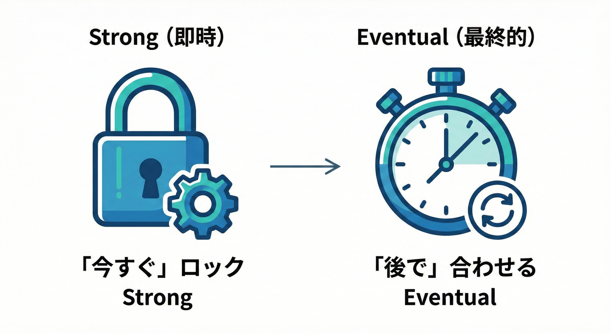
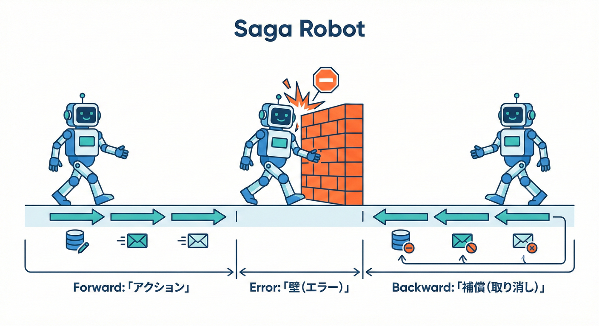
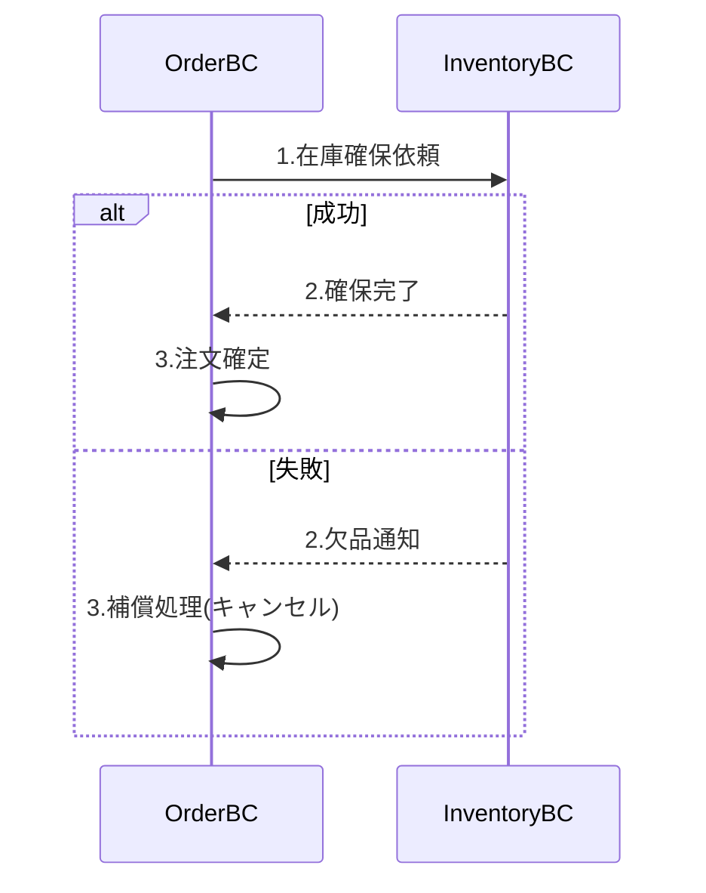
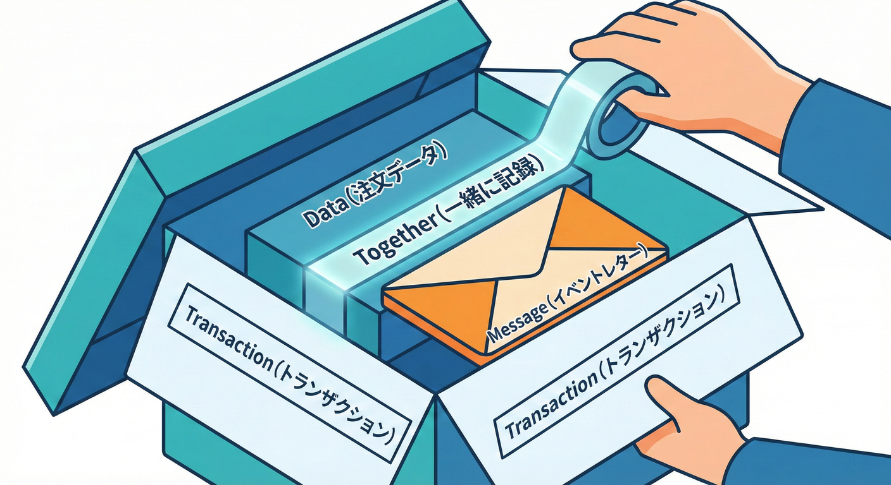
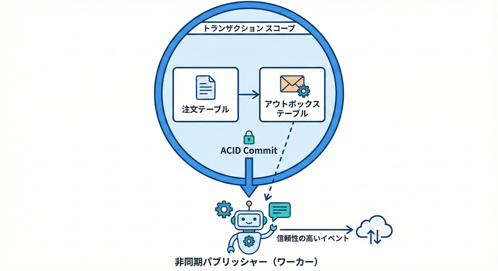

# 第26章：境界と一貫性（トランザクションの気持ち）🔁

## この章のゴール🎯✨

* **「どこまでを“同時に正しい”にするか」**を決められるようになる✅
* 境界（BC）をまたぐと起きる **“ズレ”** を、仕様として説明できるようになる🗣️
* **C#で「境界を越える更新」を安全に扱う定番パターン**（Saga / Outbox）を、雰囲気だけでもつかむ💻🛡️ ([Microsoft Learn][1])

---

## 1) まずは超ざっくり：一貫性ってなに？✅





一貫性（Consistency）は、ざっくり言うとこう👇

* **「今この瞬間、正しいと言える状態」**が守れてること✨
* たとえばミニECなら…

  * 在庫が **-1個** になってない？😱
  * 支払いが失敗したのに「注文確定」になってない？💥
  * 同じ注文が二重に確定してない？😵‍💫

ここで大事なキーワードが **“同時に正しい範囲”** だよ🧠✨
その「範囲」を決めるのが、境界（BC）の超重要なお仕事💪

---

## 2) トランザクションの“気持ち”ってこういうこと🥺🔁



トランザクションは、気持ち的にこう👇

> 「いまやってる一連の処理、**全部成功ならOK**。
> 1つでも失敗なら、**全部なかったことにしてほしい**🥹」

つまり **“全部 or ゼロ”**（Atomicity）だね✅
そしてこれがやりやすいのは…

* **同じアプリ**
* **同じデータベース**
* **同じ境界（BC）の中**

この条件がそろうと、ACID（堅い一貫性）を守りやすいよ💎 ([Microsoft Learn][1])

---

## 3) じゃあ、境界（BC）をまたぐと何が起きるの？🧱➡️🧱



BCをまたぐと、だいたいこうなる👇

* AのBCで保存✅
* 次にBのBCで保存しようとしたら…失敗❌
* でもAはもう保存しちゃった😇（戻せない or 戻すのが地獄）

これが **「分散トランザクション地獄」** の入口🕳️💀

### 「TransactionScopeでまとめればよくない？」って思うよね🤔

たしかに .NET には `TransactionScope` みたいに “広い範囲を1トランザクション扱い” にする仕組みがあるよ💡 ([Microsoft Learn][2])
でも注意点が強い⚠️

* 分散トランザクション（MSDTCにエスカレーション）が絡むと、環境や構成で **普通に詰む** ことがある💥
* 少なくとも **System.Transactions の分散トランザクションは Windows の .NET 7 以降で追加**、それ以外（古い .NET や非Windows）では失敗する、と明記されてるよ📌 ([Microsoft Learn][2])
* しかも「BCは独立性が命」なのに、分散トランザクションは **実行時に密結合** になりがち😵‍💫

あと、暗黙の分散トランザクションを許す設定として `TransactionManager.ImplicitDistributedTransactions` がある（= 勝手に昇格するのを許可する）っていう情報もあるよ⚙️ ([Microsoft Learn][3])
でも教材的には結論これ👇

✅ **「境界を越えるのに“1発で全部確定”を狙いすぎない」**
→ 代わりに、設計パターンで安全にする💪✨

---

## 4) 境界と一貫性の決め方：3つの質問📝💡



境界を切ったあと、次の3つを決めるとスッキリするよ✨

### Q1. 「絶対に同時に正しくないとダメ」なのはどれ？🧷

* 例：注文確定したら「注文番号」と「明細合計」は必ず一致してないと困る
  → これは **同じBC内** に置いたほうが楽✅

### Q2. 「ちょいズレてもOK（あとで追いつけばOK）」はどれ？🕒

* 例：注文確定の直後、配送側の画面に反映が **数秒遅れる**
  → ユーザー体験的に許されるなら **OK**😊

### Q3. 「ズレたとき、どうやって戻す？」🔙

* 例：在庫の確保に失敗したら「注文をキャンセル扱い」にする
  → これが **補償（Compensation）** の考え方だよ🧯 ([Microsoft Learn][1])

---

## 5) 境界をまたぐ“正しさ”の作り方：定番3パターン🧰✨

### パターンA：そもそも同じ境界に入れる（強一貫性が必要）🧲

* 「同時に正しくないと本当に困る」なら
  👉 **境界を分けない** ほうが正解のときがある🙆‍♀️

### パターンB：Saga（分割して、失敗したら“取り消し”する）🧩🧯



* ざっくり：

  1. 各サービス（BC）で **ローカルトランザクション** を確定✅
  2. 次のBCへイベント/メッセージでつなぐ📨
  3. 途中で失敗したら、**補償処理**で巻き戻す🔙
* これがSagaだよ🗺️ ([Microsoft Learn][1])



### パターンC：Outbox（DB保存とイベント発行の“二重書き込み”を潰す）📤📦



* ありがちな事故：

  * DB保存は成功✅
  * でもイベント送信に失敗❌（ネットワークとか）
  * 他BCが知らないまま😇
* Outboxはこれを避けるために
  **「DBの同じトランザクションで outbox に“送る予定”も保存」**して、
  あとで確実に送るやつ📮✨ ([Microsoft Learn][4])

---

## 6) ミニECで体験！「許せるズレ」を決める例🛒✨

### 例テーマ：注文確定で “在庫確保” もしたい📦

やりたいこと：

* 注文を作る（注文BC）🧾
* 在庫を引く/確保する（在庫BC）📦

ここで質問👀
**「注文確定ボタンを押した瞬間に、在庫も絶対確保できてないとダメ？」**

* YESなら：
  👉 同一BCに寄せる / 同期APIで確保を確認する（ただし失敗時UXも設計）
* NOなら：
  👉 注文は「受付」状態で確定 → 在庫確保できたら「確定」へ✨
  👉 途中失敗なら「在庫不足でキャンセル」へ😢
  👉 これが **Sagaっぽい発想**🧩

---

## 7) C#で “境界内” をちゃんと固める（超ミニ例）🧱💻

まずは **BC内は堅く** が基本だよ✅
EF Coreは `SaveChanges` が暗黙トランザクションになったり、明示トランザクションもできるよ📌 ([Microsoft Learn][2])

```csharp
// 例：注文BCの中で「注文作成 + 監査ログ」を同時に確定したい
await using var tx = await db.Database.BeginTransactionAsync();

try
{
    var order = Order.Create(customerId, items);   // ここでBC内ルールを守る（合計金額など）
    db.Orders.Add(order);

    db.AuditLogs.Add(new AuditLog("OrderCreated", order.Id));

    await db.SaveChangesAsync();
    await tx.CommitAsync();
}
catch
{
    // どれか失敗したら「なかったこと」にする
    //（Commitされてないのでロールバックされる）
    throw;
}
```

ポイント✨

* **BC内の不変条件（守りたいルール）**は、ここで守る💪
* BC内をグラつかせたまま、BC間の整合を頑張るのはキツい😵‍💫

---

## 8) C#で “境界をまたぐ” を安全にする：Outboxの超ミニ例📤🧾



Outboxは「注文保存」と「イベント発行予定」を **同じトランザクション** に入れるのがコツ✅ ([Microsoft Learn][4])

```csharp
public class OutboxMessage
{
    public Guid Id { get; set; }
    public DateTimeOffset OccurredAt { get; set; }
    public string Type { get; set; } = "";
    public string PayloadJson { get; set; } = "";
    public DateTimeOffset? PublishedAt { get; set; }
}

public async Task PlaceOrderAsync(...)
{
    await using var tx = await db.Database.BeginTransactionAsync();

    var order = Order.Create(...);
    db.Orders.Add(order);

    // 「送る予定」もDBに保存（これがOutbox）
    db.OutboxMessages.Add(new OutboxMessage {
        Id = Guid.NewGuid(),
        OccurredAt = DateTimeOffset.UtcNow,
        Type = "OrderPlaced",
        PayloadJson = JsonSerializer.Serialize(new { orderId = order.Id })
    });

    await db.SaveChangesAsync();
    await tx.CommitAsync();
}

// 別のバックグラウンド処理で Outbox を読んで Publish する（失敗したらリトライ）
```

これで何が嬉しい？😊

* DB保存だけ成功して「イベント送れなかった…」が減る✅
* 送信側の失敗は **リトライ**で回復しやすい🔁
* 受信側は **同じイベントが2回来ても平気（冪等性）** を作ると最強💪✨

---

## 9) Sagaを“気持ちで理解”するミニ図🗺️✨

```text
注文BC:  注文受付(受付中) ✅ → イベント OrderPlaced 📣
           │
           ▼
在庫BC:  在庫確保 ✅ → イベント StockReserved 📣
           │
           ▼
請求BC:  支払い確定 ✅ → イベント PaymentCaptured 📣
           │
           ▼
注文BC:  注文確定(確定) 🎉
```

もし途中で在庫確保が失敗したら…👇

* 注文BCに「在庫不足」イベントが戻ってくる
* 注文を「キャンセル」にする（補償）😢🧯

この考え方が、MicrosoftのSaga説明そのものだよ📌 ([Microsoft Learn][1])

---

## 10) “許せるズレ”を決めるチェックリスト✅📝

境界を越えるたびに、これだけ確認すると事故が減るよ✨

* [ ] **いま絶対に守りたいルール**は何？（不変条件）🧷
* [ ] **ユーザーに見せる状態**はどうする？（受付中/処理中/確定/失敗）🖥️
* [ ] **失敗したときの戻し方**は？（補償・キャンセル・返金）🔙
* [ ] **二重実行**されても平気？（冪等性）🔁
* [ ] 監査ログ/履歴は残る？（あとで追える）🕵️‍♀️

---

## 11) よくあるつまずきポイント😵‍💫⚠️

* **「境界を分けたのに、全部同期で固めようとして結局密結合」**になる💥
* **“最終的に一致する”の定義がなくて、データが信用できなくなる**😇
* イベントが重複して、在庫が二重に引かれる（冪等性不足）😱
* 「失敗＝例外」しか用意してなくて、UXが崩壊する😢

---

## 12) お助けAIプロンプト🤖✨

* 「このユースケースで**“同時に正しい”が必要なルール**を3つ挙げて」✅
* 「境界をまたぐ操作を、**Sagaで成功/失敗/補償**の流れにして」🧩
* 「Outboxを入れるなら、**保存するPayloadの最小フィールド**を提案して」📤
* 「二重実行に備えた**冪等性のキー設計**を案出しして」🔁

---

## 13) 2026のC#メモ（最新系）📌✨

C#は **C# 14** が最新で、**.NET 10** 上で使えるよ（Visual Studio 2026でも試せる）🧡 ([Microsoft Learn][5])

[1]: https://learn.microsoft.com/en-us/azure/architecture/patterns/saga "Saga Design Pattern - Azure Architecture Center | Microsoft Learn"
[2]: https://learn.microsoft.com/en-us/ef/core/saving/transactions "Transactions - EF Core | Microsoft Learn"
[3]: https://learn.microsoft.com/en-us/dotnet/api/system.transactions.transactionmanager.implicitdistributedtransactions?view=net-10.0&utm_source=chatgpt.com "TransactionManager.ImplicitDistributedTransactions Property"
[4]: https://learn.microsoft.com/en-us/azure/architecture/databases/guide/transactional-outbox-cosmos "Transactional Outbox pattern with Azure Cosmos DB - Azure Architecture Center | Microsoft Learn"
[5]: https://learn.microsoft.com/en-us/dotnet/csharp/whats-new/csharp-14 "What's new in C# 14 | Microsoft Learn"
