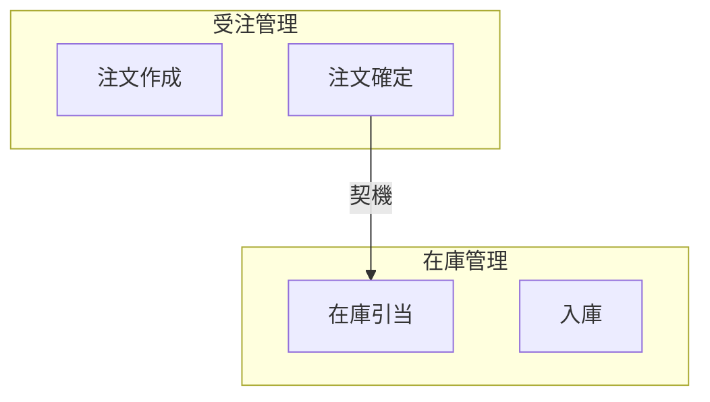
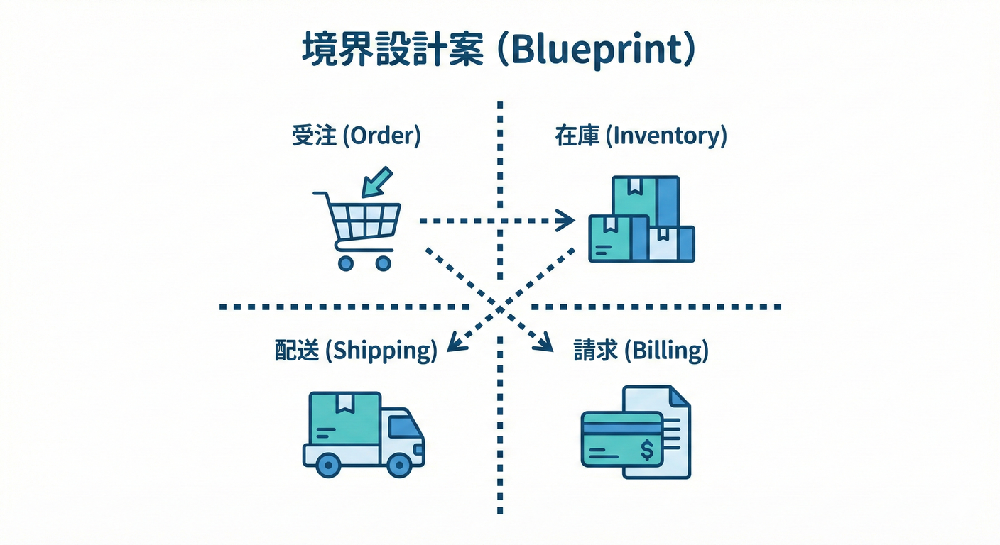

# 第27章：ケーススタディでBC案を確定（仮でOK）🛒📦🚚

## この章のゴール🎯✨

この章では、ミニEC題材を使って **Bounded Context（BC）の「最初の確定案」** を作ります🧩
ポイントはこれ👇

* ✅ **「正解のBC」を当てにいかない**（まずは“仮説”でOK🌱）
* ✅ **言葉と責務が混ざらない境界**をつくる
* ✅ 境界ごとに **ミニ用語集📒** を作って“意味の一貫性”を固定する
* ✅ BC同士のやり取りを **最小限の契約（Published Language）📨** にする準備をする

---

## まず大事な前提🧠💡：「BCは“発見して育てる”もの」

BCは会議室で一発確定！…というより、
**業務の流れ（イベント）を並べて → 固まりを見て → 境界を引く** ことで、かなり現実的な案に近づきます🌩️🗺️
イベントストーミングが「境界（BCなど）を引く」ところまで繋がるワークであることもよく知られています。([Mathias Verraes' Blog][1])

---

## 27.1 ケーススタディ：ミニECの登場人物と流れ🎬🛒

扱う世界はざっくりこれ👇

* 注文する（Order）📦
* 在庫を引き当てる（Inventory）📦🔢
* 出荷・配送する（Shipping）🚚
* 請求・決済する（Billing/Payment）💳🧾

ここでの罠はこれ💥
**同じ単語が部署ごとに別物**になりやすい（例：「注文」「顧客」「住所」「金額」）😵‍💫

---

## 27.2 BC案を確定するための5ステップ🪜✨

## Step 1：イベントの“固まり”を作る🧺🌩️

イベント（過去形）を並べて、近いものを寄せます。

例（イメージ）👇

* **注文まわり**：注文作成／注文確定／注文キャンセル…📦
* **在庫まわり**：在庫引当／在庫戻し／入庫／棚卸…📦🔢
* **配送まわり**：出荷指示／発送／配達完了…🚚
* **請求まわり**：請求作成／決済確定／返金…💳🧾

> コツ：固まりには「目的の一言」をつけると境界が見えやすいよ🏷️✨



---

## Step 2：固まりに“責務がわかる名前”をつける🏷️✨

ここでの命名は、後でコード（プロジェクト名・名前空間）にも影響しやすいので超重要💎

* ❌「注文BC」みたいな“何でも入る箱”
* ✅「Order Management（受注管理）」みたいな“責務が見える名前”

---

## Step 3：「その情報の所有者は誰？」を決める🏠🔒

境界が壊れる典型はこれ👇
**同じデータをみんなが勝手に更新しはじめる**😇

だから、各BCでこう決めます📝

* **正本（Master）**はどこ？
* 他BCは **参照はOKでも更新は禁止**（必要なら契約経由📨）

---

## Step 4：境界をまたぐ“やり取り”を最小化する📨✂️

BCを跨ぐたびに、やり取りは遅く・重くなりがちです🕒💦
なので、次のどちらかに寄せるとスッキリします👇

* **イベント通知**：「起きたよ！」（例：OrderPlaced）📣
* **問い合わせ**：「今どうなってる？」（例：在庫ある？）🔎

イベントストーミングの流れでも、境界の後に「コマンド」「データ」を整理して合意を作っていく手順が紹介されています。([IBM Cloud Architecture][2])

---

## Step 5：BCごとに“ミニ用語集”を作って固定する📒✅

BCの中では **言葉の意味を1つに揃える**のがルール✨
同名でも、BCが違えば別物でOK🙆‍♀️

---

## 27.3 今回のBC案（確定“仮”バージョン）🧩🛒📦🚚💳



ここでは、現実でよく扱いやすい4分割案を採用します✅

## ✅ BC案：4つ

1. **Order Management（受注管理）**📦
2. **Inventory Management（在庫管理）**📦🔢
3. **Shipping/Fulfillment（配送・出荷）**🚚
4. **Billing/Payment（請求・決済）**💳🧾

> 「モジュール（＝BC）に分けて単一アプリとして運用する」考え方（いわゆるモジュラーモノリス）でも、**機能を独立モジュールに分ける**ことがよく語られます。([thereformedprogrammer.net][3])
> EC題材の .NET 8 モジュラーモノリス例も公開されています。([GitHub][4])

---

## 27.4 文章で見るミニContext Map（まずは相関だけ）🗺️🤝

イメージ図👇（箱＝BC）

* [Order Management] 📦
  ├─（イベント）→ OrderPlaced 📣 → [Inventory] 📦🔢
  ├─（イベント）→ OrderPaid 💳 → [Shipping] 🚚
  └─（イベント）→ OrderInvoiced 🧾 → [Billing/Payment] 💳🧾

※ここでは“仮”でOK。第28章でちゃんとContext Mapとして描くよ🗺️✨

---

## 27.5 ミニ用語集（サンプル）📒✨

「同じ単語でもBCが違うと意味が違う」を、**ちゃんと文章で固定**します📝

## 1) 「注文（Order）」の違い🧨

* **Order Management の Order**：
  顧客が買う意思を持って作った“受注の器”。キャンセルや変更のルールが中心📦
* **Shipping の Order**：
  配送対象としての“出荷単位”。住所・梱包・配送状況が中心🚚
* **Billing/Payment の Order**：
  請求や決済の対象としての“課金単位”。金額・税・返金が中心💳🧾

## 2) 「住所（Address）」の違い🏠

* **Shipping の Address**：配送できること（不在・配送会社制約など）が重要🚚
* **Billing の Address**：請求書に載せること（法的・帳票ルール）が重要🧾

## 3) 「金額（Amount）」の違い💰

* **Order**：見積り（割引・送料が未確定のこともある）
* **Billing**：確定請求（税計算・端数処理が確定ルール）

こういう“定義の違い”を放置すると、境界が簡単に溶けます😇

---

## 27.6 Bounded Context Canvas（ミニ版テンプレ）🧩📄

BCを説明するためのキャンバス（テンプレ）もよく使われます。DDD Crew が公開している **Bounded Context Canvas** を元に、ここでは“教材用ミニ版”で作ります🧡 ([miro.com][5])

## ミニ版：書く項目（1BCにつきこれだけ）✍️

* **名前**（責務が見える名前）🏷️
* **目的**（このBCは何のため？）🎯
* **含むルール**（守るべき制約）🔒
* **主な用語**（このBC内での定義）📒
* **入力**（受け取るイベント/コマンド）📥
* **出力**（出すイベント/公開する契約）📤
* **所有データ**（正本は何？）🏠
* **外部依存**（どこに依存？）➡️

---

## 27.7 “確定したこと”にするための合格チェック✅✨

BC案ができたら、最低これだけチェックします🧪

* ✅ **目的が1行で言える？**（ふわっとしてたら混ざってる可能性😵‍💫）
* ✅ **用語がBC内で一貫してる？**（同じ単語が2定義になってない？）
* ✅ **変更理由が近いものが集まってる？**（変更の波🌊が違うなら分け候補）
* ✅ **データ所有者が決まってる？**（正本が不在＝共有地獄の入口🧱💥）
* ✅ **境界越えのやり取りが最小？**（何でも同期しようとしてない？🕒）

---

## 27.8 ミニ演習（この章のメイン）🎮✅

## 演習1：4つのBCにイベントを振り分けよう🧺

次のイベントを、4BCのどれに属するか分類してね👇

* 注文作成された
* 注文が確定した
* 在庫が引き当てられた
* 出荷指示が出た
* 発送された
* 請求が作成された
* 決済が確定した
* 返金された

> 正解は1つじゃないよ🙆‍♀️
> 迷ったら「そのイベントの責任を持つのは誰？」で決める🏠✨

---

## 演習2：衝突単語を3つ拾って“定義”を書こう📒🧠

例：注文／顧客／住所／金額 などから3つ選んで👇

* Order Management での定義
* Shipping での定義
* Billing での定義

---

## 演習3：境界越えの“契約”を1つ作ろう📨

例：「OrderPlaced」を Inventory に伝える、みたいなやつ📣

### C#の超ミニ例（Published Languageのイメージ）✨

```csharp
public sealed record OrderPlaced(
    string OrderId,
    string CustomerId,
    IReadOnlyList<OrderLine> Lines,
    DateTimeOffset OccurredAt
);

public sealed record OrderLine(
    string ProductId,
    int Quantity
);
```

※ここでのコツ👇

* **相手に必要な最小限だけ**にする🥗
* Order Management の“内部の事情”を持ち出さない（境界を守る）🔒

---

## 27.9 お助けAIプロンプト例🤖✨

（そのままコピペでOK👌）

* 「このイベント一覧を、目的が近いグループに分けて。各グループに“境界名”の候補も付けて」🧺🏷️
* 「“注文”“住所”“金額”がBCごとにどう定義がズレるか、用語集の形で書いて」📒
* 「OrderPlaced の Published Language（契約DTO）を、必要最小フィールドで提案して」📨
* 「4つのBC案について、データ所有者（正本）を決める表を作って」🏠

---

## 27.10 まとめ🧁✨

* BCは **仮説でOK**。でも、**用語集📒・所有者🏠・契約📨** を作ると一気に“設計っぽく”固まる
* ケーススタディでは、まず **4BC（受注・在庫・配送・請求）** が扱いやすい
* 境界越えは「イベント通知 or 問い合わせ」に寄せて **最小化**すると事故が減る🛡️
* 次の章で、この関係を **Context Map** として1枚にしていくよ🗺️✨

[1]: https://verraes.net/2013/08/facilitating-event-storming/?utm_source=chatgpt.com "Facilitating Event Storming"
[2]: https://ibm-cloud-architecture.github.io/refarch-eda/methodology/event-storming/?utm_source=chatgpt.com "Event Storming - IBM Automation"
[3]: https://www.thereformedprogrammer.net/my-experience-of-using-modular-monolith-and-ddd-architectures/?utm_source=chatgpt.com "My experience of using modular monolith and DDD ..."
[4]: https://github.com/ilroberts/DotNetModularMonolith?utm_source=chatgpt.com "An implementation of the Modular Monolith using .Net 8 ..."
[5]: https://miro.com/templates/bounded-context-canvas-emplate/?utm_source=chatgpt.com "Bounded Context Canvas Template | Miroverse"
