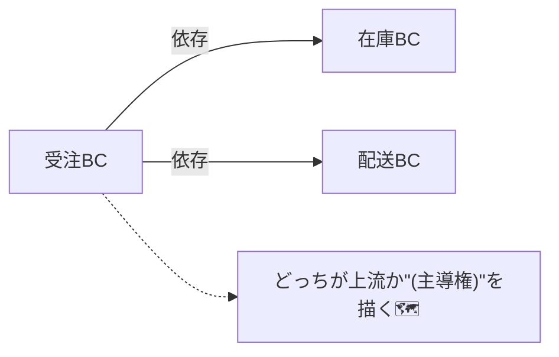
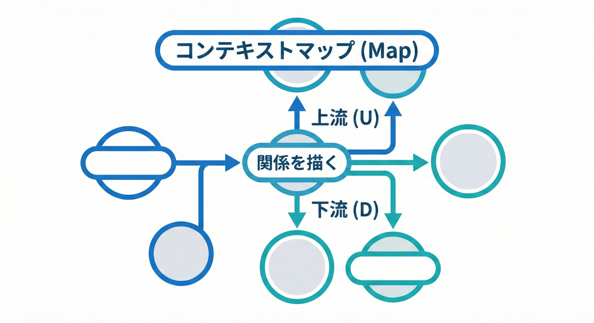

# 第28章：Context Mapとは？（描けるようになろう）🗺️🤝✨

## この章でできるようになること🎯✨

* **Bounded Context（BC）どうしの関係**を、1枚の「地図」にできる🗺️
* **依存の向き（上流 / 下流）**を言葉で説明できる⬆️⬇️
* 「どの関係パターンにする？」を**根拠つきで仮置き**できる✅

---

## 1. Context Mapってなに？🗺️✨

**Context Map（コンテキストマップ）**は、複数のBCがあるときに、

* それぞれのBCが
* **どうつながっていて**
* **どっちが主導権を持っていて（上流/下流）**
* **どうやって統合するか（関係パターン）**

を、**見える化する地図**だよ🧭✨
「境界は分かった！でも…境界どうしの付き合い方が地獄😇」を防ぐための道具ね。 ([Microsoft Learn][1])

---

## 2. なんで必要？（図にできない関係はだいたい危険⚠️）🧯

BCを分けても、現実には **完全に孤立**はしないよね🤝
注文BCは在庫が気になるし、配送BCは住所が欲しいし、請求BCは金額が欲しい…🛒📦🚚💳

ここを図にしないと👇

* **隠れ依存**が増える（気づいたらあちこちが繋がってる😇）
* **変更の影響範囲**が読めない（直したら別のBCが壊れる💥）
* 「誰が契約（ルール）を握る？」が曖昧で揉める⚔️

だからContext Mapは、**事故を減らす安全装置**なんだ〜🧯✨ ([Microsoft Learn][2])



---

## 3. Context Mapの“部品”🧩✨



Context Mapは、だいたいこの4点が描ければOK🙆‍♀️✨

## ① BC（箱）📦

* BC名（= その世界での“言葉の意味が一貫する範囲”）
* 「役割が伝わる名前」が大事（第24章の話につながるよ🏷️）

## ② つながり（線）🔗

* BCどうしの接点（API / イベント / ファイル連携 / 人手など）

## ③ 依存の向き（上流 / 下流）⬆️⬇️

* **上流（Upstream）**：契約（仕様）を提供する側
* **下流（Downstream）**：それを利用して影響を受ける側

## ④ 関係パターン（ラベル）🏷️

* 「この関係、どう付き合う？」を一言で表す
  （次章以降で深掘りするやつ！）

これで「ただの線」じゃなく、**意味のある地図**になるよ🗺️✨ ([DevIQ][3])

---

## 4. まず覚える：上流/下流の決め方⬆️⬇️🤔

迷ったら、この質問をしてみてね👇

## Q1：仕様変更で“痛い”のはどっち？😵‍💫

* 変更されると困る側 → **下流**になりがち

## Q2：データやルールの“持ち主”はどっち？👑

* その概念の定義（計算/制約/状態遷移）を握ってる側 → **上流**

## Q3：合わせる努力をしてるのはどっち？🧎‍♀️

* 変換したり、吸収したり、頑張ってる側 → **下流**（がんばりが発生する…！）

この「上流/下流」が決まると、次に「関係パターン」が選びやすくなるよ✅ ([software-architecture-guild.com][4])

---

## 5. 関係パターン：今日は“ざっくり地図帳”📚🗺️

ここでは「存在を知って、ラベルを貼れる」ことがゴールだよ〜🏷️✨
（第29章以降で、1つずつちゃんとやるよ💪）

* **Partnership（協力関係）**：対等。いっしょに育てる🤝
* **Shared Kernel（共有カーネル）**：小さく共有。大きくなると地獄⚠️
* **Customer/Supplier（顧客/供給者）**：下流（顧客）の要望も考慮して上流が提供🧑‍🤝‍🧑
* **Conformist（順応者）**：下流が割り切って上流に“合わせきる”🙇‍♀️
* **Anti-Corruption Layer（ACL）**：下流が“翻訳層”で自分の世界を守る🛡️
* **Open Host Service（公開ホストサービス）**：上流が公開APIなどを整備して公開🌐
* **Published Language（公開言語）**：境界を越える“契約語彙”（DTO/イベント名など）📢
* **Separate Ways（別々の道）**：無理に統合しない（分離を選ぶ）🚶‍♀️🚶‍♂️
* **Big Ball of Mud（泥団子）**：全部ぐちゃぐちゃの反面教師💀

この一覧で「関係を分類できる」だけでも、会話が一気にラクになるよ🗣️✨ ([DevIQ][3])

---

## 6. 描き方：5ステップで“地図”を作る✍️🗺️✨

## Step 1：BCを箱で並べる📦📦📦

* 第27章で出したBC案を、そのまま箱にする
* まだ仮でOK（育てる前提🌱）

## Step 2：BCどうしの接点を書く🔗

* 「何を渡してる？」（データ / コマンド / イベント / 参照など）
* 例：`在庫引当`、`出荷指示`、`請求確定` など

## Step 3：上流/下流を決める⬆️⬇️

* 「定義の持ち主は誰？」で判断👑

## Step 4：関係パターンを“仮ラベル”で貼る🏷️

* 迷ったら **Customer/Supplier / Conformist / ACL** のどれかに寄りがち（よくある！） ([software-architecture-guild.com][4])

## Step 5：契約（Published Language）の“候補メモ”を書く📝

* DTOやイベントの名前・意味（境界を越える言葉）
* ここが雑だと、後で衝突しやすい🧨

---

## 7. ミニECで描く：Context Map（例）🛒📦🚚💳✨

BCをこんな感じで置くよ👇（第27章の例をベース）

* OrderManagement（受注管理）🛒
* Inventory（在庫管理）📦
* Shipping（配送）🚚
* Billing（請求）💳

そして「依存の向き（下流→上流）」を矢印で描くとこう👇

```text
[OrderManagement] ──(depends on)──▶ [Inventory]
       │                              ▲
       │                              │
       ├──(depends on)──▶ [Shipping]  │
       │                              │
       └──(depends on)──▶ [Billing]   │
```

この図の読み方はこうだよ😊✨

* `OrderManagement → Inventory`
  注文BCは「在庫があるか/引き当てできるか」を知りたい。
  在庫ルールの定義を握ってるのは在庫BCになりやすい＝**在庫が上流**📦👑

* `OrderManagement → Shipping`
  配送BCは出荷の世界（伝票、追跡、配送ステータス）。
  でも「何をどこへ送る？」は注文の情報が必要＝ここも依存が発生しやすい🚚

* `OrderManagement → Billing`
  請求の世界は「請求確定」「入金」「返金」など、注文とは別の“お金の都合”がある💳
  だから“同じ金額”でも意味がズレやすい（後の章で超大事🧨）

そしてこの線に、さっきのラベルを貼っていくよ🏷️
たとえば👇（※今日は“仮置き”でOK！）

* OrderManagement → Inventory：**Customer/Supplier** か **ACL**（在庫の都合が強いならACL寄り）🛡️
* OrderManagement → Shipping：**Customer/Supplier**（出荷指示の契約を握る側を決めよう）🧾
* OrderManagement → Billing：**Published Language**を丁寧に（請求イベント/DTOの語彙を固定📢）

「どう統合する？」はContext Mapが入口になるよ〜🚪✨ ([DevIQ][3])

---

## 8. “よくある事故”チェック🧯⚠️

## 事故①：線はあるけど、意味がない😇

* 「APIで繋ぐ」だけだと、**主導権**が分からない
  → 上流/下流と関係パターンを付ける🏷️✨

## 事故②：クラス図みたいに描き始める📉

* Context Mapは**戦略の地図**！
  クラス名やテーブル名は今は主役じゃないよ🙅‍♀️

## 事故③：Shared Kernelが肥大化して全部共有になる🧨

* 共有は最小にしないと、結局“境界が溶ける”⚠️
  「共有が増える＝境界設計を見直すサイン」になりやすいよ📛 ([vaadin.com][5])

## 事故④：図が1回描かれて放置される🧟‍♀️

* 境界評価は“進化する作業”になりがち
  だからContext Mapも**育てるドキュメント**にするのが大事🌱 ([Microsoft Learn][2])

---

## 9. ミニ演習（15〜25分）⏱️📝✨

## 演習A：関係を書き出して、線を引こう🔗

次の“接点”を、どのBCどうしの関係か結んでね👇

* 在庫引当（Reserve Stock）📦
* 出荷指示（Ship Request）🚚
* 請求確定（Invoice Issued）💳
* 住所変更（Address Updated）🏠

## 演習B：上流/下流を決めよう⬆️⬇️

各線に対して、次のどっちかを決めてメモ📝

* 上流：契約を提供する側
* 下流：影響を受ける側

## 演習C：関係ラベルを“仮”で貼ろう🏷️✨

各線に、次のどれかを1つ貼ってみてね👇

* Customer/Supplier
* Conformist
* ACL
* （その他でもOK）

「迷った線」が出たら、そこが**設計の会話ポイント**だよ🗣️✨ ([DevIQ][3])

---

## 10. お助けAIプロンプト集🤖✨

（文章・図・命名・契約語彙づくりに超使えるよ〜！）

* 「このユースケースからBC間の依存（情報の受け渡し）を列挙して」🔍
* 「上流/下流を判断して、理由も添えて」⬆️⬇️
* 「Context Mapの関係ラベルを仮置きして、選んだ根拠を短く」🏷️
* 「Published Languageとしてイベント名/DTO名の候補を出して（後方互換を意識して）」📢
* 「ACLが必要そうな境界を見つけて、変換ポイント（単位/命名/欠損値）を洗い出して」🛡️

コード補助は **GitHub Copilot** や **OpenAI Codex** みたいなAI拡張とも相性ばつぐんだよ💻✨

---

## まとめ🧡

* Context Mapは、BCどうしの関係を**意味つきで**1枚にする地図🗺️
* キモは **上流/下流** と **関係パターンのラベル**🏷️
* 図にできない関係は、だいたい“危ない匂い”がする⚠️

次章からは、この地図に貼ったラベル（関係）を1つずつ深掘りして、事故りにくい付き合い方を身につけるよ〜🤝✨ ([DevIQ][3])

[1]: https://learn.microsoft.com/en-us/dotnet/architecture/microservices/architect-microservice-container-applications/identify-microservice-domain-model-boundaries?utm_source=chatgpt.com "Identifying domain-model boundaries for each microservice"
[2]: https://learn.microsoft.com/en-us/azure/architecture/microservices/model/domain-analysis?utm_source=chatgpt.com "Using domain analysis to model microservices"
[3]: https://deviq.com/domain-driven-design/context-mapping?utm_source=chatgpt.com "Context Mapping"
[4]: https://software-architecture-guild.com/guide/architecture/domains/integration-of-bounded-contexts/?utm_source=chatgpt.com "Integration of Bounded Contexts"
[5]: https://vaadin.com/blog/ddd-part-1-strategic-domain-driven-design?utm_source=chatgpt.com "DDD Part 1: Strategic Domain-Driven Design"
