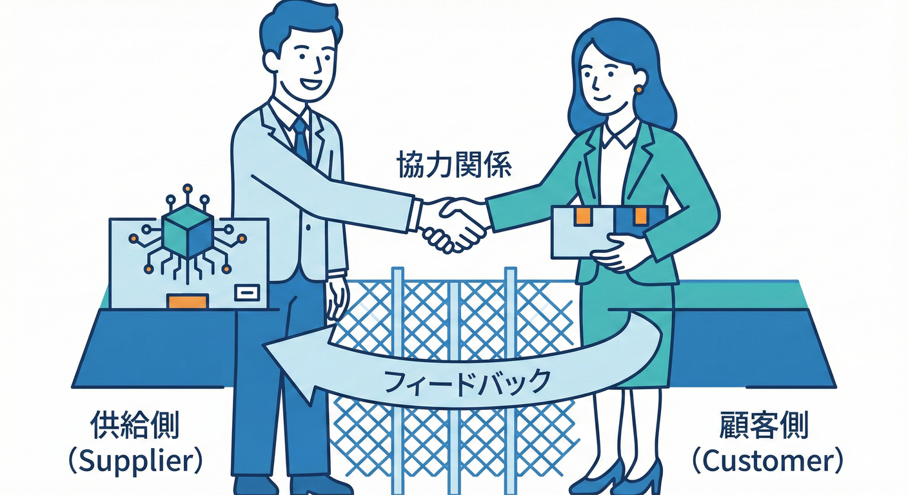
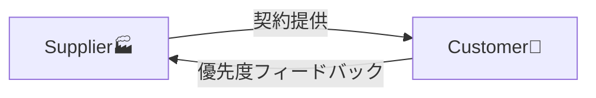
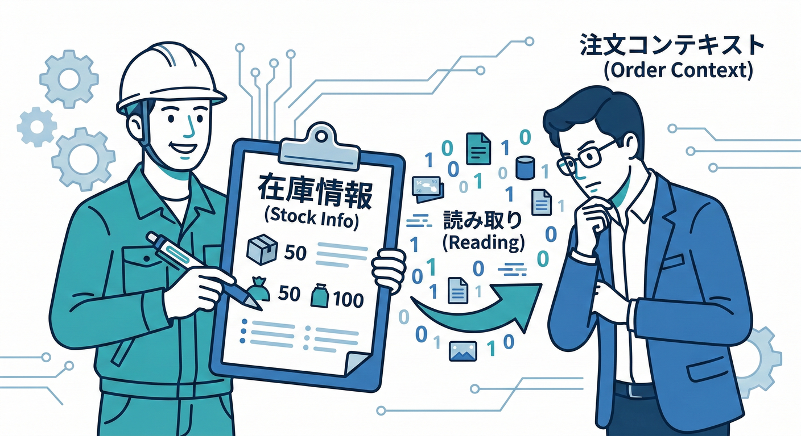
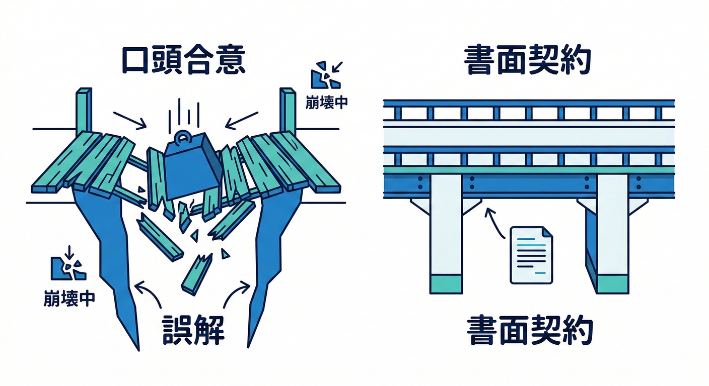
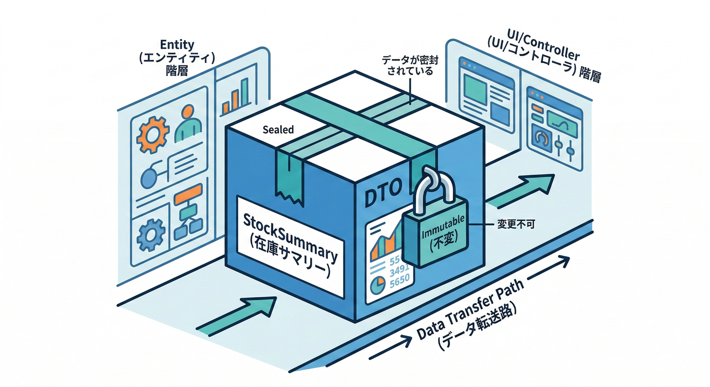

# 第29章：関係A Customer/Supplier（供給と利用）🧑‍🤝‍🧑

## この章でできるようになること🎯✨

* Context Mapで「供給側（Supplier）」「利用側（Customer）」を見分けられる👀🗺️
* どっちが主導権を持つか（契約・リリースの主導）を整理できる👑📦
* 仕様変更で燃えないための“段取り”を作れる🔥➡️🧯
* C#で「契約（DTO）」「互換性」「テスト」で境界を守る形がイメージできる💻🔒

---

## 1. Customer/Supplierってなに？🧩✨



Customer/Supplierは、2つの境界づけられたコンテキストが「供給する側」と「利用する側」として関係を結ぶパターンだよ🗺️🤝

* Supplier（上流 / Upstream）🏭：データや機能を“供給”する側
* Customer（下流 / Downstream）🛒：それを“利用”して自分の機能を成り立たせる側

ポイントはここ👇
**CustomerはSupplierに依存してる**（使わないと困る）けど、**Customerの要望や優先度がSupplierの計画に影響する**こともある、ってところ💬📌
「下流の都合も上流がちゃんと考えてあげる関係」ってイメージ！ ([DevIQ][1])



---

## 2. まず覚える単語セット🧠📒✨

* **Upstream（上流）**：供給する側（Supplier）🏭
* **Downstream（下流）**：利用する側（Customer）🛒
* **契約（Contract）**：API・イベント・DTOなど「境界越えの約束」📜📨
* **リリースリズム**：変更が出る頻度（毎週？毎月？）📆
* **互換性**：古い使い方でも動くようにする工夫🧸🔧

Customer/Supplierでは、特に **契約とリリース** が超重要になるよ📜📦✨ ([ソフトウェアアーキテクチャギルド][2])

---

## 3. ミニECでの具体例🛒📦🚚💳




### 例A：在庫管理BC🏬 と 受注管理BC🧾

* 在庫管理BC（Supplier）🏬：在庫数・引当結果を供給
* 受注管理BC（Customer）🧾：注文確定のために在庫情報が必要

ここで起きがちなのが👇

* 在庫側が「引当済み」の意味を変えた
* 受注側がそれを知らずに「注文確定」して事故💥😵‍💫

だからこそ、Customer/Supplierでは
**Customerの要求（こういう情報が欲しい！）をSupplierの計画に反映してもらう**のが大事なんだ🗣️📌 ([DevIQ][1])

---

## 4. 図でイメージしよう🗺️✨

### Context Mapの超シンプル図🖍️

* 上流（Supplier）から下流（Customer）へ “供給の矢印” が向くよ➡️

```text
   🏭 Supplier（上流）  ───➡️  🛒 Customer（下流）
      契約を出す側              使って成り立つ側
      変更の影響を与える側      変更の影響を受ける側
```

そして、理想はこう👇

* Customerが「必要な優先度」を伝える📣
* Supplierが「それを踏まえて」計画・提供する🧠📦

この “関係性を合意して運用する” のがパターンの本体だよ🤝✨ ([DevIQ][1])

---

## 5. いつCustomer/Supplierを選ぶ？⚖️💡


### 選びどき✅

* 下流（Customer）が上流（Supplier）にちゃんと意見できる（交渉できる）🗣️
* 上流が「下流の成功も考える」気がある（組織的に可能）🏢💞
* 契約を整備して、変更をコントロールできる体制を作れる📜🧰

### 選びにくいとき⚠️

* 上流が強すぎて、下流の要望を聞く気がない😇
  → それは次章の **Conformist** 寄りになりがち🙇‍♀️
* 上流のモデルがクセ強で、下流が守りたいものが多い🧱
  → **翻訳の壁（ACL）** を検討したくなる🛡️

「交渉できる関係か？」が、Customer/Supplierかどうかの分かれ道だよ🚦 ([ddd-practitioners.com][3])

---

## 6. Customer/Supplierで一番やっちゃダメな事故💥😵‍💫

### 事故①：契約が無い（口約束）🫠




* 「たぶんこの項目使ってないよね？」で削除
* 下流が本番で落ちる💣

### 事故②：破壊的変更を“いきなり本番”🚧

* バージョンも段階もなく変更
* 下流が追従できず炎上🔥

### 事故③：上流の都合だけで仕様が決まる👑💥

* “Customer”なのに要望が反映されない
* 実態はCustomer/Supplierじゃなくて「ただの支配」になっちゃう😢

「関係パターン」って、**図じゃなくて運用**なんだよね🧠✨ ([ソフトウェアアーキテクチャギルド][2])

---

## 7. うまく回すための実務セット🧰✨

### ステップ1：上流・下流を確定する🧭

* 「どっちが機能やデータを提供してる？」
* 「どっちがそれ無しだと困る？」

### ステップ2：契約を“文章で”固定する📜🖊️


* APIなら：エンドポイント・項目・制約・例
* イベントなら：イベント名・意味・発火タイミング・項目
* DTOなら：各フィールドの意味、必須/任意、単位、桁、NULL扱い

### ステップ3：変更のルールを決める📆🔁

* 追加はOK（互換性を壊しにくい）➕
* 削除・意味変更は段階を踏む（非推奨→移行→削除）🚧

### ステップ4：テストで契約を守る🧪🔒

* 下流が期待する形が崩れたら検知できるようにする
* “人の記憶”に頼らない！🧠❌

この「契約・リリース・テスト」の3点セットが、Customer/Supplierの生命線だよ💓📦🧪 ([ソフトウェアアーキテクチャギルド][2])

---

## 8. C#での実装イメージ💻✨

ここでは「上流が契約DTOを返す」「下流がそれを使う」超ミニ例でいくよ🧸
（2026年2月時点だと .NET 10 と C# 14 が現行の大きな基準になってるよ📌） ([Microsoft for Developers][4])

---

### 8.1 上流 Supplier 側：契約DTOを定義する📨🏭




* ドメインの内部モデルをそのまま外に出さない
* 外に出すのは「契約用の形（DTO）」だけにする

```csharp
// Supplier側：公開する契約DTO（Published Languageの一部イメージ）
public sealed record StockSummaryDto(
    string Sku,
    int AvailableQuantity,
    string AvailabilityStatus, // 例: "InStock" / "Low" / "Out"
    DateTimeOffset AsOfUtc
);
```

ここでのコツ✨

* 名前や意味は“契約”だから、軽い気持ちで変えない📌
* 単位（個数、税抜税込、UTCなど）を曖昧にしない🧾⏰

---

### 8.2 上流 Supplier 側：返す場所を作る🌐🏭

```csharp
// Supplier側：在庫の要約を返す（例：アプリ層がDTOを返す）
public interface IStockQueryService
{
    Task<StockSummaryDto?> GetStockSummaryAsync(string sku, CancellationToken ct);
}
```

ポイント✨

* ここは「問い合わせ専用」と割り切る（読み取りモデル）と安定しやすい📖
* ビジネスルールが濃い内部の型を持ち出さない🔒

---

### 8.3 下流 Customer 側：使う側は“期待”を固定する🛒🧪

下流は「この形で来るはず」を前提に組み立てるから、壊れると困る😵‍💫
そこで、最低限でも “契約テスト” っぽいものを置くと安心🧪

```csharp
// Customer側：契約が満たされてるかを最低限チェックするテスト例（雰囲気）
using Xunit;

public sealed class StockContractTests
{
    [Fact]
    public void StockSummaryDto_contract_should_be_stable()
    {
        // 例：必須フィールドの意味が壊れてないかを確認する観点
        var dto = new StockSummaryDto(
            Sku: "ABC-001",
            AvailableQuantity: 3,
            AvailabilityStatus: "InStock",
            AsOfUtc: DateTimeOffset.UtcNow
        );

        Assert.False(string.IsNullOrWhiteSpace(dto.Sku));
        Assert.True(dto.AvailableQuantity >= 0);
        Assert.False(string.IsNullOrWhiteSpace(dto.AvailabilityStatus));
    }
}
```

もちろん本物の連携では、ここに「実際のAPIレスポンス」「スキーマ」などの検証を足していく感じになるよ🧪📦
大事なのは **“壊れたら検知できる” 状態** を作ること！🔔✨

---

## 9. 判断ミスしやすいポイント集😇🧠


### 「Supplierが強い」＝Customer/Supplier？🤔

強い弱いだけだと危ない！⚠️
Customer/Supplierは **Customerの優先度がSupplierの計画に反映される** ところが核だよ🧡 ([DevIQ][1])

### 「翻訳が欲しい」＝ACLを置けばOK？🛡️

ACLは便利だけど、関係性としては「協調」より「防御」に寄るよ🧱
Customer/Supplierの理想は、まず **契約を整備して協調で回す** こと（ただし現実は混ざることもある）📌 ([InfoQ][5])

---

## 10. ミニ演習✍️🧩✨

### お題：ミニECの4つのBCを想像しよう🛒📦🚚💳

* 受注管理BC
* 在庫管理BC
* 配送管理BC
* 請求管理BC

#### 問1：Customer/Supplierになりそうな組を2つ選んでね🧑‍🤝‍🧑

* どっちがSupplier？どっちがCustomer？➡️を書いてみよう✍️

#### 問2：契約を1つ決めよう📜

例：在庫管理BCが返す「在庫要約」

* 項目（フィールド）を5つ以内で書く
* 各項目の意味を1行で書く（単位・必須/任意も）📝

#### 問3：変更ルールを作ろう🚧

* 追加はOK？
* 削除はどうする？（何段階？どの期間？）📆

---

## 11. つまずきポイント救急箱🧰🩹

* 「同じ言葉」でも意味が違うのに、契約で混ぜちゃう🌀
  → フィールド名より先に **意味を文章で固定** しよう📜
* “便利だから”で上流の内部モデルを共有したくなる😇
  → 最初だけラク、後で地獄になりがち🔥
* 変更通知が雑で、下流が追従できない📣❌
  → リリースノート、互換性ルール、テストの3点を揃える🧪📦

---

## 12. チェックリスト✅✨

* 上流/下流が明確になってる？🏭➡️🛒
* 契約が文章化されてる？（意味・単位・必須/任意）📜
* 破壊的変更の段取りが決まってる？🚧
* 下流が壊れた時に検知できる？（テスト・監視）🧪🔔
* 下流の優先度が上流の計画に入る運用がある？🗣️📌 ([DevIQ][1])

---

## 13. お助けAIプロンプト🤖✨

* 「この2つのBCの関係はCustomer/Supplier？Conformist？ACL？理由つきで判定して」🧭
* 「契約DTOのフィールド案を5つ以内で。各フィールドの意味と単位も」📨
* 「破壊的変更を避ける移行ステップを3段階で提案して」🚧
* 「契約テストで最低限見るべき観点をチェックリスト化して」✅
* 「上流・下流で起きがちな事故を3つ挙げて、防ぐ運用をセットで出して」🧯🔥

[1]: https://deviq.com/domain-driven-design/context-mapping?utm_source=chatgpt.com "Context Mapping"
[2]: https://software-architecture-guild.com/guide/architecture/domains/integration-of-bounded-contexts/?utm_source=chatgpt.com "Integration of Bounded Contexts"
[3]: https://ddd-practitioners.com/home/glossary/bounded-context/bounded-context-relationship/customer-supplier/?utm_source=chatgpt.com "Customer Supplier – Domain-driven Design"
[4]: https://devblogs.microsoft.com/dotnet/announcing-dotnet-10/?utm_source=chatgpt.com "Announcing .NET 10"
[5]: https://www.infoq.com/articles/ddd-contextmapping/?utm_source=chatgpt.com "Strategic Domain Driven Design with Context Mapping"
