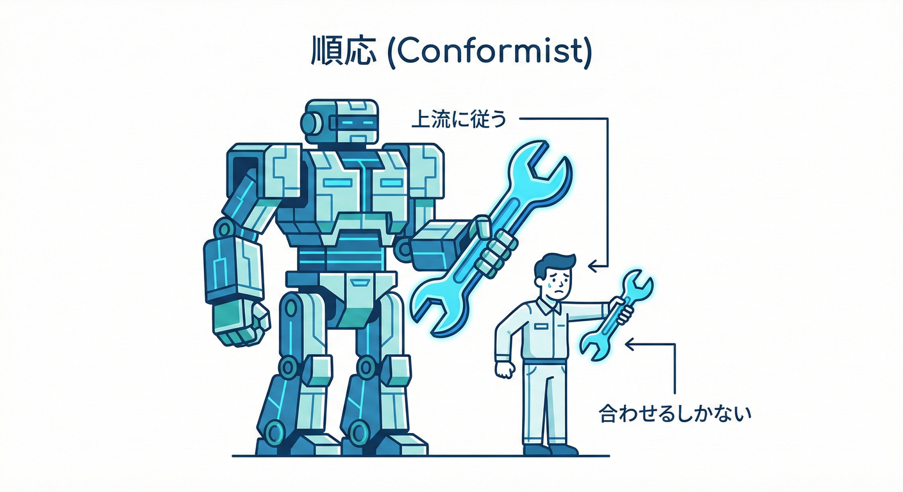
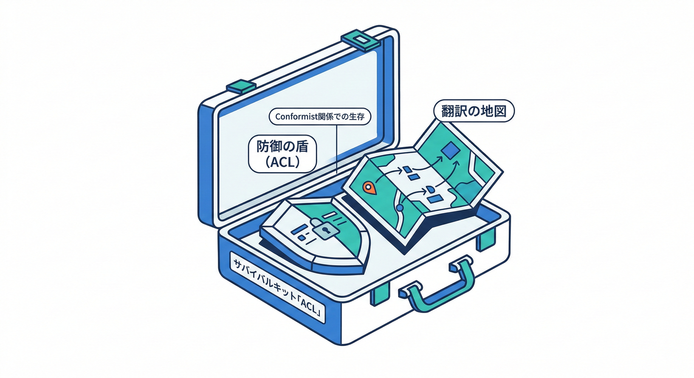
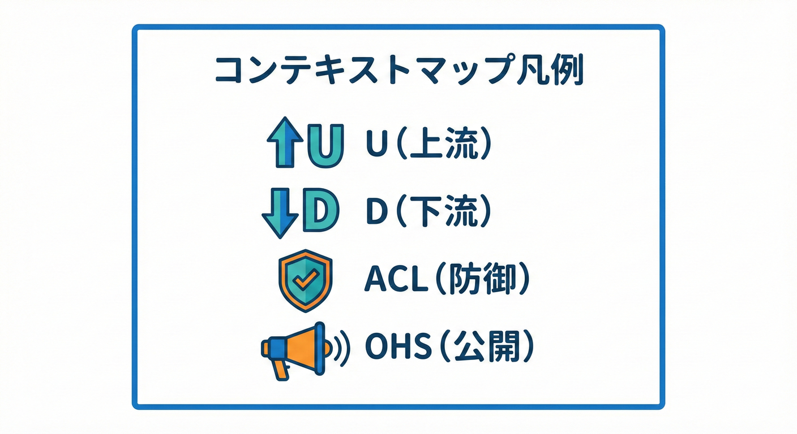
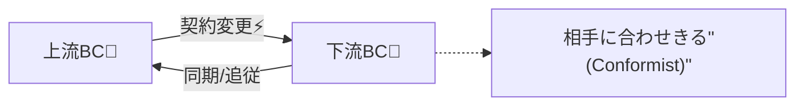
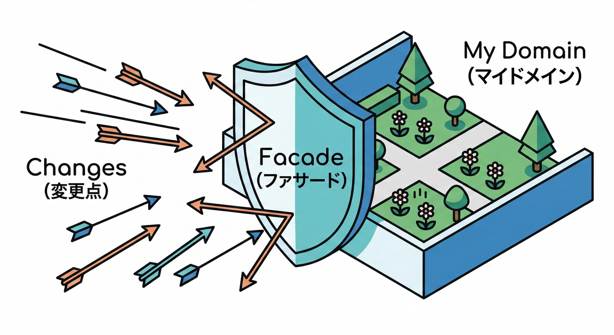

# 第30章：関係B Conformist（合わせきる）🙇‍♀️

## ねらい🎯

* Context Mapで **Conformist（コンフォーミスト）** を正しく使い分けられるようになる✨
* 「早く進めたいから合わせる」判断の **メリット/地雷** を理解する💣➡️🛡️
* C#で **“合わせる”実装** をして、壊れやすさを **最小コストで抑える** コツを掴む💻✨

---

## 1) Conformistって一言で？📝✨



**下流（Downstream）が、上流（Upstream）のモデルに “全面的に合わせる” 関係**だよ🙇‍♀️
「相手の言葉・構造・ルールが正義！」って割り切って、こちらが吸収する感じ🌊

* Context Mapは、複数のBCの関係（依存の向き・協調の形）を整理する地図🗺️
  その関係パターンの1つが Conformist だよ📌 ([GitHub][1])
* Conformistは **“上流は変えない（or 変えられない）”** が前提になりやすい😇 ([ddd-practitioners.com][2])

---

## 2) どんなときに出てくる？あるある3選🍩✨

## あるある①：相手が強い（主導権がない）👑💥

* 上流が別チーム/別会社で「仕様はウチ基準ね」で終わる
* 下流が交渉できず、合わせるしかない🙃

## あるある②：外部SaaS/決済/配送など “外の世界” 🌍📦

* 外部APIのデータ形が固定
* こちらのドメインを守る（ACL）を作る余裕がないなら、まず合わせる判断も起きがち😵‍💫

## あるある③：とにかくスピード優先🏃‍♀️💨

* 期限が近い、検証したい、作る人数が少ない
* “今は” Conformistで走って、あとで見直す（ただし条件つき！）⏳✨

---

## 3) Customer/Supplier と何が違うの？🤔🔍


## Customer/Supplier（第29章）🧑‍🤝‍🧑

* 下流が「こうしてほしい」と言える
* 上流が “顧客” のために調整する余地がある
* 仕様変更に **会話** がある📣

## Conformist（第30章）🙇‍♀️

* 下流が **全面的に相手に合わせる**
* 上流は合わせてくれない（交渉できない/したくない）
* 変更は上流都合で降ってくる⚡ ([ddd-practitioners.com][2])

---

## 4) Conformistのメリット/デメリット⚖️💡

## メリット😊✨

* ✅ **最速で繋がる**（設計・実装が軽い）
* ✅ **翻訳コスト（ACL）が要らない**
* ✅ “相手の仕様が正”だから判断が迷いにくい

## デメリット😇💥

* ❌ 上流の変更がそのまま刺さる（影響範囲がデカい）
* ❌ 下流のドメインが **相手の言葉に侵食**されやすい
* ❌ “なんでこの項目名？”みたいな違和感が蓄積しがち🧟‍♀️

---

## 5) 使っていいライン（超大事）📏🧡




Conformistは **使う場所を間違えると事故る**💥
判断はこの表でOK👇

| 判断ポイント    | ConformistでOK🙆‍♀️  | 危険⚠️（避けたい）  |
| --------- | ------------------- | ----------- |
| そのBCはコア？  | 支援/汎用寄り             | コア（競争力ど真ん中） |
| 上流を変えられる？ | 変えられない（外部/別会社/強チーム） | 同じチームで調整できる |
| 変更頻度      | 少ない/安定              | 頻繁・仕様が揺れる   |
| 期限/体制     | まず出す必要がある           | じっくり作れる     |
| 未来の拡張     | そこまで重要じゃない          | 将来かなり育てる予定  |

💡ポイント：**コアに侵入させない**のが基本だよ🛡️
「コアは守る」→「周辺は合わせる」みたいに使うと安全度アップ✨

---

## 6) ミニECでの具体例🛒📦（Conformistの地図を描く）

## 登場人物（BC）👥

* **顧客管理BC（CustomerManagement）**：住所の正を持つ🏠
* **配送BC（Shipping）**：配送ラベル作成・出荷指示を出す📦

配送BCは住所が欲しい。でも…
顧客管理BCは「住所の形は変えないよ」って姿勢😇
→ 配送BCが **全面的に合わせる** のが Conformist！

## Context Map（文字図）🗺️✍️

* 上流（Upstream）：CustomerManagement
* 下流（Downstream, Conformist）：Shipping

```
[U] CustomerManagement  ───▶  [D:CF] Shipping
```

※ “CF” みたいに Conformist をラベルとして表す書き方もあるよ📌 ([Context Mapper][3])





---

## まとめ🧡

---

## 7) C#で「合わせきる」実装パターン💻🙇‍♀️

ここでは **“最速で繋ぐ”** を優先しつつ、
**壊れ方をマシにする最低限の守り**も入れるよ🛡️✨

## パターンA：上流の契約（DTO）をそのまま参照する📦

上流が `CustomerManagement.Contracts` みたいな契約ライブラリ（NuGet等）を出していて、下流がそれを参照するイメージ。

* ✅ めっちゃ早い
* ❌ 上流の破壊変更がコンパイルエラーで刺さる（でも早く気づけるのは利点）

```csharp
// CustomerManagement.Contracts（上流が提供している想定）
namespace CustomerManagement.Contracts;

public sealed record AddressDto(
    string PostalCode,
    string PrefectureCode,
    string City,
    string Line1,
    string? Line2
);

public sealed record CustomerDto(
    string CustomerId,
    string FullName,
    AddressDto DefaultShippingAddress
);
```

```csharp
// Shipping（下流：Conformist）
using CustomerManagement.Contracts;

namespace Shipping;

public sealed class ShippingLabelService
{
    public string BuildLabelText(CustomerDto customer)
    {
        // 住所の形も命名も “相手が正” として扱う🙇‍♀️
        var a = customer.DefaultShippingAddress;

        return $"""
        {customer.FullName} 様
        〒{a.PostalCode}
        {a.PrefectureCode} {a.City}
        {a.Line1} {a.Line2}
        """;
    }
}
```

### 最低限の守り（おすすめ）🛡️

* 契約ライブラリのバージョンは **SemVer** 前提で固定（急な破壊変更を踏みにくくする）🔒
* CIで **契約更新PR** を明示（“いつ変わったか”を見える化）👀
* 結合テストで「ラベルが作れる」を毎回確認🧪

---

## パターンB：OpenAPI/SDK生成に “合わせる” 🤖📡

上流がAPIを公開してて、下流がクライアント生成（型も生成）でそのまま使う感じ。

* ✅ 更新が早い（生成し直し）
* ❌ 生成型がドメイン深くまで入り込むと地獄💀
  → **使う場所を境界付近に寄せる**のがコツ✨（完全ACLほど重くしない）

---

## 8) Conformistの “事故り方” と回避🧯💥

## 事故①：上流の都合でenumが変わって全部壊れる⚡


* `OrderStatus = Shipped` が `Dispatched` に変わった
* 文字列比較してたら静かにバグる😇
  ✅ 対策：enum/定数は **型で扱う** + **コンパイルで落ちる**寄りにする🧱

## 事故②：相手用語がコアに侵入して会話が崩壊🗣️💔


* いつの間にか「相手の用語」で社内会話が進む
  ✅ 対策：**コアBCでは別の言葉を保つ**（ここが踏ん張りどころ💪）

## 事故③：上流の “変な都合” が下流の設計まで歪める🌀




✅ 対策：

* 今はConformistでも、将来ACLに移るために
  **依存を1か所（境界）に集める**（“逃げ道”だけ作る）🚪✨

---

## 9) ミニ演習🎮✅（手を動かすよ）

## 演習1：Conformistにする/しないを判定しよう⚖️

次のケースで、Conformistがアリか判断してね👇

1. 決済は外部サービス。納期が短い。コアは注文体験。
2. 在庫BCと受注BCは同じチーム。調整できる。
3. 配送会社のAPIが頻繁に変わる。配送BCは支援扱い。

**書くこと📝**

* Conformistにする？（Yes/No）
* 理由（主導権・コア度・変更頻度・期限）を1行で✨

## 演習2：Context Mapを文字で描こう🗺️✍️

* 上流/下流を書いて、下流側に **CF** を付けてみてね🙇‍♀️
  （第29章のCSと並べて描けると最高！）

---

## 10) つまずきポイント集😵‍💫➡️😊

* 「Conformistって手抜き？」
  → **“戦略的に割り切る”** のがConformistだよ✨ 手抜きじゃなくて、優先順位の選択🎯
* 「じゃあACLはいらないの？」
  → コアを守りたいならACLが強い🛡️ でも **コストが高い**。Conformistは “まず出す” に強い💨
* 「いつConformistを卒業するの？」
  → 上流変更が痛くなってきたら、境界に変換層を足して **ACLへ移行**を検討🔁

---

## 11) お助けAIプロンプト集🤖✨（コピペOK）

## 判断の補助🧠

* 「この2つのBCの関係はConformist/Customer-Supplier/ACLのどれが妥当？理由も3つで」
* 「Conformistを選ぶときのリスクを、このケースで具体的に5個挙げて」

## 実装の補助💻

* 「このDTO（上流契約）を使うConformist実装例をC#で。依存を境界に集める形で」
* 「契約変更に気づくための結合テスト案を3つ（xUnit前提）で」

## 未来のACL移行の補助🚪

* 「今はConformistだけど、将来ACLに移行しやすい“依存の集約点”の設計案を出して」

---

## 付録：開発環境メモ（今どきの前提に合わせる）🧩💻

* .NETは **.NET 10（LTS）** が 2025-11-11 リリースで、2028-11-14 までサポート予定だよ📅✨ ([dotnet.microsoft.com][4])

[1]: https://github.com/ddd-crew/context-mapping?utm_source=chatgpt.com "ddd-crew/context-mapping"
[2]: https://ddd-practitioners.com/home/glossary/bounded-context/bounded-context-relationship/conformist/?utm_source=chatgpt.com "Conformist - Domain-driven Design: A Practitioner's Guide"
[3]: https://contextmapper.org/docs/conformist/?utm_source=chatgpt.com "Conformist"
[4]: https://dotnet.microsoft.com/en-us/platform/support/policy/dotnet-core?utm_source=chatgpt.com "NET and .NET Core official support policy"
