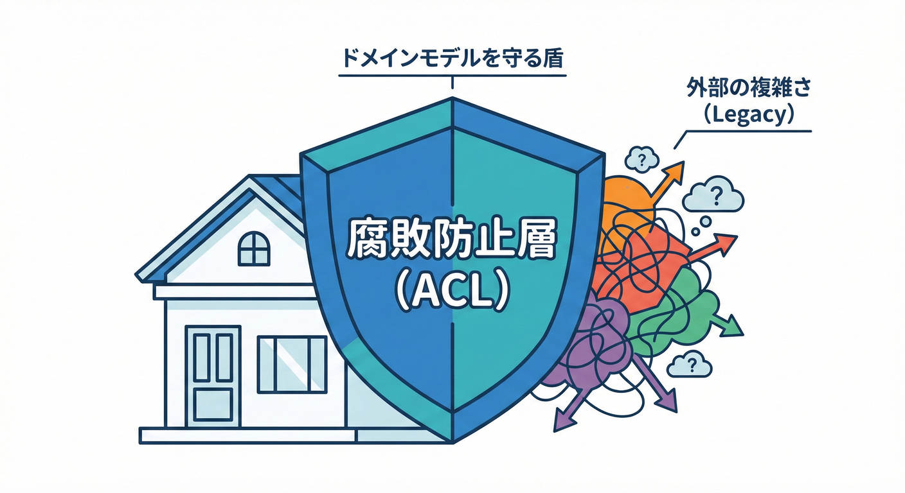
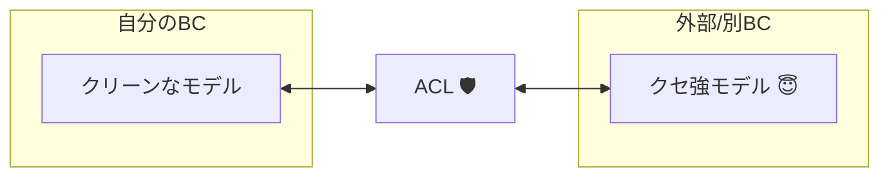
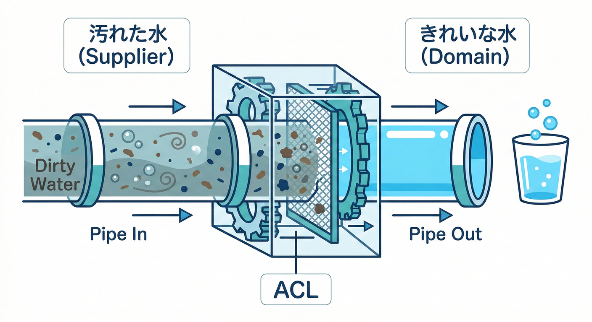
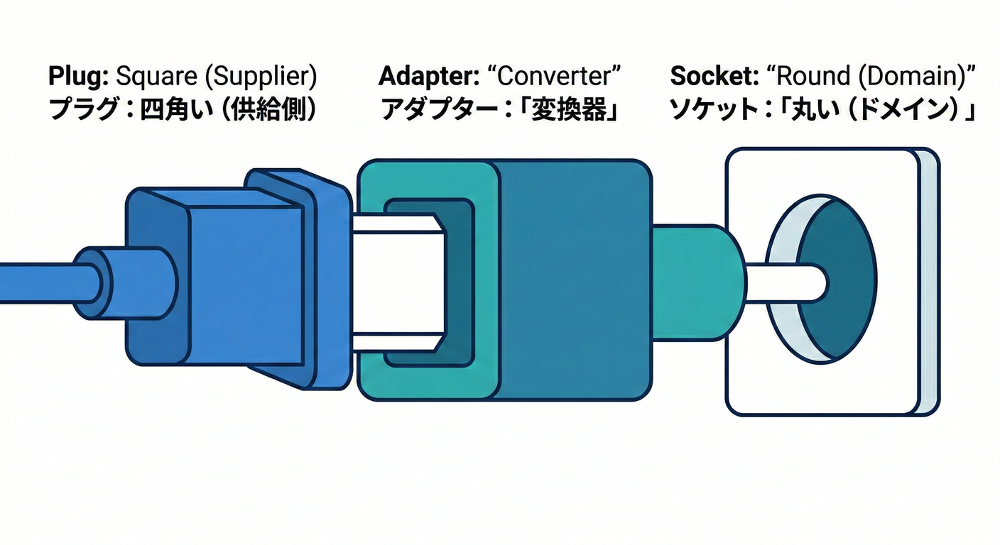
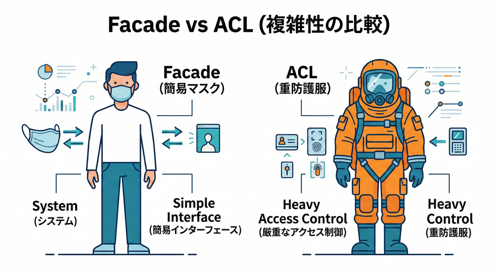
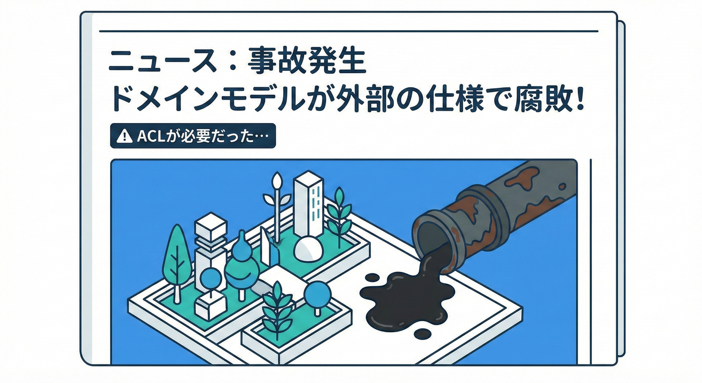
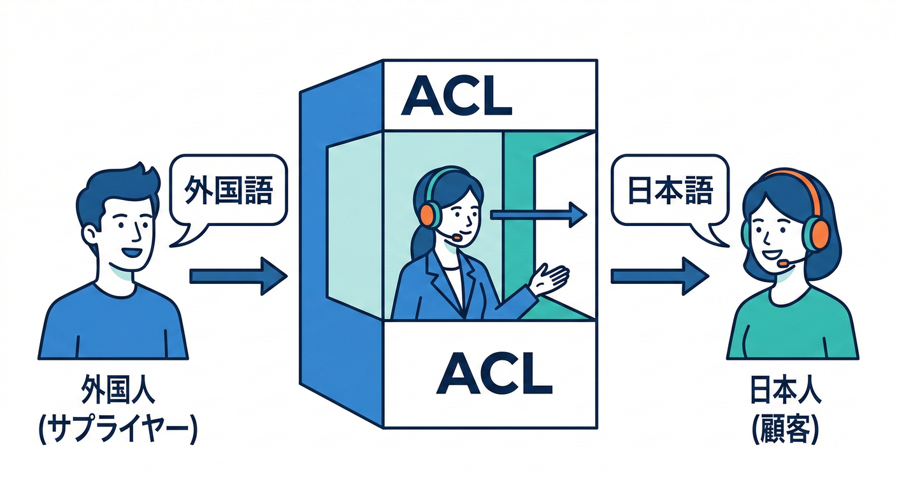
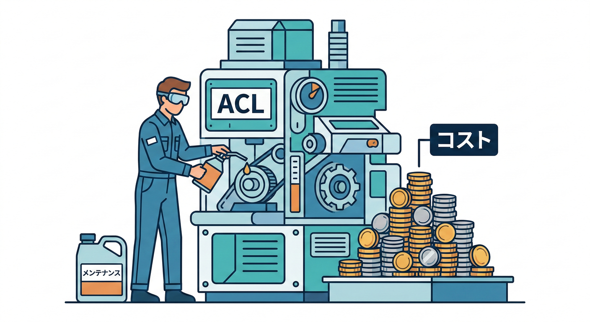

# 第31章：ACL入門A（なぜ必要？）🛡️

## この章でできるようになること🎯✨

* ACL（Anti-Corruption Layer / 腐敗防止層）が **何のために存在するのか** を、言葉で説明できる😊
* 「別BC・外部システムとつながる時、どこが壊れやすいか」を **具体例で想像できる** 🧠💡
* 「ACLを入れるべき状況／入れなくていい状況」の **見分けの感覚** がつく👀✅

---

## ACLを一言でいうと🧱🌊



**ACL＝“相手のクセ”を、自分のドメインに持ち込まないための翻訳＆防波堤** だよ🛡️✨
別BCやレガシー、外部APIと話すときに、**自分のモデルが汚れないように** 間に“変換レイヤー”を置く考え方！([Microsoft Learn][1])



---

## 1) そもそも何が「腐敗（corruption）」なの？😵‍💫🧪




ここでいう腐敗は、「悪いことした」じゃなくて…
**外の都合で、こっちのドメインがグチャグチャになること**😭💥

たとえば👇

* 外部が `status = 1/2/3` みたいな数字コードしか返さない → こっちのドメインにも `int StatusCode` が増える😇
* 外部が `"Y"` / `"N"` を使う → こっちが `bool` で表現できなくなって変換if地獄へ😵‍💫
* 外部の「顧客(Customer)」が、こっちの「顧客」と意味が違う → 同名なのに中身が別物で事故る🧨

こういうのが積み上がると、**ドメインモデルが“外部仕様の寄せ集め”になってしまう**んだよね…🥲

---

## 2) ACLが必要になる典型パターン🏥🧩




ACLが活躍するのは、だいたいこのへん👇

## パターンA：別BCとつながる（特に“相手が強い”）🔗👑

Context Mapでいう「上流／下流」みたいな関係で、
**下流（= 使う側）が“相手に合わせないといけない”状況**ってあるよね🙇‍♀️
このとき、下流側が **自分のドメインを守るために翻訳を持つ** のがACLの発想だよ🛡️([DevIQ][2])

## パターンB：外部サービス・SaaS・ベンダーAPIとつながる🌐📨

外部APIは、突然フィールド名が変わったり、仕様が微妙にズレたりする😇
だから **“外の変化”を内側へ直撃させない** のが超重要！([Microsoft Learn][1])

## パターンC：レガシーとつながる（移行中）🏚️➡️🏗️

レガシーは「命名」「単位」「null文化」「状態管理」が独特なことが多い😂
それを新しいドメインへ直入れすると、**新システムまでレガシー化**しちゃう…😱
そこでACLで “接続だけする” のが定番だよ🛡️([Microsoft Learn][1])

---

## 3) ミニECでイメージ：配送BC×外部配送API🚚📦

たとえば「配送BC（Shipping）」が、外部の配送会社APIを呼ぶケース！

外部APIが返してくるのがこんな感じだとするね👇

* `delivery_status: "IN_TRANSIT"`
* `eta_days: 2`（営業日なのか暦日なのか不明😇）
* 住所が `address1/address2` で分かれてたり、逆に1本だったり…

ここで **ACLなし** で配送BCが外部レスポンスを直接扱うと…

* 配送BCの中に、外部の `delivery_status` がそのまま入り込む😵‍💫
* 「ETAが営業日/暦日どっち？」問題が、ドメインのあちこちに散らばる🧨
* 仕様変更で、配送BCのドメインやユースケースまで巻き込まれて修羅場🔥

---

## 5) 図で理解：ACLは“境界の玄関”🏠🚪




イメージはこれ👇

```
（自分のBCの世界）      （相手の世界）
  ドメインモデル  ←→  ACL  ←→  外部API / 別BC / レガシー
      きれい✨          翻訳📖        クセ強め😇
```

**ポイントは1つ！**
「自分のBCの中は、自分の言葉・自分の型で統一する」✅
相手のクセは **ACLの中でだけ** 面倒を見る🧹🛡️([Microsoft Learn][1])

---

## 6) ACLがないと起きがちな“3つの事故”💥💥💥



## 事故①：ドメインが“外部仕様カタログ”になる📚😇

本来、ドメインは業務ルールを表すはずなのに、
外部都合のフィールドやコード値が入ってきて「意味の一貫性」が崩れる😭

## 事故②：if文の森が生える🌳🌳🌳

`if(status==2) ...` とか
`if(flag=="Y") ...` とかが、いろんな場所に散らばる…😵‍💫
“変換”が分散すると、変更時に全部探す羽目になる🔍💦

## 事故③：テストがつらくなる🧪💔

外部レスポンス形式がドメインに混ざると、
テストが「外部形式前提」になって **読みづらい・壊れやすい** 😭
ACLがあると、**ドメインはドメインの言葉でテストできる** よ🧡([Microsoft Learn][1])

---

## 6) ACLがあると何が嬉しい？🎁✨

* 外部仕様が変わっても、直す場所が **ACLに集約** される🔧✅
* ドメインは「自分の用語」「自分の型」「自分のルール」で保てる🧠✨
* 連携の“汚いところ”を、境界に押し込められる🧹🛡️
* 「どこまでがドメイン？」が明確になって、チームで話しやすい💬🌸([microservices.io][3])

---

## 7) “翻訳”って、何を翻訳するの？📖🔁




ACLが翻訳するのは、主にこの4つだよ👇

1. **名前（用語）**：`customer` がこっちの `Member` に相当する…など🏷️
2. **型（表現）**：`"Y"/"N"` → `bool`、`"2026/02/02"` → `DateOnly` など🧩
3. **単位・ルール**：円/ドル、税込/税抜、営業日/暦日…💴📏
4. **欠損・例外文化**：nullが来る、空文字が来る、0が来る…😇

これを **ドメインの外（境界）で吸収する** のがACL！([Microsoft Learn][1])

---

## 8) ちょい注意：ACLは“魔法”じゃない⚠️🧯

ACLを置くと良いこと多いけど、万能ではないよ👇

* **レイヤーが1枚増える** → 実装・監視・運用の手間も増える📦
* 変換が重いと **遅延** が出ることもある⏱️
* 何でもACLに押し込むと、ACLが肥大化して“第二のレガシー”になる😵‍💫

このへんは Microsoft の Azure Architecture Center でも注意点として挙げられてるよ🧯([Microsoft Learn][1])

---

## 9) “ACLを入れる？”判断チェック✅👀




次の質問に「うん…そうかも」が多いほど、ACLの出番だよ🛡️✨

* 相手の用語や型が、こっちの用語とズレてる？🧨
* 相手の仕様変更が、こっちの開発計画と独立して起きる？🔁
* 相手のデータが「欠損」「例外」「コード値」多め？😇
* 直接つなぐと、ドメインの中に変換ロジックが散らばりそう？🌳
* 「相手に合わせる」しか選べない関係？🙇‍♀️（下流側つらい）([DevIQ][2])

---

## 10) ミニ演習（頭の中でOK）🧠🎮

配送BCが外部配送APIを呼ぶとして、外部からこれが返ってくる👇

* `delivery_status = "DONE"`
* `eta_days = 0`
* `address = ""`（空文字…？）

このとき考えてみてね😊

1. 配送BCのドメインでは、状態は何型がいい？（string？enum？ValueObject？）🏷️
2. `eta_days=0` は「到着済み」なのか「未計算」なのか？🤔
3. `address=""` は「住所なし」なのか「相手の仕様上の空」なのか？😵‍💫
4. それを **どこで吸収** する？（ドメインの中？それともACL？）🛡️

---

## 11) お助けAIプロンプト🤖✨

* 「この外部APIレスポンスの“クセ”を列挙して。型・単位・欠損・命名の観点で！」🔍
* 「このレスポンスを、配送BCのユビキタス言語に合う形へ変換する案を出して！」📖
* 「ACLに閉じ込めるべき変換ルールを、箇条書きで仕様として書いて！」📌
* 「変換が散らばると危険なポイントを、保守の観点で説明して！」🧯

---

## まとめ🧡

ACLは、別BC・外部・レガシーの“クセ”から **自分のドメインを守る防波堤** 🛡️🌊
境界に“翻訳係”を置くことで、ドメインがきれいなまま育つ🌱✨([microservices.io][3])

[1]: https://learn.microsoft.com/en-us/azure/architecture/patterns/anti-corruption-layer?utm_source=chatgpt.com "Anti-corruption Layer pattern - Azure Architecture Center"
[2]: https://deviq.com/domain-driven-design/context-mapping?utm_source=chatgpt.com "Context Mapping"
[3]: https://microservices.io/patterns/refactoring/anti-corruption-layer.html?utm_source=chatgpt.com "Pattern: Anti-corruption layer"
