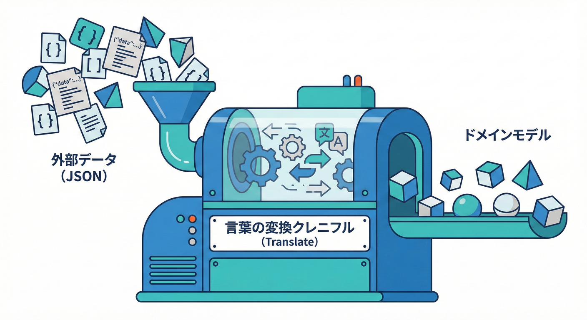
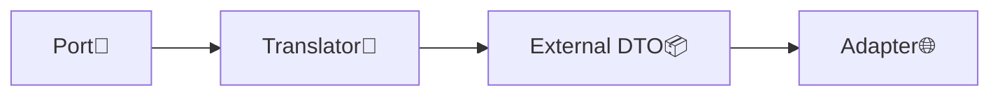
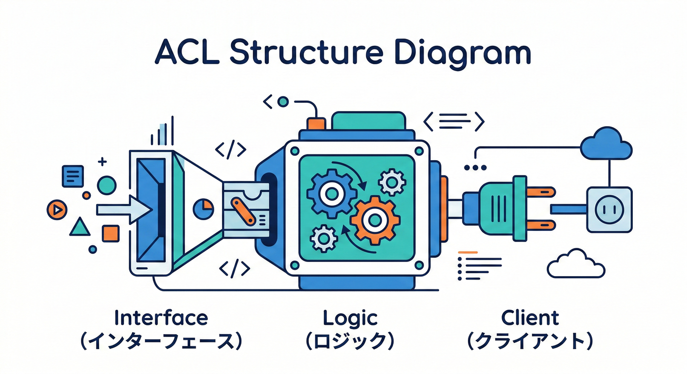
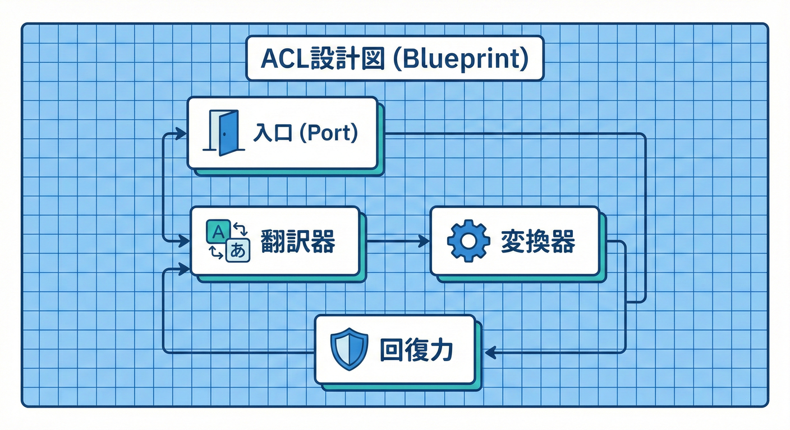
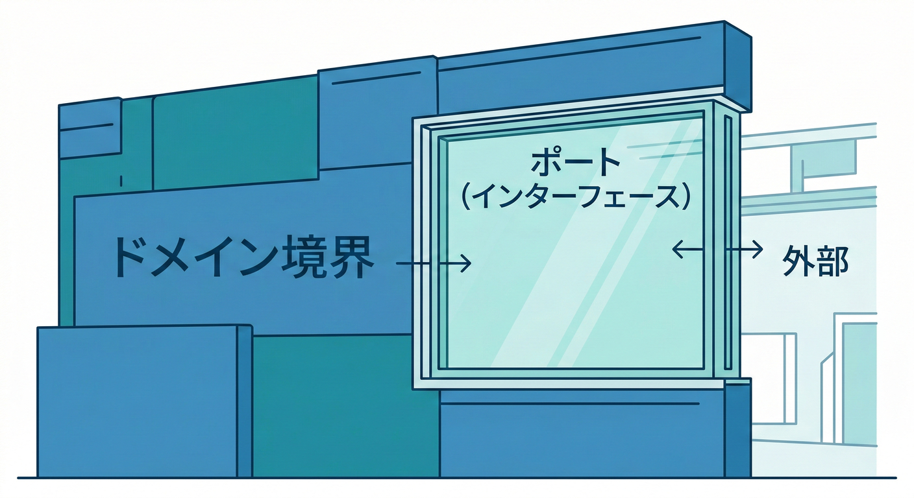
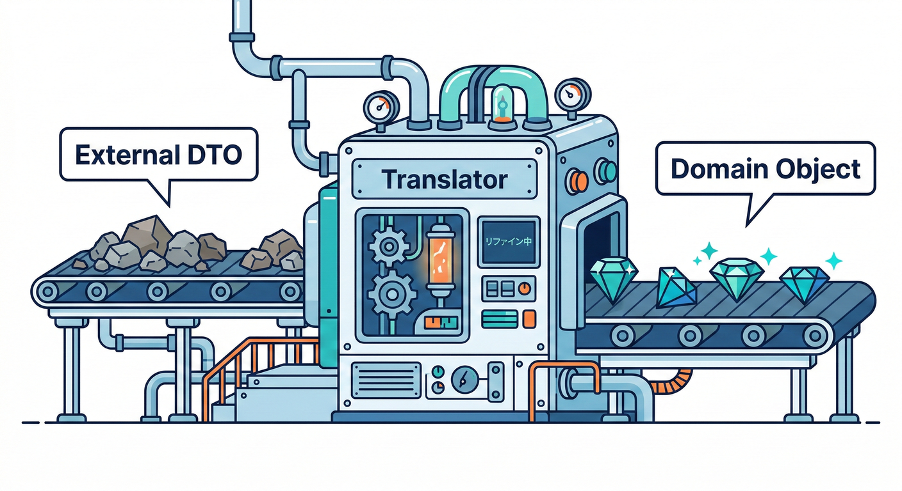
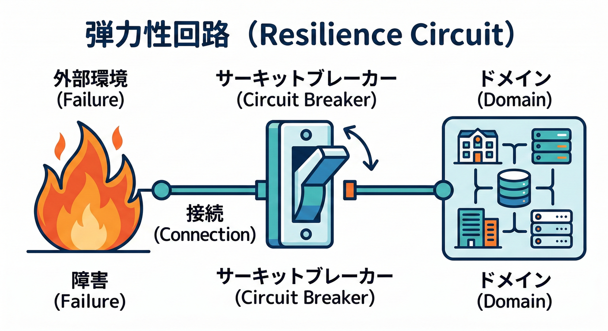
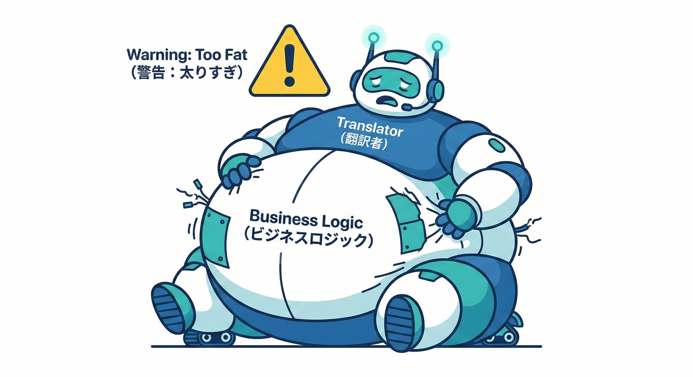

# 第32章：ACL入門B（どう作る？）🔧

## この章でできるようになること🎯✨

* **ACL（Anti-Corruption Layer）を“部品として”組み立てられる**ようになる🧩
* **DTO ⇔ ドメイン型の変換**を、事故りにくい形で書けるようになる📦🔁🏛️
* **命名・単位・欠損値・真偽値・ステータス**みたいな“揺れ”を吸収できるようになる🌪️➡️😌

---

## 1) ACLって「結局なにを作る」の？🧠🛡️



ACLは一言でいうと、**外の世界（別BC/外部サービス）のクセや都合を、あなたのBCに持ち込まないための翻訳レイヤー**だよ📘✨
「呼び出し」「変換」「例外/エラーの整形」まで含めて、**翻訳に必要なロジックをここへ集める**のがコツ！([Microsoft Learn][1])

また、DDD界隈でも “2つのドメインモデルを翻訳する層” として説明されている定番パターンだよ📌([microservices.io][2])



---

## 2) ACLの完成形（部品のセット）🧩✨






ACLはだいたいこの部品でできてるよ👇

1. **Port（ポート）**：あなたのBCが欲しい“機能”の口（インターフェイス）🚪
2. **External DTO（外部DTO）**：相手のAPI/イベントの形をそのまま写した入出力📦
3. **Translator（翻訳）**：External DTO ⇔ Domain（あなたの言葉）変換🔁
4. **Adapter/Client（接続）**：HTTP/メッセージングの実装（外部へつなぐ）🌐
5. **Resilience（回復力）**：リトライ/タイムアウト/遮断など（外部は落ちる前提😇）🧯

HTTP接続をするなら、.NETでは `IHttpClientFactory` を使うのが王道だよ。([Microsoft Learn][3])
さらに回復力（Resilience）を足すなら `Microsoft.Extensions.Http.Resilience` が用意されてるよ。([Microsoft Learn][4])

---

## 3) 例題：受注管理BC → 配送管理BC を呼ぶ🚚📦

## 状況（よくあるやつ）😵‍💫

受注管理（OrderManagement）BCは「配送を作ってほしい」だけ。
でも配送管理（Shipping）BCのAPIはこんなクセがある…👇

* JSONが `snake_case`（例：`postal_code`）🐍
* 重量が **グラム**で来る（こっちはkgで扱いたい）⚖️
* 真偽値が `"Y"`/`"N"` 😇
* ステータスが文字列コード（`"LBL_CREATED"`とか）🔤

ここを **ACLで全部吸収**して、受注管理BCの中は “自分の言葉” だけで生きられるようにするよ🛡️💕

---

## 4) 手順①：まず Port（欲しい機能の口）を決める🚪✨




受注管理BCが欲しいのは「配送を作る」「配送状態を取る」みたいな **ユースケース**。
相手APIの形じゃなくて、**自分の言葉で**インターフェイスを切ろう🗣️💡

```csharp
public interface IShippingPort
{
    Task<ShipmentResult> CreateShipmentAsync(CreateShipmentCommand command, CancellationToken ct);
}
```

ポイント✅

* **この `IShippingPort` の引数/戻り値は “ドメイン型”** に寄せる（外部DTOを出さない）🙅‍♀️
* “配送APIがこうだから…”をここに混ぜない（混ぜたら負け😇）

---

## 5) 手順②：External DTO（相手の形を“そのまま写す”）を作る📦📝

外部DTOは割り切って **相手のJSON/契約に合わせて**作るよ。
プロパティ名が合わないなら、`System.Text.Json` の属性や命名ポリシーで合わせられるよ📌([Microsoft Learn][5])

例：相手が `postal_code` を返す想定👇

```csharp
using System.Text.Json.Serialization;

public sealed record ShippingCreateShipmentRequestDto(
    [property: JsonPropertyName("order_id")] string order_id,
    [property: JsonPropertyName("postal_code")] string postal_code,
    [property: JsonPropertyName("weight_g")] int weight_g,
    [property: JsonPropertyName("cash_on_delivery")] string cash_on_delivery // "Y" / "N"
);

public sealed record ShippingCreateShipmentResponseDto(
    [property: JsonPropertyName("shipment_id")] string shipment_id,
    [property: JsonPropertyName("status_code")] string status_code
);
```

ここでのコツ💡

* **DTOは“翻訳前の生データ置き場”**（ビジネスルールを入れない）🥗
* `string?` とか `int?` など、欠損しそうなら素直に nullable にするのも大事🙆‍♀️

---

## 6) 手順③：受注管理BCのドメイン型を作る🏛️✨（外のクセ禁止）

受注管理BCは “自分の言葉” で持つよ👇
（外の `"Y"/"N"` とか `"LBL_CREATED"` とか知らなくてOK！最高！）

```csharp
public sealed record ShipmentId(string Value);

public enum ShipmentStatus
{
    LabelCreated,
    InTransit,
    Delivered,
    Unknown
}

public sealed record WeightKg(decimal Value)
{
    public static WeightKg FromGrams(int grams) => new(grams / 1000m);
}

public sealed record CreateShipmentCommand(
    string OrderId,
    string PostalCode,
    WeightKg Weight,
    bool CashOnDelivery
);

public sealed record ShipmentResult(
    ShipmentId ShipmentId,
    ShipmentStatus Status
);
```

---

## 7) 手順④：Translator（翻訳）を書く🔁🧠




翻訳はACLの心臓❤️
揺れポイントをここで吸収するよ👇

* 命名：`postal_code` → `PostalCode` 🏷️
* 単位：`weight_g` → `WeightKg` ⚖️
* 真偽：`"Y"/"N"` → `bool` ✅
* ステータス：文字列コード → `enum` 🎛️

```csharp
public static class ShippingTranslator
{
    public static ShippingCreateShipmentRequestDto ToExternal(CreateShipmentCommand cmd)
        => new(
            order_id: cmd.OrderId,
            postal_code: cmd.PostalCode,
            weight_g: (int)(cmd.Weight.Value * 1000m),
            cash_on_delivery: cmd.CashOnDelivery ? "Y" : "N"
        );

    public static ShipmentResult ToDomain(ShippingCreateShipmentResponseDto dto)
        => new(
            ShipmentId: new ShipmentId(dto.shipment_id),
            Status: MapStatus(dto.status_code)
        );

    private static ShipmentStatus MapStatus(string? statusCode)
        => statusCode switch
        {
            "LBL_CREATED" => ShipmentStatus.LabelCreated,
            "IN_TRANSIT"  => ShipmentStatus.InTransit,
            "DELIVERED"   => ShipmentStatus.Delivered,
            _             => ShipmentStatus.Unknown
        };
}
```

翻訳の鉄則🔥

* **変換できない値は “Unknown” に落とす**（例外で全体爆発を避ける）💣➡️🧯
* “よくわからないからとりあえずstringで持つ”を、ドメイン側に持ち込まない🙅‍♀️

---

## 8) 手順⑤：Adapter/Client（接続）を書く🌐🔌

ここで `HttpClient` を使って外部を叩くよ。
.NETでは `IHttpClientFactory` を使うのが推奨されてる（接続の管理やDIと相性◎）([Microsoft Learn][3])

```csharp
using System.Net.Http.Json;
using System.Text.Json;

public sealed class ShippingAclClient : IShippingPort
{
    private readonly HttpClient _http;
    private static readonly JsonSerializerOptions JsonOptions = new()
    {
        // 必要なら命名や柔軟性をここで調整できるよ
        PropertyNameCaseInsensitive = true
    };

    public ShippingAclClient(HttpClient http)
    {
        _http = http;
    }

    public async Task<ShipmentResult> CreateShipmentAsync(CreateShipmentCommand command, CancellationToken ct)
    {
        var reqDto = ShippingTranslator.ToExternal(command);

        // 例：POST /shipments
        using var res = await _http.PostAsJsonAsync("/shipments", reqDto, JsonOptions, ct);

        // 外部エラーをドメインに持ち込まない：ここで整形する
        if (!res.IsSuccessStatusCode)
        {
            // ここでは例として例外にしてるけど、
            // 章が進むと「ドメインに合う失敗表現」に変えるのがさらに良いよ✨
            throw new HttpRequestException($"Shipping API failed: {(int)res.StatusCode}");
        }

        var resDto = await res.Content.ReadFromJsonAsync<ShippingCreateShipmentResponseDto>(JsonOptions, ct)
                    ?? throw new HttpRequestException("Shipping API returned empty body.");

        return ShippingTranslator.ToDomain(resDto);
    }
}
```

`System.Text.Json` は `JsonSerializerOptions` や命名ポリシー/属性で柔軟に合わせられるよ📌([Microsoft Learn][5])

---

## 9) 手順⑥：Resilience（回復力）を“ACL側”で持つ🧯⚡




外部は落ちる！遅れる！たまに壊れる！😇
だから **リトライ・タイムアウト・遮断**は、だいたいACL側で持つのが気持ちいいよ🛡️

.NETには `Microsoft.Extensions.Http.Resilience` が用意されてて、`HttpClient` 向けの回復性メカニズムを提供してるよ。([Microsoft Learn][4])

（章の主題はACLの形なので、ここでは“置き場所の感覚”だけ覚えよう💡）

---

## 10) “変換が肥大化”したら黄色信号🚨📈




Translatorがどんどん太ってきたら、だいたいこのどれか👇

* そもそも **境界の切り方が苦しい**（責務が混ざってる）😵‍💫
* 相手のモデルが **頻繁に変わる**（契約が安定してない）🌀
* “翻訳”じゃなくて、実は **自分の業務ルール**を押し込んでる😇

こういうときは、Context Mapを見直したり、**公開する言葉（Published Language）**の導入を検討する流れになるよ📢✨（第34章につながる！）

---

## 11) ありがち事故と対策（先に踏んでおこう）🧨➡️🛡️

## 事故①：外部DTOがドメイン層に漏れる💧

* ❌ ドメインが `ShippingCreateShipmentResponseDto` を知ってる
* ✅ **IShippingPortはドメイン型だけ**にする

## 事故②：ステータスをstringで保持して地獄👹

* ✅ ドメイン側は `enum` で **意味が固定**されるようにする

## 事故③：単位変換が散らばって計算ミス⚖️💥

* ✅ `WeightKg.FromGrams()` みたいに **変換の置き場所を固定**する

---

## 12) ミニ演習✍️🎮

## お題：次のJSONをドメインに翻訳しよう🔁

外部からこう返ってくるとする👇

```json
{
  "shipment_id": "SHP_12345",
  "status_code": "IN_TRANSIT"
}
```

**やること✅**

1. `ShippingCreateShipmentResponseDto` を受け取る
2. `ShipmentResult(ShipmentId, ShipmentStatus)` に変換する
3. 未知の `status_code` は `Unknown` にする

---

## 13) お助けAIプロンプト🤖✨（レビュー用）

* 「この外部JSONからC# DTO（`JsonPropertyName`付き）を作って」📦
* 「このDTO→ドメイン変換で、単位・null・未知値の落とし穴を指摘して」🕳️
* 「`status_code` のマッピングを enum にして、未知値の扱いも入れて」🎛️

※生成されたコードはそのまま採用せず、**“翻訳の責任がACLに閉じてるか”**だけ最終チェックしようね🔍✅

---

## 14) 今日のまとめ🌸✅

* ACLは **“外のクセを中に入れない翻訳所”** 🛡️([Microsoft Learn][1])
* 作る順番は **Port → 外部DTO → ドメイン型 → Translator → Client** が安定🧩
* 揺れ（命名/単位/欠損/真偽/ステータス）は **Translatorに集約**して勝つ🏆
* HTTP接続は `IHttpClientFactory`、回復力は `Microsoft.Extensions.Http.Resilience` が定番ルートだよ🌐🧯([Microsoft Learn][3])

---

## 参考：この章で触れた“最新の土台”📌

.NET 10 は 2026-01-13 時点の更新（例：10.0.2）が案内されてるよ。([Microsoft][6])
C# 14 の新機能も .NET 10 / Visual Studio 2026 で試せる、と整理されてるよ。([Microsoft Learn][7])

[1]: https://learn.microsoft.com/en-us/azure/architecture/patterns/anti-corruption-layer?utm_source=chatgpt.com "Anti-corruption Layer pattern - Azure Architecture Center"
[2]: https://microservices.io/patterns/refactoring/anti-corruption-layer.html?utm_source=chatgpt.com "Pattern: Anti-corruption layer"
[3]: https://learn.microsoft.com/en-us/dotnet/core/extensions/httpclient-factory?utm_source=chatgpt.com "Use the IHttpClientFactory - .NET"
[4]: https://learn.microsoft.com/ja-jp/dotnet/core/resilience/http-resilience?utm_source=chatgpt.com "回復性がある HTTP アプリを構築する: 主要な開発パターン"
[5]: https://learn.microsoft.com/ja-jp/dotnet/standard/serialization/system-text-json/customize-properties?utm_source=chatgpt.com "System.Text.Json でプロパティの名前と値をカスタマイズする ..."
[6]: https://dotnet.microsoft.com/en-US/download/dotnet/10.0?utm_source=chatgpt.com "Download .NET 10.0 (Linux, macOS, and Windows) | .NET"
[7]: https://learn.microsoft.com/ja-jp/dotnet/csharp/whats-new/csharp-14?utm_source=chatgpt.com "C# 14 の新機能"
