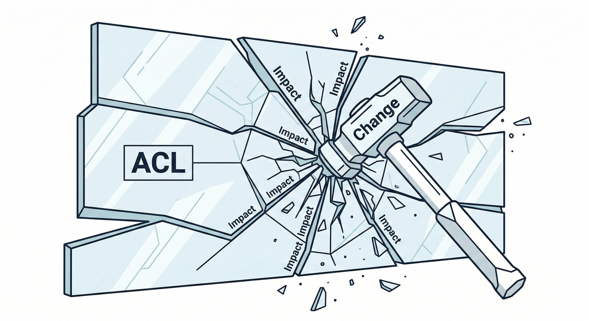
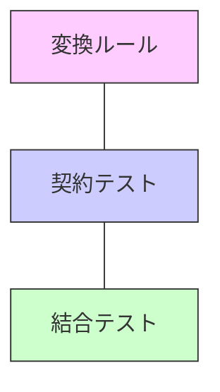
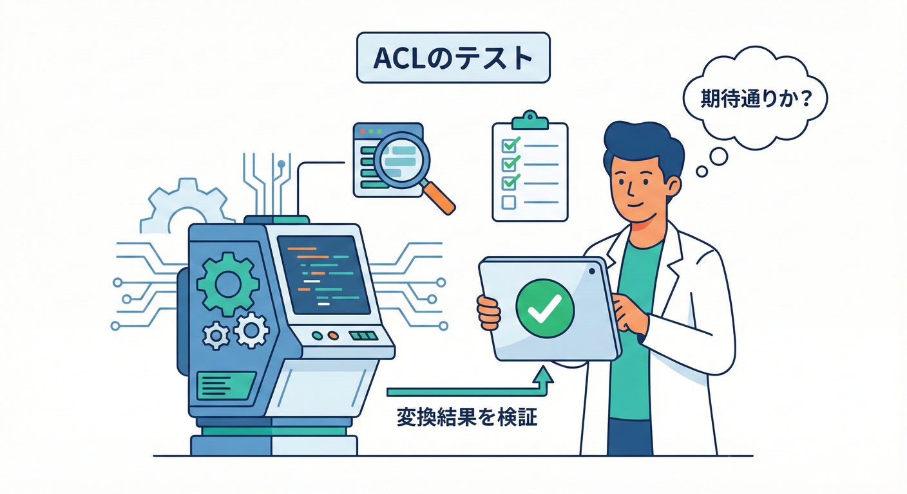
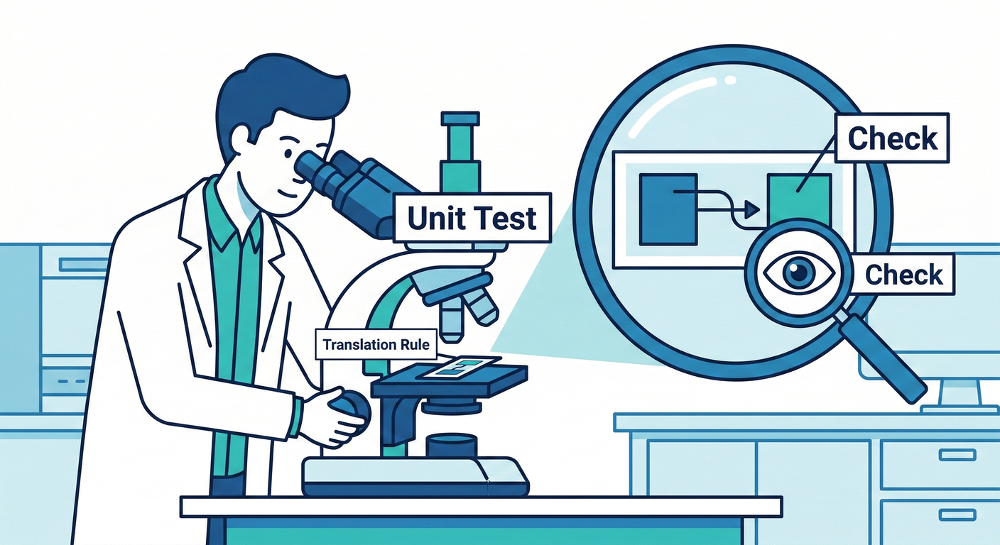
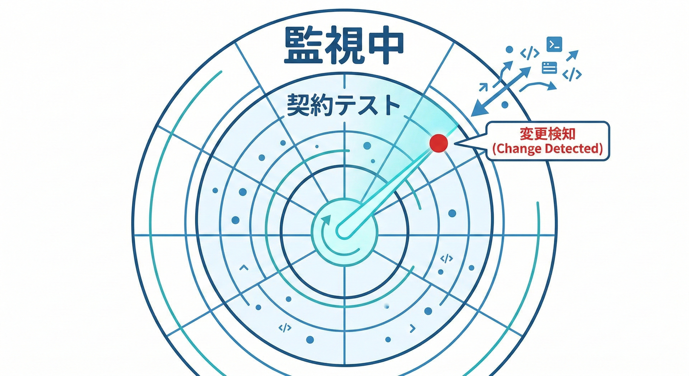
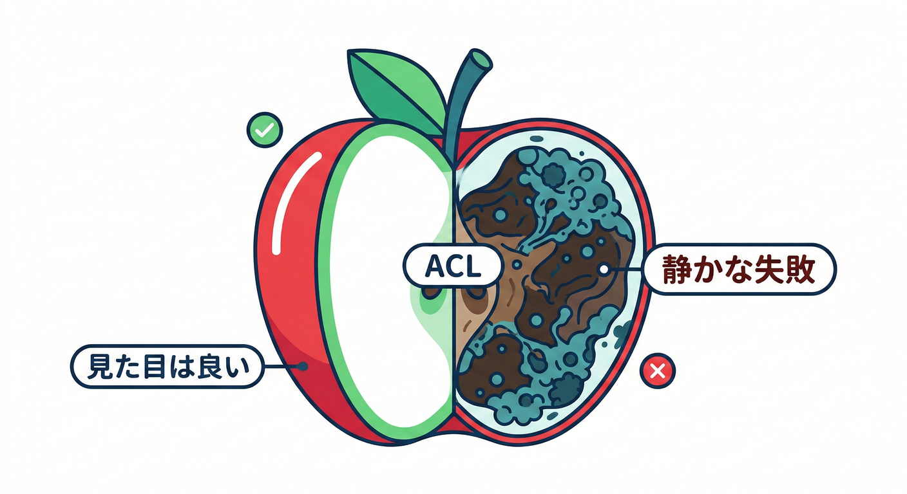
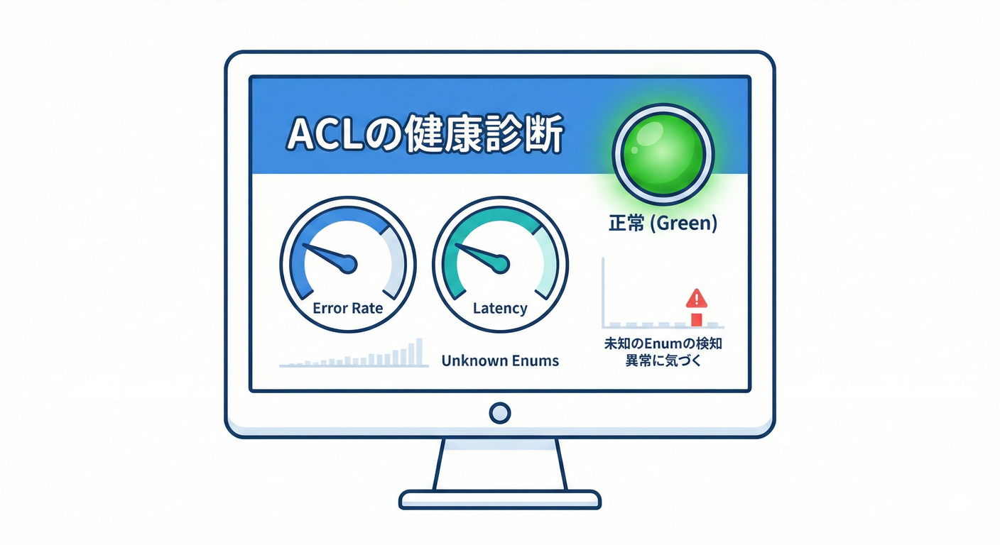

# 第33章：ACL入門C（テスト＆運用）🧪

## 今日のゴール🎯✨

この章が終わったら、こんなことができるようになります👇💖

* ACL（翻訳レイヤー）が**壊れてもドメインを守れる**ように、テストを設計できる🛡️
* 「相手（別BC/外部）が変わった！」に**気づける仕組み**を作れる🔔
* 変更が来たときの**直し方・確認手順（運用ルーチン）**を回せる🔁

---

## 1. ACLって「壊れやすい場所」なの？😳💥




うん、壊れやすいです🥺
なぜならACLは、**“外の世界の揺れ”**（仕様変更・欠損・命名・単位・enum追加など）を一身に受け止める場所だからです🌪️

だからこそ…
ACLが壊れたときに、

* 変な値がドメインに入る😇
* 例外が連鎖して障害になる😇😇
* 「どこが原因？」が追えなくなる😇😇😇

…みたいな地獄が起きやすいんです🔥

なので方針はこれ👇✨
**「ACLは壊れる前提で、テストと運用で囲う」**🧪🔒

---

ACLのテストは、だいたいこの3種類に分けるとスッキリします👇





## A) 変換ルールのユニットテスト（最重要）🧪✅

* DTO → ドメイン 変換の「ルール」を**仕様として固定**する
* 例：単位、丸め、nullの扱い、enumのマッピング、文字列の正規化など

## B) 契約（Contract）テスト（変化の検知係）📜🔍

* 「相手のAPI/イベント形式が変わった」を**早期に検知**する
* Consumer Driven Contract Testing（CDC）なら、使ってる部分だけを契約にできて強いです📌（例：Pact）([docs.pact.io][1])

## C) 結合テスト（“実際に繋ぐとどうなる？”）🔌🧪

* ステージングやテスト環境で、実際のレスポンスに近いもので確認
* 「想定外の欠損」「謎の文字コード」「タイムゾーン」みたいな実戦バグを拾う🕵️‍♀️

---

## 3. 例題：配送会社APIをACLで受ける📦🚚（よくあるやつ）

外部（配送会社）からこんなJSONが返ってくる想定にします👇

* `status` は `"IN_TRANSIT"` みたいな文字列
* `delivered_at` は配達前だと `null`
* `weight_grams` は **g単位**（でもドメインはkgで扱いたい）
* `occurred_at` は **UTCのISO文字列**

## ✅ 変換ルール（この章の主役）📌✨

ここを「仕様」として固定し、テストで守ります💖

1. `weight_grams` → `kg`（`g / 1000m`）
2. `delivered_at == null` は「未配達」と解釈（ドメインの状態で表現）
3. `status` の未知値は「落とす」or「Unknownに寄せる」
   　※おすすめは **Unknownに寄せて監視**（落とすと障害になりやすい）👀
4. UTC時刻は `DateTimeOffset` で保持（タイムゾーン事故を避ける）🕰️

---

## 4. ACL実装（最小サンプル）🧩💻

※テストが主役なので、実装は最小にします🌸

```csharp
using System;

public sealed record ShippingExternalDto(
    string TrackingNumber,
    string Status,
    int WeightGrams,
    string OccurredAtUtc,     // ISO-8601 string
    string? DeliveredAtUtc    // ISO-8601 or null
);

public enum ShippingStatus
{
    Unknown = 0,
    InTransit,
    Delivered,
    Returned
}

public sealed record Shipment(
    string TrackingNumber,
    ShippingStatus Status,
    decimal WeightKg,
    DateTimeOffset OccurredAtUtc,
    DateTimeOffset? DeliveredAtUtc
);

public static class ShippingAclTranslator
{
    public static Shipment ToDomain(ShippingExternalDto dto)
    {
        var status = dto.Status switch
        {
            "IN_TRANSIT" => ShippingStatus.InTransit,
            "DELIVERED"  => ShippingStatus.Delivered,
            "RETURNED"   => ShippingStatus.Returned,
            _            => ShippingStatus.Unknown
        };

        var occurred = DateTimeOffset.Parse(dto.OccurredAtUtc); // ISO想定
        DateTimeOffset? delivered = dto.DeliveredAtUtc is null
            ? null
            : DateTimeOffset.Parse(dto.DeliveredAtUtc);

        var weightKg = dto.WeightGrams / 1000m;

        return new Shipment(
            TrackingNumber: dto.TrackingNumber,
            Status: status,
            WeightKg: weightKg,
            OccurredAtUtc: occurred,
            DeliveredAtUtc: delivered
        );
    }
}
```

---

## 5. 変換ルールのユニットテスト🧪✅（xUnit例）




xUnitは .NET 8以降に対応するv3系が案内されています([xunit.net][2])
（この章の目的は「テストの型」を覚えることなので、フレームワークはxUnitで進めます💖）

## 5-1) “単位変換” を固定するテスト⚖️

```csharp
using System;
using Xunit;

public class ShippingAclTranslatorTests
{
    [Theory]
    [InlineData(0, 0.0)]
    [InlineData(1, 0.001)]
    [InlineData(1500, 1.5)]
    public void Weight_grams_to_kg_is_converted(int grams, decimal expectedKg)
    {
        var dto = new ShippingExternalDto(
            TrackingNumber: "T123",
            Status: "IN_TRANSIT",
            WeightGrams: grams,
            OccurredAtUtc: "2026-01-20T10:00:00Z",
            DeliveredAtUtc: null
        );

        var domain = ShippingAclTranslator.ToDomain(dto);

        Assert.Equal(expectedKg, domain.WeightKg);
    }
}
```

## 5-2) nullの扱い（配達前はnull）🧼

```csharp
using Xunit;

public partial class ShippingAclTranslatorTests
{
    [Fact]
    public void DeliveredAt_null_stays_null()
    {
        var dto = new ShippingExternalDto(
            TrackingNumber: "T123",
            Status: "IN_TRANSIT",
            WeightGrams: 1000,
            OccurredAtUtc: "2026-01-20T10:00:00Z",
            DeliveredAtUtc: null
        );

        var domain = ShippingAclTranslator.ToDomain(dto);

        Assert.Null(domain.DeliveredAtUtc);
        Assert.Equal(ShippingStatus.InTransit, domain.Status);
    }
}
```

## 5-3) 未知のstatusが来たとき（事故の温床💣）

「落とさない」で **Unknownに寄せる**方針のテストです👇

```csharp
using Xunit;

public partial class ShippingAclTranslatorTests
{
    [Fact]
    public void Unknown_status_maps_to_Unknown()
    {
        var dto = new ShippingExternalDto(
            TrackingNumber: "T999",
            Status: "ON_THE_MOON", // 想定外🛸
            WeightGrams: 1000,
            OccurredAtUtc: "2026-01-20T10:00:00Z",
            DeliveredAtUtc: null
        );

        var domain = ShippingAclTranslator.ToDomain(dto);

        Assert.Equal(ShippingStatus.Unknown, domain.Status);
    }
}
```

---

## 6. 契約（Contract）テストで「相手の変更」を早めに掴む📜🔔




ここで大事なのは気持ちとして👇

* ユニットテスト：**自分のルールを守る**
* 契約テスト：**相手が変わったら気づく**

Consumer Driven Contract Testing（CDC）は、使ってる通信だけを契約にできるのが強みです📌([docs.pact.io][1])
.NET向けのPact実装として PactNet が提供されています([GitHub][3])

## 契約テストの“運用的”な置き方🧠✨

* **Consumer側**（あなた側）：
  「この形で来てほしい」をテストとして持つ → 契約（pact）を生成📄
* **Provider側**（相手側）：
  pactを取り込み、守れてるか検証✅

もし相手が“別BC”で自分たちが両方管理してるなら、CIで自動検証まで持っていくと最強です💪🔥

---

## 7. 結合テスト：現実の “汚いデータ” を拾う🧹🕵️‍♀️


現場でよくあるのがこれ👇😇

* `occurred_at` が `"2026/01/20 10:00:00"` みたいな謎形式になる
* 数値が文字列で来る `"weight_grams": "1500"`
* enumが増える `"status": "DELIVERED_TO_PICKUP_POINT"`
* たまに欠損する（`trackingNumber` が空とか）

結合テストでは、**“実データに近いレスポンス”**を固定して、ACLが耐えるかを見ます👀
（この固定ファイルを「ゴールデン（golden）」って呼んだりします✨）

---

## 8. 運用（Runbook）：変更通知が来たらこの順で回す🔁📣

ACL運用は、**手順が命**です💖
「焦って直す」より「いつもの順番で直す」が強い💪

## 変更が来たとき手順✅

1. **影響範囲を確認**（どのDTO/どのフィールド？）🔍
2. **契約テスト or ゴールデンテストを先に更新して“赤くする”】【テストで変更を見える化】🟥
3. ACL修正（変換ルール追加・互換維持）🔧
4. ユニットテストで変換ルールを固定🧪
5. 結合テスト（疑似レスポンス/ステージング）🔌
6. リリース後は監視を強める（次の項）📈👀

## ロールバック方針もセットで🪂

* 「未知statusはUnknownに寄せる」みたいな**安全弁**を残す
* 急に落ちる（例外で停止）を避ける設計にする
* 監視が鳴ったら「どの入力で壊れたか」追えるログを残す🧾✨

---

## 9. 監視（Observability）：ACLは “静かに腐る” のが怖い😱🧊






ACLの怖さは「全部落ちる」よりも、**少しずつ変になって気づかない**ことです🥶監視ダッシュボード](./picture/bc_cs_study_033_monitor_dashboard.png)

ACLの怖さは「全部落ちる」よりも、**少しずつ変になって気づかない**ことです🥶

## 監視で見ると強いもの📈

* `ShippingStatus.Unknown` の発生率（増えたら相手が変わったサイン）🚨
* 変換失敗（パース失敗・必須欠損）の件数🧯
* ACL通過後の“ありえない値”（重量0が急増、みたいな）🧐

ログはこの2つがあると復旧が速いです🏃‍♀️💨

* どの外部ID（trackingNumber等）で起きたか
* どのフィールドが原因か（status? timestamp?）

---

## 10. “最新環境”の前提メモ（超短く）🧷✨

* .NETは **.NET 10 がLTS**として案内され、サポート表も公開されています([Microsoft][4])
* Visual Studioは **Visual Studio 2026** が提供され、.NET 10 / C# 14 サポートが記載されています([Microsoft Learn][5])
  （ここは「この章の内容が2026の現役前提である」根拠として置いてます📌）

---

---

## 11. お助けAIプロンプト🤖💬✨（コピペOK）

* 「このACL変換で、壊れやすいポイント（null/enum/単位/時刻）を列挙して」🔍
* 「xUnitで、変換ルールを固定するTheoryテストを作って」🧪
* 「未知enum値が増えたとき、落とさずに安全に扱う設計案を3つ出して」🛡️
* 「ACLの監視メトリクス案（カウンタ/割合/ログ項目）を提案して」📈
* 「契約テスト（CDC）の導入手順を、最小構成で箇条書きにして」📜

[1]: https://docs.pact.io/?utm_source=chatgpt.com "Pact Docs: Introduction"
[2]: https://xunit.net/?utm_source=chatgpt.com "xUnit.net: Home"
[3]: https://github.com/pact-foundation/pact-net?utm_source=chatgpt.com "pact-foundation/pact-net"
[4]: https://dotnet.microsoft.com/en-us/platform/support/policy/dotnet-core ".NET and .NET Core official support policy | .NET"
[5]: https://learn.microsoft.com/en-us/visualstudio/releases/2026/release-notes "Visual Studio 2026 Release Notes | Microsoft Learn"
