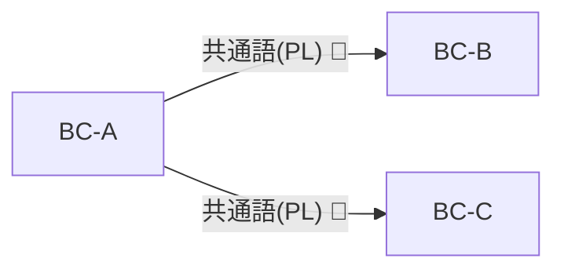

# 第34章：Published Language（公開する言葉）📢

## ねらい🎯

この章を終えると、こんなことができるようになります😊✨

* 境界（BC）をまたぐときの「契約の言葉（Published Language）」を説明できる📣
* API / イベント / DTO を「契約」として設計できる📦
* 変更しても壊れにくい “後方互換” の感覚がつかめる🔁✅

---

## 1) Published Languageってなに？📚✨


**Published Language = 境界を越えてやり取りするために“公開する言葉”**です📢


たとえば、受注BC→配送BCに「注文が確定したよ！」を伝えるとき、**共通で理解できる用語・形式（データ構造）**が必要になりますよね🙂

DDDの定義でも、「既存のドメインモデルをそのままデータ交換言語にすると複雑すぎたり未ドキュメントで、しかも凍結して進化できなくなる。だから“よくドキュメント化された共有言語”を使おう」って話になります。([Domain Language][1])

---

## 2) ミニECでの例🛒📦🚚

受注管理BC（OrderManagement）と配送BC（Shipping）があるとします👇

* 受注管理BCの中：

  * `Order` 集約（内部ルールがぎっしり）🧠
  * `割引` や `在庫引当` の都合でモデルが頻繁に変わる🔁

* 境界を越えるとき：

  * 配送BCが欲しいのは **「配送に必要な最低限」**だけ📦✨
  * だから **“公開用の言葉”＝Published Language** を作る💡

例：`OrderPlaced`（注文確定）イベント

* 配送BCが必要：`OrderId` / `ShippingAddress` / `Items` くらい
* いらない：受注側の内部事情（割引計算の途中経過とか…）🙅‍♀️

---

## 3) ユビキタス言語・ACLとの関係🧩🔗

ここ、混ざりやすいので整理します😊

* **ユビキタス言語🗣️**：BCの“内側”で一貫する言葉
* **ACL（Anti-Corruption Layer）🛡️**：外のクセを内側に入れない「翻訳・防波堤」
* **Published Language📢**：境界越えのために“公開する”共通言語（契約）

イメージとしてはこう👇

* **相手がバラバラ**（外部サービス/他部署）なら：ACLで守る🛡️
* **自分が提供側**で、複数の利用者がいるなら：Published Languageを整備して公開する📣
  （Open-host Service と組み合わせが多い、って整理もあります）([Domain Language][1])

---

## 4) Published Languageを作ると何が嬉しい？😍✨

## ✅ うれしいこと

* 境界の外に “内部モデルのゴチャゴチャ” を漏らさない🔒
* 連携の変更に強くなる（壊れる範囲が小さい）🛡️
* 仕様（契約）がドキュメント化されて、会話が速くなる🚀

## ⚠️ ありがちな事故

* 「ドメインクラスをそのままDTOにして外へ出す」
  → その瞬間、外部互換のために内部モデルが凍る🧊💥（進化できない）

---

## 5) “公開する言葉” の作り方：3つの型📦📨📣

Published Language は、だいたい次のどれか（または複合）です👇

1. **HTTP APIの契約**（JSONレスポンス・URL・パラメータ）🌐
2. **イベントの契約**（イベント名・ペイロード）📮
3. **共有DTO/スキーマ**（社内標準のJSON Schema / Protobuf 等）📑

この教材ではまず **わかりやすいJSON契約**で進めます🙂✨

---

## 6) 後方互換（Backward Compatibility）超入門☘️🔁

## “後方互換”って？

**昔のクライアント（利用者）が、何も変えなくても動く**状態のこと😊
Published Languageではこれがめっちゃ大事です🧡

## 実務でよくある「互換ルール」例🧾

たとえば Microsoft の Microsoft Graph の方針だと、こんな感じで「何が破壊的変更で、何が互換変更か」を具体例で示しています👇

* 破壊的（NG）：プロパティ削除/リネーム/型変更、URL変更、必須ヘッダ追加…💥
* 互換的（OK）：**nullable/既定値付きのプロパティ追加**、enumメンバー追加…✅
  （「未知のプロパティが来ても耐えるクライアントにしてね」という注意もあります）([Microsoft Learn][2])

また、Microsoft の Azure系では、**安定版は後方互換で長く使える**前提で、`api-version` を明示して進めるやり方が説明されています。([Microsoft Learn][3])

---

## 7) 互換を壊しにくい「変更のコツ」🍀✨

## ✅ やっていい変更（壊れにくい）

* フィールドを **追加**（しかも optional / default で解釈できる形）➕✅
* enum に値を **追加**（受け側が未知値を許容できる設計なら）➕✅
* 新しいエンドポイント（またはイベント v2）を **追加**📌✅

## ❌ できれば避けたい変更（壊れやすい）

* フィールド削除 / リネーム / 型変更 🧨
* 意味をこっそり変える（同じ名前で別の意味にする）😇
* “必須” を増やす（昔のクライアントが送れない）📛

---

## 8) C#で「公開用DTO」を作る例（API編）💻📨✨

ここからミニECの「受注管理BC」が外へ公開する想定でいきます🛒

## 8-1) 内部モデル（例）🧠

内部は自由に設計・進化できる（＝頻繁に変わる）前提でOK👌
外に見せません🙅‍♀️

```csharp
// 受注管理BCの内部（例：ドメイン層）
public sealed class Order
{
    public OrderId Id { get; }
    public DateTimeOffset PlacedAt { get; }
    public IReadOnlyList<OrderLine> Lines { get; }

    // 割引・クーポン・税計算など、内部事情が増えていく…
}
```

## 8-2) Published Language（公開用DTO）📢

外に出すのは **「契約」**なので、わかりやすく・薄く・安定させます🙂

```csharp
// 公開用（契約）DTO：v1
public sealed record OrderPlacedV1Dto(
    string OrderId,
    string ShippingPostalCode,
    string ShippingAddressLine1,
    OrderItemV1Dto[] Items
);

public sealed record OrderItemV1Dto(
    string Sku,
    int Quantity
);
```

ポイント✨

* `OrderId` は ValueObject をそのまま出さず **string化**（境界の外に依存を出しにくい）🔒
* 配送に不要な情報は入れない🥗

## 8-3) Minimal APIで公開（v1 / v2）🌐

C#の最新機能は .NET 10 + C# 14 が前提になっています。([Microsoft Learn][4])
（.NET 10 と Visual Studio 2026 は 2025/11 にリリース、LTSとして 2028/11 までサポート、という位置づけです）([Microsoft for Developers][5])

ここでは「URLに v を入れる」一番わかりやすい型でいきます😊

```csharp
using Microsoft.AspNetCore.Mvc;

var builder = WebApplication.CreateBuilder(args);
var app = builder.Build();

// v1: 既存クライアント向け（壊さない）
app.MapGet("/api/v1/orders/{orderId}/placed",
    ([FromRoute] string orderId) =>
    {
        // 本当はドメインからデータ取得してマッピングする
        var dto = new OrderPlacedV1Dto(
            OrderId: orderId,
            ShippingPostalCode: "100-0001",
            ShippingAddressLine1: "東京都千代田区...",
            Items: new[]
            {
                new OrderItemV1Dto("SKU-001", 1),
                new OrderItemV1Dto("SKU-777", 2),
            }
        );

        return Results.Ok(dto);
    });

// v2: フィールド追加（互換のため、v1は残す）
app.MapGet("/api/v2/orders/{orderId}/placed",
    ([FromRoute] string orderId) =>
    {
        var dto = new OrderPlacedV2Dto(
            OrderId: orderId,
            ShippingPostalCode: "100-0001",
            ShippingAddressLine1: "東京都千代田区...",
            ShippingAddressLine2: "マンション名など",
            Items: new[]
            {
                new OrderItemV2Dto("SKU-001", 1, "Tシャツ"),
                new OrderItemV2Dto("SKU-777", 2, "本"),
            }
        );

        return Results.Ok(dto);
    });

app.Run();

// v2 DTO（追加＝壊れにくい）
public sealed record OrderPlacedV2Dto(
    string OrderId,
    string ShippingPostalCode,
    string ShippingAddressLine1,
    string? ShippingAddressLine2,      // v2で追加（optional）
    OrderItemV2Dto[] Items
);

public sealed record OrderItemV2Dto(
    string Sku,
    int Quantity,
    string? DisplayName               // v2で追加（optional）
);
```

ここが超大事💡

* **v1は残す** → 既存利用者が壊れない✅
* v2は **追加**で進化 → 新利用者が便利になる✅

---

## 9) C#で「公開する言葉」を作る例（イベント編）📮✨

イベントは **“過去形”**でしたね🌩️
ここでも Published Language を意識します😊

## 9-1) イベント名にバージョンを入れる📌

* `OrderPlaced.v1`
* `OrderPlaced.v2`

（イベントは「あとから取り返しがつかない」ことが多いので、バージョンを明示すると安全🔒）

## 9-2) v1 → v2 の進化（追加が基本）➕

```csharp
// v1 イベント（契約）
public sealed record OrderPlacedV1(
    string OrderId,
    string ShippingPostalCode,
    OrderItemV1[] Items
);

// v2 イベント（契約）: 追加
public sealed record OrderPlacedV2(
    string OrderId,
    string ShippingPostalCode,
    string? ShippingAddressLine1,
    OrderItemV2[] Items
);

public sealed record OrderItemV1(string Sku, int Quantity);
public sealed record OrderItemV2(string Sku, int Quantity, string? DisplayName);
```

---

## 10) “契約を壊してない”をテストする🧪✅

## 10-1) 互換テストの超かんたん例✨

「昔のJSON（v1）を、新しいDTO（v2）で読めるか？」をチェックします。
（**追加は壊れにくい**、をテストで保証する感じ😊）

```csharp
using System.Text.Json;
using Xunit;

public class ContractCompatibilityTests
{
    [Fact]
    public void V1_payload_can_be_deserialized_as_V2()
    {
        // v1の利用者が送ってくる/保存されているJSONのつもり
        var v1Json = """
        {
          "orderId": "ORD-123",
          "shippingPostalCode": "100-0001",
          "items": [
            { "sku": "SKU-001", "quantity": 1 }
          ]
        }
        """;

        var v2 = JsonSerializer.Deserialize<OrderPlacedV2Dto>(v1Json);

        Assert.NotNull(v2);
        Assert.Equal("ORD-123", v2!.OrderId);
        Assert.Null(v2.ShippingAddressLine2); // v2追加分は無い＝nullでOK
    }
}

public sealed record OrderPlacedV2Dto(
    string OrderId,
    string ShippingPostalCode,
    string? ShippingAddressLine2,
    OrderItemV2Dto[] Items
);

public sealed record OrderItemV2Dto(string Sku, int Quantity, string? DisplayName);
```

---

## 11) 実務の定番：APIバージョニング支援ライブラリ🧰✨

「ルートだけでバージョンを管理する」でも十分スタートできます👌
でも、運用が大きくなってきたら **APIバージョニングの仕組み**が欲しくなります🙂

ASP.NET向けには **ASP.NET API Versioning（Aspプロジェクト）** があり、Minimal APIにも対応していて、Microsoft REST Guidelines のセマンティクスに沿うように作られています。([GitHub][6])
また、昔の `Microsoft.AspNetCore.Mvc.Versioning` 系は非推奨になって移行が案内されています。([GitHub][7])

（この章では“Published Languageの考え方”が主役なので、導入は次の段階でもOKです😊）

---

## 12) ミニ演習🎮✅

## 演習A：公開DTOを「最小」に削る🥗✂️

受注管理BCから配送BCへ渡す情報として、次の候補から **“配送に必要な最小”**を選んで `OrderPlacedV1Dto` を作ってみよう✨

候補👇

* `OrderId`
* `CustomerId`
* `ShippingAddress`
* `BillingAddress`
* `DiscountDetail`
* `Items (Sku, Quantity)`
* `TaxBreakdown`
* `PlacedAt`

ゴール🎯

* できたDTOを見て「配送BCの会話」になってるか確認👀✅

## 演習B：v2を「互換を壊さず」に追加する➕🔁

v1を残したまま、v2で次を追加してみよう✨

* `ShippingAddressLine2`（任意）
* `Item.DisplayName`（任意）

---

## 13) つまずきポイント集😵‍💫💡

* **DTOが太りすぎる**：
  「なんでも入れる」が始まったら黄色信号🚥（“必要最小”に戻す）

* **ドメイン型をそのまま出しちゃう**：
  便利だけど、外部互換で内部が凍りやすい🧊💥

* **“同じ単語で別の意味”が混ざる**：
  Published Language は “境界を越える共通言語” なので、意味のズレは致命傷になりやすい🧨

---

## 14) お助けAIプロンプト🤖✨

* 「このBC間連携に必要な“最小DTO”を提案して。配送側が必要な項目だけに絞って」🥗
* 「v1 DTOから、後方互換を壊さずにv2へ進化させる追加案を3つ出して」➕🔁
* 「このJSONを“破壊的変更か/互換変更か”で分類して理由も書いて」🧾✅
* 「v1→v2互換テスト（xUnit）を作って。v1 JSON を v2 DTO で読めることを保証したい」🧪

[1]: https://www.domainlanguage.com/wp-content/uploads/2016/05/DDD_Reference_2015-03.pdf "Microsoft Word - pdf version of final doc - Mar 2015.docx"
[2]: https://learn.microsoft.com/en-us/graph/versioning-and-support "Versioning, support, and breaking change policies for Microsoft Graph - Microsoft Graph | Microsoft Learn"
[3]: https://learn.microsoft.com/en-us/azure/developer/intro/azure-service-sdk-tool-versioning "Versioning policy for Azure services, SDKs, and CLI tools | Microsoft Learn"
[4]: https://learn.microsoft.com/en-us/dotnet/csharp/whats-new/csharp-14 "What's new in C# 14 | Microsoft Learn"
[5]: https://devblogs.microsoft.com/dotnet/announcing-dotnet-10/ "Announcing .NET 10 - .NET Blog"
[6]: https://github.com/dotnet/aspnet-api-versioning "GitHub - dotnet/aspnet-api-versioning: Provides a set of libraries which add service API versioning to ASP.NET Web API, OData with ASP.NET Web API, and ASP.NET Core."
[7]: https://github.com/dotnet/aspnet-api-versioning/discussions/807 "Announcement: Hello Project \"Asp\" · dotnet aspnet-api-versioning · Discussion #807 · GitHub"
