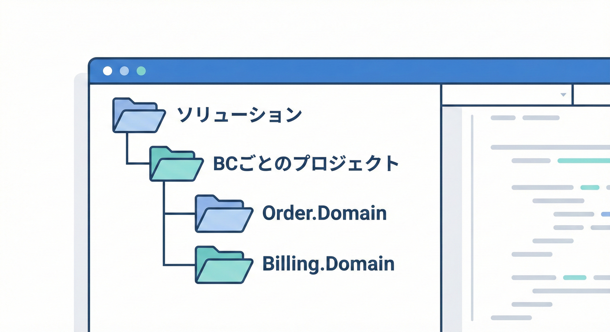
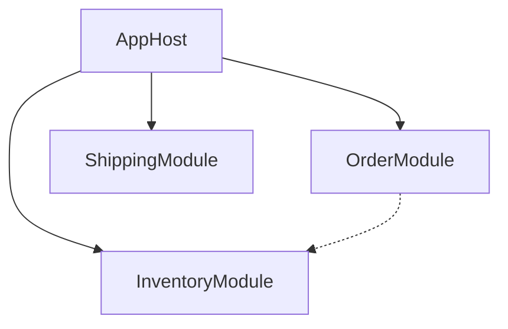
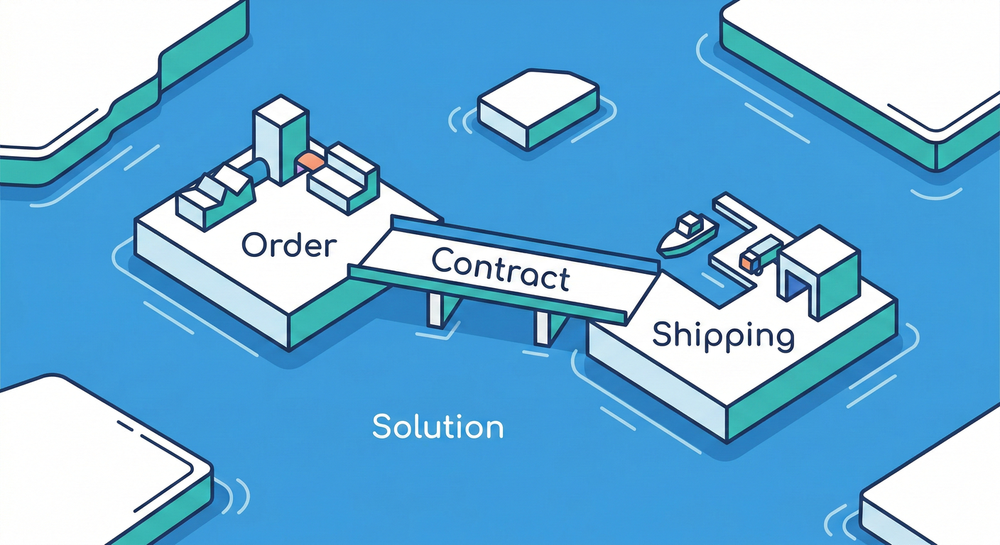
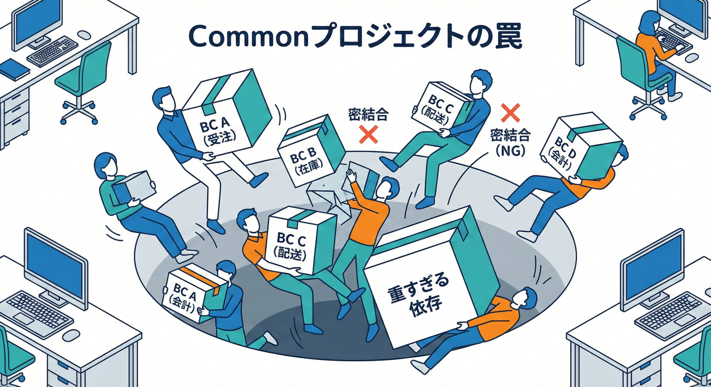

# 第35章：プロジェクト構成A（まず置き場所）🏗️

## この章のゴール🎯

* **Bounded Context（BC）ごとに「置き場所」を分けて**、混ざらない土台を作れる🏠✨
* **モジュラーモノリス**（＝ひとつにデプロイできるけど、中は境界で守る）で始められる🧱💡
* 後の章（参照ルール・DTO/ACL）を**安全に積める形**にしておく🚀

---

## 1) 置き場所を分けると、何が嬉しいの？🧠💖


BCを分けるって、イメージは **「言葉（用語）とモデル（ルール）の世界が違う」** を守ることでしたよね🗺️✨
でもコードは放っておくと、すぐこうなりがち👇😵‍💫

* `Customer` が **会員**でも **請求先**でも **配送先**でも使われる
* `OrderStatus` が部署ごとに意味がズレてるのに、同じ enum に押し込む
* 便利だから `Common` に全部入れて、結局 “全部つながる” 地獄😇🔥

なので最初にやるべきはこれ👇

✅ **「BCごとに住所を分ける」**（プロジェクト/フォルダ/名前空間）🏠🏠🏠
✅ **境界を越えるときは “玄関” を通る**（契約DTOやACLは後の章で）🚪📨

---

## 2) 2026の“安定スタック”を選ぶコツ🧩🔧

いまの安定ラインとしては **.NET 10（LTS）** が軸にしやすいです✅
リリース日やサポート期限が公式表で管理されていて、**2028-11-14 までサポート**が続きます📅🔒 ([Microsoft][1])
C#も **C# 14** 世代が前提になり、拡張メンバーなど新しい構文が入っています🧠✨ ([Microsoft Learn][2])

IDE側も **Visual Studio 2026** のリリースノートが出ています🛠️✨ ([Microsoft Learn][3])

---

## 3) まずは「モジュラーモノリス」でOK👌🧱


いきなりマイクロサービスにすると、境界は守れても…

* デプロイ、認証、監視、通信、データ整合性…やること爆増💣😵‍💫
* 学習としては「境界の本質」より「運用の大変さ」が先に来ちゃう

なのでこの章では、こうします👇

✅ **1つのソリューションで、BCごとにプロジェクトを分ける**
✅ **デプロイは1つ（Web/APIホスト）**
✅ **境界は参照ルールと公開契約で守る（次章以降）**

---

## 4) “おすすめの置き場所”テンプレ🗂️✨（ミニEC例）






ミニEC（受注・在庫・配送・請求）を例に、こんな形が扱いやすいです👇🛒📦🚚💳

```text
MiniECommerce.sln
└─ src
   ├─ AppHost
   │  └─ MiniECommerce.AppHost   （起動プロジェクト：Web/APIなど）
   │
   ├─ Modules
   │  ├─ OrderManagement
   │  │  ├─ MiniECommerce.OrderManagement    （まずは1プロジェクトでもOK）
   │  │  └─ MiniECommerce.OrderManagement.Contracts（外に見せるDTO置き場案）
   │  ├─ Inventory
   │  │  ├─ MiniECommerce.Inventory
   │  │  └─ MiniECommerce.Inventory.Contracts
   │  ├─ Shipping
   │  │  ├─ MiniECommerce.Shipping
   │  │  └─ MiniECommerce.Shipping.Contracts
   │  └─ Billing
   │     ├─ MiniECommerce.Billing
   │     └─ MiniECommerce.Billing.Contracts
   │
   └─ BuildingBlocks
      └─ MiniECommerce.BuildingBlocks （技術寄り共通：ログ/結果型など）
```

## ポイント🌟

* **Modules/** の下に **BCごとの島**を作る🏝️✨
* `Contracts` は **「外に出す言葉（Published Language）」** の候補置き場📨📢（本格運用は第34章〜）
* `BuildingBlocks` は “業務じゃない共通” のみ（増やしすぎ注意⚠️）

---

## 5) Visual Studioで作る手順（気持ちよく迷わない版）🧭✨




## 5-1. ソリューション作成🧱

1. **新しいプロジェクトの作成**
2. `ASP.NET Core Web API`（または `Console` でもOK）
3. 名前を `MiniECommerce.AppHost` にする
4. ソリューション名を `MiniECommerce` にする

## 5-2. “Modules” 用のフォルダを作る📁

ソリューションエクスプローラーで👇

* ソリューションを右クリック → **追加** → **新しいソリューション フォルダー**

  * `src`
  * `Modules`
  * `BuildingBlocks`

（※ソリューションフォルダーは “見た目の整理” なので、物理フォルダも揃えるなら後で移動してOK👌）

## 5-3. BCプロジェクトを追加🏝️

例：OrderManagement を作るなら👇

* `Modules` の下にソリューションフォルダー `OrderManagement`
* その中に `Class Library` を追加 → `MiniECommerce.OrderManagement`

同様に Inventory / Shipping / Billing も作る✨

---

## 6) dotnet CLIで一気に作る（再現性MAX）⚡🧪

GUIが苦手な人や、AIに手順を渡したいときは CLI が強いです💪✨

```powershell
mkdir MiniECommerce
cd MiniECommerce

dotnet new sln -n MiniECommerce

mkdir src\AppHost
dotnet new webapi -n MiniECommerce.AppHost -o src\AppHost\MiniECommerce.AppHost
dotnet sln add src\AppHost\MiniECommerce.AppHost\MiniECommerce.AppHost.csproj

mkdir src\Modules\OrderManagement
dotnet new classlib -n MiniECommerce.OrderManagement -o src\Modules\OrderManagement\MiniECommerce.OrderManagement
dotnet sln add src\Modules\OrderManagement\MiniECommerce.OrderManagement\MiniECommerce.OrderManagement.csproj

mkdir src\Modules\Inventory
dotnet new classlib -n MiniECommerce.Inventory -o src\Modules\Inventory\MiniECommerce.Inventory
dotnet sln add src\Modules\Inventory\MiniECommerce.Inventory\MiniECommerce.Inventory.csproj
```

（Shipping/Billing も同じ要領で増やすだけ🧩✨）

---

## 7) 命名ルール（置き場所の“迷子”を防ぐ）🏷️🧠

## ✅ 良い名前の条件

* **BC名が入ってる**（どの島か一発で分かる）🏝️
* **役割が想像できる**（Host / Contracts / Domain…）🔍
* **短すぎない**（`Order` みたいな曖昧語は衝突しやすい）💥

## 例（わかりやすい系）✨

* `MiniECommerce.AppHost`
* `MiniECommerce.OrderManagement`
* `MiniECommerce.OrderManagement.Contracts`

---

## 8) “共通”の置き場所、3つの安全ライン🧯⚠️


## 8-1. まず最強：外部ライブラリに寄せる📦✨

ログやDIなどは、できるだけ **既存の仕組み**を使うのが事故りにくいです👍

## 8-2. BuildingBlocks（技術寄り共通）🧱

OKになりやすい例👇

* `Result<T>`（成功/失敗を統一する型）
* 例外の共通ポリシー
* 技術的な小物（時刻プロバイダのIFなど）

NGになりやすい例👇😇

* `Customer` や `Order` を共通に置く（＝意味が混ざる💥）
* “便利ユーティリティ” が巨大化する（全部が依存する👻）

## 8-3. Shared Kernel（業務共通）は最後の最後🥺

「本当に同じ意味で共有できる」と証明できたときだけ💡
（証明できないなら “契約DTO” で渡すほうが安全📨）

---

## 9) 最小の“島”を1つ作って動かしてみよう🏝️💻

OrderManagement に、超ミニでいいので **ドメインっぽいルール**を置いてみます✨
（この章は “置き場所” が主役なので、内容は薄くてOK👌）

```csharp
namespace MiniECommerce.OrderManagement;

public readonly record struct OrderId(Guid Value)
{
    public static OrderId New() => new(Guid.NewGuid());
}

public sealed class Order
{
    public OrderId Id { get; } = OrderId.New();
    public DateTime CreatedAtUtc { get; } = DateTime.UtcNow;

    // ここに「受注管理としてのルール」が育っていくイメージ🌱
}
```

✅ これで「受注の世界の言葉」は `MiniECommerce.OrderManagement` に隔離されました🏠✨

---

## 10) AI拡張の使いどころ（この章は“骨組み生成”が強い）🤖⚡

## Visual Studioの GitHub Copilot を使うコツ💡

* Copilot の状態管理やインストール手順は公式で案内されています🧩 ([Microsoft Learn][4])
* 環境設定（Tools → Options → GitHub → Copilot…）の導線も、GitHub側ドキュメントにあります📘 ([GitHub Docs][5])
* Visual Studio 2026 のリリースノートにも Copilot 関連の機能案内が載っています🛠️ ([Microsoft Learn][3])

## 便利プロンプト例🪄（コピペOK）

* 「ミニECのBounded Contextを OrderManagement / Inventory / Shipping / Billing に分けて、.NETのソリューション構成（AppHost + Modules + BuildingBlocks）を作る手順を、dotnet CLIコマンドで出して」
* 「各モジュールに `Contracts` プロジェクトも作って、DTOはモジュール外にドメイン型を漏らさない方針で雛形を作って」
* 「`BuildingBlocks` に入れて良いもの/ダメなものを、具体例付きでチェックして」

---

## 11) ミニ演習🧩🎮

## 演習A：島を4つ作る🏝️🏝️🏝️🏝️

1. `OrderManagement / Inventory / Shipping / Billing` の4プロジェクトを追加
2. それぞれに `namespace` が混ざってないか確認（例：OrderManagementの中にInventoryが出てきたらアウト🙅‍♀️）

## 演習B：Contracts を追加して「玄関」を作る🚪📨

1. `MiniECommerce.OrderManagement.Contracts` を追加
2. そこに `OrderSummaryDto` を置く（中身は空でもOK）
3. “ドメイン型を置かない” を守る（`Order` クラスは置かない🙅‍♀️）

---

## 12) よくあるつまずきポイント集😵‍💫🧯



## ❌ `Common` を作って何でも入れる

➡️ **境界を壊す最短ルート**💥
“便利” は後からでも作れるけど、壊れた境界は戻すのが大変😭

## ❌ BC名が曖昧すぎる

➡️ `Order` / `User` みたいな単語は衝突しやすい⚡
“何を管理するBCか” まで名前に出すと事故が減ります🏷️✨

## ❌ 物理フォルダとソリューション表示がバラバラ

➡️ 後で直せるけど、最初から揃えると気持ちいい📁✨
（CIやレビューで迷子が減る💖）

---

## 13) この章のチェックリスト✅✅✅

* [ ] `src/AppHost` と `src/Modules` が分かれている
* [ ] Modules は **BCごと**にプロジェクトがある
* [ ] “業務共通” を安易に作ってない（特に `Customer` や `Order`）
* [ ] 境界を越えるための `Contracts`（玄関）を置ける構造になっている
* [ ] 依存関係を固定できる余地がある（次章でやるよ📐）

---

## お助けAIプロンプト（第35章）🤖✨

* 「このソリューション構成、境界を壊しそうな“共通化”ポイントを指摘して」🔍
* 「4つのBCに分けたプロジェクト名を、衝突しにくい命名に直して案を3つ」🏷️
* 「Contracts に置くDTO案を、ドメイン型を漏らさないルールで提案して」📨
* 「BuildingBlocks に置いて良い型/悪い型を、具体例付きで分類して」🧱⚠️

[1]: https://dotnet.microsoft.com/en-us/platform/support/policy?utm_source=chatgpt.com "The official .NET support policy"
[2]: https://learn.microsoft.com/en-us/dotnet/csharp/whats-new/csharp-14?utm_source=chatgpt.com "What's new in C# 14"
[3]: https://learn.microsoft.com/en-us/visualstudio/releases/2026/release-notes?utm_source=chatgpt.com "Visual Studio 2026 Release Notes"
[4]: https://learn.microsoft.com/en-us/visualstudio/ide/visual-studio-github-copilot-install-and-states?view=visualstudio&utm_source=chatgpt.com "Manage GitHub Copilot installation and state"
[5]: https://docs.github.com/copilot/configuring-github-copilot/configuring-github-copilot-in-your-environment?tool=visualstudio&utm_source=chatgpt.com "Configuring GitHub Copilot in your environment"
