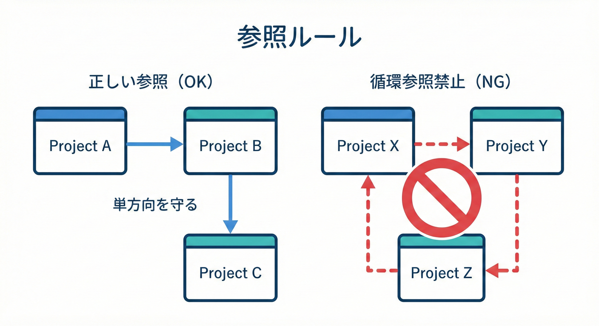
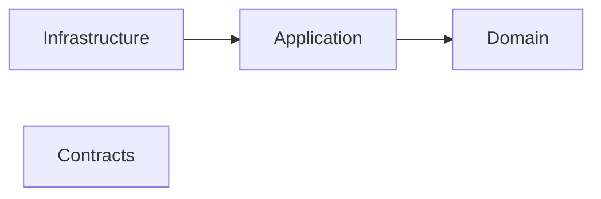
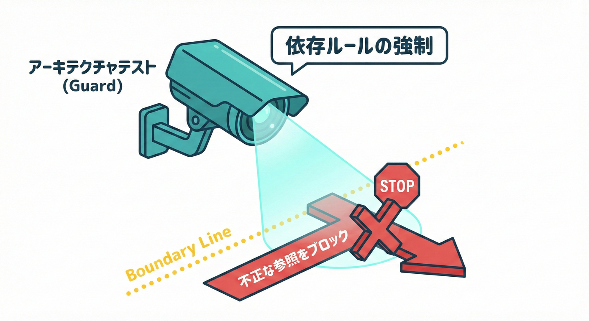

# 第36章：プロジェクト構成B（参照ルールを固定）📐

## この章でできるようになること🎯✨

* 「どこがどこを参照していいか」を**ルール化**できるようになる🧭
* そのルールを **Visual Studio / CLI / テスト**で「守れる形」にできる🛡️
* “共通プロジェクト地獄”を避けて、境界が崩れにくい構成にできる🚧💕

---

## 1. 参照ルールってなに？なんで必要？🤔🧱

Bounded Context（BC）を分けても、コードが**勝手につながり始めたら**境界はあっという間に崩れます😇💥
とくに危ないのはこういう状態👇

* Aの都合でBの内部クラスを直接呼ぶ📞💣
* “便利だから”とCが全員の共通クラス置き場になる🧺🔥
* 依存がぐるぐる循環して、変更が怖くなる🌀😵‍💫

だから **「参照していい方向」を固定**して、境界を“物理的に”守る必要があるんだよ🛡️✨

ちなみに2026の標準として、.NET 10（LTS）＋C# 14 が前提になりやすいよ📌（ツールチェーン的にもこれが軸）([Microsoft for Developers][1])

---

## 2. まず結論：おすすめの参照ルール（超テンプレ）🧩✅





BCごとに「層」を分けて、参照方向を**片道**にします➡️✨

## ✅ BCの中の層（例）

* `*.Domain` 🧠（業務ルールの中心）
* `*.Application` 🧭（ユースケース）
* `*.Infrastructure` 🧰（DB/外部APIなど）
* `*.Contracts` 📨（境界越え用DTO/イベント/公開APIモデル）

## ✅ 参照していい向き（片道）➡️

* `Application → Domain` ✅
* `Infrastructure → Application（＋Domain）` ✅
* `Contracts → （基本）どこにも参照しない` ✅（薄く保つ🥗）
* `Domain → 他BC` ❌（絶対に我慢😤）
* `Domain → Infrastructure` ❌（逆流は事故る😇）

---

## 3. ミニEC例：BCごとにプロジェクトを切る🏗️🛒

たとえばこんなBCがあるとして👇

* 受注管理（OrderManagement）📦
* 在庫管理（Inventory）📦
* 配送管理（Shipping）🚚
* 請求（Billing）💳

**ソリューション構成**はこういう感じが安定するよ🌸

```text
Shop.sln
  /src
    /OrderManagement
      OrderManagement.Domain
      OrderManagement.Application
      OrderManagement.Infrastructure
      OrderManagement.Contracts
    /Inventory
      Inventory.Domain
      Inventory.Application
      Inventory.Infrastructure
      Inventory.Contracts
    /Shipping
      Shipping.Domain
      Shipping.Application
      Shipping.Infrastructure
      Shipping.Contracts
    /Billing
      Billing.Domain
      Billing.Application
      Billing.Infrastructure
      Billing.Contracts
  /tests
    ArchitectureTests
    OrderManagement.Tests
    ...
```

---

## 4. 参照ルールを「見える化」する📌👀

頭の中だけのルールは守れないので、**1枚ルール**にします🗺️✨

## ✅ ルール（文章で固定）📝

* **同一BC内**は「Application→Domain」「Infrastructure→Application」だけ許可
* **BCをまたぐ直接参照は禁止**（Domain同士は特に禁止）🚫
* BC間のやり取りは **Contracts（DTO/イベント）＋ACL**でやる🛡️📨
* “共通”が必要なら **Cross-cutting（ログ/設定など）**だけを別枠にする（後述）🧯

---

## 5. Visual Studioで「参照の向き」を揃える🧰🖱️

## 5.1 追加で参照を張るときのチェック✅

* 参照を追加する前に「これは**片道**か？」を確認➡️
* 「Domainから外へ」になってたら、ほぼアウト😇

## 5.2 参照関係の確認👀

* ソリューションエクスプローラーで、プロジェクトの **依存関係** を見て
  「Domainが孤立してるか（＝外へ出てないか）」をチェック🔍

※ Visual StudioのAI支援も2026は統合が進んでいて、参照追加やリファクタ時に“提案されるまま”進むと事故りがち⚠️（便利＝安全ではない）([Microsoft Learn][2])

---

## 6. CLIでも確認できる（ミスの早期発見）⌨️✨

PowerShellでOKだよ🪄

```powershell
## ソリューションに含まれるプロジェクト一覧
dotnet sln .\Shop.sln list

## 特定プロジェクトが参照しているプロジェクト一覧
dotnet list .\src\OrderManagement\OrderManagement.Application\OrderManagement.Application.csproj reference
```

参照追加もCLIならこう👇

```powershell
dotnet add .\src\OrderManagement\OrderManagement.Application\OrderManagement.Application.csproj `
  reference .\src\OrderManagement\OrderManagement.Domain\OrderManagement.Domain.csproj
```

---

## 7. “共通プロジェクト乱立”を避けるコツ🧨🧊

## 7.1 「共通」に入れたくなるものランキング（危険度つき）⚠️

* **ドメインの型（Entity/VO/Enum）** → 共有したくなるけど、共有すると境界が溶ける🫠💥
* **DTO/イベント** → これは「Contracts」に寄せると安全📨✅
* **ログ/設定/エラーハンドリング** → Cross-cuttingとして共通化OK🧯
* **便利Util** → だいたい増殖して地獄😇（最後は“神クラス”になる）

## 7.2 最小共通化の考え方🥺➡️控えめに！

共通化が必要なときは、まずこの順で考えると失敗しにくいよ💡

1. **Contracts（境界の契約）**に出せない？📨
2. **ACL**で変換すれば済まない？🛡️
3. それでも必要なら **Cross-cutting**（技術寄り）として切り出す🧰
4. それでも必要なら、**“依存されるだけ”の薄いプロジェクト**にする（参照方向は片道）➡️

---

## 8. 参照ルールは「テストで固定」すると勝ち🧪🏆

人間の注意力には限界があるので、**壊れたら自動で落ちる**ようにします💥➡️🧪✅
これがいちばん強い💪✨

## 8.1 選択肢（代表例）🧰

* ArchUnitNET：ルール表現が強い（ガチガチに守る派向け）([GitHub][3])
* NetArchTest：導入が軽い（まず始める派向け）([GitHub][4])
* NDepend：ルールや可視化が強い（チームで育てる派向け）([NDepend][5])

ここでは **NetArchTest**で“最小の勝ち筋”を作るよ🌸

---

## 9. 実装：アーキテクチャテストで「参照違反を禁止」🧪🚫



## 9.1 テストプロジェクトを1つ作る🧰

名前例：`ArchitectureTests`
（xUnit でOKだよ🙆‍♀️）

## 9.2 例：OrderManagement の Domain が他BCを参照してたら落とす💥

```csharp
using System.Reflection;
using NetArchTest.Rules;
using Xunit;

public class DependencyRulesTests
{
    [Fact]
    public void OrderManagement_Domain_ShouldNotDependOn_OtherBoundedContexts()
    {
        // ★ Domainアセンブリを指定（プロジェクト名と同じならこれでOK）
        var domainAssembly = Assembly.Load("OrderManagement.Domain");

        // ★ 依存禁止：他BCのnamespace（例）
        var forbiddenNamespaces = new[]
        {
            "Inventory.",
            "Shipping.",
            "Billing."
        };

        var result = Types
            .InAssembly(domainAssembly)
            .ShouldNot()
            .HaveDependencyOnAny(forbiddenNamespaces)
            .GetResult();

        Assert.True(result.IsSuccessful, result.GetFailureReport());
    }
}
```

## 9.3 例：BC間は Contracts だけ許可（ざっくり版）📨✅

「Domain同士の直接参照はNG、Contracts経由に寄せようね」って縛り👇

```csharp
using System.Reflection;
using NetArchTest.Rules;
using Xunit;

public class ContractsOnlyAcrossBcTests
{
    [Fact]
    public void OrderManagement_Application_ShouldNotDependOn_OtherBc_Domain()
    {
        var appAssembly = Assembly.Load("OrderManagement.Application");

        // 例：他BCのDomainへの依存はダメ
        var forbidden = new[]
        {
            "Inventory.Domain",
            "Shipping.Domain",
            "Billing.Domain"
        };

        var result = Types
            .InAssembly(appAssembly)
            .ShouldNot()
            .HaveDependencyOnAny(forbidden)
            .GetResult();

        Assert.True(result.IsSuccessful, result.GetFailureReport());
    }
}
```

> コツ💡：最初は「禁止したいもの」から書くと成功しやすいよ😊✨
> “完璧なルール”を一気に作ろうとすると挫折しやすい😵‍💫

---

## 10. GitHubで毎回チェック（壊れたら止める）🧱🚦

プッシュやPRで **テストが落ちたらマージできない**、これが最強の境界ガード🛡️✨
（ここは GitHub のCIで回すイメージだよ🔁）

---

## 11. Central Package Management（おまけ：依存管理をスッキリ）📦✨

参照ルールと別軸だけど、プロジェクトが増えると**NuGetバージョンの散らかり**が起きやすい😇
そこで `Directory.Packages.props` を使うと、依存の管理がかなり楽になるよ🧹✨([Microsoft Learn][6])

```powershell
## ルートに Directory.Packages.props を作る
dotnet new packagesprops
```

---

## 12. ミニ演習（10〜15分）🎮✅

1. わざと `OrderManagement.Domain` から `Inventory.Domain` のクラスを `using` してみる🧨
2. テストを実行する🧪
3. **落ちたメッセージ**を読んで「どの参照がダメか」特定する🔍
4. 修正方針を選ぶ👇

   * ContractsのDTOに置き換える📨
   * ACLで変換する🛡️
   * そもそも責務（境界）を見直す🧭

---

---

## 13. つまずきポイントあるある🪤😭

* **「共通に置けば早い」病** → 最初だけ早くて、後で一番つらい😇
* **循環参照が発生** → だいたい「Domainが外に手を出した」が原因👀💥
* **AIの提案で参照が増える** → 便利だけど、ルール違反も平気で混ざるからテストで守るのが正解🧪
  （AI拡張は Microsoft の統合AIや OpenAI 系の開発支援など色々あるけど、最後に守るのは“ルール”だよ🛡️）([Microsoft Learn][2])

---

## 14. まとめ📌✨

* BCを守るコアは **参照ルール（依存の向き）を片道に固定**すること➡️🔒
* “共通”は増やさず、**Contracts＋ACL**に寄せるのが安全📨🛡️
* 最強の守りは **アーキテクチャテストで自動検知**🧪🏆
* .NET 10（LTS）＋C# 14 の流れが前提になりやすい（2026基準）([Microsoft for Developers][1])

---

## お助けAIプロンプト例🤖✨

* 「このソリューション構成で、依存の向きが逆流している参照を指摘して」🔍
* 「“共通プロジェクトに入りたい候補”を、Contracts/ACL/Cross-cuttingに分類して」📦
* 「この参照違反を、Contracts＋ACLに直す修正案を3つ出して」🛡️
* 「NetArchTestで“Domainは外部に依存しない”ルールを追加して」🧪

[1]: https://devblogs.microsoft.com/dotnet/announcing-dotnet-10/?utm_source=chatgpt.com "Announcing .NET 10"
[2]: https://learn.microsoft.com/en-us/visualstudio/releases/2022/release-notes-v17.10?utm_source=chatgpt.com "Visual Studio 2022 version 17.10 Release Notes"
[3]: https://github.com/TNG/ArchUnitNET?utm_source=chatgpt.com "TNG/ArchUnitNET: A C# architecture test library to specify ..."
[4]: https://github.com/BenMorris/NetArchTest?utm_source=chatgpt.com "BenMorris/NetArchTest: A fluent API for .Net that can ..."
[5]: https://www.ndepend.com/default-rules/NDepend-Rules-Explorer.html?ruleid=ND1400&utm_source=chatgpt.com "Avoid namespaces mutually dependent - Architecture"
[6]: https://learn.microsoft.com/en-us/nuget/consume-packages/central-package-management?utm_source=chatgpt.com "Central Package Management (CPM) - NuGet"
