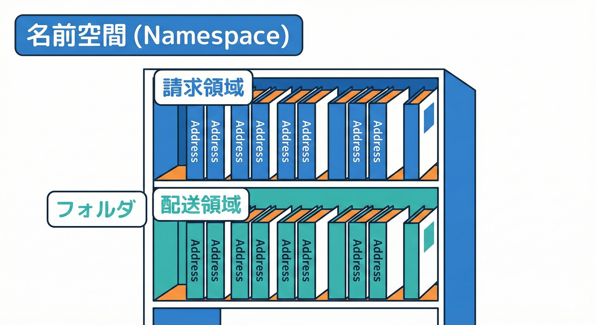
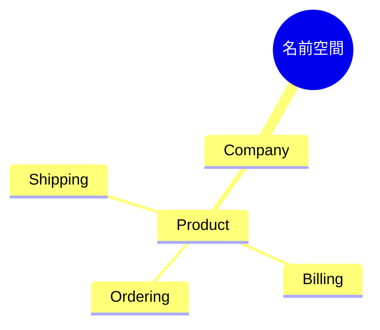

# 第37章：namespaceとフォルダ設計（見ただけで分かる）📁✨

## 1. この章のゴール🎯✨

* ソリューションを開いた瞬間に「どの境界（Context）に属するコードか」が分かるようにする👀✨
* 同じ単語の衝突（Customer / Order など）を、**名前空間とフォルダで“見える化”**できるようにする🧨🔍
* 「境界をまたぐ参照」が起きそうな場所を、構造で先回りして止める🛡️🚧

---

## 2. まず結論：namespaceは“住所”、フォルダは“地図”🏠🗺️





* **namespace**：コード上の住所（型の所属）🏷️
* **フォルダ**：人間が迷子にならない地図📌
* これを揃えると、探索コストが激減するし、混ざりものも減るよ〜😊✨

名前空間の命名は「長期で効く」ので、設計ガイドラインに沿った形が安心だよ🧡
（例：`Company.Product.Feature` のように階層化） ([Microsoft Learn][1])

---

## 3. BC（境界）を守る“鉄板ルール”3つ🔒✨

### ルール①：最初に「Context名」を入れる（境界が先）🥇

`Company.Product.<Context>...` の **`<Context>` を早めに出す**のがポイント💡
これだけで「今どの世界の言葉？」がすぐ分かるよ👀✨ ([Microsoft Learn][1])

✅ 例：

* `MyShop.Ordering`（受注の世界）🛒
* `MyShop.Billing`（請求の世界）💳
* `MyShop.Shipping`（配送の世界）🚚

---

### ルール②：フォルダ構造をnamespaceに寄せる（迷子防止）🧭

フォルダとnamespaceがズレると、探索が毎回「え、どこ…？」になる😵‍💫
揃えると、見ただけで “どこに何があるか” 分かる📁✨

---

### ルール③：「共通(Common)」を増やさない（境界が溶ける）🫠

`Common` / `Shared` が増えると、**境界の外からドメインが侵入**しやすい⚠️
“共通化したくなったら” まず疑うクセをつけるのが勝ち🏆✨

---

## 4. おすすめ命名パターン🏷️✨（迷ったらこれ）

「境界 → 層 → 目的」の順にするのが読みやすいよ😊

* `Company.Product.<Context>.<Layer>.<Feature>`

例：

* `MyShop.Ordering.Domain.Orders`
* `MyShop.Ordering.Application.PlaceOrder`
* `MyShop.Ordering.Contracts.V1`（外に出すDTO）📨
* `MyShop.Ordering.Integration.Billing`（他BCとつなぐ）🔗

namespaceの基本的な役割は「型を整理し、名前を衝突させない」ことだよ🧩 ([Microsoft Learn][2])

---

## 5. フォルダ設計の具体例📁✨（見ただけで分かる形）

### ✅ 例：BCごとにプロジェクトが分かれている場合（分かりやすい）💻

（第35〜36章で作った構成を想定）

```text
src/
  MyShop.Ordering/
    MyShop.Ordering.csproj
    Domain/
      Customers/
      Orders/
    Application/
      UseCases/
    Contracts/
      V1/
    Integration/
      Billing/
  MyShop.Billing/
    MyShop.Billing.csproj
    Domain/
    Application/
    Contracts/
tests/
  MyShop.Ordering.Tests/
  MyShop.Billing.Tests/
```

* **Domain**：その境界の“言葉の意味”の中心🧠
* **Application**：ユースケース（手順）🧾
* **Contracts**：境界を越える“公開する言葉”📢
* **Integration**：他の境界とつなぐ場所（翻訳・接続）🔌

---

## 6. C#のnamespaceはこう書く（ファイルスコープ推し）✍️✨

最近のC#では **ファイルスコープ名前空間**がスッキリ書けて便利だよ〜😊
（`namespace X.Y.Z;` の形） ([Microsoft Learn][3])

```csharp
namespace MyShop.Ordering.Domain.Customers;

public sealed class OrderingCustomer
{
    public required string CustomerId { get; init; }
}
```

👉 注意：ファイルスコープは「そのファイルは1つのnamespaceだけ」になるよ！
（入れ子namespaceや、2つ目のnamespace宣言はできない） ([Microsoft Learn][4])

---

## 7. “同名クラス禁止”で衝突を見える化👀💥（初心者向け超おすすめ）

C#はnamespaceが違えば同名クラスを置けるけど、初心者のうちは事故が増えがち😇
（`using` で意図せず別の `Customer` を掴む…とか）

だからこの教材では、いったん **「同名クラス禁止」ルール**をおすすめするよ✅✨

* `OrderingCustomer`（受注の顧客）
* `BillingCustomer`（請求の顧客）
* `ShippingAddress`（配送で使う住所）
* `BillingAddress`（請求で使う住所）

これだけで、コードレビューの会話がめっちゃ楽になる🧡

さらに、型名がnamespace名と衝突するのも避けようね（可読性が落ちる）
→ こういうのを検出するルール（CA1724）もあるよ🧯 ([Microsoft Learn][5])

---

## 8. usingの置き方で事故が減る📌✨（地味だけど効く）

### ✅ 基本：`using` はnamespaceの外（ファイル先頭）に置く🧠

namespaceの中に `using` を入れると、名前解決がややこしくなりやすいよ〜😵‍💫
（避けたほうがシンプル） ([Microsoft Learn][6])

### ✅ “全ファイル共通”は `global using` を使う🌍

* `global using` は **プロジェクト内の全ファイルに効く**よ✨ ([Microsoft Learn][7])
* ただしルールあり：

  * `global using` は通常の `using` より前
  * `namespace` の中に書いちゃダメ🙅‍♀️（エラーになる） ([Microsoft Learn][8])

```csharp
// GlobalUsings.cs（みたいな専用ファイルを作るとスッキリ）
global using System;
global using System.Collections.Generic;
```

---

## 9. 重要な注意：namespaceは“壁”じゃない🧱（壁はプロジェクト/アセンブリ）

ここ、めっちゃ大事！⚠️
C#の `internal` は「同じアセンブリ（プロジェクト出力物）内なら見える」なので、**namespaceで隠せるわけじゃない**よ👀
つまり「本当の壁」は **プロジェクト（アセンブリ）**で作るのが基本💡 ([Microsoft Learn][9])

（第38章で “公開範囲で守る” をしっかりやるよ🔒✨）

---

## 10. ミニ演習✏️🧩（30〜45分くらい）

### 演習A：フォルダ→namespaceを揃える📁➡️🏷️

1. `Ordering` プロジェクトに `Domain/Customers` フォルダを作る
2. `OrderingCustomer.cs` を置く
3. ファイル先頭のnamespaceを `MyShop.Ordering.Domain.Customers` にする

✅ できたらチェック：

* フォルダを見て “どのBC？” が即答できる？👀
* `Domain` に「他BCの言葉」が混ざってない？🫠

---

### 演習B：同名衝突を“起こしてから”直す🧨→✅

1. `Ordering` と `Billing` の両方に `Customer` クラスを作る
2. どこかのコードで両方を参照してみる（混乱するはず😇）
3. 次のどちらかで解決：

* ① **同名禁止ルール**で `OrderingCustomer` / `BillingCustomer` に改名
* ② どうしても同名なら **完全修飾名**で書く（上級者寄り）

---

## 11. よくあるつまずきポイント集🧷😵‍💫

* 「フォルダを移動したのにnamespaceが古いまま」
  → ファイル先頭のnamespaceを一括置換で揃えよう🔁✨

* 「ファイルスコープにしたら入れ子namespaceが書けない」
  → それが仕様だよ！“1ファイル1namespace”で整理しよう📌 ([Microsoft Learn][4])

* 「Contractsにドメイン型を置きたくなる」
  → それ、境界が溶ける入口🫠（Contractsは“公開言語”＝DTO中心📨）

---

## 12. お助けAIプロンプト🤖✨（コピペOK）

* 「このプロジェクト構成に対して、BCが混ざってそうなフォルダ名・namespace名を指摘して」🔍
* 「`Ordering` と `Billing` の用語衝突が起きそうなクラス名を列挙して、改名案も出して」🧠
* 「フォルダ構成とnamespaceがズレているファイルを検出する手順（またはスクリプト案）を出して」🧰
* 「Contractsに置くDTOを最小フィールドで提案して（Domain型は持ち出さない方針で）」📨

---

## 13. 仕上げチェックリスト✅✨

* [ ] `Company.Product.<Context>` が先頭に出てる？（境界が見える？）
* [ ] フォルダとnamespaceが対応してる？（迷子にならない？）
* [ ] `Common` で何でも共有してない？（境界が溶けてない？）
* [ ] クラス名の衝突は起きてない？（同名禁止 or 明確な区別）
* [ ] `global using` はルール通りに置けてる？ 🌍 ([Microsoft Learn][8])

[1]: https://learn.microsoft.com/en-us/dotnet/standard/design-guidelines/names-of-namespaces?utm_source=chatgpt.com "Names of Namespaces - Framework Design Guidelines"
[2]: https://learn.microsoft.com/ja-jp/dotnet/csharp/language-reference/keywords/namespace?utm_source=chatgpt.com "名前空間キーワード - C# reference"
[3]: https://learn.microsoft.com/en-us/dotnet/csharp/language-reference/proposals/csharp-10.0/file-scoped-namespaces?utm_source=chatgpt.com "File scoped namespaces - C# feature specifications"
[4]: https://learn.microsoft.com/en-us/dotnet/csharp/language-reference/keywords/namespace?utm_source=chatgpt.com "The namespace keyword - C# reference"
[5]: https://learn.microsoft.com/en-us/dotnet/fundamentals/code-analysis/quality-rules/ca1724?utm_source=chatgpt.com "CA1724: Type Names Should Not Match Namespaces"
[6]: https://learn.microsoft.com/ja-jp/dotnet/csharp/fundamentals/coding-style/coding-conventions?utm_source=chatgpt.com "NET コーディング規則 - C#"
[7]: https://learn.microsoft.com/ja-jp/dotnet/csharp/language-reference/keywords/using-directive?utm_source=chatgpt.com "using ディレクティブ: 名前空間から型をインポートする - C# ..."
[8]: https://learn.microsoft.com/en-us/dotnet/csharp/language-reference/compiler-messages/using-directive-errors?utm_source=chatgpt.com "Resolve warnings related using namespaces"
[9]: https://learn.microsoft.com/en-us/dotnet/csharp/programming-guide/classes-and-structs/access-modifiers?utm_source=chatgpt.com "Access Modifiers (C# Programming Guide)"
