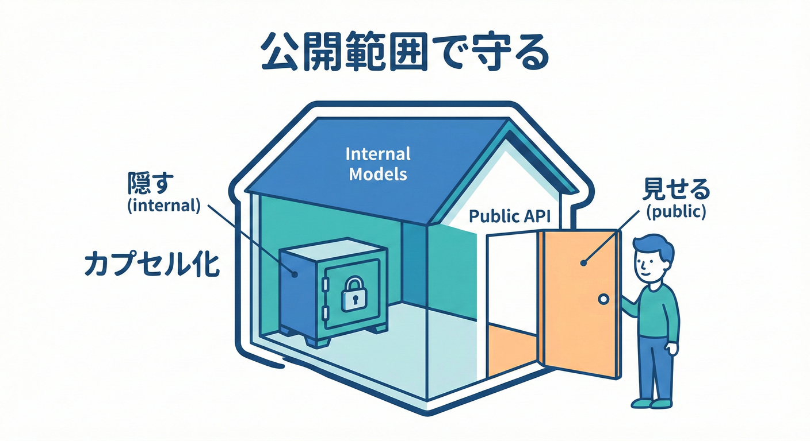
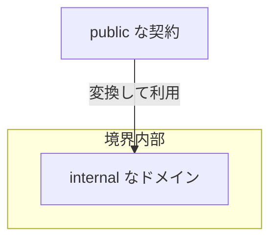
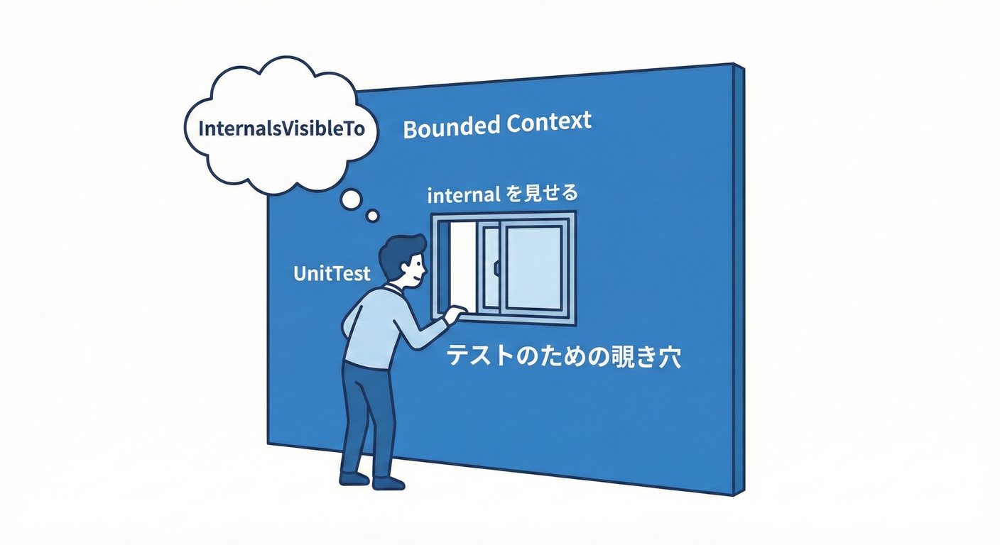

# 第38章：公開範囲で守る（public / internal の感覚）🔒✨

## この章のゴール🎯

* 「境界の外に見せていいもの／ダメなもの」を、C#の公開範囲（アクセス修飾子）でキュッと守れるようになる💪🔐
* “境界外にドメイン型が漏れて事故る”を防げるようになる🚫💥
* テストだけは例外で覗けるようにする「友達アセンブリ」も触る🧪🤝

---

## 1. まず結論：BCの外に出していいのは「契約」だけ📨✨





境界づけられたコンテキスト（BC）の外に出していいのは、基本「契約（Contract）」だけだよ〜！😊
ここでいう契約は、たとえば「DTO」「公開インターフェイス」「イベント（公開メッセージ）」みたいなもの📦📣

逆に、外に出しちゃダメなものはコレ👇

* ドメインの型（Entity / ValueObject / Domain Service など）🧠🚫
* ドメインのルールが詰まったメソッドや状態遷移🌀🚫
* “このBCの都合”が強い内部モデル（途中計算、内部用 enum など）🧮🚫

「外に出すのは薄く・少なく・安定させる」これが基本姿勢だよ〜🥗✨

---

## 2. アクセス修飾子の超まとめ（この章の主役）🧩🔑

C#のアクセス修飾子は、大きく「4つ」＋組み合わせで「6段階」って覚えるとラクだよ😊

* public / protected / internal / private
* そこから「protected internal」「private protected」も作れるよ〜🧷✨ ([Microsoft Learn][1])

## ざっくり意味（BCを守る目線で）👀🔒

* **private**：クラスの中だけ。いちばん安全🫶
* **internal**：同じアセンブリ（＝同じプロジェクト成果物）だけ🏠
* **public**：どこからでも見える（＝境界の外に出る）🌍
* **protected / private protected**：継承用（設計が難しくなることも多いので、BC境界には慎重に）🧬⚠️ ([Microsoft Learn][2])

## 重要トリビア（地味に効く）✨

* 名前空間直下の型（トップレベル型）は、何も付けないと既定で「internal」になるよ🧠
* さらに「file」修飾子で“そのファイル内だけ”にもできるよ📄🔒 ([Microsoft Learn][3])

この「何も付けない＝internal」が、境界設計ではめちゃ使える👍✨

---

## 3. BCを守るための「公開設計ルール」5つ🛡️💡

## ルール①：ドメイン型は “原則 internal” にする🧠🔒

BCの中でだけ生きる概念は、外に見せないのが正解◎
外に見せると「他BCが依存して変更できなくなる」地獄が始まる😇🔥

## ルール②：外に出すのは “DTO / Contract” だけ📦📨

外部に出るデータは、**薄いDTO**にする（必要最小限）🥗✨
「ドメインを運ぶ箱」にしない（＝ドメイン型をDTOにしない）🚫🧠

## ルール③：BCごとにプロジェクトを分ける（超重要）🏗️✨

「internal」は **同一アセンブリ内**なら見えちゃう。
だから、BCを守りたいなら **BCをプロジェクト単位（アセンブリ単位）に**して、internalが効く状態にするのが大事だよ🏠🔒

## ルール④：公開入口（Facade）だけ public にする🚪✨

BCの外へ出る窓口は、できれば少数の「入口」だけにする。
たとえば「Application層のサービス」や「公開インターフェイス」みたいに、外向きの顔を固定する感じ🙂✨

## ルール⑤：テストだけ “友達” にして internal を見せる🧪🤝

内部ロジックのテストが必要なときは、テスト用アセンブリにだけ internal を公開できるよ。
それが「InternalsVisibleTo」だよ〜！🔓🧪 ([Microsoft Learn][4])

---

## 4. 実装例：ドメインは閉じて、契約だけ出す📦🔒✨

ここからは “ミニEC” の雰囲気でいくね🛒🌸
例：OrderManagement（受注管理BC）を1つのプロジェクトにして、外に出すのは契約だけにする！

## 4.1 受注管理BCの内部（Domain）🧠🔒

```csharp
// OrderManagement.Domain/Order.cs
namespace OrderManagement.Domain;

// 重要：外に見せたくないので internal
internal sealed class Order
{
    internal OrderId Id { get; }
    internal OrderStatus Status { get; private set; }

    internal Order(OrderId id)
    {
        Id = id;
        Status = OrderStatus.Draft;
    }

    internal void Confirm()
    {
        if (Status != OrderStatus.Draft)
            throw new InvalidOperationException("下書き以外は確定できないよ😵‍💫");

        Status = OrderStatus.Confirmed;
    }
}

internal readonly record struct OrderId(Guid Value);

internal enum OrderStatus
{
    Draft,
    Confirmed
}
```

ポイント👇

* ドメイン型（Order / OrderId / OrderStatus）は internal にして、BC内に閉じ込める🏠🔒
* ルール（Confirmの制約）もBC内だけで完結✨

---

## 4.2 外に出す「契約（DTO）」📨✨

```csharp
// OrderManagement.Contracts/OrderSummaryDto.cs
namespace OrderManagement.Contracts;

// 外に見せるので public（＝契約）
public sealed record OrderSummaryDto(
    Guid OrderId,
    string Status
);
```

DTOは「必要最小限」にしておくと、後で変更が楽だよ🥗✨
（詳細は次章のDTO設計でもっとやるよ〜📦📨）

---

## 4.3 外向きの入口（Application Facade）🚪✨

```csharp
// OrderManagement.Application/IOrderQueries.cs
using OrderManagement.Contracts;

namespace OrderManagement.Application;

// 外向きに見せたい入口だけ public
public interface IOrderQueries
{
    OrderSummaryDto? FindById(Guid orderId);
}
```

```csharp
// OrderManagement.Application/OrderQueries.cs
using OrderManagement.Contracts;
using OrderManagement.Domain;

namespace OrderManagement.Application;

// 実装クラスは public にしない設計もアリ（登録方法次第）
// ここでは internal にして「入口はインターフェイスだけ」にする例✨
internal sealed class OrderQueries : IOrderQueries
{
    private readonly IOrderRepository _repo;

    internal OrderQueries(IOrderRepository repo) => _repo = repo;

    public OrderSummaryDto? FindById(Guid orderId)
    {
        var order = _repo.Find(new OrderId(orderId));
        if (order is null) return null;

        return new OrderSummaryDto(
            order.Id.Value,
            order.Status.ToString()
        );
    }
}

// RepositoryもBC内側なので internal
internal interface IOrderRepository
{
    Order? Find(OrderId id);
}
```

ここが超大事👇

* 外に出すのは「IOrderQueries」と「OrderSummaryDto」だけ📨✨
* ドメイン（Order）は外に一切出てこない🚫🧠
* “BCを越える会話”は契約（DTO）経由だけになる💬📦

---

## 5. さらに強い隠し技：「file」修飾子で“そのファイルだけ”にする📄🔒✨

「internalですら広い…！このヘルパー、同じプロジェクト内でも使わせたくない！」ってときに便利なのが「file」だよ😊
トップレベル型を「このファイル内限定」にできるやつ！ ([Microsoft Learn][5])

```csharp
// OrderManagement.Application/MappingHelpers.cs
namespace OrderManagement.Application;

// この型は「このファイル内でだけ」使える✨
file static class StatusMapping
{
    public static string ToPublicText(string status)
        => status switch
        {
            "Draft" => "下書き",
            "Confirmed" => "確定",
            _ => "不明"
        };
}
```

地味だけど、名前衝突の回避とか、生成コード（ソースジェネレーター）とも相性いいよ〜🧩✨ ([Microsoft Learn][5])

---

## 6. テストだけ internal を覗く：InternalsVisibleTo 🧪👀✨



「でも internal にするとテストしづらいよ〜😵」ってなることあるよね。
そんなときは「OrderManagement.Tests」だけを“友達”にして、internal を見せられるよ🤝✨ ([Microsoft Learn][4])

```csharp
// OrderManagement/Properties/AssemblyInfo.cs など
using System.Runtime.CompilerServices;

[assembly: InternalsVisibleTo("OrderManagement.Tests")]
```

これでテスト側から internal な Order を触って検証できる👍🧪
ただし注意👇

* 何でもかんでも internal をテストで直叩きしすぎると、「公開入口のテスト」が薄くなってバランス崩れる😇
* 入口（public API）テスト：外からの仕様確認✅
* internalテスト：難しいルールのピンポイント検証🧪
  この2つを使い分けるのが気持ちいいよ〜✨

---

## 7. よくある事故パターン（あるある）🚨💥

## 事故①：Entityをpublicにして、他BCが参照し始める🧟‍♀️

「便利だから参照しとこ」が積み重なって、変更不能になる地獄🔥
→ ドメイン型は原則 internal 🧠🔒

## 事故②：DTOにドメイン型を混ぜる（DTOが太る）🍔💥

「DTOにOrderを入れたろ！」みたいなやつ。境界が溶ける🫠
→ DTOは薄く、プリミティブ中心🥗📦

## 事故③：共通プロジェクトが増殖する（Shared地獄）🌀

“共通”に寄せすぎると、結局そこで衝突する😇
→ 共通は最小限。契約は「Contracts」みたいに目的が明確な箱だけ📦✨

---

## 8. ミニ演習（手を動かそう）🧩💻✨

## 演習A：いまのpublic、減らせる？🔍

1. 自分のBCプロジェクトで「public class」を検索🔎
2. 「外に見せる必要ある？」を1個ずつ判断
3. 外に見せないなら internal に変える🔒
4. ビルドして、他プロジェクトが依存してたら“契約に置き換える”📨

## 演習B：契約（DTO）を薄くする🥗

「外に返すDTO」に、次が混ざってないかチェック👇

* ドメイン型（Entity/VO）🧠🚫
* ドメインのenum（境界内の都合が強い）🚫
* “内部だけの計算途中”🚫

混ざってたら、プリミティブに落とすか、公開用のenumに変換してね✨

---

## 9. つまずきポイント（やさしく解決）🩹😊

## Q1：internalにしたらDI登録できない？😵

→ **入口（interface）は public** のまま、実装は internal でOKなこと多いよ👍
DIは「同一プロジェクト内の composition root（登録する場所）」で組み立てればいける✨

## Q2：protectedって使うべき？🧬

→ BC境界を守る目的なら、まずは **private / internal / public** の3つ中心でOK！
継承は複雑さが出やすいので、最初は避けると安心🍀

## Q3：何も付けないと既定で何になるの？🤔

→ トップレベル型は既定で internal、メンバーは既定で private だよ🧠✨ ([Microsoft Learn][3])

---

## 10. お助けAIプロンプト（コピペでOK）🤖✨

* 「このプロジェクトの public 型一覧を作って。外部に出すべき契約だけ残す提案して」📋🔍
* 「DTOが太ってない？ ドメイン型が漏れてる場所を指摘して」🍔🚫
* 「このBCの外に出していい最小API（インターフェイス＋DTO）案を3パターン出して」📨✨
* 「internal に変えたら壊れる参照を洗い出して、契約経由に直す案を出して」🔧🧩

---

## 参考になる公式情報（要点）📚✨

* .NET 10（LTS）と Visual Studio 2026、C# 14 の“新機能”案内がまとまってるよ。 ([Microsoft for Developers][6])
* アクセス修飾子の基本と既定値（トップレベルは internal、file 修飾子も可）。 ([Microsoft Learn][3])
* file 修飾子（ファイル内限定タイプ）。 ([Microsoft Learn][5])
* InternalsVisibleTo（internal を特定アセンブリに見せる）。 ([Microsoft Learn][4])

[1]: https://learn.microsoft.com/ja-jp/dotnet/csharp/language-reference/keywords/access-modifiers?utm_source=chatgpt.com "アクセス修飾子 - C# reference"
[2]: https://learn.microsoft.com/en-us/dotnet/csharp/language-reference/keywords/private-protected?utm_source=chatgpt.com "private protected keyword - C# reference"
[3]: https://learn.microsoft.com/ja-jp/dotnet/csharp/programming-guide/classes-and-structs/access-modifiers?utm_source=chatgpt.com "アクセス修飾子 (C# プログラミング ガイド)"
[4]: https://learn.microsoft.com/en-us/dotnet/fundamentals/runtime-libraries/system-runtime-compilerservices-internalsvisibletoattribute?utm_source=chatgpt.com "System.Runtime.CompilerServices. ..."
[5]: https://learn.microsoft.com/en-us/dotnet/csharp/language-reference/keywords/file?utm_source=chatgpt.com "The file modifier - C# reference"
[6]: https://devblogs.microsoft.com/dotnet/announcing-dotnet-10/ "Announcing .NET 10 - .NET Blog"
