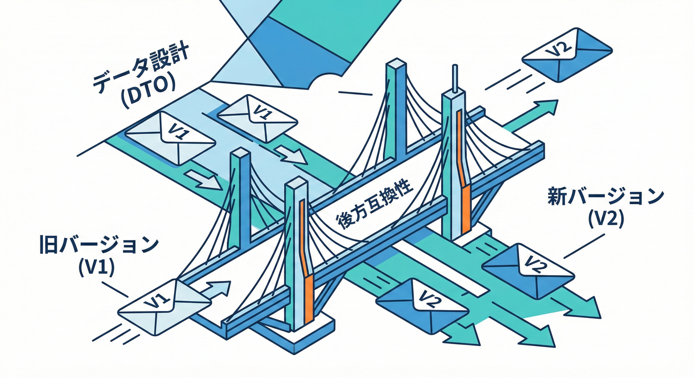
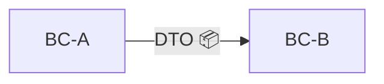
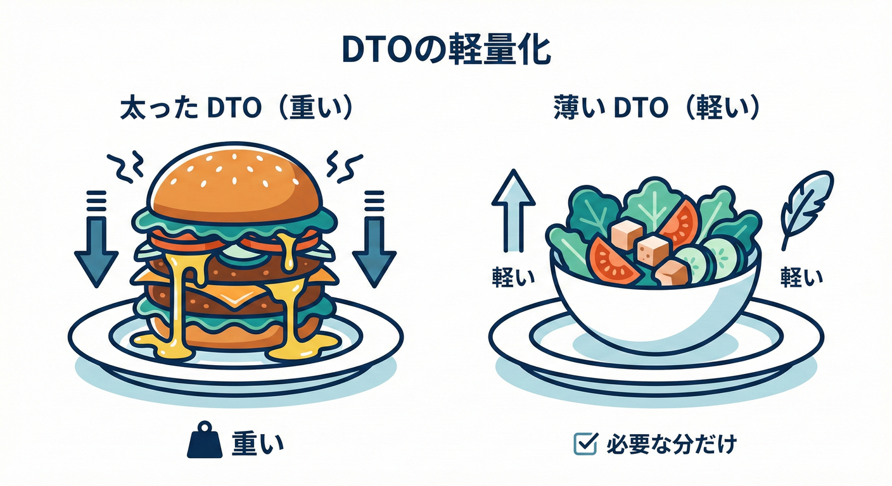

# 第39章：境界越えのデータ設計（DTOとバージョンの超入門）📦📨

## 0. 今日のゴール🎯✨

境界（Bounded Context）をまたぐときに、

* **ドメイン型を持ち出さずに**（＝境界を壊さずに）🙅‍♀️🔒
* **DTO（契約用データ）を薄く作って**🥗
* **壊さずに進化させる**（後方互換）🚧➡️✅

これができるようになります💪💕

---

## 1. 「境界越え」ってどこで起きる？🌉

たとえばミニECだと、こんな“橋渡し”が発生します👇

* 受注管理BC → 請求BC：請求に必要な注文情報を渡す💳
* 受注管理BC → 配送BC：配送に必要な宛先・荷物情報を渡す🚚
* 在庫BC → 受注管理BC：在庫引当結果を返す📦

ここで大事なのは…

## ✅ 境界を越えるときは「契約（Contract）」で話す📜✨

契約＝**DTO / API / イベント**みたいな、外に公開してよい形のこと。

第38章でやった「public/internal」も、ここで効いてきます🔒

---

## 2. DTOって何？（超ざっくり）📨





DTO（Data Transfer Object）は、

> **境界を越えて渡すための“荷物”**🎁

です😊

* ドメイン型（Entity/VO）＝中身がルールだらけの“本体”🧠
* DTO＝必要最低限だけを詰めた“配送箱”📦

## 🚨 ありがちな事故：ドメイン型をそのまま外に出す

* 変更が全部“破壊変更”になりやすい💥
* うっかり内部ルールや内部構造を公開してしまう😇
* 依存関係が逆流しやすい（境界が崩れる）🌊🧱

---

## 3. DTOを「薄く」するコツ🥗✨（ここ超重要！）



## コツA：1ユースケース＝1 DTO に寄せる🎯

「なんでも入ったDTO（万能DTO）」はだいたい破滅します💣

* 注文一覧に必要なDTO
* 注文詳細に必要なDTO
* 請求計算に必要なDTO

みたいに分けるのが安全🙆‍♀️

---

## コツB：相手が必要なものだけ渡す📦➡️📦

境界を越えるデータは、**“相手の用語”に合わせて最小限**に。

* ✅ 渡す：OrderId, Amount, Currency, OrderedAt
* ❌ 渡さない：受注BCの内部状態機械、割引計算の中間値、内部テーブルID…😵‍💫

---

## コツC：DTOに「意味の強い型」を詰めすぎない🧱

境界の外では、相手の事情が違います👀

* DTOは **プリミティブ寄り**（string, number, datetime, id）にしておくと壊れにくいです👌
* “完全なドメイン表現”は、境界の内側だけで守る🛡️

---

## コツD：DTOは「契約」なので、名前は慎重に🏷️✨

* `OrderDto` みたいな雑名は危険⚠️
* `BillingOrderSummary` とか `ShippingAddressSnapshot` みたいに、**用途が分かる名前**が安心😊

---

## 4. 後方互換って何？（壊さず進化）🕊️✨

## ✅ 後方互換（Backward Compatible）

**古いクライアントが、そのまま動く**状態を守ること💕

例：

* サーバーがレスポンスに項目を「追加」しても、古いクライアントが無視して動けばOK🙆‍♀️
* **JSONの“知らない項目”は基本無視される**ので、追加は比較的安全になりやすいです✅
  （.NET の `System.Text.Json` も、既定ではPOCOに無いプロパティは無視されます。）([Microsoft Learn][1])

---

## 5. “安全な変更” と “危険な変更” 🟢🔴

## 🟢 比較的安全（まずはここで進化しよう）✨

* フィールドを **追加**（しかも“任意”）➕
* 新しいエンドポイントを追加🆕
* 新しいイベント種類を追加📣

## 🔴 だいたい破壊変更（バージョン戦略が必要）💥

* フィールド削除🗑️
* リネーム（名前変更）✏️
* 型変更（string→number など）🔁
* 任意→必須（required化）🚨
* 意味変更（同じフィールド名なのに計算ルールが変わる等）🧨

「破壊変更を避けるのが基本で、必要なら明示的にバージョンを上げる」…が鉄板です💡([Microsoft Learn][2])

---

## 6. C#でDTOを作ってみよう（例）💻✨

ここでは「受注管理BC → 請求BC」に渡す“注文サマリ”を想定します📦💳

## 6.1 v1（最初の契約）📜

```csharp
public sealed record BillingOrderSummaryDto
{
    public Guid OrderId { get; init; }
    public decimal TotalAmount { get; init; }
    public string Currency { get; init; } = "JPY";
    public string Status { get; init; } = "Unknown";
    public DateTimeOffset OrderedAt { get; init; }
}
```

ポイント📌✨

* `record`＋`init`：DTOは“基本イミュータブル寄り”が扱いやすいです😊
* `Status` は string：将来ステータスが増えても壊れにくい（ただし運用ルールは決めよう）📝

---

## 6.2 v1.1（安全な進化：任意フィールドを追加）➕🌱

クーポンコードを追加したくなった！🎟️

```csharp
public sealed record BillingOrderSummaryDto
{
    public Guid OrderId { get; init; }
    public decimal TotalAmount { get; init; }
    public string Currency { get; init; } = "JPY";
    public string Status { get; init; } = "Unknown";
    public DateTimeOffset OrderedAt { get; init; }

    // v1.1: 追加（任意）
    public string? CouponCode { get; init; }
}
```

* 古いクライアント：`CouponCode` を知らない → **無視して動く**✅
* 新しいクライアント：`CouponCode` があれば使える🎉

この「追加で進化」がいちばん平和です🕊️💕

---

## 7. System.Text.Jsonで“互換性の考え方”を押さえる🧩✨

## 7.1 既定動作：知らないプロパティは無視🙆‍♀️

.NET の `System.Text.Json` は、既定で **POCOに無いプロパティを無視**します。([Microsoft Learn][1])
これが「追加が安全になりやすい」大きな理由です😊

---

## 7.2 逆に“厳格モード”もある（境界内だけで使うのが無難）🔍

.NET 8以降は、**未知プロパティを拒否**して例外にできる設定もあります。([Microsoft Learn][1])

ただし注意⚠️

* 外部公開APIや、別BCとの連携でこれをやると「追加が即破壊」になりやすいです💥
* “契約をガチガチに固定したい内部”でだけ使う、が安全😊

---

## 8. バージョニング戦略（超入門）🧭✨

「追加で済まない破壊変更」をしたいとき、どうする？😵‍💫
ここで **API Versioning** の考え方が出てきます📌

## 8.1 よくあるバージョンの持たせ方📦

代表例はこんな感じ👇

1. **URLに入れる**
   `/api/v2/orders/...`
2. **クエリで持つ**
   `/api/orders?api-version=2`
3. **ヘッダーで持つ**
   `api-version: 2`

Azureの設計ベストプラクティスでも、ヘッダーでバージョンを指定する例が紹介されています📚([Microsoft Learn][2])

---

## 8.2 ASP.NET CoreのAPIバージョニング（定番パッケージ）📦🧰

ASP.NET Coreでやるなら、いま主流は `Asp.Versioning.*` 系です。([NuGet][3])
（昔の `Microsoft.AspNetCore.Mvc.Versioning` は置き換えが進んでいます。）([GitHub][4])

---

## 9. “破壊変更”を避ける段取り（段階的に）🚧➡️✅

## ステップ1：まず「追加」で逃げられないか考える🧠

* 新フィールド追加で足りない？
* 新エンドポイント追加で足りない？
* 新イベント追加で足りない？

逃げられるなら、それが最強💪💕

---

## ステップ2：リネームしたいなら「二重持ち」して移行する✌️

例：`TotalAmount` を `Amount` に変えたい場合

* すぐ消さない🙅‍♀️
* しばらく両方返す（または両方受ける）
* クライアントが移行したら削除（ここでバージョン上げが必要になりやすい）🆙

---

## ステップ3：どうしても無理なら v2 を作る🆕

* v1は維持（互換）
* v2で新仕様
* v1は非推奨→期限を切って終了（運用が超大事）⏳

---

## 10. “DTOのバージョン” と “APIのバージョン” は別物だよ🧠✨

* DTOが v1.1 になった（フィールド追加）
  → **APIのバージョンを上げなくてもいい**ことが多い🙆‍♀️
* 破壊変更が必要（削除/型変更/必須化）
  → **APIを v2 にする**、が安全✅

この「分けて考える」と混乱が減ります😊

---

## 11. ミニ演習🎮✅（手を動かそう！）

## 演習A：DTOを“薄く”リデザインしてみよう🥗

次のDTOは太りすぎです🐷💦（ありがち）

```csharp
public class OrderDto
{
    public Order DomainOrder { get; set; } = default!; // ←ドメイン丸ごと！🙅‍♀️
    public List<OrderLine> Lines { get; set; } = new();
    public string InternalMemo { get; set; } = "";
    public string DiscountRuleDebugText { get; set; } = "";
}
```

✅やること

* 請求BCが必要な最小フィールドだけにして、DTOを作り直してね📦✨
* 「ID」「金額」「通貨」「注文日時」「請求に必要な状態」くらいを目安に😊

---

## 演習B：互換性テストを書こう🧪✨

“古いJSON（v1）”を新DTO（v1.1）で読めるか確認！

```csharp
using System.Text.Json;
using Xunit;

public class DtoCompatibilityTests
{
    [Fact]
    public void OldJson_V1_ShouldDeserializeInto_V1_1_Dto()
    {
        var oldJson = """
        {
          "orderId": "11111111-1111-1111-1111-111111111111",
          "totalAmount": 1200,
          "currency": "JPY",
          "status": "Paid",
          "orderedAt": "2026-02-01T10:00:00+09:00"
        }
        """;

        var dto = JsonSerializer.Deserialize<BillingOrderSummaryDto>(oldJson);
        Assert.NotNull(dto);
        Assert.Null(dto!.CouponCode); // v1には無いのでnullでOK✅
    }
}
```

---

## 12. つまずきポイント集（先回り）🧯💕

## つまずき①：DTOに `required` を付けて地雷💣

「必須にしたい！」は分かるけど、後から `required` を増やすのは破壊変更になりやすいです🚨
まずは **任意で追加 → 移行 → 次のバージョンで必須** の順が安全😊

## つまずき②：enumが増えて落ちる😇

* 新しい値が来ても落ちない設計にしておく（Unknownを用意する等）🧩
* 文字列で運ぶなら未知値を受け止めるルールを決めよう📝

## つまずき③：金額・日付がBCごとにブレる🌀

* 金額：`amount` と `currency` をセットで💴
* 日付：ISO 8601（`DateTimeOffset`）でズレに強く⏰

---

## 13. 今日のまとめ🧡

* 境界越えは **契約（DTO）** でやる📨
* DTOは **薄く、用途ごと** に作る🥗🎯
* 進化はまず **追加（任意）** で逃げる➕
* 破壊変更は **段階的移行** or **v2** で安全に🚧✅
* `System.Text.Json` は既定で未知プロパティを無視しやすく、追加進化と相性がいい🙆‍♀️([Microsoft Learn][1])
* APIバージョニングは、ヘッダー/クエリ/URLなど戦略がある📦([Microsoft Learn][2])
* ASP.NET Coreのバージョニング支援は `Asp.Versioning.*` が主流📦([NuGet][3])

---

## お助けAIプロンプト（第39章用）🤖✨

* 「このDTO、太りすぎなら“最小フィールド案”を3つ出して🥗」
* 「この変更は後方互換？破壊変更？理由もつけて判定して⚖️」
* 「破壊変更が必要なときの段階的移行プランを手順で作って🚧」
* 「v1 JSON と v1.1 DTO の互換性テスト（xUnit）を書いて🧪」
* 「APIのバージョン戦略（URL/Query/Header）のメリデメを表にして📊」

[1]: https://learn.microsoft.com/en-us/dotnet/standard/serialization/system-text-json/missing-members?utm_source=chatgpt.com "Handle unmapped members during deserialization - .NET"
[2]: https://learn.microsoft.com/en-us/azure/architecture/best-practices/api-design?utm_source=chatgpt.com "Best practices for RESTful web API design - Azure"
[3]: https://www.nuget.org/packages/Asp.Versioning.Mvc?utm_source=chatgpt.com "Asp.Versioning.Mvc 8.1.1"
[4]: https://github.com/abpframework/abp/issues/18368?utm_source=chatgpt.com "Replace Microsoft.AspNetCore.Mvc.Versioning with Asp. ..."
