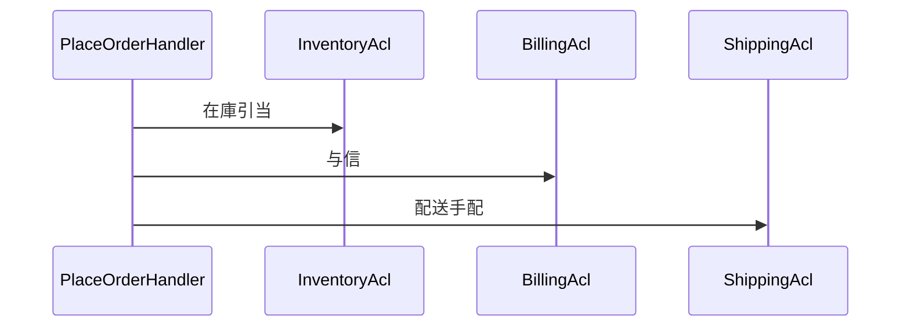
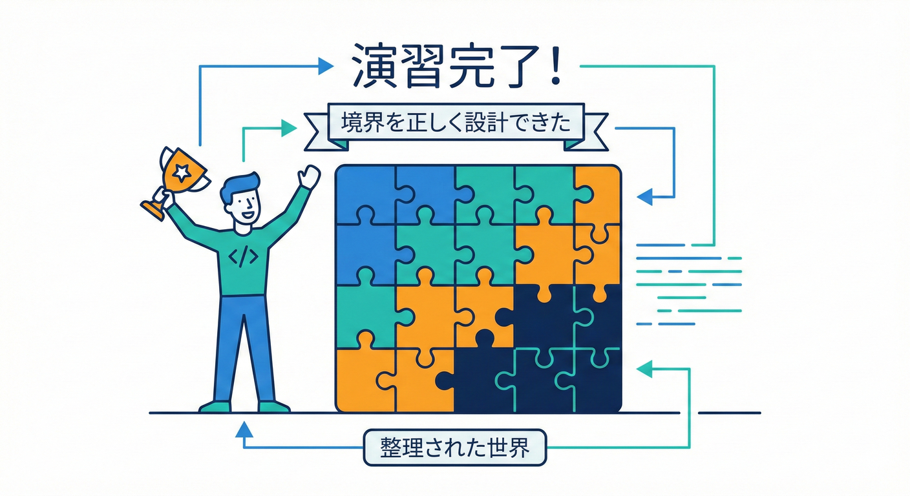

# 第40章：総合演習（BC分割→Context Map→実装修正）🎮✅

## この章で作るもの 🎁✨

ミニEC題材で、次の成果物を**ぜんぶ1本につなげて完成**させます🧩💕

* ✅ **分割前コード（地雷入り）**を読んで、衝突ポイントを発見🧨
* ✅ **BC案**を決める（用語集つき）📒
* ✅ **Context Map**で関係を1枚にする🗺️🤝
* ✅ **C#で境界を守る**（DTO / ACL / internal）🔒💻
* ✅ **テスト**で境界の崩壊を検知できるようにする🧪✅
* ✅ 最後に**レビュー観点チェック**で合格判定🎓✨

---

## 40-1　演習の前提ストーリー　ミニECの世界 🛒📦💳🚚

登場する機能はこの4つだけに絞ります（絞るの大事💡）

1. **受注**：注文を作る・状態を進める 📦
2. **在庫**：在庫を引当てる・戻す 🧺
3. **請求**：支払いの与信・確定 💳
4. **配送**：送り状を作る・出荷する 🚚

ここで大事なのは、**「注文」「顧客」「金額」「住所」みたいな言葉が、部署ごとに意味がズレる**ところです😵‍💫
このズレを、**BCで分けて守る**のがゴールです💪✨

---

## 40-2　まず分割前コードを読む　地雷探しゲーム 🧨🎮

## 分割前の悪い例　全部入り OrderService 💣

* 受注・在庫・請求・配送が1クラスで混ざってます
* 「注文ステータス」が**在庫/請求/配送の都合**で増殖します
* “便利そう”が一番危ないやつ😇

```csharp
// ❌ 分割前（地雷）：責務が全部混ざってる
public class OrderService
{
    private readonly DbConnection _db;
    private readonly PaymentApi _payment;
    private readonly ShippingApi _shipping;

    public async Task PlaceOrderAsync(Guid customerId, List<(string sku, int qty)> lines, string address)
    {
        // 1) 在庫チェック（ここからして受注の責務じゃない）
        foreach (var (sku, qty) in lines)
        {
            var stock = await _db.QuerySingleAsync<int>("SELECT Stock FROM Items WHERE Sku=@sku", new { sku });
            if (stock < qty) throw new Exception("OutOfStock");
        }

        // 2) 注文作成
        var orderId = Guid.NewGuid();
        await _db.ExecuteAsync("INSERT INTO Orders(Id, CustomerId, Status, Address) VALUES(@id,@c,'NEW',@a)",
            new { id = orderId, c = customerId, a = address });

        // 3) 在庫引当（DB直で減らす）
        foreach (var (sku, qty) in lines)
        {
            await _db.ExecuteAsync("UPDATE Items SET Stock = Stock - @q WHERE Sku=@sku", new { sku, q = qty });
        }

        // 4) 支払い（与信→確定を一気に）
        var total = await _db.QuerySingleAsync<decimal>("SELECT SUM(Price*Qty) FROM OrderLines WHERE OrderId=@id", new { id = orderId });
        var paymentResult = await _payment.ChargeAsync(customerId, total);
        if (!paymentResult.Success) throw new Exception("PaymentFailed");

        // 5) 配送手配
        var tracking = await _shipping.CreateShipmentAsync(address, lines);

        // 6) 状態更新（なんか全部ここ…）
        await _db.ExecuteAsync("UPDATE Orders SET Status='SHIPPING', Tracking=@t WHERE Id=@id", new { id = orderId, t = tracking });
    }
}
```

## 地雷チェックリスト　読んで印を付けよう 🖊️👀

次を見つけたら、コードにコメントで印を付けます✅

* ✅ “注文”の中に**在庫のルール**がいる
* ✅ “注文”の中に**請求のルール**がいる
* ✅ “注文”の中に**配送のルール**がいる
* ✅ “Address”が1個しかない（配送住所？請求先？😇）
* ✅ 例外が雑（OutOfStock / PaymentFailed が直投げ）
* ✅ DBテーブル共有っぽい（Items と Orders が直結）

---

## 40-3　BC案を決める　まずは4分割でOK 🧩✨

## BC案　この章ではこれで進めるよ 🧭

* **OrderManagement**：受注の意思決定（注文を作る、状態を進める）📦
* **Inventory**：在庫の真実（引当/戻し/在庫数）🧺
* **Billing**：お金の真実（与信/確定/返金）💳
* **Shipping**：配送の真実（送り状/出荷）🚚

> .NET 10 は 2025年11月11日にリリースされた **LTS** で、サポートは 2028年11月14日までです。([Microsoft][1])
> C# 14 は .NET 10 SDK と組み合わせて試せます。([Microsoft Learn][2])

## 用語集ミニ　同名でもBCで意味が変わる例 📒🌀

ここ、超重要です🧡（衝突を“見える化”）

* **注文**

  * OrderManagement：顧客が「買う」と決めた意思決定の記録
  * Shipping：配送する荷物の単位（送り状・梱包単位に寄る）
  * Billing：請求の対象（確定した金額・税計算ルールの単位）

* **住所**

  * Shipping：配送先（届ける場所）
  * Billing：請求先（カード/請求書の名義と整合）

---

## 40-4　Context Mapを1枚にする 🗺️🤝

## この章の関係の決め方　シンプル版 🌸

* **OrderManagement** が “進行役” になって

  * 在庫へ「引当していい？」
  * 請求へ「与信していい？」
  * 配送へ「出荷していい？」
    を順番にお願いする感じです🙋‍♀️

## 図　依存の向きだけは絶対に描く ✍️

```text
[Inventory]  <--(ACL/DTO)--  [OrderManagement]  --(ACL/DTO)--> [Billing]
                                |
                                +--(ACL/DTO)--> [Shipping]
```

* どの矢印にも **ACL/DTO** を入れてるのがポイント🛡️✨
* つまり「相手の型（ドメイン）をそのまま持ち込まない」🙅‍♀️

最近は GitHub の Copilot などで“エージェント的にタスクを進める”支援も増えてるので、**図→境界→実装**の順で固めるとAIとも相性が良いです🤖🧠([The Verge][3])

---

## 40-5　実装　プロジェクト分割と参照ルール 🔒🏗️

## フォルダとプロジェクト構成案 📁✨

```text
/src
  /OrderManagement
    OrderManagement.Domain
    OrderManagement.Application
    OrderManagement.Contracts   (公開するDTOだけ)
    OrderManagement.Infrastructure (ACLの実装はここ)
  /Inventory
    Inventory.Domain
    Inventory.Application
  /Billing
    Billing.Domain
    Billing.Application
  /Shipping
    Shipping.Domain
    Shipping.Application

/tests
  OrderManagement.Tests
  Inventory.Tests
  Billing.Tests
  Shipping.Tests
  EndToEnd.Tests
```

### 参照ルール　これだけ守れば勝ち 🏆

* Application は Domain を参照してOK ✅
* Infrastructure は Application を参照してOK ✅
* **他BCのDomainは参照しない** ❌
* 境界越えは **Contracts（DTO）＋ACL** だけでやる ✅

> Visual Studio 2022 は 2026年1月時点で 17.14 系が提供されています。([Microsoft Learn][4])
> GitHub Copilot の統合拡張は Visual Studio 17.10 以降で使えます。([Visual Studio][5])

---

## 40-6　境界越え　DTOとACLを作る 📨🛡️

## 公開DTO　OrderManagement.Contracts 側 📦

「相手に渡す最小限」だけにします🥗✨

```csharp
namespace OrderManagement.Contracts;

public sealed record ReserveStockRequest(
    Guid OrderId,
    IReadOnlyList<ReserveStockLine> Lines
);

public sealed record ReserveStockLine(string Sku, int Quantity);

public sealed record ReserveStockResponse(
    bool Success,
    string? FailureReason
);
```

## ACL　OrderManagement.Infrastructure 側 🔄

* OrderManagement は **IInventoryGateway** だけ知ってる
* 中で Inventory の都合に合わせて変換する（翻訳）📖✨

```csharp
using OrderManagement.Contracts;

namespace OrderManagement.Infrastructure.InventoryAcl;

public interface IInventoryGateway
{
    Task<ReserveStockResponse> ReserveAsync(ReserveStockRequest request, CancellationToken ct);
}

// ✅ ACL実装（ここだけが Inventory に触ってよい）
public sealed class InventoryGateway : IInventoryGateway
{
    private readonly Inventory.Application.InventoryAppService _inventory;

    public InventoryGateway(Inventory.Application.InventoryAppService inventory)
        => _inventory = inventory;

    public async Task<ReserveStockResponse> ReserveAsync(ReserveStockRequest request, CancellationToken ct)
    {
        // DTO → Inventory側のコマンドへ変換（翻訳）
        var cmd = new Inventory.Application.Commands.ReserveCommand(
            request.OrderId,
            request.Lines.Select(x => new Inventory.Application.Commands.ReserveLine(x.Sku, x.Quantity)).ToList()
        );

        var result = await _inventory.ReserveAsync(cmd, ct);

        // Inventory側の結果 → DTO に戻す
        return new ReserveStockResponse(result.Success, result.FailureReason);
    }
}
```

> ポイント：Inventory のコマンド型は **外へ出ない**（internal でもOK）🔒
> “相手の揺れ”を吸う場所が ACL です🛡️✨

---

## 40-7　分割後の流れ　OrderManagementはオーケストラ 🎻✨




## Application Service の例 🎼

```csharp
public sealed class PlaceOrderHandler
{
    private readonly IInventoryGateway _inventory;
    private readonly IBillingGateway _billing;
    private readonly IShippingGateway _shipping;
    private readonly IOrderRepository _orders;

    public async Task<Guid> HandleAsync(PlaceOrderCommand cmd, CancellationToken ct)
    {
        var order = Order.Create(cmd.CustomerId, cmd.Lines, cmd.ShippingAddress);

        // 1) 在庫引当
        var stock = await _inventory.ReserveAsync(order.ToReserveRequest(), ct);
        if (!stock.Success) throw new DomainException($"OutOfStock: {stock.FailureReason}");

        // 2) 与信
        var auth = await _billing.AuthorizeAsync(order.ToAuthorizeRequest(), ct);
        if (!auth.Success)
        {
            await _inventory.ReleaseAsync(order.ToReleaseRequest(), ct);
            throw new DomainException($"PaymentDenied: {auth.FailureReason}");
        }

        // 3) 配送手配
        var ship = await _shipping.CreateShipmentAsync(order.ToShipmentRequest(), ct);
        order.AttachShipment(ship.TrackingNumber);

        await _orders.SaveAsync(order, ct);

        return order.Id;
    }
}
```

## ここで境界が守れてる理由 💡

* OrderManagement の中に「在庫の在り方」は入ってない🧺❌
* OrderManagement の中に「課金の仕様」は入ってない💳❌
* OrderManagement の中に「配送の事情」は入ってない🚚❌
* 代わりに「お願いする契約（DTO）」だけがある📨✅

---

## 40-8　テスト　境界が崩れたら赤くなるようにする 🧪🚨

## 1) Domain単体テスト　まずは各BCで勝つ 🏅

* OrderManagement.Domain：注文の不変条件（例：合計がマイナスにならない）✅
* Inventory.Domain：引当ルール（例：在庫未満は失敗）✅
* Billing.Domain：与信の状態遷移（例：確定前に返金しない）✅

## 2) ACLテスト　翻訳が壊れたら死ぬ😇

* DTOの必須項目が落ちてないか
* 値の単位（税/通貨/丸め）がズレてないか
* null/欠損時の扱いが合ってるか

## 3) End-to-End テスト　最短で1本通す 🎯

* 正常系：注文→在庫引当→与信→配送→保存 ✅
* 異常系：与信NGなら在庫戻しが動く ✅
* 異常系：在庫NGなら請求に触らない ✅

---

## 40-9　最終レビュー　合格チェックリスト ✅🎓✨



## 言葉の一貫性 📒

* ✅ “注文” “住所” “金額” の意味がBC内でブレてない
* ✅ DTOは “公開する言葉” になってる（曖昧な名前がない）

## 依存の向き ➡️

* ✅ 他BCのDomain参照がない
* ✅ 参照できるのは Contracts と Gatewayインターフェースだけ

## 共有の扱い 🧱

* ✅ 共有テーブル直読みがない（やるなら所有者ルールがある）
* ✅ “共通便利クラス” が増殖してない

## テストで守れてる 🧪

* ✅ ACLの翻訳テストがある
* ✅ 失敗時の巻き戻し（在庫戻し等）がE2Eで検証されてる

---

## 40-10　お助けAIプロンプト　この章専用 🤖✨

コピペして使える形にしてあります📋💕

```text
あなたはDDD/Bounded Contextの先生です。
次の分割前コードを読み、(1)衝突している用語 (2)責務の混在 (3)BC分割案（3〜6個）を提案して。
各BCごとに「目的を1行」「主要エンティティ/値オブジェクト候補」「用語集ミニ（同名異義）」も出して。
最後にContext MapをASCII図で描いて、矢印ごとに「ACL/DTOで守るポイント」を箇条書きにして。
```

```text
次のDTO案を、後方互換を壊さずに進化させたい。
(1) 追加OKなフィールド (2) 破壊変更になりやすい変更 (3) バージョニング戦略（段階的移行）を、
例と一緒に提案して。
```

```text
ACLの変換コードが肥大化してきた。
(1) どこが設計上の臭いか (2) 分割/整理の案 (3) テスト戦略（変換ルール固定）を提案して。
```

---

## 40-11　よくあるつまずき　ここで転ばないでね 🧸💦

* **DTOにドメイン都合を詰めがち**
  → “相手が必要な最小限”だけにする🥗✨

* **共通プロジェクトを作りすぎる**
  → 共通にした瞬間、境界が溶けやすい🫠⚠️

* **「とりあえず参照」で境界が崩壊**
  → 参照ルールを固定して、違反したらビルドで落とすのが強い🔒💪

* **E2Eが巨大化**
  → “成功1本＋失敗2本”くらいからでOK🎯✨

[1]: https://dotnet.microsoft.com/en-us/platform/support/policy/dotnet-core?utm_source=chatgpt.com "NET and .NET Core official support policy"
[2]: https://learn.microsoft.com/en-us/dotnet/csharp/whats-new/csharp-14?utm_source=chatgpt.com "What's new in C# 14"
[3]: https://www.theverge.com/news/669339/github-ai-coding-agent-fix-bugs?utm_source=chatgpt.com "GitHub's new AI coding agent can fix bugs for you"
[4]: https://learn.microsoft.com/en-us/visualstudio/releases/2022/release-history?utm_source=chatgpt.com "Visual Studio 2022 Release History"
[5]: https://visualstudio.microsoft.com/github-copilot/?utm_source=chatgpt.com "Visual Studio With GitHub Copilot - AI Pair Programming"
