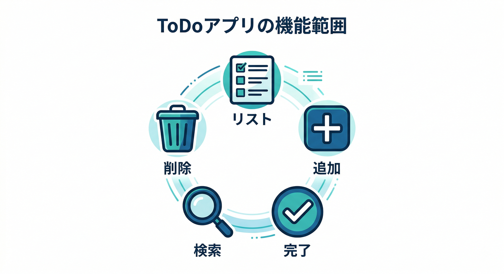
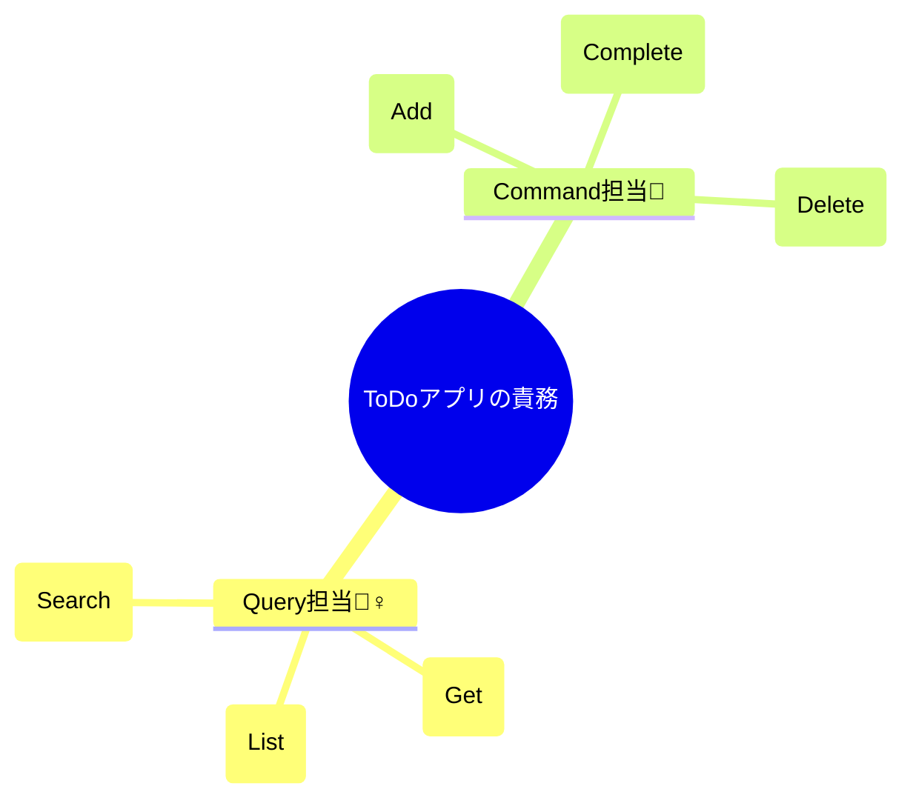
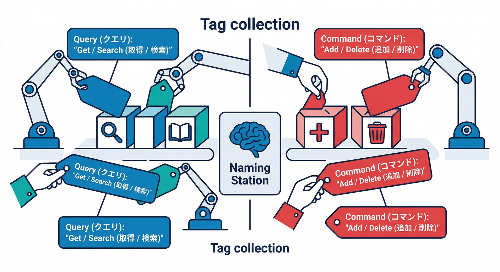
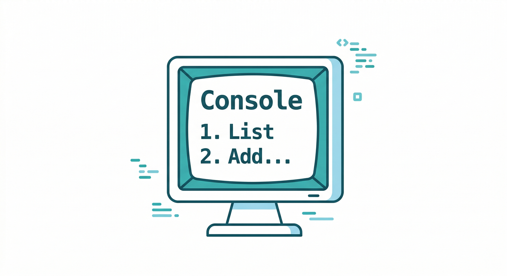
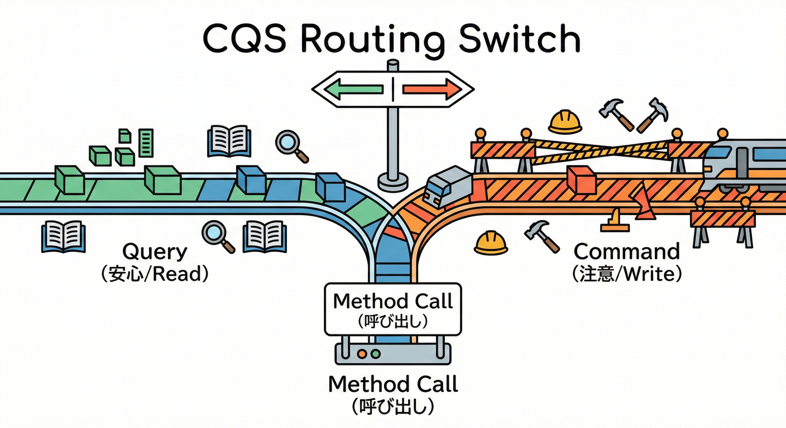
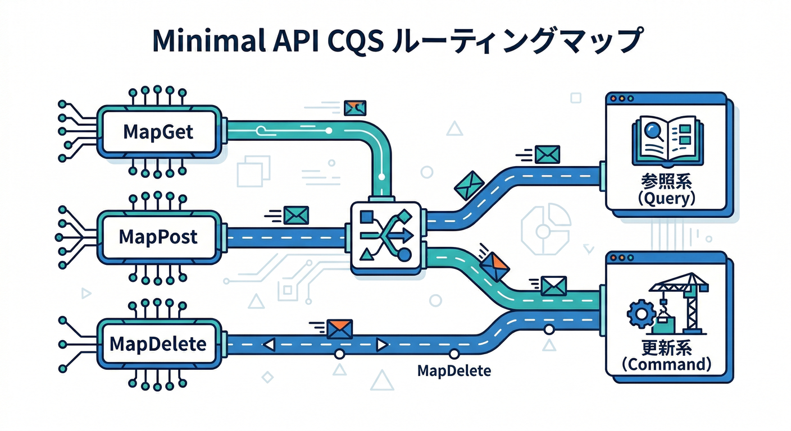
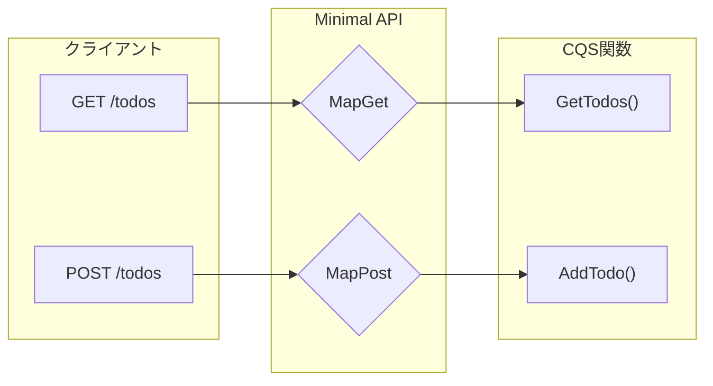
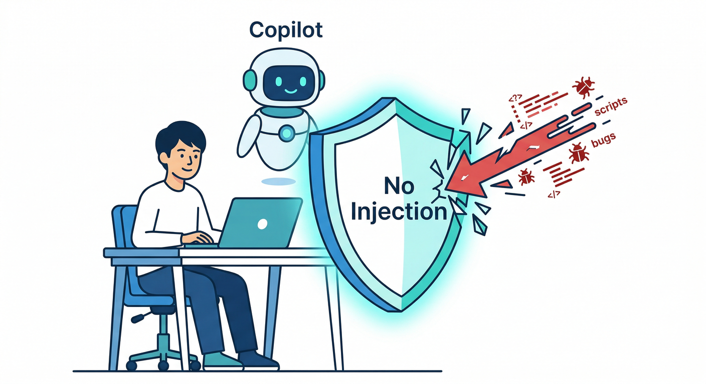

# 第07章：まずは小さい題材でCQS（ToDoで分ける）📝🍰

この章は「**分けるだけで、読みやすさが上がる**」を体で覚える回だよ〜😊✨
（最新は **.NET 10（LTS）＋C# 14** が公式に出てるよ📦✨ ([Microsoft for Developers][1]) / Visual Studio 2026 も更新が出てるよ🧰 ([Microsoft Learn][2]) / VS には Copilot 体験が統合されてるよ🤖 ([Visual Studio][3])）

---

## 0) この章のゴール🎯✨

* ToDo を題材にして、**Query（参照）** と **Command（変更）** を迷わず分けられる🧠💡
* 命名だけで「これは読むだけ / これは変える」が伝わるようになる✍️✨
* 分けた結果、呼び出し側（UI/Endpoint）がスッキリするのを体験する😌🌸

---

## 1) ミニToDoの仕様（小さく！）🧁



**データ**はこれだけ👇

* `Id`（Guid）🪪
* `Title`（やること）📝
* `IsDone`（完了？）✅

**Query（参照）** 🕵️‍♀️

* 一覧 `GetTodos()` 📋
* 詳細 `GetTodo(id)` 🔎
* 検索 `SearchTodos(keyword)` 🔍

**Command（変更）** 🔧

* 追加 `AddTodo(title)` ➕
* 完了 `CompleteTodo(id)` ✅
* 削除 `DeleteTodo(id)` 🗑️




---

## 2) 命名のコツ（ここ超大事）✍️💎



## Query は「Get/List/Search」系で統一🔍

* `GetTodo` / `GetTodos`
* `SearchTodos`
* `Find` でもいいけど、初心者には `Search` がわかりやすいよ😊

## Command は「Add/Create/Update/Complete/Delete」系で統一🔧

* `AddTodo` / `CreateTodo`
* `CompleteTodo`
* `DeleteTodo`

💡コツ：**メソッド名だけで副作用があるか分かる**のが理想✨

---

## 3) Console版：CQSを“分けるだけ”で作ってみる🎮🪟



ここでは **DBなし**・**メモリだけ**でいくよ（まずは味見🍰）

## 完成イメージ（操作）🍀

* 1: 一覧 📋
* 2: 追加 ➕
* 3: 完了 ✅
* 4: 削除 🗑️
* 5: 検索 🔍

---

## コード（Program.cs 1ファイルでOK）🧩

```csharp
using System;
using System.Collections.Generic;
using System.Linq;

public sealed class TodoItem
{
    public Guid Id { get; init; } = Guid.NewGuid();
    public required string Title { get; init; }
    public bool IsDone { get; set; }
}

var todos = new List<TodoItem>();

while (true)
{
    Console.WriteLine();
    Console.WriteLine("==== Mini ToDo ====");
    Console.WriteLine("1) List  2) Add  3) Complete  4) Delete  5) Search  0) Exit");
    Console.Write("Select: ");
    var input = Console.ReadLine();

    switch (input)
    {
        case "1":
            // Query ✅（読むだけ）
            PrintTodos(GetTodos());
            break;

        case "2":
            Console.Write("Title: ");
            var title = Console.ReadLine() ?? "";
            // Command 🔧（変える）
            var id = AddTodo(title);
            Console.WriteLine($"Added! Id={id}");
            break;

        case "3":
            Console.Write("Id: ");
            if (Guid.TryParse(Console.ReadLine(), out var completeId))
            {
                // Command 🔧
                var ok = CompleteTodo(completeId);
                Console.WriteLine(ok ? "Completed! ✅" : "Not found 😢");
            }
            break;

        case "4":
            Console.Write("Id: ");
            if (Guid.TryParse(Console.ReadLine(), out var deleteId))
            {
                // Command 🔧
                var ok = DeleteTodo(deleteId);
                Console.WriteLine(ok ? "Deleted! 🗑️" : "Not found 😢");
            }
            break;

        case "5":
            Console.Write("Keyword: ");
            var keyword = Console.ReadLine() ?? "";
            // Query ✅
            PrintTodos(SearchTodos(keyword));
            break;

        case "0":
            return;

        default:
            Console.WriteLine("???");
            break;
    }
}

//
// ===== Query（参照：状態変更しない）✅ =====
//

IReadOnlyList<TodoItem> GetTodos()
{
    // 読むだけ：並び替えや絞り込みはOK（副作用なし）
    return todos
        .OrderBy(t => t.IsDone)           // 未完了 → 完了
        .ThenBy(t => t.Title)
        .ToList();
}

TodoItem? GetTodo(Guid id)
{
    return todos.FirstOrDefault(t => t.Id == id);
}

IReadOnlyList<TodoItem> SearchTodos(string keyword)
{
    keyword = keyword.Trim();
    if (keyword.Length == 0) return GetTodos();

    return todos
        .Where(t => t.Title.Contains(keyword, StringComparison.OrdinalIgnoreCase))
        .OrderBy(t => t.IsDone)
        .ThenBy(t => t.Title)
        .ToList();
}

void PrintTodos(IReadOnlyList<TodoItem> items)
{
    if (items.Count == 0)
    {
        Console.WriteLine("(empty)");
        return;
    }

    foreach (var t in items)
    {
        var mark = t.IsDone ? "✅" : "⬜";
        Console.WriteLine($"{mark} {t.Title}  ({t.Id})");
    }
}

//
// ===== Command（変更：状態を変える）🔧 =====
//

Guid AddTodo(string title)
{
    title = title.Trim();
    if (title.Length == 0)
    {
        Console.WriteLine("Title is empty 😢");
        return Guid.Empty;
    }

    var item = new TodoItem { Title = title };
    todos.Add(item);
    return item.Id;
}

bool CompleteTodo(Guid id)
{
    var t = GetTodo(id);
    if (t is null) return false;

    t.IsDone = true; // 状態変更 ✅
    return true;
}

bool DeleteTodo(Guid id)
{
    var t = GetTodo(id);
    if (t is null) return false;

    todos.Remove(t); // 状態変更 ✅
    return true;
}
```

---

## 4) “分けるだけ”で何が良くなるの？😊✨



## ✅ いいこと1：読む処理が安心して呼べる💖

`GetTodos()` を何回呼んでも **データが勝手に変わらない**から、UIが壊れにくい✨

## ✅ いいこと2：変更処理の入口がはっきりする🚪🔧

「変えるのはここ（Command）だけ！」って決めるだけで、
バグの捜索範囲がギュッと狭くなるよ🕵️‍♀️🔍

## ✅ いいこと3：呼び出し側が読みやすい📖

switch の中が「Query/Command」で揃ってるから、読む人が迷子になりにくい😊🧭

---

## 5) Minimal API版（同じ発想で、HTTPにする🌐🍰）



Minimal API のチュートリアルは公式も更新されてるよ（ASP.NET Core 10.0）📚 ([Microsoft Learn][4])
しかも **.NET 10 で Minimal API のバリデーション強化**も入ってる（後の章で効くやつ！）✨ ([Microsoft Learn][5])

ここでは ToDo を HTTP で操作する最小形だけ置くね😊

```csharp
using Microsoft.AspNetCore.Mvc;

var builder = WebApplication.CreateBuilder(args);
var app = builder.Build();

var todos = new List<TodoItem>();

app.MapGet("/todos", () =>
{
    // Query ✅
    return Results.Ok(GetTodos());
});

app.MapGet("/todos/{id:guid}", (Guid id) =>
{
    // Query ✅
    var t = GetTodo(id);
    return t is null ? Results.NotFound() : Results.Ok(t);
});

app.MapGet("/todos/search", ([FromQuery] string? q) =>
{
    // Query ✅
    return Results.Ok(SearchTodos(q ?? ""));
});

app.MapPost("/todos", ([FromBody] CreateTodoRequest req) =>
{
    // Command 🔧
    var id = AddTodo(req.Title ?? "");
    return id == Guid.Empty
        ? Results.BadRequest("Title is empty")
        : Results.Created($"/todos/{id}", new { id });
});

app.MapPost("/todos/{id:guid}/complete", (Guid id) =>
{
    // Command 🔧
    return CompleteTodo(id) ? Results.NoContent() : Results.NotFound();
});

app.MapDelete("/todos/{id:guid}", (Guid id) =>
{
    // Command 🔧
    return DeleteTodo(id) ? Results.NoContent() : Results.NotFound();
});

app.Run();

record CreateTodoRequest(string? Title);

sealed class TodoItem
{
    public Guid Id { get; init; } = Guid.NewGuid();
    public required string Title { get; init; }
    public bool IsDone { get; set; }
}

// ===== Query ✅ =====
IReadOnlyList<TodoItem> GetTodos()
    => todos.OrderBy(t => t.IsDone).ThenBy(t => t.Title).ToList();

TodoItem? GetTodo(Guid id)
    => todos.FirstOrDefault(t => t.Id == id);

IReadOnlyList<TodoItem> SearchTodos(string keyword)
{
    keyword = keyword.Trim();
    if (keyword.Length == 0) return GetTodos();

    return todos
        .Where(t => t.Title.Contains(keyword, StringComparison.OrdinalIgnoreCase))
        .OrderBy(t => t.IsDone)
        .ThenBy(t => t.Title)
        .ToList();
}

// ===== Command 🔧 =====
Guid AddTodo(string title)
{
    title = title.Trim();
    if (title.Length == 0) return Guid.Empty;

    var item = new TodoItem { Title = title };
    todos.Add(item);
    return item.Id;
}

bool CompleteTodo(Guid id)
{
    var t = GetTodo(id);
    if (t is null) return false;
    t.IsDone = true;
    return true;
}

bool DeleteTodo(Guid id)
{
    var t = GetTodo(id);
    if (t is null) return false;
    todos.Remove(t);
    return true;
}
```




---

## 6) ありがちなミス集（ここだけ避ければ勝ち🏆）😇


## ❌ Query の中でこっそり更新しちゃう👻

例：`GetTodos()` の中で「古いToDoを削除」とか「アクセス回数を増やす」とか
→ **“読むだけ”の顔して変える**のが一番事故るやつ💥

## ❌ Command が返しすぎる📦📦📦

例：`AddTodo()` が「追加したToDo＋全一覧＋件数＋…」みたいにモリモリ
→ 呼び出し側が「何に依存してるの？」って混乱しやすい😵‍💫
この章では **ID返す or 何も返さない**くらいでOK👌

---

## 7) ミニ演習（手を動かすやつ🧩✨）

## 演習A：並び順をちょい改造🍀

* 未完了 → 完了の順（もう入ってる）
* さらに「新しい順」も入れてみよ（`CreatedAt` を追加）🕒✨

  * `CreatedAt` を入れるのは **Command（追加）** の責務だよ➕

## 演習B：検索を強くする🔍💪

* スペース区切りで AND 検索（例：`buy milk`）
* **Queryだけ**で頑張ってみてね😊

## 演習C：ToggleDone を作る✅🔁

* `ToggleTodoDone(id)` は **Command**（状態変えるから）🔧
* Query に紛れ込ませないのが勝ち✨

---

## 8) Copilot/Codex活用（事故らせない使い方つき🤖🧷）



## ① まずAIに「CQSの意図」を短く伝える📝

Copilot Chat にこれを投げると、提案がブレにくいよ😊

* 「ToDoアプリ。**Queryは副作用なし**、**Commandだけが状態変更**。命名は Get/Search と Add/Complete/Delete で統一してコード提案して」

Visual Studio の Copilot 体験は統合されてるので、この流れがやりやすいよ🤖✨ ([Visual Studio][3])

## ② 生成されたコードの“レビュー質問テンプレ”🔎

* 「この関数、状態変更（List操作、ファイル書き込み、ログDB更新など）してない？」👀
* 「Command が返しすぎてない？」📦
* 「Query を何回呼んでも結果が安定する？」🔁

## ③ セキュリティ注意（AI時代の新しい落とし穴）🚨

最近は **プロンプト注入**みたいに、ファイルや出力に混ぜた指示でAIをだまして危ない操作をさせる問題が研究・報告されてるよ🧨
（AI IDE系で多数の脆弱性が報告された流れもある）([arXiv][6])

なので最低限これだけ守ると安心度UP⬆️😊

* 生成物は **必ず自分の目で読む**（特にファイル操作/ネットワーク/プロセス起動）👁️
* **秘密情報（トークン/鍵）を貼らない**🔑🙅‍♀️
* 「この変更、どこで副作用が起きる？」をレビューで確認する🔍

GitHub側も、タスクで使う時のベストプラクティス（指示の置き方等）を案内してるよ📚 ([GitHub Docs][7])

---

## 9) 章末チェックリスト✅✨（3つだけ！）

* [ ] Query が **状態変更してない**？（こっそり Remove/Update してない？）👻
* [ ] Command が **状態変更の入口**になってる？🔧
* [ ] 命名だけで「読む/変える」が伝わる？✍️

---

次の第8章で、今日やった “分け方” を **`TodoCommands` / `TodoQueries` クラス**にして、さらに読みやすくするよ〜🏗️✨

[1]: https://devblogs.microsoft.com/dotnet/announcing-dotnet-10/?utm_source=chatgpt.com "Announcing .NET 10"
[2]: https://learn.microsoft.com/en-us/visualstudio/releases/2026/release-notes?utm_source=chatgpt.com "Visual Studio 2026 Release Notes"
[3]: https://visualstudio.microsoft.com/github-copilot/?utm_source=chatgpt.com "Visual Studio With GitHub Copilot - AI Pair Programming"
[4]: https://learn.microsoft.com/en-us/aspnet/core/tutorials/min-web-api?view=aspnetcore-10.0&utm_source=chatgpt.com "Tutorial: Create a Minimal API with ASP.NET Core"
[5]: https://learn.microsoft.com/en-us/aspnet/core/fundamentals/minimal-apis?view=aspnetcore-10.0&utm_source=chatgpt.com "Minimal APIs quick reference"
[6]: https://arxiv.org/html/2601.10338v1?utm_source=chatgpt.com "An Empirical Study of Security Vulnerabilities at Scale"
[7]: https://docs.github.com/copilot/how-tos/agents/copilot-coding-agent/best-practices-for-using-copilot-to-work-on-tasks?utm_source=chatgpt.com "Best practices for using GitHub Copilot to work on tasks"
