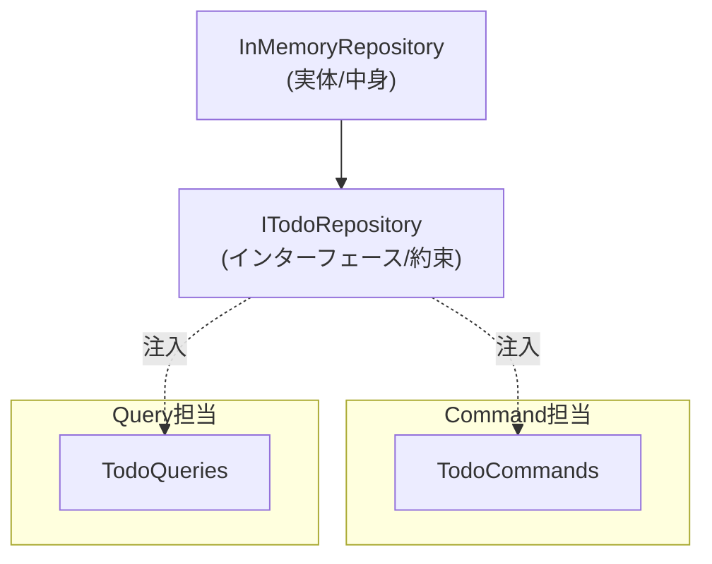
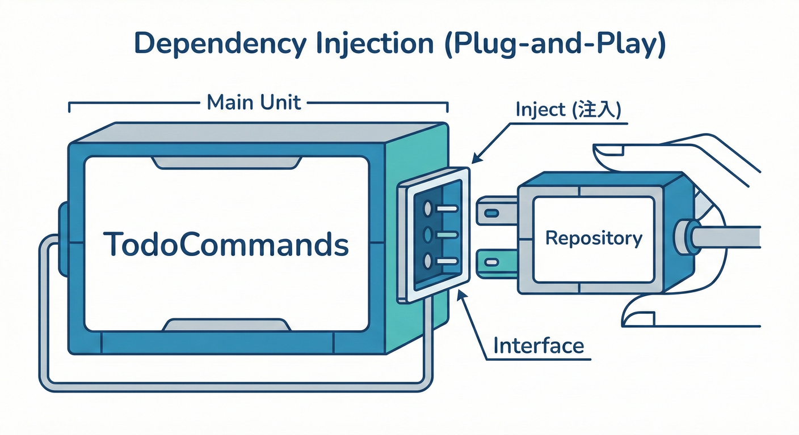

# 第08章：最小の設計型（Commands/Queriesクラスで分離）🏗️🧱

この章は「とりあえずCQSを“形”にする」回だよ〜😊
**TodoCommands / TodoQueries を分けて、依存（Repository）を外から渡す**ところまでいきます🔌✨
そして「**newしない**」の気持ちよさを、ふわっと体験しよう〜！🌸

ちなみに2026年の“今どき”としては、**.NET 10（LTS）**が最新の主流で、**C# 14**が最新だよ〜✨（Visual Studio 2026 には .NET 10 SDK が入るよ） ([Microsoft][1])
（そして .NET 10 は 2026/01/13 の更新も出てる！） ([Microsoft サポート][2])

---

## 1) 今日のゴール🎯✨

この章が終わるとこうなるよ👇😊

* ✅ `TodoCommands` と `TodoQueries` に分けられる
* ✅ `Repository` を **コンストラクタで受け取る**（依存を外から渡す）
* ✅ **「new は入口（最初）だけ」**に寄せられる
* ✅ ConsoleでもMinimal APIでも同じ考え方で組める✨ ([Microsoft Learn][3])

---

## 2) まず“設計の最小セット”を置こう🧩✨

登場人物はこれだけ！

* **TodoItem**：データ（モデル）📝
* **ITodoRepository**：保存・取得の「約束」（インターフェース）📮
* **InMemoryTodoRepository**：とりあえず動く保存先（メモリ）🧠
* **TodoCommands**：追加・完了・削除など「変更」🔧
* **TodoQueries**：一覧・詳細・検索など「参照」🔍

ここで大事なのはココ👇✨

> 外から渡してもらう（＝注入）🎁




---

## 3) まずはモデル📝✨（TodoItem）

```csharp
public sealed class TodoItem
{
    public Guid Id { get; init; } = Guid.NewGuid();
    public string Title { get; private set; }
    public bool IsCompleted { get; private set; }

    public TodoItem(string title)
    {
        Title = title.Trim();
    }

    public void Complete() => IsCompleted = true;

    public void Rename(string newTitle) => Title = newTitle.Trim();
}
```

ポイント😊✨

* `Guid` は作るときに決まる🪪
* “状態変更”はメソッドに寄せる（`Complete`, `Rename`）🔧

---

## 4) Repositoryの「約束」を作る📮✨（ITodoRepository）

```csharp
public interface ITodoRepository
{
    Task AddAsync(TodoItem item, CancellationToken ct = default);
    Task<TodoItem?> GetAsync(Guid id, CancellationToken ct = default);
    Task<IReadOnlyList<TodoItem>> ListAsync(CancellationToken ct = default);
    Task DeleteAsync(Guid id, CancellationToken ct = default);
    Task SaveAsync(CancellationToken ct = default);
}
```

ここでの気持ち😍

* **Commands/Queries は “保存先の実体” を知らない**
* 「こういうことできるよね？」って約束だけ知ってる📮✨
  これが “依存を柔らかくする” 入口だよ〜🧸

---

## 5) とりあえず動かす：InMemory版🧠✨

まずはDBなしでOK！動くのが正義😊✨

```csharp
using System.Collections.Concurrent;

public sealed class InMemoryTodoRepository : ITodoRepository
{
    private readonly ConcurrentDictionary<Guid, TodoItem> _store = new();

    public Task AddAsync(TodoItem item, CancellationToken ct = default)
    {
        _store[item.Id] = item;
        return Task.CompletedTask;
    }

    public Task<TodoItem?> GetAsync(Guid id, CancellationToken ct = default)
        => Task.FromResult(_store.TryGetValue(id, out var item) ? item : null);

    public Task<IReadOnlyList<TodoItem>> ListAsync(CancellationToken ct = default)
        => Task.FromResult((IReadOnlyList<TodoItem>)_store.Values.ToList());

    public Task DeleteAsync(Guid id, CancellationToken ct = default)
    {
        _store.TryRemove(id, out _);
        return Task.CompletedTask;
    }

    public Task SaveAsync(CancellationToken ct = default)
        => Task.CompletedTask; // メモリなので何もしない
}
```

---

## 6) いよいよ分離！TodoCommands（変更）🔧✨



Command は「状態を変える側」だよ〜✅🗑️

```csharp
public sealed class TodoCommands
{
    private readonly ITodoRepository _repo;

    public TodoCommands(ITodoRepository repo)
    {
        _repo = repo;
    }

    public async Task<Guid> CreateAsync(string title, CancellationToken ct = default)
    {
        if (string.IsNullOrWhiteSpace(title))
            throw new ArgumentException("タイトルは必須だよ🥺", nameof(title));

        var item = new TodoItem(title);
        await _repo.AddAsync(item, ct);
        await _repo.SaveAsync(ct);

        return item.Id; // 例外的に「IDだけ」返すパターン🪪✨
    }

    public async Task CompleteAsync(Guid id, CancellationToken ct = default)
    {
        var item = await _repo.GetAsync(id, ct);
        if (item is null) throw new InvalidOperationException("そのTodoは見つからないよ🥲");

        item.Complete();
        await _repo.SaveAsync(ct);
    }

    public async Task DeleteAsync(Guid id, CancellationToken ct = default)
    {
        await _repo.DeleteAsync(id, ct);
        await _repo.SaveAsync(ct);
    }
}
```

ここでの学び😊✨

* `TodoCommands` は **Repositoryをnewしてない**👏
* 依存はコンストラクタから入ってくる🎁🔌

---

## 7) 次！TodoQueries（参照）🔍✨

Query は「読むだけ」✨
（読むだけだから、ここに更新が混ざると事故る😇💥）

```csharp
public sealed class TodoQueries
{
    private readonly ITodoRepository _repo;

    public TodoQueries(ITodoRepository repo)
    {
        _repo = repo;
    }

    public Task<IReadOnlyList<TodoItem>> ListAsync(CancellationToken ct = default)
        => _repo.ListAsync(ct);

    public Task<TodoItem?> GetAsync(Guid id, CancellationToken ct = default)
        => _repo.GetAsync(id, ct);

    public async Task<IReadOnlyList<TodoItem>> SearchAsync(string keyword, CancellationToken ct = default)
    {
        keyword = keyword.Trim();
        var list = await _repo.ListAsync(ct);

        if (keyword.Length == 0) return list;

        return list
            .Where(x => x.Title.Contains(keyword, StringComparison.OrdinalIgnoreCase))
            .ToList();
    }
}
```

---

## 8) 「newしない」を体験しよう✨（入口だけnewする）🚪

## A) Consoleアプリ版：入口（Program）でだけ組み立てる🧩✨

“最初の1回だけ new する場所” を決めると、世界が平和になるよ〜🕊️😊

```csharp
var repo = new InMemoryTodoRepository();

var commands = new TodoCommands(repo);
var queries  = new TodoQueries(repo);

// 使ってみる🎉
var id = await commands.CreateAsync("レポート書く📝");
await commands.CreateAsync("コーヒー買う☕");

var all = await queries.ListAsync();
Console.WriteLine($"件数: {all.Count}✨");

await commands.CompleteAsync(id);

var item = await queries.GetAsync(id);
Console.WriteLine($"{item?.Title} 完了？ => {item?.IsCompleted} ✅");
```

この形の良さ😍

* ロジック（Commands/Queries）は “組み立て” を知らない
* だからテストしやすいし、差し替えしやすい✨

---

## B) Minimal API版：DIコンテナに登録して自動で渡してもらう🔌✨

Minimal APIは **DIが標準で使える**よ〜！ ([Microsoft Learn][4])
（エンドポイントの引数にサービスを書くだけで注入されるのが超ラク🧸）

```csharp
using Microsoft.AspNetCore.Mvc;

var builder = WebApplication.CreateBuilder(args);

// 依存の登録（DI）🔌
builder.Services.AddSingleton<ITodoRepository, InMemoryTodoRepository>();
builder.Services.AddScoped<TodoCommands>();
builder.Services.AddScoped<TodoQueries>();

var app = builder.Build();

app.MapPost("/todos", async ([FromBody] CreateTodoRequest req, TodoCommands commands) =>
{
    var id = await commands.CreateAsync(req.Title);
    return Results.Created($"/todos/{id}", new { id });
});

app.MapGet("/todos", async (TodoQueries queries) =>
{
    var list = await queries.ListAsync();
    return Results.Ok(list);
});

app.MapPost("/todos/{id:guid}/complete", async (Guid id, TodoCommands commands) =>
{
    await commands.CompleteAsync(id);
    return Results.NoContent();
});

app.Run();

public sealed record CreateTodoRequest(string Title);
```

ここでの感動ポイント🥹✨

* Endpointは薄いまま（やること少ない）
* Commands/Queriesが“仕事の中心”になる
* 依存はDIが勝手に渡してくれる🔌✨
  （Minimal API公式チュートリアルでも、こういうふうにDIへ登録して使う流れが基本だよ） ([Microsoft Learn][4])

---

## 9) ちょいだけ「依存関係ルール」っぽい話🧭✨（超やさしく）

今の形って、こういう向きだよ👇😊

* Program / Endpoint（入口）🚪
  ↓ 使う
* Commands / Queries（アプリの機能）🎯
  ↓ “約束”だけ知ってる
* ITodoRepository（インターフェース）📮
  ↑ 実体がぶら下がる
* InMemoryTodoRepository（実装）🧠

つまり✨
**大事な側（Commands/Queries）は、具体（InMemory）を知らない**
→ これが「依存の向きを整える」の第一歩だよ〜🌱

---

## 10) ミニ演習🧩🎮（手を動かすと一気に定着するよ！）

## 演習A：Queryを追加🔍✨

* `GetCompletedAsync()` を `TodoQueries` に追加してみてね✅

  * ヒント：`ListAsync()` して `IsCompleted == true` だけ返す！

## 演習B：Commandを追加🔧✨

* `RenameAsync(Guid id, string newTitle)` を `TodoCommands` に追加✍️

  * `TodoItem.Rename()` を呼ぶだけでOK！

## 演習C：禁じ手チェック😇💥

* わざと `SearchAsync()` の中で “ついでに保存” をやってみて、
  「Queryなのに副作用あると怖い」を体感してみてね👻⚠️
  （やったあと元に戻そ〜！笑）

---

## 11) AI（Copilot/Codex）に頼むときの“安全プロンプト”例🤖🧷✨

## 例1：Query追加の提案をもらう

```text
C#でCQSに従ってTodoQueriesに GetCompletedAsync を追加したいです。
既存の ListAsync を使って副作用なしで実装してください。
メソッド名・戻り値型・null/空の扱いも提案してください。
```

## 例2：Command追加の提案をもらう

```text
TodoCommandsに RenameAsync(Guid id, string newTitle) を追加したいです。
例外は最小にして、入力チェックの方針も含めて提案してください。
Repositoryはnewせずコンストラクタ注入のままでお願いします。
```

AIの出力は、最後にこの2点だけチェックしてね😊✨

* ✅ Queryが状態変更してない？
* ✅ Commandが値を返しすぎてない？（ID程度ならOK寄り）

---

## 12) まとめ🎁✨（この章で“型”ができた！）

* `TodoCommands` / `TodoQueries` に分けた🎯
* 依存は **外から渡す**（DIの入口）🔌
* **newは入口だけ**に寄せられた🚪✨
* ConsoleでもMinimal APIでも同じ考え方で作れる😍

---

次の章では、この分離を活かして「失敗（エラー）の種類」を整理していくよ😵‍💫🧠✨
（CQSと相性めっちゃ良いところ！）

[1]: https://dotnet.microsoft.com/en-us/download/dotnet?utm_source=chatgpt.com "Browse all .NET versions to download | .NET"
[2]: https://support.microsoft.com/en-us/topic/-net-10-0-update-january-13-2026-64f1e2a4-3eb6-499e-b067-e55852885ad5?utm_source=chatgpt.com ".NET 10.0 Update - January 13, 2026"
[3]: https://learn.microsoft.com/en-us/dotnet/core/extensions/dependency-injection-usage?utm_source=chatgpt.com "Tutorial: Use dependency injection in .NET"
[4]: https://learn.microsoft.com/en-us/aspnet/core/tutorials/min-web-api?view=aspnetcore-10.0&utm_source=chatgpt.com "Tutorial: Create a Minimal API with ASP.NET Core"
