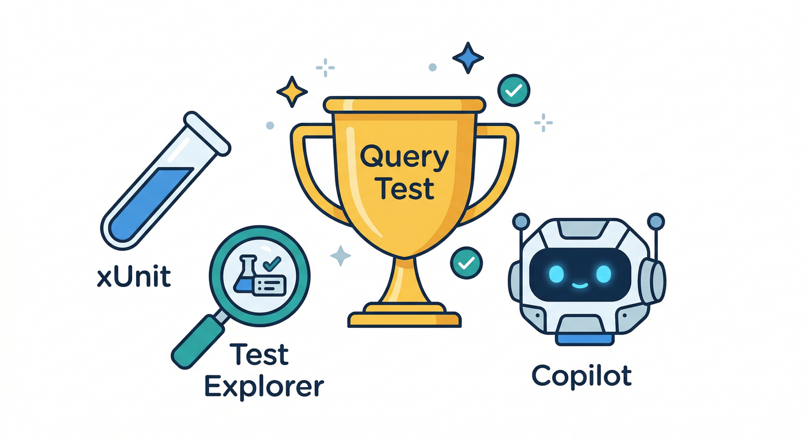
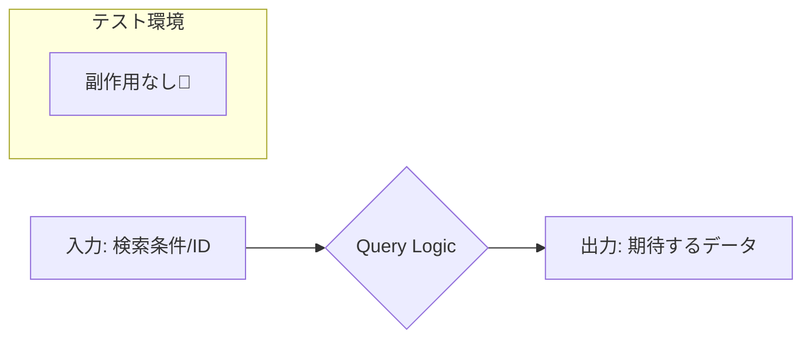
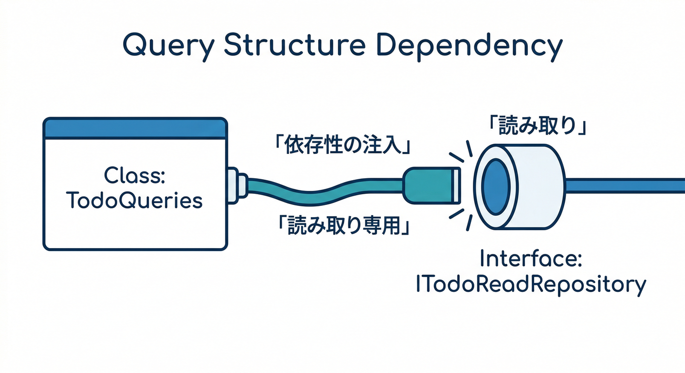
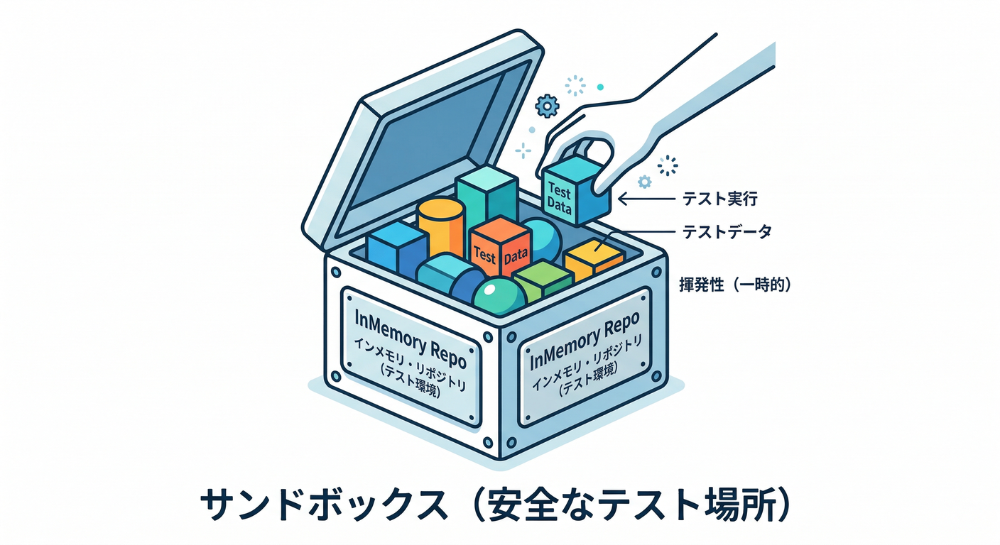
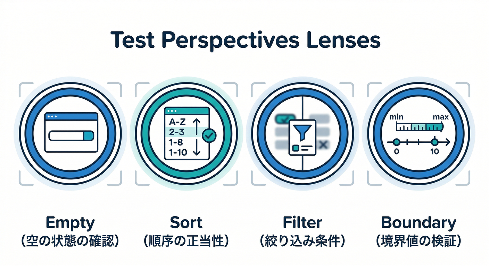
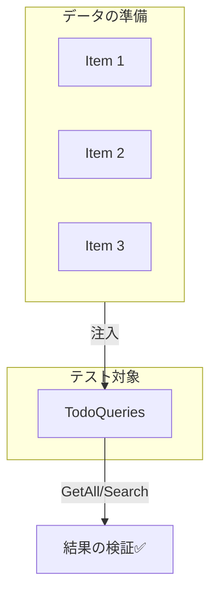
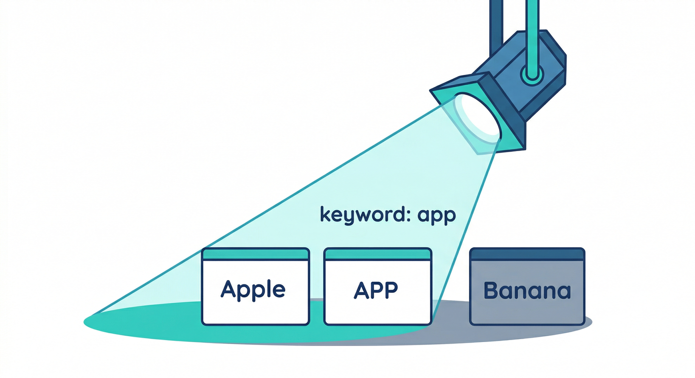

# 第11章：CQSとテスト①（Queryはラク勝ち🧪🏆）

この章はね、めっちゃ気持ちいい回です🥰
なぜなら **Query（参照）は副作用がない前提** なので、**テストが「入力→出力」だけで完結しやすい**から！✨

ちなみに今の最新環境だと、**.NET 10（LTS）**が基準で話せます👍 ([Microsoft][1])
Visual Studioも **Visual Studio 2026（2026/1/13 のアップデートあり）** まで来てて、テスト体験もかなり強化されてるよ〜🛠️✨ ([Microsoft Learn][2])

---

## 1) 今日のゴール🎯✨



ゴールはこれだけ！シンプル！😊

* Queryのテストがラクな理由を体感する🧠🌱
* **xUnit**（または MSTest / NUnit）で、Queryの単体テストを書ける🧪
* Visual Studioの **Test Explorer** で「実行・デバッグ」できる🔍🪲 ([Microsoft Learn][3])
* AI（Copilot/Codex）に **テストケース案** を出させて、良いテストに育てる🤖📝 ([Microsoft Learn][4])

---

## 2) Queryテストがラクな理由😍✨（CQSのご褒美）


### Queryはこういう存在👇

* 入力：検索条件・ID・フィルタなど🔍
* 出力：欲しいデータ（一覧、詳細、検索結果）📦
* ✅ **状態を変えない**（DB更新しない、ファイル書かない、メール送らない）

だからテストが…

> だけで終わる！💯✨




---

## 3) 今日の題材：TodoQueries をテストする📝🍰

ここまでの章で作ってきた想定の “分離” はこんな感じ👇

* `TodoQueries`：参照だけ担当🔍
* `TodoCommands`：変更だけ担当🔧（これは第12章でテストするよ🎭）

今回は `TodoQueries` に集中！🏃‍♀️💨

---

## 4) まずは “テストしやすいQuery” の形にする🏗️✨



ポイントはこれ👇
Queryが依存するのは「読むための窓口」だけにする（＝読み取り専用の依存）😊

例：読み取り用リポジトリ（インターフェース）📌

```csharp
public sealed record TodoItem(Guid Id, string Title, bool IsCompleted, int Priority);

public interface ITodoReadRepository
{
    IReadOnlyList<TodoItem> GetAll();
    TodoItem? FindById(Guid id);
}
```

そして Query クラス👇

```csharp
public sealed class TodoQueries
{
    private readonly ITodoReadRepository _repo;

    public TodoQueries(ITodoReadRepository repo)
    {
        _repo = repo;
    }

    // Query①：一覧（優先度が高い順 → タイトル順）
    public IReadOnlyList<TodoItem> GetAll()
        => _repo.GetAll()
                .OrderByDescending(x => x.Priority)
                .ThenBy(x => x.Title, StringComparer.OrdinalIgnoreCase)
                .ToList();

    // Query②：完了だけ
    public IReadOnlyList<TodoItem> GetCompleted()
        => _repo.GetAll().Where(x => x.IsCompleted).ToList();

    // Query③：検索（タイトルに含む：大文字小文字を無視）
    public IReadOnlyList<TodoItem> SearchByTitle(string keyword)
    {
        if (string.IsNullOrWhiteSpace(keyword)) return Array.Empty<TodoItem>();

        return _repo.GetAll()
                    .Where(x => x.Title.Contains(keyword, StringComparison.OrdinalIgnoreCase))
                    .ToList();
    }

    // Query④：IDで1件
    public TodoItem? GetById(Guid id) => _repo.FindById(id);
}
```

ここまでくると、テストがめちゃ簡単になるよ〜🥳✨

---

## 5) テスト用の “インメモリRepo” を作る🧊✅（モック不要！）



Queryテストはまず **in-memory**（メモリ上のリスト）で十分！👍

```csharp
public sealed class InMemoryTodoReadRepository : ITodoReadRepository
{
    private readonly List<TodoItem> _items;

    public InMemoryTodoReadRepository(IEnumerable<TodoItem> items)
    {
        _items = items.ToList();
    }

    public IReadOnlyList<TodoItem> GetAll() => _items;

    public TodoItem? FindById(Guid id) => _items.FirstOrDefault(x => x.Id == id);
}
```

---

## 6) Queryテストで見る観点（ここが超大事！）🔍✨



Queryのテストは、だいたいこの4種類で勝てます🏆

4. **境界**（null/空文字/大小文字/存在しないID）🧱




---

## 7) xUnitでテストを書く🧪✨（AAAでいこう）

Microsoft公式にも xUnit/NUnit/MSTest の流れがまとまってるので、迷ったらここ基準でOKだよ😊 ([Microsoft Learn][5])
（今回は例として xUnit で！）

### 7-1) 並び順テスト（ソート）🔃✅


```csharp
using Xunit;

public sealed class TodoQueriesTests
{
    [Fact]
    public void GetAll_should_sort_by_priority_desc_then_title_asc()
    {
        // Arrange 🧸
        var a = new TodoItem(Guid.NewGuid(), "banana", false, priority: 1);
        var b = new TodoItem(Guid.NewGuid(), "Apple",  false, priority: 1);
        var c = new TodoItem(Guid.NewGuid(), "zzz",    false, priority: 3);

        var repo = new InMemoryTodoReadRepository(new[] { a, b, c });
        var sut = new TodoQueries(repo);

        // Act 🚀
        var result = sut.GetAll();

        // Assert ✅
        Assert.Equal(new[] { c.Id, b.Id, a.Id }, result.Select(x => x.Id));
    }
}
```

🎉 これだけ！
「優先度3が先」「同じ優先度ならタイトル昇順（大文字小文字無視）」が一発で検証できる✨

---

### 7-2) 絞り込みテスト（完了だけ）✅🧹

```csharp
[Fact]
public void GetCompleted_should_return_only_completed_items()
{
    // Arrange 🧸
    var done = new TodoItem(Guid.NewGuid(), "done", true, 1);
    var todo = new TodoItem(Guid.NewGuid(), "todo", false, 1);

    var repo = new InMemoryTodoReadRepository(new[] { done, todo });
    var sut = new TodoQueries(repo);

    // Act 🚀
    var result = sut.GetCompleted();

    // Assert ✅
    Assert.Single(result);
    Assert.True(result[0].IsCompleted);
    Assert.Equal(done.Id, result[0].Id);
}
```

---

### 7-3) 検索テスト（大文字小文字無視）🔎✨



検索は境界が多いので **Theory** が相性最高！😍

```csharp
[Theory]
[InlineData("app", 2)]
[InlineData("APP", 2)]
[InlineData("le",  2)]
[InlineData("zzz", 0)]
public void SearchByTitle_should_find_case_insensitively(string keyword, int expectedCount)
{
    // Arrange 🧸
    var items = new[]
    {
        new TodoItem(Guid.NewGuid(), "Apple",  false, 1),
        new TodoItem(Guid.NewGuid(), "PineApple", false, 1),
        new TodoItem(Guid.NewGuid(), "Banana", false, 1),
    };

    var repo = new InMemoryTodoReadRepository(items);
    var sut = new TodoQueries(repo);

    // Act 🚀
    var result = sut.SearchByTitle(keyword);

    // Assert ✅
    Assert.Equal(expectedCount, result.Count);
}
```

---

### 7-4) 空文字・空白は0件にする（境界テスト）🧱🫙

```csharp
[Theory]
[InlineData("")]
[InlineData("   ")]
[InlineData(null)]
public void SearchByTitle_should_return_empty_when_keyword_is_blank(string? keyword)
{
    // Arrange 🧸
    var repo = new InMemoryTodoReadRepository(new[]
    {
        new TodoItem(Guid.NewGuid(), "Apple", false, 1),
    });
    var sut = new TodoQueries(repo);

    // Act 🚀
    var result = sut.SearchByTitle(keyword ?? "");

    // Assert ✅
    Assert.Empty(result);
}
```

---

## 8) Visual Studioでテスト実行＆デバッグ🛠️🪲


### Test Explorerでやること😊

* テスト一覧を見る👀
* 実行する▶️
* 失敗したテストを絞り込む🔍
* テストをデバッグする🐛

Test Explorerは公式でも「ユニットテストを効率よく回す場所」として案内されてるよ✨ ([Microsoft Learn][3])
デバッグも、Test Explorerから直接できる（ブレークポイント置いて追える）って明記されてる👍 ([Microsoft Learn][6])

### さらに嬉しい：VS 2026の “テスト失敗→Copilotでデバッグ” 🚀🤖

Visual Studio 2026 だと、失敗テストを右クリックして **Copilotと連携してデバッグを進める流れ** まで入ってきてるよ✨ ([Microsoft Learn][2])
（ただし、最終判断は人間がやろうね🫶）

---

## 9) コマンドラインでも回せる（dotnet test）⌨️✅

Visual Studio以外でも、これで回せます👇

* `dotnet test`

最新の `dotnet test` は **.NET 10 SDK以降での改善**も入ってるので、CIでも超便利だよ〜✨ ([Microsoft Learn][7])

---

## 10) VS Code派の人向け（C# Dev Kitでテスト）🧩🧪

VS Codeなら **C# Dev Kit** のテスト機能で discovery & 実行ができるよ😊 ([Visual Studio Code][8])
（ただ、困ったら `dotnet test` に逃げるのが最強の保険✨）

---

## 11) AIでテストケース案を出すコツ🤖📝（ラクして品質UP）

### 11-1) Copilot “Testing for .NET” を使う（Visual Studio）🧪🤖

GitHub Copilot Chat には **テスト生成**の機能が入ってて、**xUnit / NUnit / MSTest** を選んで作れるよ✨ ([Microsoft Learn][4])
たとえば Chat にこう打つやつ👇（公式の例）

* `@test #target`（solution/project/file/class/member を指定） ([Microsoft Learn][9])

### 11-2) でも！AIに丸投げしないでね⚠️🧷

AIはときどき…

* 仕様を “それっぽく” 勝手に決める😇
* テスト名は良いけど中身が雑🥲
* 重要な境界（空/並び順/大小文字）を落とす💥

だから、AIにはこう頼むのが強いよ💪✨

#### ✅ テストケース案を出させるプロンプト例（コピペ用）

```text
あなたはC#のユニットテスト設計者です。
次のQueryメソッドに対して、重要なテスト観点を列挙してください：
- 空（0件）
- 並び順（ソート）
- 絞り込み（フィルタ）
- 境界（null/空文字/大小文字/存在しないID）
その後、xUnitでテストコードを書いてください。
前提：Queryは副作用なし。テストはインメモリRepoで書くこと。
```

---

## 12) ミニ演習🎮✨（5分でOK）

### 演習A：テストを1本追加しよう🧪

`GetById` に対して👇をテストしてみてね！

* 存在するID → Todoが返る✅
* 存在しないID → nullが返る🫙

### 演習B：並び順ルールを変えたくなったら？🔃

もし並び順を
「Priority降順 → IsCompleted（未完了を先）→ Title」
にしたら、どのテストが落ちる？どれを直す？😊

---

## 13) よくある詰まりポイント🧱😵‍💫（先に潰す！）

* 😵「テストが発見されない」

  * Test Explorerのフィルタが効いてることがあるよ🔍
  * まずは `dotnet test` で通るか確認（切り分け最強）⌨️✨ ([Microsoft Learn][7])

* 😵「並び順の期待値がズレる」

  * `OrderBy` の条件が複数あるときは **“期待する順番を明文化”**（ID配列で比較）にすると安定✅

* 😵「検索が不安定」

  * 大文字小文字、空白、部分一致…境界を先に固定しよう🧱✨

---

## まとめ🎉✨

* Queryは **副作用がない** → テストが **入力→出力** で完結しやすい😍
* 観点はだいたい **空 / 並び順 / 絞り込み / 境界** の4つで勝てる🏆
* Visual Studioの Test Explorer で **実行もデバッグも超ラク**🛠️🐛 ([Microsoft Learn][3])
* AIは **テスト観点の補助** に使うと強い（丸投げは危険）🤖🧷 ([Microsoft Learn][4])

---

次の **第12章** はいよいよ、**Commandのテスト（副作用の確認）**に突入だよ〜🎭🧪
「モックってなに？」も、怖くない範囲で“必要最小限”だけ使っていくね😊✨

[1]: https://dotnet.microsoft.com/en-US/download/dotnet/10.0?utm_source=chatgpt.com "Download .NET 10.0 (Linux, macOS, and Windows) | .NET"
[2]: https://learn.microsoft.com/en-us/visualstudio/releases/2026/release-notes?utm_source=chatgpt.com "Visual Studio 2026 Release Notes"
[3]: https://learn.microsoft.com/en-us/visualstudio/test/unit-test-basics?view=visualstudio&utm_source=chatgpt.com "Unit test basics with Test Explorer - Visual Studio (Windows)"
[4]: https://learn.microsoft.com/en-us/visualstudio/test/github-copilot-test-dotnet-overview?view=visualstudio&utm_source=chatgpt.com "Overview of GitHub Copilot testing for .NET"
[5]: https://learn.microsoft.com/en-us/dotnet/core/testing/unit-testing-csharp-with-xunit?utm_source=chatgpt.com "Unit testing C# in .NET using dotnet test and xUnit"
[6]: https://learn.microsoft.com/en-us/visualstudio/test/debug-unit-tests-with-test-explorer?view=visualstudio&utm_source=chatgpt.com "Debug Unit Tests with Test Explorer - Visual Studio"
[7]: https://learn.microsoft.com/en-us/dotnet/core/tools/dotnet-test?utm_source=chatgpt.com "dotnet test command - .NET CLI"
[8]: https://code.visualstudio.com/docs/csharp/testing?utm_source=chatgpt.com "Testing with C# Dev Kit"
[9]: https://learn.microsoft.com/en-us/visualstudio/test/unit-testing-with-github-copilot-test-dotnet?view=visualstudio&utm_source=chatgpt.com "Generate and run unit tests using GitHub Copilot testing"
