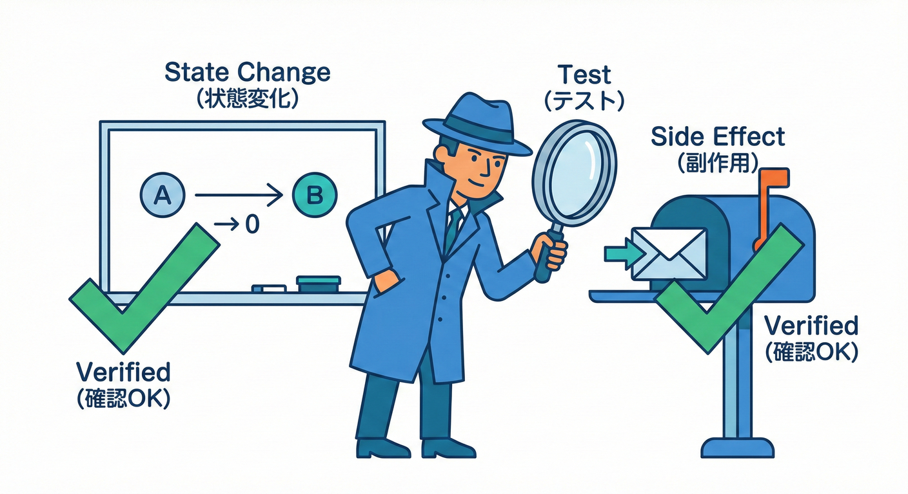
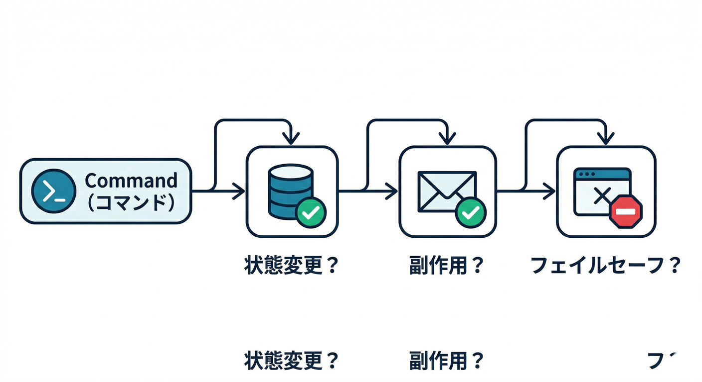
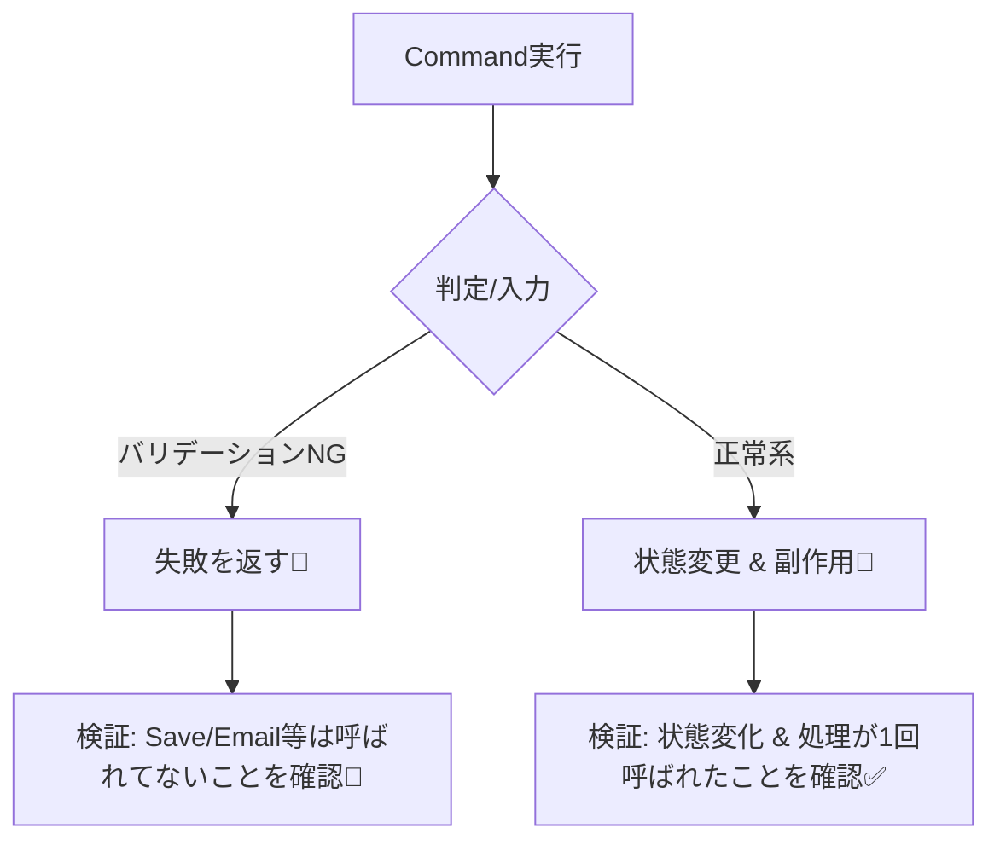
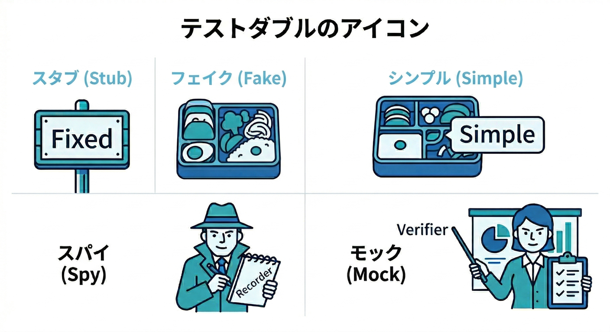
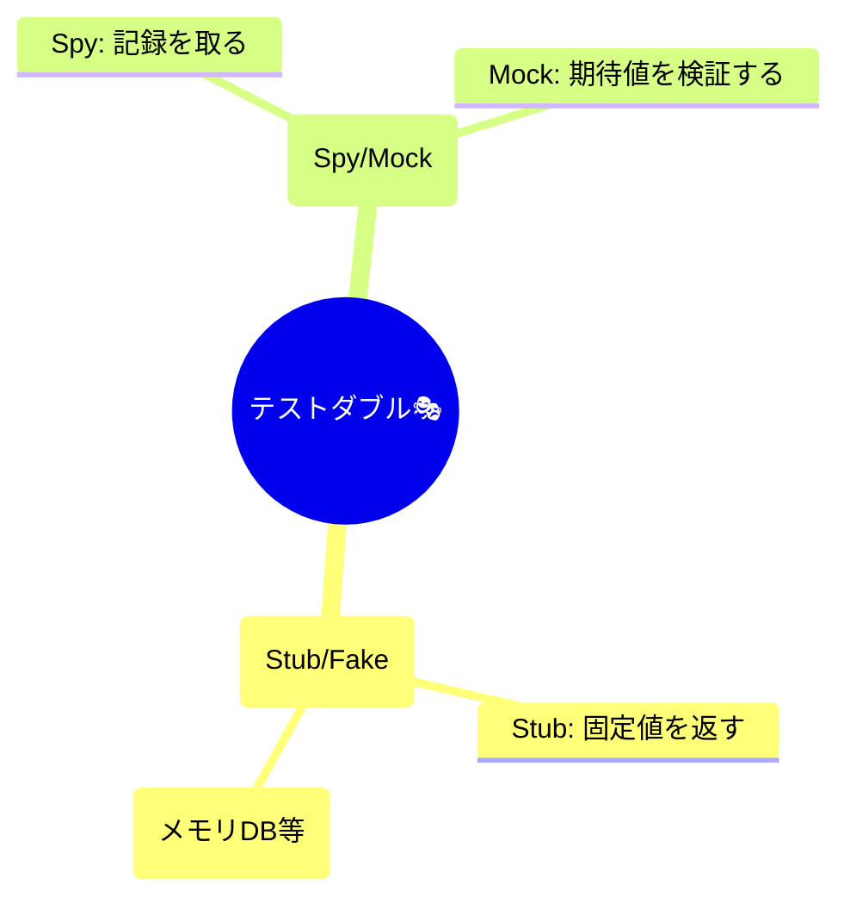
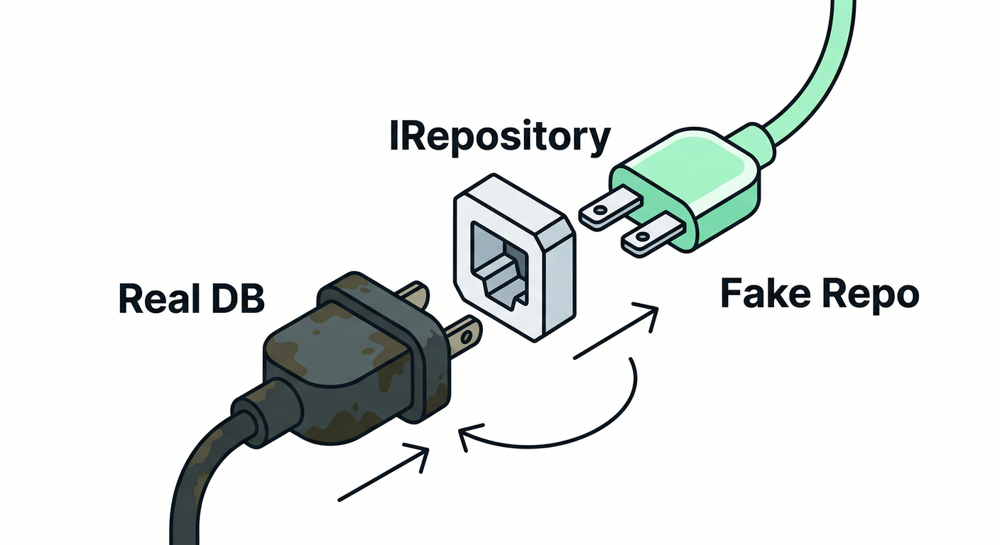
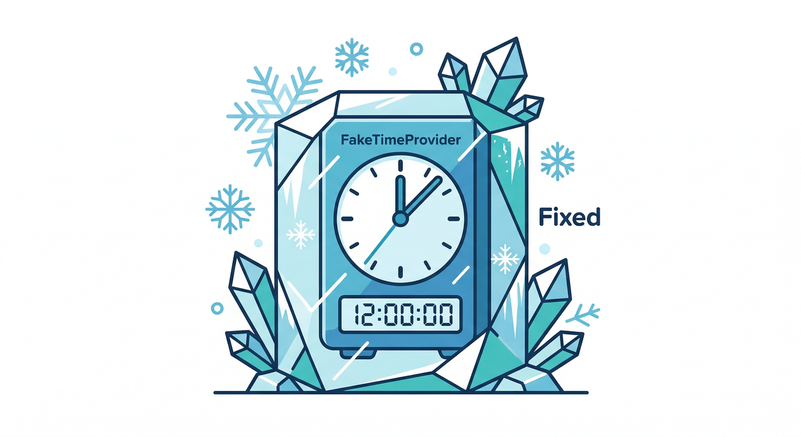
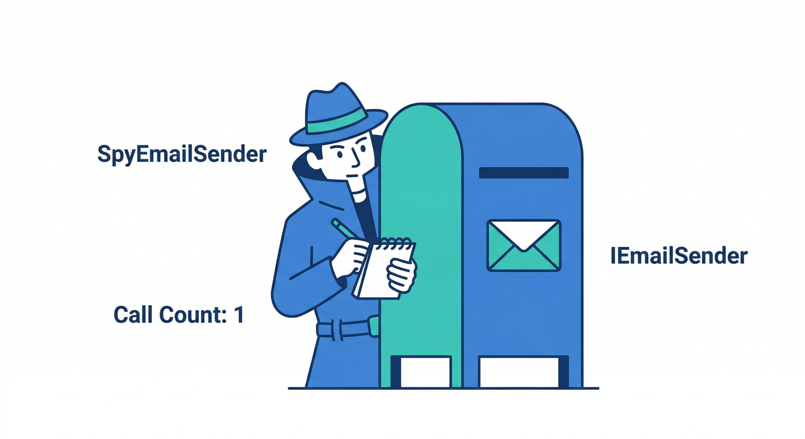
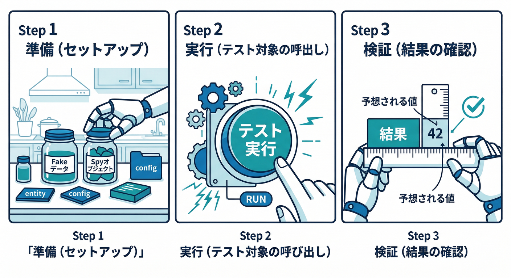
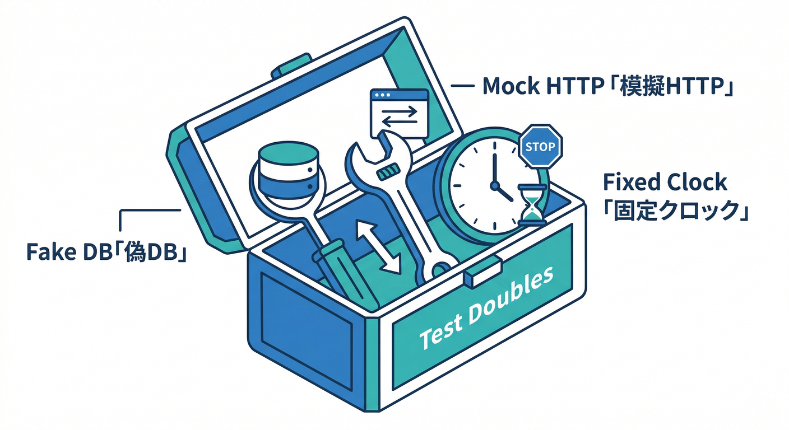

# 第12章：CQSとテスト②（Commandの副作用を確かめる🎭🧪）

## この章のゴール🎯✨

Commandのテストは「返り値を見る」よりも、次の2つをちゃんと確認できるようになるのがゴールだよ〜😊

* **状態がどう変わったか**（DB/メモリ上のデータ、ドメイン状態）✅
* **副作用が起きたか**（メール送信、外部API、イベント発行、ログ、ファイル etc）📨🌐

そして、そのために
**外部I/Oを差し替えてテストする感覚🔌** を身につけるよ！

---

## 1) まず結論：Commandテストの見取り図🗺️🧠




Commandはだいたいこう👇

* 入力を受け取る（Command）📥
* ルールチェック（バリデーション）🧾
* 状態変更（Repository/DBに反映）🧱
* 副作用（メール・イベント・外部API）🎇
* 成功/失敗を返す（Resultなど）🎁

だからテストはこうなる👇

* **「正しい状態変更」できた？**
* **「必要な副作用」だけ起きた？（余計なことしてない？）**
* **「失敗時は何もしない」になってる？**（ここ超大事！）🛑✨




---

## 2) “モック/スタブ”って何？（最小だけ）🎭🧸



難しい言葉は最小でOK〜😊
よく使うのはこの4つ！

* **Stub（スタブ）**：呼ばれたら“決まった値”を返す係🔁
* **Fake（フェイク）**：簡易実装（インメモリDBみたいな）🍱
* **Spy（スパイ）**：呼ばれた記録を取って後で確認する係👀📝
慣れたら **Moq** みたいなライブラリでMockするのもOK🙆‍♀️（MoqはNuGetで広く使われてるよ〜） ([NuGet][1])




---

## 3) お題：ToDoの「完了Command」をテストしてみよ📝✅

## 3-1. 依存を“差し替え可能”にする（テストの入口🔑）



Command側が **DBやメール送信を直接newしてたら** テストは地獄になるよね😇💥
なので、**インターフェースにして外から注入**するよ🔌

ここが“依存関係ルール”の入り口っぽいところ：
**中（ユースケース）は外（DBやメール）を知らない** 👉 だから差し替えできる✨

---

## 3-2. 最小の実装例（Resultで返すパターン🎁）



```csharp
// ドメイン
public sealed class TodoItem
{
    public Guid Id { get; }
    public string Title { get; }
    public bool IsDone { get; private set; }
    public DateTimeOffset? DoneAt { get; private set; }

    public TodoItem(Guid id, string title)
    {
        Id = id;
        Title = title;
    }

    public void Complete(DateTimeOffset now)
    {
        if (IsDone) return; // 二重完了は無視する方針（例）
        IsDone = true;
        DoneAt = now;
    }
}

// 外部I/Oの境界（差し替えポイント）
public interface ITodoRepository
{
    Task<TodoItem?> FindByIdAsync(Guid id, CancellationToken ct);
    Task SaveAsync(TodoItem item, CancellationToken ct);
}

public interface IEmailSender
{
    Task SendCompletedAsync(string title, CancellationToken ct);
}

// Command + Handler
public readonly record struct CompleteTodoCommand(Guid TodoId);

public readonly record struct Result(bool IsSuccess, string? Error)
{
    public static Result Ok() => new(true, null);
    public static Result Fail(string error) => new(false, error);
}

public sealed class CompleteTodoHandler
{
    private readonly ITodoRepository _repo;
    private readonly IEmailSender _email;
    private readonly TimeProvider _time;

    public CompleteTodoHandler(ITodoRepository repo, IEmailSender email, TimeProvider time)
        => (_repo, _email, _time) = (repo, email, time);

    public async Task<Result> HandleAsync(CompleteTodoCommand cmd, CancellationToken ct)
    {
        var todo = await _repo.FindByIdAsync(cmd.TodoId, ct);
        if (todo is null) return Result.Fail("NotFound");

        var now = _time.GetUtcNow();
        todo.Complete(now);

        await _repo.SaveAsync(todo, ct);
        await _email.SendCompletedAsync(todo.Title, ct);

        return Result.Ok();
    }
}
```

ここでの見どころ👀✨

* **TimeProvider**を注入してるから、テストで“時間”を固定できるよ⏰
* .NETではテスト用の **FakeTimeProvider** も用意されてる（MicrosoftのTestingパッケージ） ([NuGet][2])

---

## 4) テスト①：手書きFake/Spyでいく（初心者に最強✍️💪）

## 4-1. Fake/Spyを作る🧸🕵️‍♀️



```csharp
public sealed class FakeTodoRepository : ITodoRepository
{
    private readonly Dictionary<Guid, TodoItem> _store = new();
    public int SaveCallCount { get; private set; }

    public void Seed(TodoItem item) => _store[item.Id] = item;

    public Task<TodoItem?> FindByIdAsync(Guid id, CancellationToken ct)
        => Task.FromResult(_store.TryGetValue(id, out var item) ? item : null);

    public Task SaveAsync(TodoItem item, CancellationToken ct)
    {
        SaveCallCount++;
        _store[item.Id] = item;
        return Task.CompletedTask;
    }
}

public sealed class SpyEmailSender : IEmailSender
{
    public int SendCallCount { get; private set; }
    public string? LastTitle { get; private set; }

    public Task SendCompletedAsync(string title, CancellationToken ct)
    {
        SendCallCount++;
        LastTitle = title;
        return Task.CompletedTask;
    }
}
```

## 4-2. テストを書く（AAA：Arrange-Act-Assert）🧪✨



（ここではテストフレームワークは例としてMSTestっぽい書き方にするね。MSTestは最近も更新が続いてて、v4の移行ガイドも公式にあるよ📘） ([Microsoft Learn][3])

```csharp
[TestClass]
public sealed class CompleteTodoHandlerTests
{
    [TestMethod]
    public async Task 完了すると_状態が変わり_SaveとEmailが1回ずつ呼ばれる()
    {
        // Arrange
        var repo = new FakeTodoRepository();
        var email = new SpyEmailSender();

        var id = Guid.NewGuid();
        repo.Seed(new TodoItem(id, "レポート提出"));

        var time = new Microsoft.Extensions.Time.Testing.FakeTimeProvider();
        time.SetUtcNow(new DateTimeOffset(2026, 1, 20, 0, 0, 0, TimeSpan.Zero));

        var sut = new CompleteTodoHandler(repo, email, time);

        // Act
        var result = await sut.HandleAsync(new CompleteTodoCommand(id), CancellationToken.None);

        // Assert
        Assert.IsTrue(result.IsSuccess);

        var saved = await repo.FindByIdAsync(id, CancellationToken.None);
        Assert.IsNotNull(saved);
        Assert.IsTrue(saved!.IsDone);
        Assert.AreEqual(new DateTimeOffset(2026, 1, 20, 0, 0, 0, TimeSpan.Zero), saved.DoneAt);

        Assert.AreEqual(1, repo.SaveCallCount);
        Assert.AreEqual(1, email.SendCallCount);
        Assert.AreEqual("レポート提出", email.LastTitle);
    }

    [TestMethod]
    public async Task 存在しないIDなら_NotFoundで_SaveもEmailもしない()
    {
        // Arrange
        var repo = new FakeTodoRepository();
        var email = new SpyEmailSender();
        var time = new Microsoft.Extensions.Time.Testing.FakeTimeProvider();
        var sut = new CompleteTodoHandler(repo, email, time);

        // Act
        var result = await sut.HandleAsync(new CompleteTodoCommand(Guid.NewGuid()), CancellationToken.None);

        // Assert
        Assert.IsFalse(result.IsSuccess);
        Assert.AreEqual("NotFound", result.Error);

        Assert.AreEqual(0, repo.SaveCallCount);
        Assert.AreEqual(0, email.SendCallCount);
    }
}
```

ポイント😊💡

* **成功時：状態変化 + 副作用**を両方チェック✅
* **失敗時：副作用ゼロ**をチェック🛑（これが事故防止に効く！）

---

## 5) テスト②：Moqで“呼ばれ方”を検証する（便利だけど使いすぎ注意🎭⚠️）

MoqはNuGetで配布されてて、今もメンテされてるよ〜 ([NuGet][1])
ただし初心者さんは **「全部Verify地獄」** になりがちなので、**大事な副作用だけ**に絞ろうね🥹

雰囲気だけ例👇

```csharp
var repo = new Moq.Mock<ITodoRepository>();
var email = new Moq.Mock<IEmailSender>();

repo.Setup(r => r.FindByIdAsync(id, It.IsAny<CancellationToken>()))
    .ReturnsAsync(new TodoItem(id, "レポート提出"));

await sut.HandleAsync(new CompleteTodoCommand(id), CancellationToken.None);

repo.Verify(r => r.SaveAsync(It.IsAny<TodoItem>(), It.IsAny<CancellationToken>()), Times.Once);
email.Verify(e => e.SendCompletedAsync("レポート提出", It.IsAny<CancellationToken>()), Times.Once);
```

**注意⚠️**

* 内部の実装手順まで縛ると、リファクタでテストが壊れやすい😵‍💫
* なるべく **「観測できる結果（状態）」を優先**して、
  “本当に大事な外部副作用”だけVerifyするのがおすすめ😊✨

---

## 6) 外部I/Oごとの“差し替え”アイデア集🔌📦



## DB（Repository）

* ユニットテスト：FakeRepository（今回のやつ）でOK👌
* もう一歩：EFならSQLiteインメモリ等（※ここは次の段階でOK）🧀

## HTTP（外部API）

* HttpClientは `HttpMessageHandler` を差し替える設計にするとテストしやすい🌐✨

## 時刻（地味に重要！）

* `TimeProvider` + `FakeTimeProvider` でテストが安定する⏰🧪 ([NuGet][2])

## “実物に近い”統合テスト（発展🔥）

* Dockerが使えるなら **Testcontainers for .NET** で「使い捨てDB」を立ててテストもできるよ🧪🐳 ([dotnet.testcontainers.org][4])
  （ただし今章は“入門”なので、まずはユニットテストで十分！）

---

## 7) AI（Copilot/Codex）に手伝ってもらうコツ🤖🧷

## 7-1. テスト案を出させるプロンプト例💬

* 「このCommandの**成功/失敗パターン**を洗い出して、AAAでテスト名も付けて」
* 「副作用（Save/Email）が**呼ばれる条件・呼ばれない条件**を表にして」
* 「NotFoundのときに**何も起きない**ことを保証するテストを書いて」

## 7-2. 事故りやすいAIあるある⚠️😂

* Verifyしまくって“実装依存テスト”になる
* 時刻が固定されてなくてテストがたまに落ちる
* Arrangeがでかすぎて読めない

👉 AIが出したテストは、最後にこの質問でセルフレビューすると強いよ😊

* 「このテスト、**仕様**を守ってる？それとも**実装手順**を縛ってる？」🪞

---

## 8) 仕上げチェックリスト✅✨（ここだけ覚えて帰ってOK！）

* 成功時：**状態変化**をAssertしてる？✅
* 成功時：重要な**副作用**を確認してる？📨
* 失敗時：**副作用ゼロ**を確認してる？🛑
* 時刻/乱数/IDなど、**不安定要素を固定**できてる？⏰
* テスト名が「何が起きるか」を日本語で言えてる？📝

---

次の章（第13章）では、引数が増えてきたときにキレイに保つために **Command/Queryを“オブジェクト化”**していくよ〜📦✨
その前に、いまのToDo題材で「メール送信は成功時だけ」「二重完了はどうする？」みたいな仕様を1個だけ足して、テストも増やしてみよっか？😊🎀

[1]: https://www.nuget.org/packages/moq/?utm_source=chatgpt.com "Moq 4.20.72"
[2]: https://www.nuget.org/packages/Microsoft.Extensions.TimeProvider.Testing/10.0.0?utm_source=chatgpt.com "Microsoft.Extensions.TimeProvider.Testing 10.0.0"
[3]: https://learn.microsoft.com/en-us/dotnet/core/testing/unit-testing-mstest-migration-v3-v4?utm_source=chatgpt.com "MSTest migration from v3 to v4 - .NET"
[4]: https://dotnet.testcontainers.org/?utm_source=chatgpt.com "Testcontainers for .NET"
