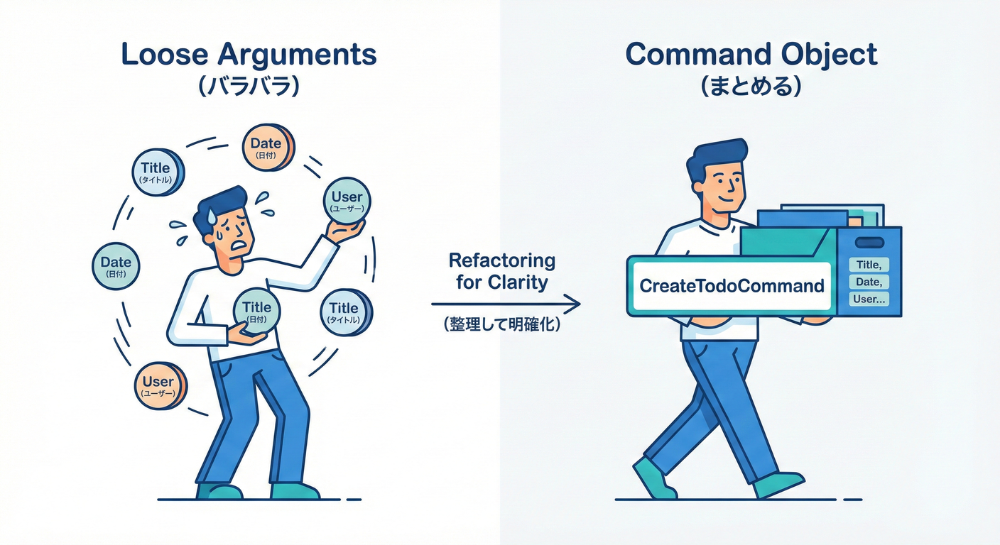
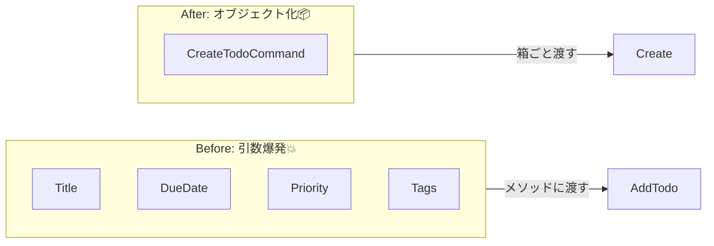
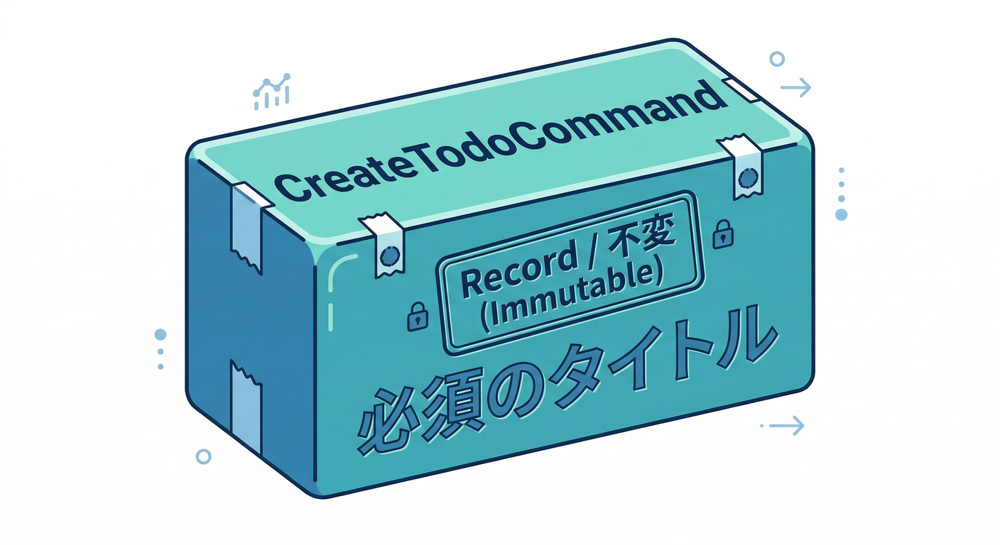
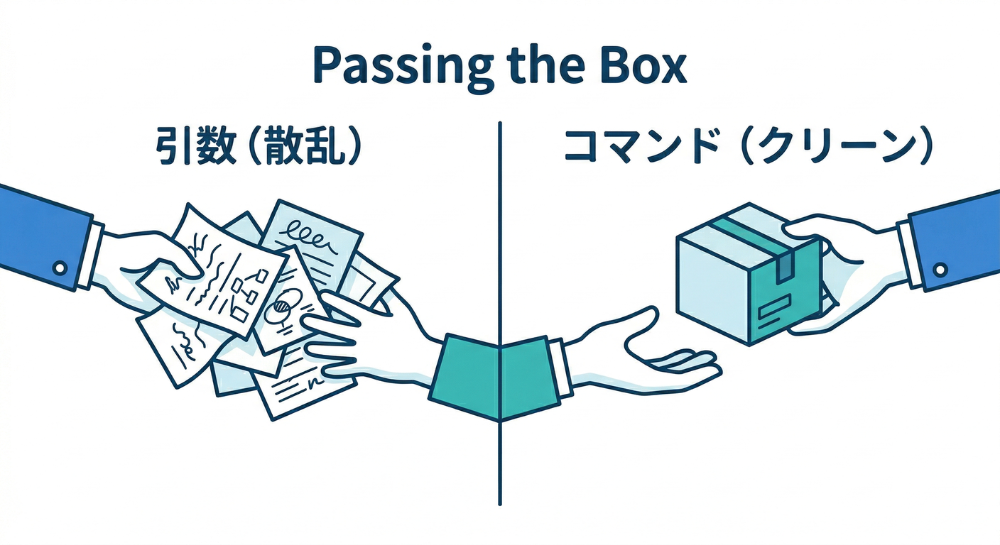
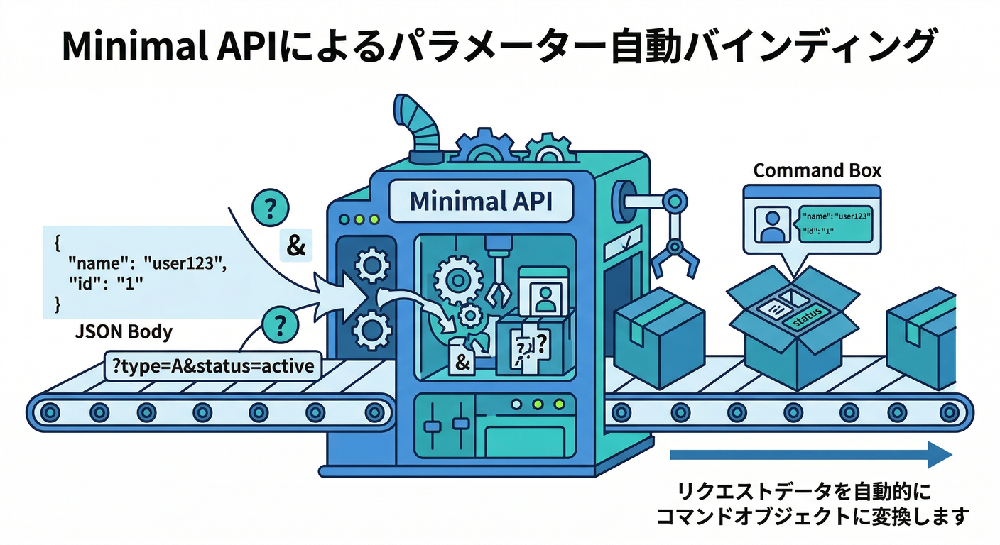
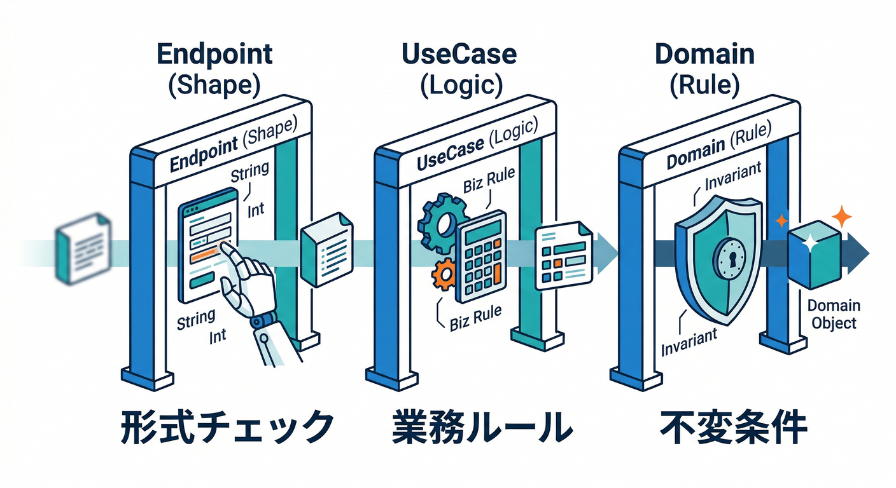
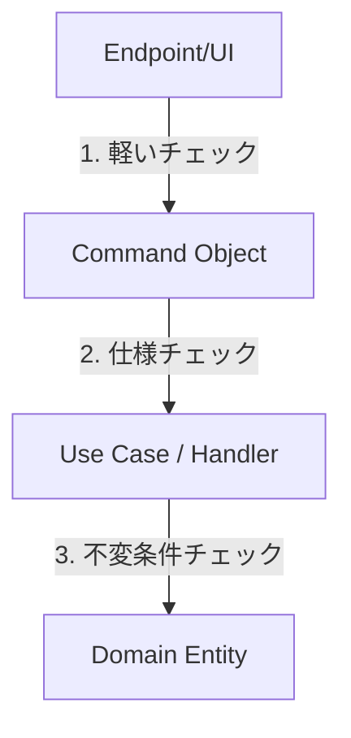
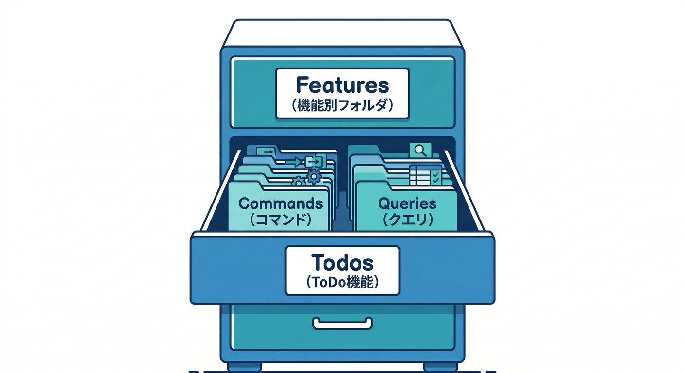

# 第13章：実務っぽい形へ①（Command/Queryオブジェクト化）📦🚚

この章はね、「引数が増えてきてつらい〜😵‍💫」を**Command/Queryを“ひとつの箱📦”にまとめる**ことで解決しちゃう回だよ〜！✨
（いまの主流は .NET 10 + C# 14 あたりだよ〜🧡） ([Microsoft Learn][1])

---

## 1) この章のゴール🎯✨

できるようになったら勝ち〜！🏆💕

* ✅ `CreateTodoCommand` / `GetTodosQuery` みたいな「1機能＝1オブジェクト」を作れる
* ✅ 「引数爆発💥」を回避できる
* ✅ バリデーション（入力チェック）を“置く場所”の感覚がつかめる
* ✅ 命名＆フォルダ構成で迷わなくなる🗂️
* ✅ 次章（Handler化）に自然につながる🚀

---

## 2) なぜ “オブジェクト化” が効くの？🤔💡

### 2-1. 引数が増えると起こる悲劇😇💥


たとえば追加がこうなると…

* `AddTodo(title, dueDate, priority, tags, memo, createdBy, ...)`
* 途中から「どれがどれ？😵」
* 呼び出し側で「順番ミス」や「null地獄」
* 将来パラメータ追加で全部壊れがち🪓

### 2-2. “箱📦”にすると一気にラクになる✨



* 呼び出しが読みやすい👀✨（プロパティ名が説明になる）
* 追加項目が増えても破壊が少ない🧱
* その箱に “最低限のルール” を入れられる（簡単バリデーション）🧷
* ログやテストで「入力が何だったか」を扱いやすい🧪




---

## 3) Command/Queryオブジェクトの基本ルール📌✨


ここは超大事〜！🫶

* 🛠️ **Command**：何かを変更する（作る/更新/削除/確定…）

  * 例：`CreateTodoCommand`, `CompleteTodoCommand`
* 🔍 **Query**：見るだけ（取得/検索/一覧…）

  * 例：`GetTodosQuery`, `GetTodoByIdQuery`

そして命名はコレが最強🧡

* Command：`動詞 + 対象`（Create/Update/Delete/Complete + Todo）
* Query：`Get/List/Search + 対象`

---

## 4) まずは作ってみよう！C#での書き方✍️✨

### 4-1. いちばん実務寄り：`record` で“入力DTO”を作る📦



Command/Queryは「運ぶもの」なので、**record**が相性いいよ〜😊
（イミュータブル寄りで事故りにくい🧊）

```csharp
public sealed record CreateTodoCommand
{
    public required string Title { get; init; }
    public DateOnly? DueDate { get; init; }
    public int? Priority { get; init; }     // 例: 1〜5
    public string[] Tags { get; init; } = [];
    public string? Memo { get; init; }
}
```

Queryも同じ感じでOK〜🔍✨

```csharp
public sealed record GetTodosQuery
{
    public string? Search { get; init; }
    public bool IncludeCompleted { get; init; } = false;
    public int? Limit { get; init; } = 50;
}
```

> ポイント💡
>
> * `required` で「必須」を表現できる（入れ忘れ事故が減る）✅
> * 配列は `= []` で空にしておくと null が消える🧹✨

---

## 5) どう呼び出す？（ConsoleでもMinimal APIでも同じ発想）🧠✨

### 5-1. “引数じゃなくて箱📦を渡す”に変える



Before（つらい）😵‍💫
`AddTodo(title, dueDate, priority, tags, memo)`

After（読みやすい）😍

```csharp
var cmd = new CreateTodoCommand
{
    Title = "レポート提出",
    DueDate = DateOnly.FromDateTime(DateTime.Today.AddDays(3)),
    Priority = 4,
    Tags = ["school", "urgent"],
    Memo = "参考文献も忘れずに"
};

await todoCommands.Create(cmd);
```

Commands側のメソッドもこうするよ〜🛠️

```csharp
public sealed class TodoCommands
{
    public async Task Create(CreateTodoCommand command)
    {
        // 次の章で “Handler化” して、ここが薄くなるイメージだよ〜✨
        // ここではまず「箱で受け取る」だけでOK👌
        await Task.CompletedTask;
    }
}
```

---

## 6) Minimal APIだともっと気持ちいい😍（自動で箱に詰めてくれる📦）



POST（Command）は **Body(JSON)** から “箱📦” に入れてくれるよ〜✨
Minimal APIのパラメータバインドがそれをやってくれる感じ！ ([Microsoft Learn][2])

```csharp
app.MapPost("/todos", async (CreateTodoCommand cmd, TodoCommands commands) =>
{
    await commands.Create(cmd);
    return Results.Ok();
});
```

GET（Query）は、クエリ文字列から “箱📦” に詰めたいよね？
.NETのMinimal APIは複合型のバインドもできるし、まとめ方も用意されてるよ〜🔍✨ ([Microsoft Learn][3])

```csharp
using Microsoft.AspNetCore.Http.HttpResults;

app.MapGet("/todos", async ([AsParameters] GetTodosQuery query, TodoQueries queries) =>
{
    var list = await queries.GetList(query);
    return Results.Ok(list);
});
```

---

## 7) “バリデーションどこに置く問題” を初心者向けにスッキリ整理🧷✨

ここ、悩みがち〜！でも最初はこう覚えよ😊

### 7-1. 3つの置き場所（ざっくり）🧠



1. **入口（Endpoint/Controller）**：型の形・必須・簡単な範囲チェック
2. **ユースケース層（Commands/Handlers）**：ビジネス的にダメ（例：期限が過去は不可）
3. **ドメイン（Entity等）**：絶対守る不変条件（例：Titleは空にしない）

### 7-2. この教材の“落とし所”✅（最初はこれでOK）

* ドメイン：**最後の砦**（空文字禁止とか）




例：Commandに「超軽い自己チェック」を付ける（やりすぎないのがコツ🧡）

```csharp
public sealed record CreateTodoCommand
{
    public required string Title { get; init; }
    public DateOnly? DueDate { get; init; }

    public string[] Validate()
    {
        var errors = new List<string>();

        if (string.IsNullOrWhiteSpace(Title))
            errors.Add("Title is required.");

        if (DueDate is not null && DueDate < DateOnly.FromDateTime(DateTime.Today))
            errors.Add("DueDate must be today or later.");

        return errors.ToArray();
    }
}
```

入口でこう使う感じ〜✨

```csharp
app.MapPost("/todos", async (CreateTodoCommand cmd, TodoCommands commands) =>
{
    var errors = cmd.Validate();
    if (errors.Length > 0) return Results.BadRequest(new { errors });

    await commands.Create(cmd);
    return Results.Ok();
});
```

> ここで大事なのは…
> **「バリデーションは“全部ここ！”じゃなくて、役割で分ける」**だよ〜🫶✨

---

## 8) 命名＆フォルダ構成（迷子にならない地図🗺️）🗂️✨



“機能単位”で固めるのが実務で強いよ〜💪

* `Features/Todos/Commands/CreateTodo/`

  * `CreateTodoCommand.cs`
* `Features/Todos/Queries/GetTodos/`

  * `GetTodosQuery.cs`

または小さめプロジェクトなら、まずはこうでもOK😊

* `Todos/Commands/`
* `Todos/Queries/`

> コツ💡
> **「探す場所が一発で分かる」**のが正義✨
> 後でHandler化したとき、同じフォルダに `CreateTodoHandler.cs` を置けて超気持ちいいよ〜🥰

---

## 9) ミニ演習📝🍰（手を動かすと一気に理解できる！）

### 演習A：引数爆発のメソッドを“箱📦化”してみよ✨

1. いまある `AddTodo(title, dueDate, priority, tags, memo)` を探す👀
2. `CreateTodoCommand` を作る
3. メソッドを `Create(CreateTodoCommand cmd)` に変更
4. 呼び出し側を全部修正（ここで気持ちよさを味わう😆）

### 演習B：Queryも同様に箱化🔍

1. `GetTodos(search, includeCompleted, limit)` を
2. `GetTodosQuery` に置き換える
3. テストで「limit省略時は50」みたいな仕様を1個だけ固定✅

---

## 10) AI拡張（Copilot/Codex）に頼むときの“勝ちテンプレ”🤖✨

### 10-1. 生成用プロンプト（そのまま使ってOK）🪄

* 「このメソッドの引数を `CreateTodoCommand` にまとめて。`record` で、必須は `required` にして。null回避で配列は空配列初期化して。」

### 10-2. レビュー用プロンプト（事故防止🧷）

* 「このCommand/Queryオブジェクト化で、**CQS違反（Queryが副作用）**になってない？
  それと、**必須/任意**の区別が適切か見て！」

---

## 11) この章のチェックリスト✅✨（ここまでできた？）

* ✅ Command/Queryを「1機能＝1箱📦」で表現できた
* ✅ 引数が減って読みやすくなった😍
* ✅ 必須/任意が `required` や初期値で表現できた
* ✅ バリデーションを“入口/ユースケース/ドメイン”の感覚で分けられた

---

## 12) 次章へのつながり👣✨

次はいよいよ **Handler化**だよ〜！👩‍🍳📨
この章で作った `CreateTodoCommand` / `GetTodosQuery` を、**Handlerが受け取って実行する**形にすると…

* Endpointがもっと薄くなる🧼✨
* 「1機能＝1ファイル」がハッキリして強い🧱
* 依存関係の向き（Dependency Rule）にも自然に入れる🧭

Visual Studio側も、最近のリリースはAI統合がより深くなってるので、この進め方と相性いいよ〜🤖🧡 ([Microsoft Learn][4])

[1]: https://learn.microsoft.com/en-us/dotnet/core/whats-new/dotnet-10/overview?utm_source=chatgpt.com "What's new in .NET 10"
[2]: https://learn.microsoft.com/en-us/aspnet/core/fundamentals/minimal-apis/parameter-binding?view=aspnetcore-10.0&utm_source=chatgpt.com "Parameter binding in Minimal API applications"
[3]: https://learn.microsoft.com/en-us/aspnet/core/fundamentals/minimal-apis?view=aspnetcore-10.0&utm_source=chatgpt.com "Minimal APIs quick reference"
[4]: https://learn.microsoft.com/en-us/visualstudio/releases/2026/release-notes?utm_source=chatgpt.com "Visual Studio 2026 Release Notes"
