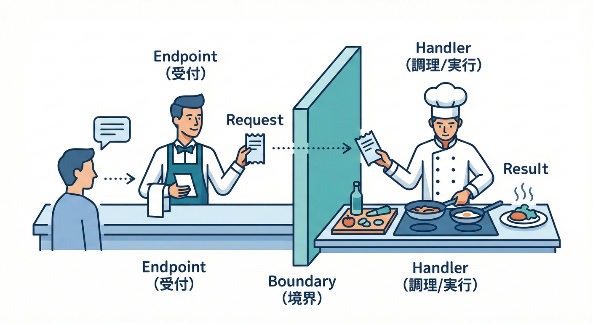
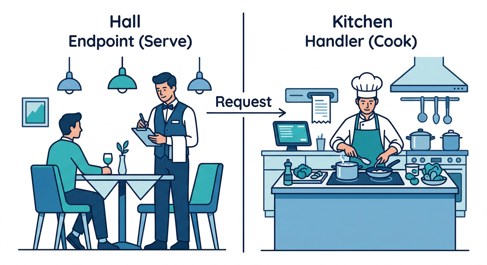
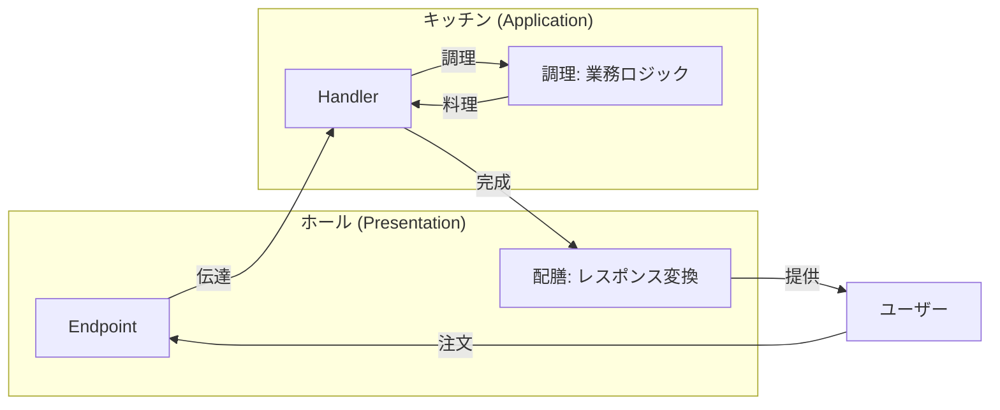
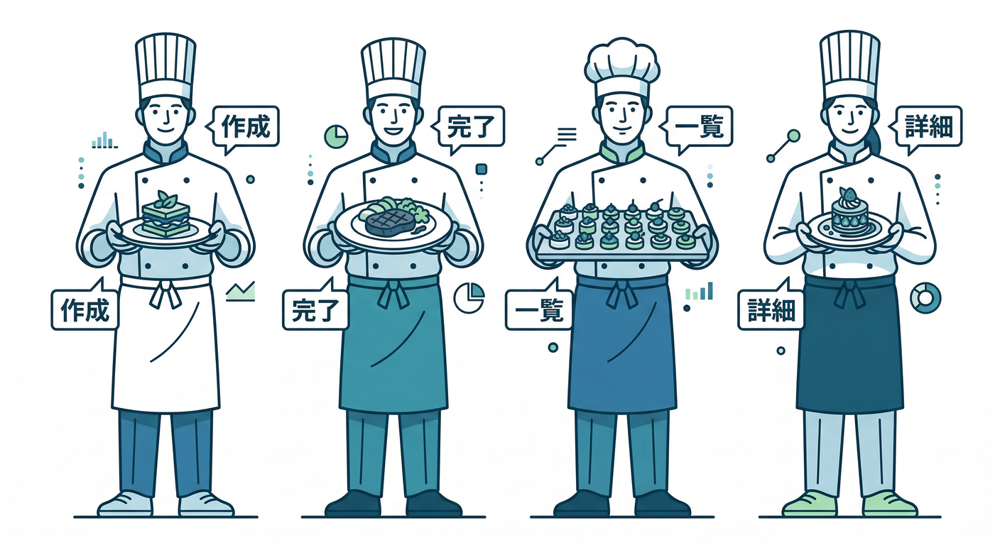
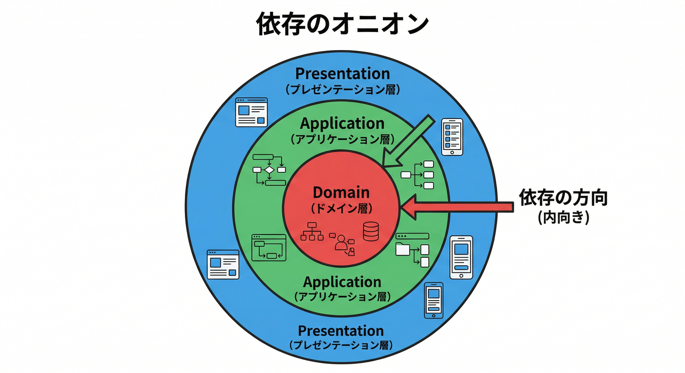
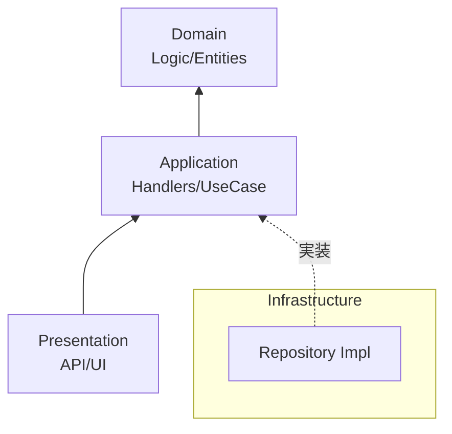
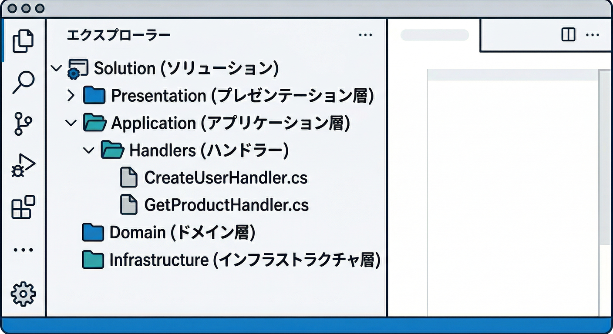
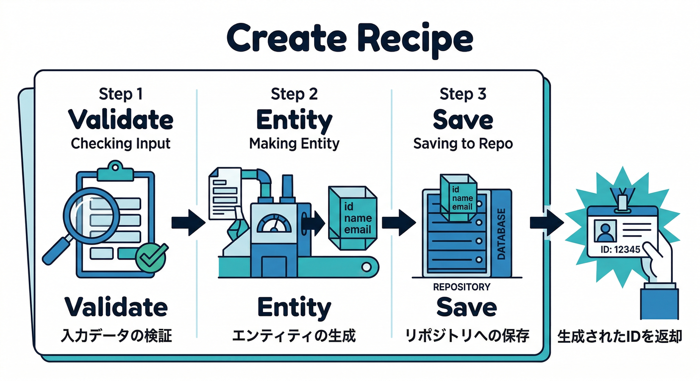
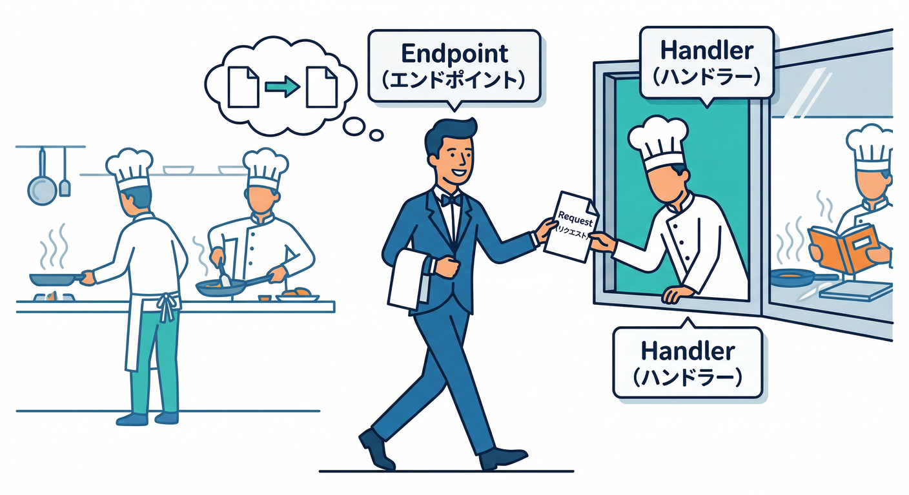
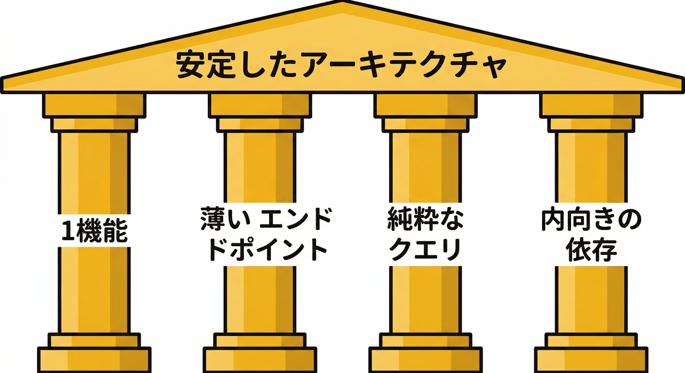

# 第14章：実務っぽい形へ②（Handler化で責務を固定）👩‍🍳📨

〜「Endpoint/Controllerは薄く！」「1機能＝1ハンドラ！」で、崩れないCQSへ〜

---

## 0. この章でできるようになること🎯💗

* 「**Controller / Minimal API の中でやる仕事**」をスッキリ最小化できる🧼✨
* 「**1つの機能＝1つのHandler**」で、責務（やること）がブレなくなる🎯
* 規模が大きくなっても、CQSが混ざりにくい構造にできる🧱
* 「依存の向き（Dependency Ruleの入口）」を、ふわっと体感できる🧭✨

ちなみに今の最新版は **.NET 10（LTS）**・**C# 14** だよ〜！🆕✨（2025/11にリリース） ([Microsoft][1])
Visual Studio 2026 で .NET 10 SDK が入る流れも案内されてるよ🛠️✨ ([Microsoft Learn][2])

---

## 1. なんでHandler化するの？🤔💭




第13章で「Command/Queryオブジェクト化」したら、引数地獄は減ったよね👍✨
でも実務で増えてくるのがコレ👇😇💥

* Endpoint/Controllerが育って**巨大化**する（バリデーション、権限、ログ、DB、変換…全部入り）🍱
* 「どこに何が書いてあるか分からない」→ 修正が怖い😱
* CQSが**いつの間にか混ざる**（Query内で更新、Command内で参照しすぎ）🌀

そこで登場するのが **Handler**！👩‍🍳✨
**「料理（業務処理）はキッチン（Handler）でやる」**
**「配膳（HTTPの受け渡し）はホール（Endpoint/Controller）でやる」**
…みたいに、役割を固定できるのが強いんだよね🍽️💗




---

## 2. Handlerの役割を1行で言うと？✍️✨



**「1つのユースケース（機能）を、最後まで責任持って実行する人」**👩‍🍳🎯

例：ToDoならこんな感じ👇

* ✅ CreateTodoHandler（作成）
* ✅ CompleteTodoHandler（完了）
* 🔍 GetTodosHandler（一覧取得）
* 🔍 GetTodoByIdHandler（詳細取得）

この「**1機能＝1ハンドラ**」が、設計を崩れにくくするコツだよ🧱✨

---

## 3. Endpoint/Controllerは“薄く”する🧼✨

## ✅ Endpoint/Controller側の仕事（ここだけ！）

* 受け取る（DTOにバインド）📥
* ルーティング（URLとメソッド）🛣️
* 認可・認証（必要なら）🔐
* Handler呼ぶ📞
* 結果をHTTPレスポンスにする📤

## ✅ Handler側の仕事（料理担当🍳）

* 入力チェック（業務ルール）📏
* Repository呼ぶ（保存/取得）🗄️
* 外部サービス（メール等）📨
* 「成功/失敗」を整形して返す🎁

---

## 4. 依存の向き（Dependency Rule）の“入口”🧭✨



超ざっくり図でいくね👇（矢印が依存の向きだよ〜）

**外側**（変わりやすい）

* Presentation（API / Controller / Endpoint）
  ↓
* Application（Handlers / UseCase）
  ↓
* Domain（Entity / ValueObject / ルール）
  **内側**（守りたい）

ポイントはこれ👇💡

* DBは「インターフェース（Repository）」越しに触るのが基本🧤✨




---

## 5. ミニ実装：ToDoをHandler化してみよう📝🍰

ここでは **Minimal API** を例にするね！（Controller版の形も最後に出すよ👍）
そして、今の .NET 10 だと Minimal API の **バリデーションサポート**も入ってて、Endpointをさらに薄くしやすいよ✨ ([Microsoft Learn][3])

---

## 5-1. フォルダ構成例🗂️✨（迷ったらこれ）



* `Presentation/`（Program.cs, Endpoints）
* `Application/`

  * `Commands/` `Queries/`（第13章のDTOたち）
  * `Handlers/`（今回の主役👑）
  * `Abstractions/`（Repositoryなどのインターフェース）
* `Domain/`（Todoなどのドメイン）
* `Infrastructure/`（Repository実装・DBなど）

「RepositoryのinterfaceはApplication側」「実装はInfrastructure側」って分けると、依存の向きが守りやすいよ🧭✨

---

## 5-2. Domain：ToDo（めちゃシンプル版）🧩

```csharp
namespace Domain;

public sealed class Todo
{
    public Guid Id { get; }
    public string Title { get; private set; }
    public bool IsCompleted { get; private set; }
    public DateTimeOffset CreatedAt { get; }

    public Todo(Guid id, string title, DateTimeOffset createdAt)
    {
        if (string.IsNullOrWhiteSpace(title)) throw new ArgumentException("Title is required.");
        Id = id;
        Title = title.Trim();
        CreatedAt = createdAt;
    }

    public void Complete()
    {
        IsCompleted = true;
    }
}
```

---

## 5-3. Application：Repositoryのinterface（依存の向きの要✨）

```csharp
using Domain;

namespace Application.Abstractions;

public interface ITodoRepository
{
    Task AddAsync(Todo todo, CancellationToken ct);
    Task<Todo?> FindByIdAsync(Guid id, CancellationToken ct);
    Task<IReadOnlyList<Todo>> ListAsync(CancellationToken ct);
    Task SaveChangesAsync(CancellationToken ct);
}
```

---

## 5-4. Application：Command/Query DTO（第13章の復習）📦

```csharp
namespace Application.Commands;

public sealed record CreateTodoCommand(string Title);

public sealed record CompleteTodoCommand(Guid Id);

namespace Application.Queries;

public sealed record GetTodosQuery();

public sealed record GetTodoByIdQuery(Guid Id);
```

---

## 5-5. Application：Result（超ミニ）🎁

「Commandは基本“変更”だから、成功/失敗をResultで返す」ってやると扱いやすいよ✨

```csharp
namespace Application;

public sealed record Error(string Code, string Message);

public sealed class Result
{
    public bool IsSuccess { get; }
    public Error? Error { get; }

    private Result(bool isSuccess, Error? error)
        => (IsSuccess, Error) = (isSuccess, error);

    public static Result Ok() => new(true, null);
    public static Result Fail(string code, string message) => new(false, new Error(code, message));
}

public sealed class Result<T>
{
    public bool IsSuccess { get; }
    public T? Value { get; }
    public Error? Error { get; }

    private Result(bool isSuccess, T? value, Error? error)
        => (IsSuccess, Value, Error) = (isSuccess, value, error);

    public static Result<T> Ok(T value) => new(true, value, null);
    public static Result<T> Fail(string code, string message) => new(false, default, new Error(code, message));
}
```

---

## 6. いよいよ主役：Handlerを作る👩‍🍳🔥

## 6-1. Command Handler：Create（作成）✅



```csharp
using Application.Abstractions;
using Domain;

namespace Application.Handlers;

public sealed class CreateTodoHandler
{
    private readonly ITodoRepository _repo;
    private readonly IClock _clock;

    public CreateTodoHandler(ITodoRepository repo, IClock clock)
        => (_repo, _clock) = (repo, clock);

    public async Task<Result<Guid>> HandleAsync(Commands.CreateTodoCommand command, CancellationToken ct)
    {
        // 業務ルールの入力チェック（Endpointから追い出す！）✨
        if (string.IsNullOrWhiteSpace(command.Title))
            return Result<Guid>.Fail("validation.title_required", "タイトルを入力してね😊");

        var todo = new Todo(Guid.NewGuid(), command.Title, _clock.Now);

        await _repo.AddAsync(todo, ct);
        await _repo.SaveChangesAsync(ct);

        return Result<Guid>.Ok(todo.Id);
    }
}
```

Clockもinterfaceにしちゃうと、テストで時刻固定できて便利だよ🕰️✨

```csharp
namespace Application.Abstractions;

public interface IClock
{
    DateTimeOffset Now { get; }
}
```

---

## 6-2. Command Handler：Complete（完了）✅

```csharp
using Application.Abstractions;

namespace Application.Handlers;

public sealed class CompleteTodoHandler
{
    private readonly ITodoRepository _repo;

    public CompleteTodoHandler(ITodoRepository repo) => _repo = repo;

    public async Task<Result> HandleAsync(Commands.CompleteTodoCommand command, CancellationToken ct)
    {
        var todo = await _repo.FindByIdAsync(command.Id, ct);
        if (todo is null)
            return Result.Fail("todo.not_found", "そのToDo、見つからなかったよ🥲");

        todo.Complete();

        await _repo.SaveChangesAsync(ct);
        return Result.Ok();
    }
}
```

---

## 6-3. Query Handler：List（一覧）🔍

Queryは「参照」だから、戻り値は普通にDTO返してOK👌✨

```csharp
using Application.Abstractions;

namespace Application.Handlers;

public sealed record TodoDto(Guid Id, string Title, bool IsCompleted, DateTimeOffset CreatedAt);

public sealed class GetTodosHandler
{
    private readonly ITodoRepository _repo;

    public GetTodosHandler(ITodoRepository repo) => _repo = repo;

    public async Task<IReadOnlyList<TodoDto>> HandleAsync(Queries.GetTodosQuery query, CancellationToken ct)
    {
        var list = await _repo.ListAsync(ct);

        // Queryは変換して返すだけ（副作用ナシ）✨
        return list
            .OrderByDescending(x => x.CreatedAt)
            .Select(x => new TodoDto(x.Id, x.Title, x.IsCompleted, x.CreatedAt))
            .ToList();
    }
}
```

---

## 7. Presentation：Endpointは“呼ぶだけ”にする📞🧼✨



```csharp
using Application.Commands;
using Application.Handlers;
using Microsoft.AspNetCore.Mvc;

var builder = WebApplication.CreateBuilder(args);

// DI（依存注入）登録
builder.Services.AddSingleton<CreateTodoHandler>();
builder.Services.AddSingleton<CompleteTodoHandler>();
builder.Services.AddSingleton<GetTodosHandler>();

// ここではInfrastructureは後で差し替えできるようにしておく想定（例：InMemoryなど）

var app = builder.Build();

app.MapPost("/todos", async (
    [FromBody] CreateTodoCommand command,
    CreateTodoHandler handler,
    CancellationToken ct) =>
{
    var result = await handler.HandleAsync(command, ct);

    return result.IsSuccess
        ? Results.Created($"/todos/{result.Value}", new { id = result.Value })
        : Results.BadRequest(result.Error);
});

app.MapPost("/todos/{id:guid}/complete", async (
    Guid id,
    CompleteTodoHandler handler,
    CancellationToken ct) =>
{
    var result = await handler.HandleAsync(new CompleteTodoCommand(id), ct);

    return result.IsSuccess
        ? Results.NoContent()
        : Results.NotFound(result.Error);
});

app.MapGet("/todos", async (
    GetTodosHandler handler,
    CancellationToken ct) =>
{
    var list = await handler.HandleAsync(new Application.Queries.GetTodosQuery(), ct);
    return Results.Ok(list);
});

app.Run();
```

見て〜！Endpointが「薄い」！🧼✨

* 受け取る
* handler呼ぶ
* HTTP結果に変換
  これだけ🥳🎉

---

## 8. Controller版でやるとどうなる？🎮（形だけサクッと）

Controllerでも考え方は同じだよ〜！

```csharp
[ApiController]
[Route("todos")]
public sealed class TodosController : ControllerBase
{
    [HttpPost]
    public async Task<IActionResult> Create(
        [FromBody] CreateTodoCommand command,
        [FromServices] CreateTodoHandler handler,
        CancellationToken ct)
    {
        var result = await handler.HandleAsync(command, ct);
        return result.IsSuccess
            ? Created($"/todos/{result.Value}", new { id = result.Value })
            : BadRequest(result.Error);
    }
}
```

---

## 9. ここが“実務で崩れない”ポイント集🧱✨



## ✅ ルール1：Handlerは「1機能だけ」🎯

* Createで「一覧取得」までやり始めたら黄色信号🚥😇
* 「それ別ハンドラにしよ？」が合言葉💗

## ✅ ルール2：Endpoint/Controllerに業務判断を書かない🧼

* 「タイトル空なら〜」みたいな業務チェックはHandlerへ📦✨

## ✅ ルール3：Queryは“更新しない”🔍🚫

* ログはOKでも、DB更新や状態変更は混ぜないのが基本🙅‍♀️
* どうしても必要なら「例外として明示」する（第6章の復習）📝

## ✅ ルール4：Repository interfaceは内側、実装は外側🧭

* 依存の向きが自然に整う✨

---

## 10. ミニ演習🧩🎀（手を動かすと一気に定着！）

## 演習A：GetTodoByIdHandlerを追加してみてね🔍

* `GetTodoByIdQuery(Guid Id)`
* `GetTodoByIdHandler`
* `GET /todos/{id}` を追加

## 演習B：Handlerが太り始めたら分割✂️

CreateTodoHandlerに「禁止ワードチェック」を足すとして…

* それはHandler内のprivateメソッド？
* それとも `IForbiddenWordChecker` に切り出す？🤔✨

---

## 11. AI活用（Copilot / Codex）🤖💞：事故りにくい使い方テンプレ

## ✅ 雛形生成プロンプト（貼ってOK）

```text
C#/.NET 10 の Minimal API で、CQSのHandlerパターンを使います。
CreateTodoHandler / CompleteTodoHandler / GetTodosHandler を作りたいです。
- Endpointは薄く（受け取り→Handler呼び出し→HTTP変換だけ）
- Commandは Result / Result<T> で成功/失敗を返す
- Queryは DTO を返す（副作用なし）
- Repositoryは interface を Application に置く
必要なコード一式を、フォルダ構成案つきで出してください。
また「責務が混ざってないか」のレビュー観点も付けてください。
```

## ✅ レビュー質問テンプレ（AIに“監査”させる🕵️‍♀️✨）

* 「Endpointに業務判断が残ってない？」
* 「Queryが更新してない？」
* 「Handlerが2つ以上の責務をやってない？」
* 「Repository実装にApplicationが依存してない？」

---

## 12. よくある詰まりポイント🧱🥲（先回り）

* **「Handler増えすぎ？」** → 正常です😂✨（機能ごとに増えるのが正解）
* **「どこまでHandlerで、どこからDomain？」** → まずはHandlerでOK👌（慣れたらDomainに寄せる）
* **「DTO変換どこでやる？」** → Query HandlerでOK（Controllerに置かない）🎯

---

## 13. まとめ🎉✨

Handler化すると…

* Endpoint/Controllerが薄くなる🧼
* 1機能＝1ハンドラで責務が固定される🎯
* CQSが混ざりにくくなる🧱
* 依存の向き（内側へ）を守りやすい🧭✨

次の第15章は、いよいよ「AI活用＋総合演習（卒業制作🎓🎉）」！
この章のHandler構造が、そのまま強い土台になるよ〜💗😊

[1]: https://dotnet.microsoft.com/ja-jp/platform/support/policy/dotnet-core?utm_source=chatgpt.com ".NET および .NET Core の公式サポート ポリシー"
[2]: https://learn.microsoft.com/en-us/dotnet/csharp/whats-new/csharp-14?utm_source=chatgpt.com "What's new in C# 14"
[3]: https://learn.microsoft.com/en-us/aspnet/core/fundamentals/minimal-apis?view=aspnetcore-10.0&utm_source=chatgpt.com "Minimal APIs quick reference"
