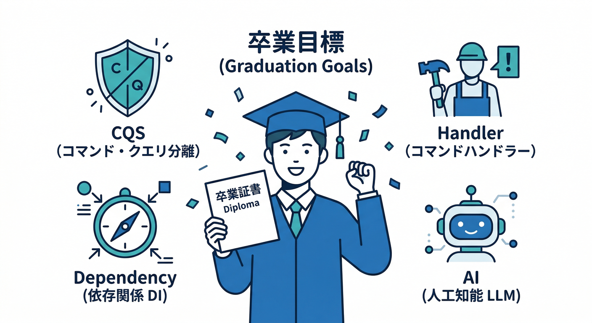
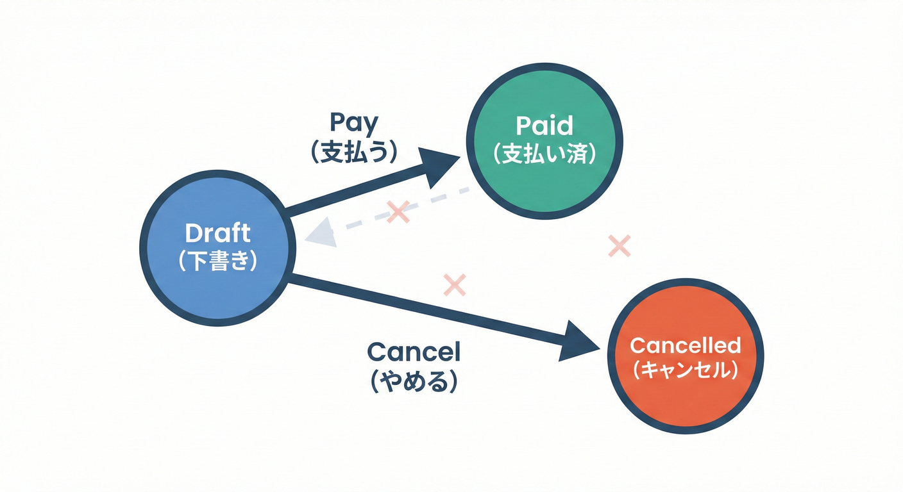
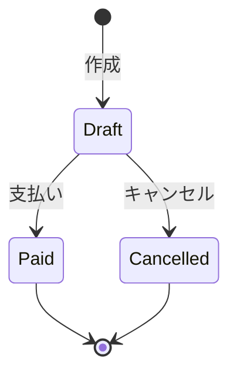
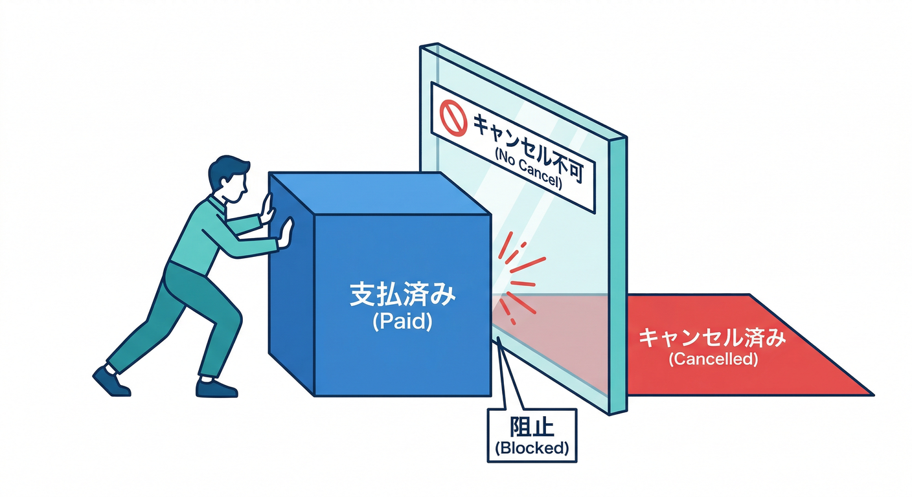
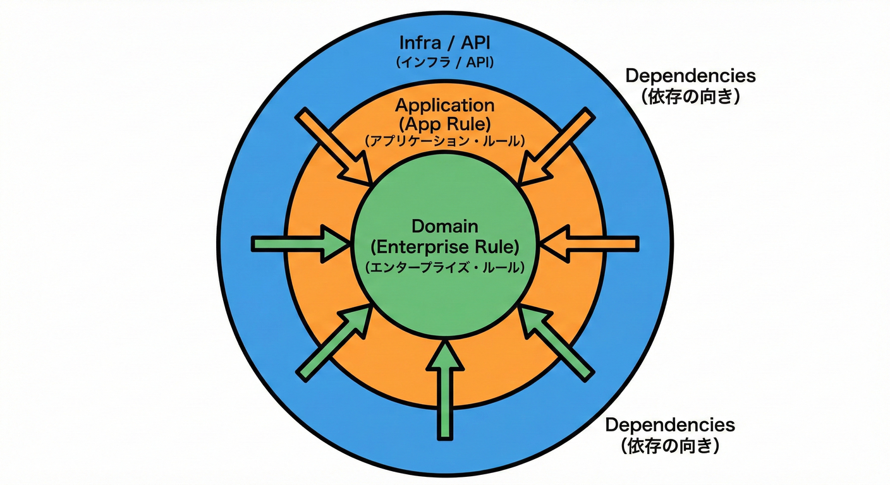
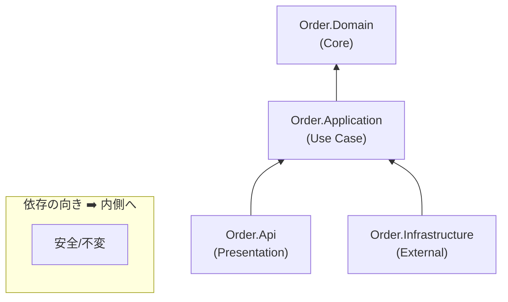
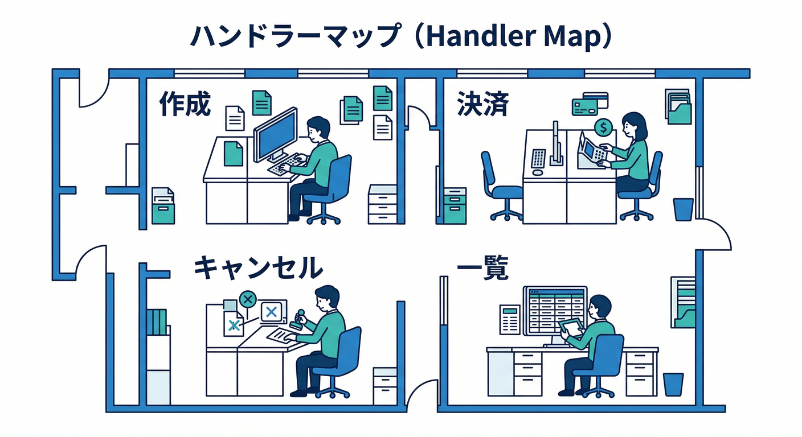
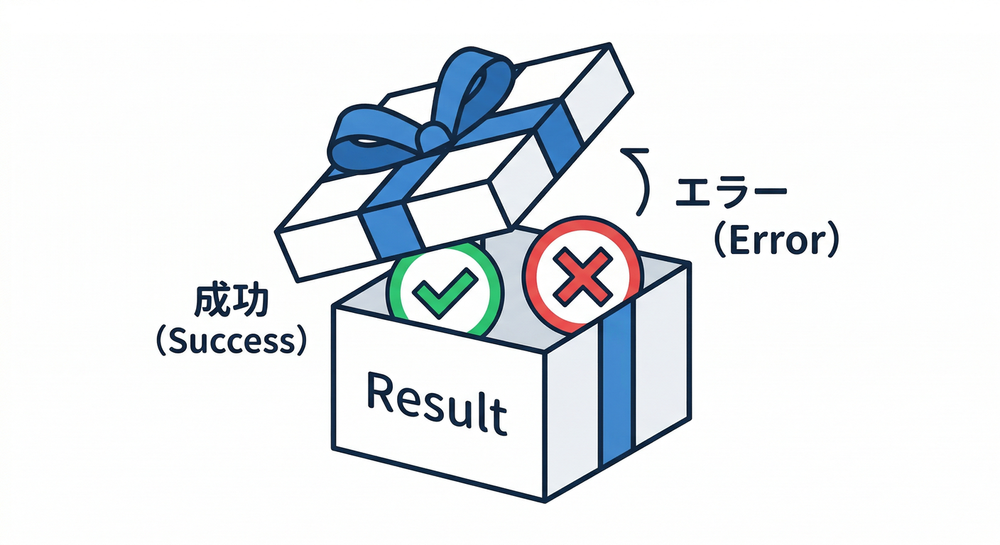
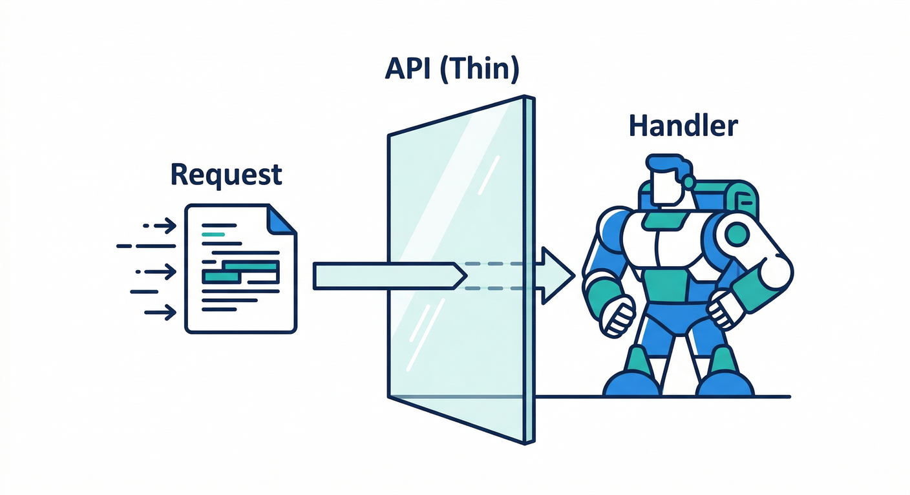
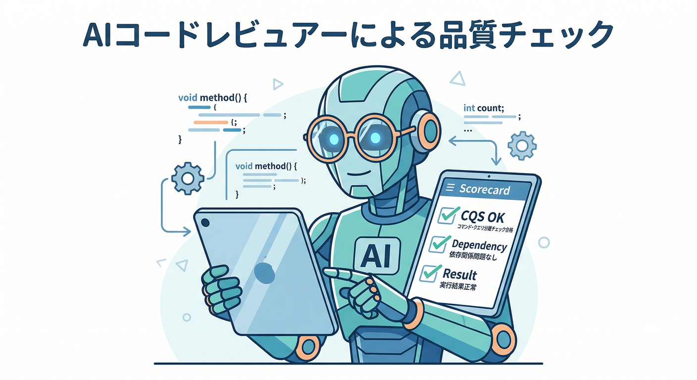

# 第15章：AI活用＋総合演習（卒業制作🎓🎉）

この章は「ここまでのCQSをぜんぶ使って、最後に“実務っぽい形”で1本完成させる」回だよ〜！😊✨
（今どきのC#は **.NET 10 + C# 14** が軸だよ🆕　Visual Studio 2026 には .NET 10 SDK が入ってるよ💡 ([Microsoft Learn][1])）

---

## 0) この章のゴール🎯💖



* **Command と Query を絶対に混ぜない**（“分ける癖”を体にしみ込ませる）🧠✨
* **Handler化**して「1機能＝1クラス」に固定する（大きくなっても崩れにくい）🏗️
* **依存関係ルール（Dependency Rule）**を“触って覚える”（内側を汚さない）🧭
* **AI（Copilot/Codex等）**で爆速に雛形を作りつつ、**事故らないレビュー習慣**を持つ🤖🧷

---

## 1) 卒業制作のお題：注文ミニ版（Order）💳📦

## 1-1. ざっくり仕様（小さくて実務っぽい）🧁






「注文（Order）」には状態があるよ〜👇

* Draft（作成直後）
* Paid（支払い済み）
* Cancelled（キャンセル）

そして、機能はこれだけ！シンプル！✨

## Query（参照🔍）

* 注文一覧（List）
* 注文詳細（Get）

## Command（変更🔧）

* 注文作成（Create）
* 支払い（Pay）
* キャンセル（Cancel）

## 1-2. ルール（バグを防ぐ大事な縛り）🚧



* Paid になった注文は **キャンセルできない** 🙅‍♀️
* Cancelled になった注文は **支払いできない** 🙅‍♀️
* 注文作成は **明細が1件以上** 必要 🧾

---

## 2) 依存関係ルールを“最小で体験”する🧭✨






「内側（コア）が外側（UIやDB）を知らない」ってやつね😊

今回のおすすめ分割はこれ👇

* **Order.Domain**（内側の核🥚）
  エンティティ、状態、ビジネスルール、エラー定義
* **Order.Application**（使い方の核🍳）
  Command/Query、Handler、Repositoryのインターフェース
* **Order.Infrastructure**（外側🧰）
  InMemoryリポジトリ（今回はDBの代わり）
* **Order.Api**（いちばん外側🌐）
  Minimal APIのエンドポイント
* **Order.Tests**（テスト🧪）

依存の向きはこう！👇

**Api → Application → Domain**
**Infrastructure → Application → Domain**
（逆はナシ！Domainは誰にも依存しないのが気持ちいい💖）

---

## 3) CQSの“完成形”を先に見せるね👀✨

## 3-1. Command/QueryのDTO（入れ物）📦

* CreateOrderCommand：入力（itemsなど）

* PayOrderCommand：入力（orderIdなど）

* CancelOrderCommand：入力（orderIdなど）

* ListOrdersQuery：入力（status/limitなど）

* GetOrderDetailQuery：入力（orderId）

## 3-2. Handler（1機能＝1ハンドラ）👩‍🍳📨



* CreateOrderHandler
* PayOrderHandler
* CancelOrderHandler
* ListOrdersHandler
* GetOrderDetailHandler

ここまで行くと、Api側は「受け取って呼ぶだけ」になってめちゃスッキリするよ🧼✨

---

## 4) 実装（最短で完成させる手順）🚀✨

## Step A：Domain（ルールを守る中心）🥚

* OrderStatus（状態）
* Order（エンティティ）
* OrderLine（明細）
* エラー定義（NotFound / InvalidState / Validation など）

## 例：Domainのイメージ（短め）🧠

```csharp
namespace Order.Domain;

public enum OrderStatus { Draft, Paid, Cancelled }

public sealed class Order
{
    public Guid Id { get; }
    public OrderStatus Status { get; private set; } = OrderStatus.Draft;
    private readonly List<OrderLine> _lines = new();
    public IReadOnlyList<OrderLine> Lines => _lines;

    public Order(Guid id) => Id = id;

    public void AddLine(string sku, int qty)
    {
        if (Status != OrderStatus.Draft) throw new InvalidOperationException("Draft only");
        if (qty <= 0) throw new ArgumentOutOfRangeException(nameof(qty));
        _lines.Add(new OrderLine(sku, qty));
    }

    public void Pay()
    {
        if (Status == OrderStatus.Cancelled) throw new InvalidOperationException("Cancelled can't pay");
        if (Status == OrderStatus.Paid) return;
        Status = OrderStatus.Paid;
    }

    public void Cancel()
    {
        if (Status == OrderStatus.Paid) throw new InvalidOperationException("Paid can't cancel");
        if (Status == OrderStatus.Cancelled) return;
        Status = OrderStatus.Cancelled;
    }
}

public sealed record OrderLine(string Sku, int Qty);
```

> ここではわざと例外にしてるけど、Application層では Result に“翻訳”して返すよ🎁✨
> （Domainは「ルールが破られた！」を正直に叫ぶ役、みたいな感じ📣）

---

## Step B：Application（CQSの本体）🍳

## 1) Repositoryのインターフェースを置く🔌

```csharp
namespace Order.Application;

using Order.Domain;

public interface IOrderRepository
{
    Task<Order?> GetAsync(Guid id, CancellationToken ct);
    Task<List<Order>> ListAsync(OrderStatus? status, int limit, CancellationToken ct);
    Task SaveAsync(Order order, CancellationToken ct);
}
```

## 2) Result型（超ミニ）🎁



```csharp
namespace Order.Application;

public sealed record AppError(string Code, string Message);

public readonly struct Result
{
    public bool IsSuccess { get; }
    public AppError? Error { get; }
    private Result(bool ok, AppError? err) { IsSuccess = ok; Error = err; }
    public static Result Ok() => new(true, null);
    public static Result Fail(string code, string msg) => new(false, new(code, msg));
}

public readonly struct Result<T>
{
    public bool IsSuccess { get; }
    public T? Value { get; }
    public AppError? Error { get; }
    private Result(bool ok, T? v, AppError? e) { IsSuccess = ok; Value = v; Error = e; }
    public static Result<T> Ok(T v) => new(true, v, null);
    public static Result<T> Fail(string code, string msg) => new(false, default, new(code, msg));
}
```

## 3) Command Handler例：Pay（支払い）💳

```csharp
namespace Order.Application;

using Order.Domain;

public sealed record PayOrderCommand(Guid OrderId);

public sealed class PayOrderHandler
{
    private readonly IOrderRepository _repo;
    public PayOrderHandler(IOrderRepository repo) => _repo = repo;

    public async Task<Result> Handle(PayOrderCommand cmd, CancellationToken ct)
    {
        var order = await _repo.GetAsync(cmd.OrderId, ct);
        if (order is null) return Result.Fail("NotFound", "注文が見つかりません");

        try
        {
            order.Pay();
            await _repo.SaveAsync(order, ct);
            return Result.Ok();
        }
        catch (InvalidOperationException ex)
        {
            return Result.Fail("InvalidState", ex.Message);
        }
    }
}
```

## 4) Query Handler例：Detail（詳細）🔍

```csharp
namespace Order.Application;

using Order.Domain;

public sealed record GetOrderDetailQuery(Guid OrderId);

public sealed record OrderDetailDto(Guid Id, string Status, List<OrderLineDto> Lines);
public sealed record OrderLineDto(string Sku, int Qty);

public sealed class GetOrderDetailHandler
{
    private readonly IOrderRepository _repo;
    public GetOrderDetailHandler(IOrderRepository repo) => _repo = repo;

    public async Task<Result<OrderDetailDto>> Handle(GetOrderDetailQuery q, CancellationToken ct)
    {
        var order = await _repo.GetAsync(q.OrderId, ct);
        if (order is null) return Result<OrderDetailDto>.Fail("NotFound", "注文が見つかりません");

        var dto = new OrderDetailDto(
            order.Id,
            order.Status.ToString(),
            order.Lines.Select(x => new OrderLineDto(x.Sku, x.Qty)).ToList()
        );

        return Result<OrderDetailDto>.Ok(dto);
    }
}
```

✅ Query側は「読むだけ」。SaveAsyncとか絶対しない！👻🚫

---

## Step C：Infrastructure（今回はInMemoryでOK🧰）

```csharp
namespace Order.Infrastructure;

using System.Collections.Concurrent;
using Order.Application;
using Order.Domain;

public sealed class InMemoryOrderRepository : IOrderRepository
{
    private readonly ConcurrentDictionary<Guid, Order> _db = new();

    public Task<Order?> GetAsync(Guid id, CancellationToken ct)
        => Task.FromResult(_db.TryGetValue(id, out var o) ? o : null);

    public Task<List<Order>> ListAsync(OrderStatus? status, int limit, CancellationToken ct)
    {
        var q = _db.Values.AsEnumerable();
        if (status is not null) q = q.Where(x => x.Status == status);
        return Task.FromResult(q.Take(limit).ToList());
    }

    public Task SaveAsync(Order order, CancellationToken ct)
    {
        _db[order.Id] = order;
        return Task.CompletedTask;
    }
}
```

---

## Step D：Api（Minimal APIは“薄く”🌐🧼）



ポイントはこれだけ👇

* エンドポイントは「入力を受ける」
* Handler呼ぶ
* ResultをHTTPに変換する

```csharp
using Order.Application;
using Order.Infrastructure;

var builder = WebApplication.CreateBuilder(args);

builder.Services.AddSingleton<IOrderRepository, InMemoryOrderRepository>();
builder.Services.AddScoped<PayOrderHandler>();
builder.Services.AddScoped<GetOrderDetailHandler>();

var app = builder.Build();

app.MapPost("/orders/{id:guid}/pay", async (Guid id, PayOrderHandler h, CancellationToken ct) =>
{
    var r = await h.Handle(new PayOrderCommand(id), ct);
    if (r.IsSuccess) return Results.NoContent();
    return r.Error!.Code switch
    {
        "NotFound" => Results.NotFound(r.Error),
        "InvalidState" => Results.Conflict(r.Error),
        _ => Results.BadRequest(r.Error)
    };
});

app.MapGet("/orders/{id:guid}", async (Guid id, GetOrderDetailHandler h, CancellationToken ct) =>
{
    var r = await h.Handle(new GetOrderDetailQuery(id), ct);
    if (r.IsSuccess) return Results.Ok(r.Value);
    return r.Error!.Code switch
    {
        "NotFound" => Results.NotFound(r.Error),
        _ => Results.BadRequest(r.Error)
    };
});

app.Run();
```

---

## 5) テスト（卒業制作の“合格ライン”🧪🏆）

## 5-1. Queryテスト（入力→出力がそのまま）😍

* NotFoundになる？
* DTOの形はOK？
* status文字列が想定どおり？

## 5-2. Commandテスト（“何が変わったか”を見る）🎭

* Draft → Paid になる？
* Cancelledの注文にPayして失敗する？
* PaidにCancelして失敗する？

InMemoryリポジトリなら、モック無しでもぜんぜん行けるよ〜！😊✨

---

## 6) AI活用：雛形はAI、判断は人間🤖🧠✨

Copilotは VS と VS Code どっちでも強いけど、**チャットもVSで使える**よ🗣️✨ ([GitHub][2])
VS 2026 自体もAI統合を前面に出してる感じだよ〜🧠⚡ ([Microsoft Learn][3])

## 6-1. 雛形生成に使う“指示テンプレ”🤖🧾

（コピペしてAIに投げてOKなやつ✨）

```text
あなたはC# 14 / .NET 10で、CQS（Command Query Separation）を守る実装を作ります。
要件：
- Order: Draft/Paid/Cancelled
- Commands: Create/Pay/Cancel（Commandは状態変更、Queryは参照のみ）
- Queries: List/GetDetail（Queryは副作用なし）
- Handler化：1機能=1Handler
- Domain/Application/Infrastructure/Api に分割（依存は外→内のみ）
- Commandは Result / Result<T> を返す
- Minimal APIは薄く、Handlerを呼ぶだけ
まずはクラスとファイル構成だけ作って、各クラスの責務コメントを入れてください。
```

## 6-2. “事故らない”レビュー質問テンプレ🧷👀



AIに「正解を作らせる」より、**レビュー係にする**と強いよ💪✨

```text
次のコードをCQS観点でレビューして：
1) Queryに状態変更（保存、更新、キャッシュ更新、ログの副作用）が混ざってない？
2) Commandが値を返しすぎてない？（必要最小限？）
3) 依存関係ルール違反してない？（Domainが外側を参照してない？）
4) Resultのエラー分類（NotFound/Validation/InvalidState/System）がブレてない？
指摘は「理由」と「直し方」もセットで。
```

## 6-3. テスト案を出させるテンプレ🧪🤖

```text
Orderの状態遷移（Draft/Paid/Cancelled）に対して、
ユニットテスト観点を列挙して。Given-When-Then形式で10個。
その後、xUnitでテストコード雛形も出して（InMemory repo前提）。
```

---

## 7) 最終チェックリスト✅✨（これ全部OKなら卒業🎓）

* Queryが **状態変更してない**？（Save/Update/Publishしてない）👻🚫
* Commandが **値を返しすぎてない**？（必要ならID or Result）📦
* 失敗の扱いが **統一**されてる？（NotFound/InvalidState/Validation…）🧾
* Apiは **薄い**？（ロジックをHandlerに寄せてる）🧼
* テストが **書きやすい形**？（Handler単体でいける）🧪✨
* 依存の向きが **外→内だけ**？🧭

---

## 8) 次に進む道👣📚（CQRSはいつ触る？）


「書き込みが増えすぎて遅い」「読み取りが複雑で別最適にしたい」みたいに
**“読みと書きを別モデルにすると楽”** になってきたら、CQRSを触るタイミングだよ〜😊✨
（でも今は焦らなくてOK！まずCQSが自然にできるのが最強💖）

---

## おまけ：卒業制作をちょい実務寄りにする追加課題🍰✨

* 注文に合計金額（Total）を追加して、Queryで計算結果を返す💰
* Cancel理由を残す（Domainに持たせる or 履歴にする）📝
* “重複Pay”を冪等にする（2回押しても安全）🔁
* エラーコードを一覧（エラーカタログ）にする📚

---

必要なら、次は「CreateOrder（作成）」と「ListOrders（一覧）」も含めて、**この卒業制作を“完成品セット”として全部のコードを通しで組み立てる版**を出せるよ😊🎉

[1]: https://learn.microsoft.com/en-us/dotnet/csharp/whats-new/csharp-14?utm_source=chatgpt.com "What's new in C# 14"
[2]: https://github.com/features/copilot?utm_source=chatgpt.com "GitHub Copilot · Your AI pair programmer"
[3]: https://learn.microsoft.com/en-us/visualstudio/releases/2026/release-notes?utm_source=chatgpt.com "Visual Studio 2026 Release Notes"
