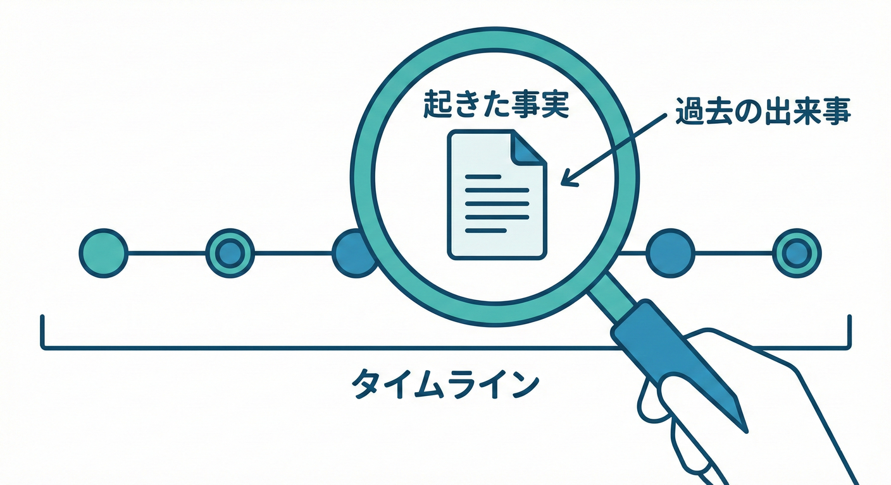
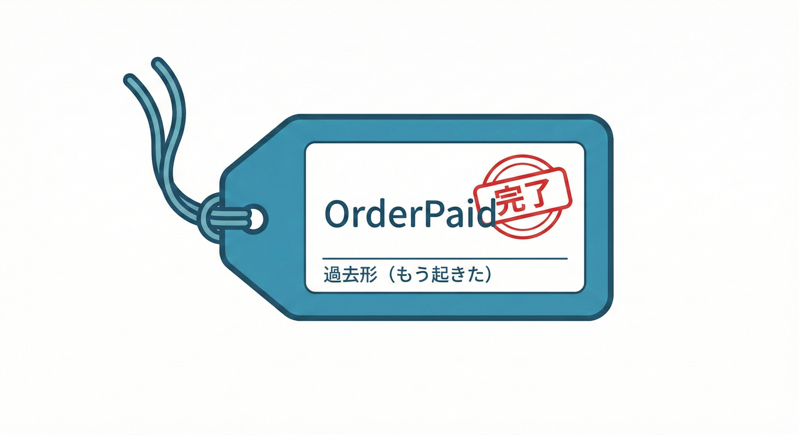

# 第1章 この教材でできるようになること🎓✨

## 1. この章のゴール🎯

この教材を最後までやると、こんなことができるようになります😊✨

* 「追加に強い」設計の考え方を、ドメインイベントで体感できる🧩
* “注文→支払い→発送”みたいな流れに、あとから機能を足しても壊れにくくできる🛒💳📦
* 「巨大メソッド化（なんでも1つのメソッドでやっちゃう😵‍💫）」を防ぐ、分け方のコツがわかる✂️✨
* イベントを **“命令”じゃなく “起きた事実”** として扱えるようになる🔔🕒

---

## 1.1 ドメインイベントってなに？🚀✨



ドメインイベントとは、ドメイン（ビジネスの領域）で**「起きた事実」**を、そのままイベントとして表したものです😊
* そして、その事実を「他の処理が知って反応できる」ようにする考え方🧠✨

たとえばミニECなら…

* ✅「支払いが完了した」→ *PaymentCompleted* / *OrderPaid*
* ✅「注文が確定した」→ *OrderPlaced*
* ✅「発送した」→ *OrderShipped*

ポイントは **“過去形（もう起きた）”** っぽい言い方になることです🕒
（イベントは「これからやれ！」じゃなく「起きたよ！」）([Microsoft Learn][1])

---

## 3. なぜドメインイベントを学ぶと「追加に強くなる」の？💪✨

### よくあるツラい例😱：「注文確定」メソッドが肥大化する

最初はこんな感じで書きがちです👇

* 注文を確定する✅
* 在庫を減らす📦
* 支払い処理を呼ぶ💳
* メールを送る📧
* ポイントを付与する🎁
* ログを書く🧾
* 外部連携APIを叩く🌍

こういうのが全部1メソッドに入ると、後から仕様が増えるたびに **同じ場所がどんどん太る** 🐘💦
結果…

* ちょっと直すだけで別の機能が壊れる😵
* テストがしんどい🧪
* 変更の影響範囲が読めない🌀

### ドメインイベントの発想🧠✨：「事実」を中心にして、反応する処理を外に出す

主役は「事実」🔔
そして、その事実に対して…

* メール送信📧
* ポイント付与🎁
* ログ記録🧾
* 外部通知🌍

みたいな **“付随処理”** を分けて足していく感じになります🧩✨
だから「あとから追加」がやりやすくなります💪

---

## 4. この教材の題材：ミニECのストーリー🛒💳📦

この教材は、ずっとこのミニストーリーで進みます😊

1. **注文する**🛒
2. **支払う**💳
3. **発送する**📦

そして、状態（Status）もざっくりこう考えます👇

* 未払い → 支払済 → 発送済🔁✨

ここで、ドメインイベントは「節目の事実」を表すのに使います🔔
例👇

* OrderPlaced（注文が確定した）🛒✅
* OrderPaid（支払いが完了した）💳✅
* OrderShipped（発送した）📦✅

---

## 5. まずは“超ミニ”の完成形を先に見よう👀✨（全体のゴールの見取り図）

この教材で目指す最小の完成形はこんな流れです👇

* **Order（注文）**の状態が変わる（例：支払済になる）❤️
* その瞬間に **OrderPaid** という「事実（イベント）」が生まれる🔔
* あとから追加したい処理（メール/ポイント/ログ…）は、イベントを受け取って実行する🎯

> 「注文の核心」と「付随処理」が分かれるのが嬉しいポイントです😊✨
> ※イベント＝過去に起きた事実、という位置づけ([Microsoft Learn][1])

---

## 6. やってみよう🛠️：イベントを“事実の文章”で書いてみる✍️🔔



次の文を **「起きた事実」** の形に直してみてください😊✨
（コツ：**“〜して！”をやめて、“〜した”にする**）

1. 「支払って！」💳
2. 「発送して！」📦
3. 「注文を確定して！」🛒

例（こういう感じ✨）

* 「支払って！」 → 「支払いが完了した」✅

---

## 7. “超ミニ実装”サンプル：Orderがイベントを持つ雰囲気🔔🧺

ここでは「雰囲気」をつかむための最小コードです😊
（本格的な作り込みは後の章で、もっとキレイにしていきます🧼✨）

```csharp
using System;
using System.Collections.Generic;

public interface IDomainEvent
{
    DateTimeOffset OccurredAt { get; }
}

// 「支払いが完了した」という“事実”
public sealed record OrderPaid(Guid OrderId, DateTimeOffset OccurredAt) : IDomainEvent;

public enum OrderStatus
{
    Unpaid,
    Paid,
    Shipped
}

public sealed class Order
{
    public Guid Id { get; } = Guid.NewGuid();
    public OrderStatus Status { get; private set; } = OrderStatus.Unpaid;

    // ドメイン内で起きたイベントを“溜める”箱（まずはこれが最短ルート🧺）
    private readonly List<IDomainEvent> _domainEvents = new();
    public IReadOnlyList<IDomainEvent> DomainEvents => _domainEvents;

    public void MarkAsPaid()
    {
        if (Status != OrderStatus.Unpaid)
            throw new InvalidOperationException("未払いの注文だけ支払い可能です🥺");

        Status = OrderStatus.Paid;

        // 状態が変わった瞬間に「起きた事実」を追加する🔔
        _domainEvents.Add(new OrderPaid(Id, DateTimeOffset.UtcNow));
    }

    public void ClearDomainEvents() => _domainEvents.Clear(); // 配ったら掃除🧹
}
```

このコードで一番大事なのはここです👇

* **イベントは「やってほしいこと」じゃなく「起きたこと」**🔔🕒
* **状態が変わった瞬間に、イベントが追加される**✅

---

## 8. チェック✅：この章で押さえる1行ルール🔔✨

* **イベントは“命令”じゃなく“事実”として扱う**📣✅

---

## 9. （おまけ）2026年1月時点の「最新」メモ📝✨

* .NET の最新ダウンロード情報では、**.NET 10 が LTS** として提供されています（SDK 10.0.102 が 2026年1月13日リリース表記）([Microsoft][2])
* 参考：ドメインイベントの定義・設計の考え方は Microsoft の .NET アーキテクチャガイドにもまとまっています([Microsoft Learn][1])

[1]: https://learn.microsoft.com/en-us/dotnet/architecture/microservices/microservice-ddd-cqrs-patterns/domain-events-design-implementation?utm_source=chatgpt.com "Domain events: Design and implementation - .NET"
[2]: https://dotnet.microsoft.com/en-us/download?utm_source=chatgpt.com "Download .NET (Linux, macOS, and Windows) | .NET"
