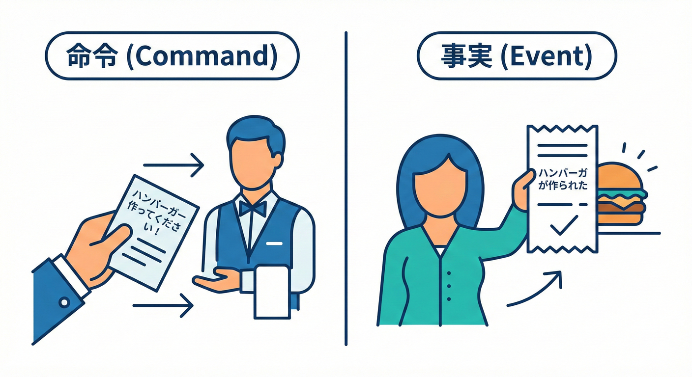
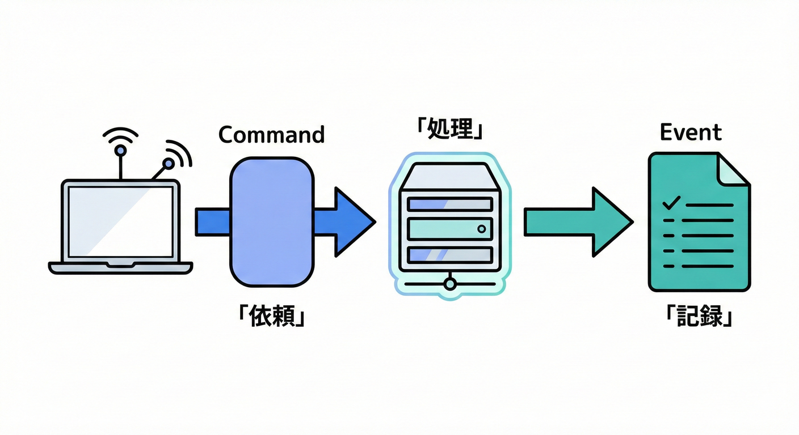

# 第02章：まずは超基本：コマンドとイベントの違い📣🤔

## 2.1 まず結論：2つは「役割」が真逆だよ🧩✨

* **Command（コマンド）＝命令・依頼📣**
  「これをやって！」（これから起きてほしいこと）
* **Event（イベント）＝起きた事実🔔**
  「これが起きた！」（もう起きたこと・記録したいこと）

特にドメインイベントでは、**イベントは“過去に起きた事実”**として扱うのが大事だよ🕒✨ ([Microsoft Learn][1])

---

## 2.2 コマンドとイベントの違い（レストランの例）🍴🍕



「注文する」のと「注文が終わった事実」は、全く別のものです😊
分かりやすくするために、レストランで例えてみましょう！
* **Command（コマンド）＝命令・依頼📣**
  「これをやって！」（これから起きてほしいこと）
* **Event（イベント）＝起きた事実🔔**
  「これが起きた！」（もう起きたこと・記録したいこと）

### 🍽️ レストラン編

* **Command**：「ハンバーガー作ってください！」📣
  → 店員さんに“依頼”してる（断られる可能性もある：材料切れとか🥲）
* **Event**：「ハンバーガーが作られた」🔔
  → もう起きた“事実”（取り消せない・言い換えると履歴）🧾

---

## 2.3 ライフサイクルの比較⚖️🚀



| 項目 | コマンド（命令） | ドメインイベント（事実） |

### ✅① 文の形（命令形 vs 過去形）

* Command：**「〜して！」**（お願い・命令）📣
* Event：**「〜した」**（事実）🔔
  ドメインイベントは「起きたこと」なので **過去形が基本**だよ🕒 ([Microsoft Learn][1])

### ✅② 成功/失敗があるのはどっち？

* Command：**失敗することがある**（支払いNG、在庫なし、権限なし…⚠️）
* Event：**失敗しない**（起きた事実を言ってるだけだから）

### ✅③ 誰が主語？

* Command：**「やってほしい」**（誰かに仕事を頼む）🧑‍✈️
* Event：**「起きた」**（観測・記録）🔍

---

## 2.4 ミニECで見る：注文→支払い→発送🛒💳📦

### 📣 Commandの例（依頼）

* 「支払いを実行して！」（PayOrder）💳
* 「発送して！」（ShipOrder）📦
* 「注文をキャンセルして！」（CancelOrder）🛑

### 🔔 Eventの例（事実）

* 「支払いが完了した」（OrderPaid）✅
* 「発送された」（OrderShipped）🚚
* 「注文がキャンセルされた」（OrderCanceled）🧾

イベント名は **“過去形 + ドメインの言葉”**が読みやすいよ✨ ([Microsoft Learn][1])

---

## 2.5 よくある混同パターン⚠️😵‍💫（ここ大事！）

### ❌「イベントなのに命令してる」例

* `SendPaymentEmail` 🔥（メール送って＝命令じゃん！📣）
* `SaveOrderToDb` 🔥（DBに保存して＝技術詳細だし命令っぽい）

### ✅「事実」に直すとこうなる

* `PaymentEmailSent`（支払いメールが送信された）📧✅
  ※ただし“送る”のは副作用なので、最初は **「支払いが完了した」**みたいな“中心の事実”を優先すると迷いにくいよ🙂
* `OrderPlaced`（注文が確定した）🛒✅

---

## 2.6 分類ゲーム：命令？それとも事実？🎮✨（10問）

次の10個を **Command / Event** に分類してみよう✍️🙂

1. 「支払いを実行して！」💳
2. 「支払いが完了した」✅
3. 「注文を確定して！」🛒
4. 「注文が確定した」🧾
5. 「在庫を引き当てて！」📦
6. 「在庫が引き当てられた」📦✅
7. 「配送ラベルを作って！」🏷️
8. 「配送ラベルが作成された」🏷️✅
9. 「注文をキャンセルして！」🛑
10. 「注文がキャンセルされた」🧾🛑

### ✅答え合わせ（サクッと）

* Command：**1, 3, 5, 7, 9** 📣
* Event：**2, 4, 6, 8, 10** 🔔

**コツ**：Eventは「〜された」「〜した」になってることが多いよ🕒✨ ([Microsoft Learn][1])

---

## 2.7 C#で超ミニ実装：CommandとEventを“型”で分けよう🧷✨

ポイントはこれ👇

* Command：**「お願い」**なので、入力（何をしたいか）を持つ📣
* Event：**「事実」**なので、起きたこと＋最低限の情報を持つ🔔
* Eventは基本 **変更しない（イミュータブル）**が相性いいよ🔒 ([download.microsoft.com][2])

```csharp
using System;

public interface ICommand { }
public interface IEvent { }

public sealed record PayOrderCommand(Guid OrderId, decimal Amount) : ICommand;   // 命令📣
public sealed record OrderPaidEvent(Guid OrderId, decimal Amount, DateTimeOffset OccurredAt) : IEvent; // 事実🔔

public sealed class Order
{
    public Guid Id { get; }
    public bool IsPaid { get; private set; }

    public Order(Guid id) => Id = id;

    // ✅ Commandを受けて、ルールを満たせたら状態が変わり、Eventが生まれる✨
    public OrderPaidEvent Pay(decimal amount)
    {
        if (IsPaid) throw new InvalidOperationException("すでに支払い済みだよ😵‍💫");
        if (amount <= 0) throw new ArgumentException("金額が不正だよ⚠️");

        IsPaid = true;

        return new OrderPaidEvent(
            OrderId: Id,
            Amount: amount,
            OccurredAt: DateTimeOffset.UtcNow
        );
    }
}
```

### 👀 ここで見たい流れ（超重要）🧠✨

1. 外から **Command** が来る📣（例：PayOrderCommand）
2. ドメイン（Order）がルールを守って処理する🧩
3. 状態が変わったら **Event** が生まれる🔔（例：OrderPaidEvent）

---

## 2.8 命名ミニ練習：良い名前に言い換えよう✍️✨

次を「Commandっぽい？ Eventっぽい？」で直してみよう🙂

* `CompletePayment`（これ、どっちでも読めちゃう😵‍💫）

  * ✅ Command寄りにするなら：`PayOrder` / `CompletePaymentCommand` 📣
  * ✅ Event寄りにするなら：`PaymentCompleted` / `OrderPaid` 🔔

---

## 2.9 AI（Copilot等）を使うときのプロンプト例🤖✨

### 🧠 命名案を出してもらう（便利！）

* 「“支払い完了”のドメインイベント名を、過去形で10個提案して。ユビキタス言語っぽく短く。」

### 🔎 混同チェックをさせる（安全！）

* 「この名前はCommand/Eventどっち？理由も。`ShipOrder`, `OrderShipped`, `CreateShipmentLabel`, `ShipmentLabelCreated`」

※最後は必ず自分でも確認ね🙂（“命令になってない？” “事実になってる？”）

---

## 2.10 チェック✅（この章のゴール）

* Commandは **「やって！」** 📣
* Eventは **「起きた！」** 🔔（過去形が基本）🕒 ([Microsoft Learn][1])
* 「イベントで命令しない」🙅‍♀️
* **Command → ドメイン処理 → Event** の流れが見えたら勝ち🏁✨

---

## 2.11 おまけ：最新C#環境のひとことメモ🪄🧩

* **C# 14 が最新リリース**で、**.NET 10 上でサポート**されているよ🧠✨ ([Microsoft Learn][3])
* **.NET 10 SDK**は公式のダウンロードページから入れられるよ🧩 ([dotnet.microsoft.com][4])

[1]: https://learn.microsoft.com/en-us/dotnet/architecture/microservices/microservice-ddd-cqrs-patterns/domain-events-design-implementation?utm_source=chatgpt.com "Domain events: Design and implementation - .NET"
[2]: https://download.microsoft.com/download/e/a/8/ea8c6e1f-01d8-43ba-992b-35cfcaa4fae3/cqrs_journey_guide.pdf?utm_source=chatgpt.com "Exploring CQRS and Event Sourcing"
[3]: https://learn.microsoft.com/en-us/dotnet/csharp/whats-new/csharp-14?utm_source=chatgpt.com "What's new in C# 14"
[4]: https://dotnet.microsoft.com/en-US/download/dotnet/10.0?utm_source=chatgpt.com "Download .NET 10.0 (Linux, macOS, and Windows) | .NET"
