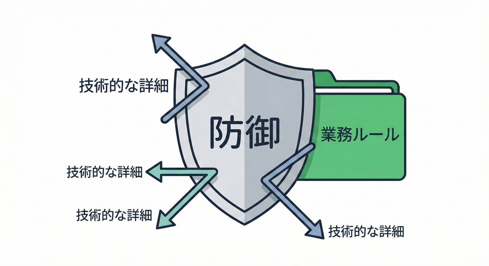
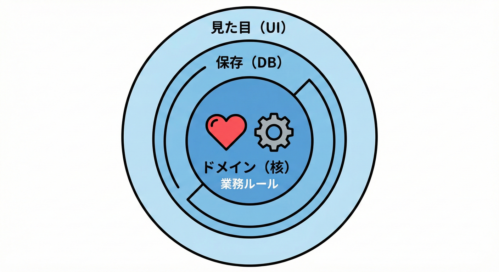

# 第03章：ドメインってなに？（設計の超入口）🏷️🙂

## この章のゴール🎯

この章が終わると、こんな状態になります👇✨

* 「ドメイン＝何か」を自分の言葉で説明できる🙂
* **ミニEC（注文→支払い→発送）**で「守りたい業務ルール」をスラスラ書ける📝
* UIやDBに引っ張られずに、**“業務の意味”をコードの中心に置く**感覚がつかめる❤️

---

### ✅ サービスを動かす「大事なルール」の集まり🛡️✨



たとえば「ミニEC」なら…
## 1. ドメイン＝「業務のルール・意味」❤️

ドメイン（Domain）って、ひとことで言うと👇

* **そのサービス（業務）の“世界観ルール”**のこと🌍
* もっと具体的には、**「こうであるべき」「こうしてはいけない」**みたいな決まりごと✅🙅‍♀️
* そして、「その言葉が指す意味」も含むよ🗣️✨

  * 例：このサービスでいう “支払い完了” って、いつの時点？（決済成功？入金確認？）🧾

イメージは「お店のルールブック📕」みたいな感じ📌
画面がどうであれ、DBがどうであれ、**ルールはルール**なんだよね🙂

---

## 3.2 「ドメイン」ってなに？📦🍰



いきなり難しい言葉ですが、超ざっくり言うとこれです👇

* 注文する🛒（Order）
* 支払う💳（Payment）
* 発送する📦（Shipment）

このとき、ドメインは「画面のボタン」じゃなくて、たとえばこういう **業務の意味** になるよ👇✨

* 「**支払いが完了した**」＝お金のやりとりが成立した事実💳✅
* 「**発送した**」＝商品を出荷した事実📦✅
* 「**キャンセルした**」＝注文を無効にした事実❌✅

そして、ここに **守るべきルール** が乗るとドメインっぽくなる🥳

---

## 3. UI / DB / 外部APIは “詳細” 🔌（ドメインの外側）

ここめっちゃ大事ポイント☝️✨

* UI（画面）🖥️：見た目や操作は変わりやすい
* DB🗃️：保存の都合で形が変わりやすい
* 外部API🌐：仕様変更が来たり、落ちたりする

でもドメイン（業務ルール）は…
**できるだけブレない中心（ハート❤️）**に置きたいんだよね🙂

ドメインイベントも同じで、**「DBに保存した」みたいな技術イベント**じゃなく、
**「業務で起きた意味のある事実」**として扱うのが基本だよ🔔✨ ([Microsoft Learn][1])

---

## 4. “ドメインっぽくない”例（ありがち）😵‍💫

### 例A：画面の都合でルールを決めちゃう🙅‍♀️

* 「発送ボタンが押されたら発送してOK」
  → でも本当は「支払い前は発送しない」かも？💦

### 例B：DBの形がルールを決めちゃう🙅‍♀️

* 「テーブルに `IsPaid` があるから支払い済み」
  → でも本当は「決済成功」「入金確認」「返金済み」など状態が複数あるかも🧠

### 例C：技術用語で“イベント”を作っちゃう🙅‍♀️

* `SavedToDatabase` とか `HttpRequestReceived` とか
  → それは **業務の出来事** じゃなくて **技術の出来事** だよ⚙️💦

---

## 5. やってみよう🛠️：ミニECの「守りたいルール」を書く📝✨

ここから実践！まずはコードじゃなくて文章でOK🙂🌸

### ステップ1：登場人物（名詞）を書き出す🧸

例👇

* 注文（Order）🛒
* 注文商品（LineItem）📦
* 支払い（Payment）💳
* 発送（Shipment）🚚
* 合計金額（Total）💰
* 住所（Address）🏠

### ステップ2：やること（動詞）を書き出す🏃‍♀️

例👇

* 注文する / 確定する🛒
* 支払う💳
* 発送する📦
* キャンセルする❌
* 返金する💸

### ステップ3：守りたいルールを「〜してはいけない」「〜なら〜」で書く🔐

ミニECの例👇（この章では **案** でOKだよ！）

* 支払い前に発送しない🙅‍♀️📦
* 支払いは1回だけ（2重決済NG）🙅‍♀️💳
* 合計金額が0円以下の注文は確定できない🙅‍♀️💰
* キャンセル後に支払いできない🙅‍♀️❌💳
* 発送後にキャンセルできない（または返品フローへ）📦➡️🔁

ここまで書けたら、もう **ドメインを掴み始めてる** よ〜🥳🎀

---

## 6. ルールをコードに置くと、何が嬉しいの？🎁✨

ドメイン（業務ルール）を中心に置くと👇

* 画面が増えても（Web/アプリ/管理画面）壊れにくい🧱✨
* DBが変わっても（列名変更、DB移行）影響が小さい🗃️➡️🙂
* 「何を守りたいか」がコードから読める👀📘

ドメインイベントも、こういう「守るべきルールの結果として起きた事実」を表すために使うよ🔔✨ ([Microsoft Learn][1])

---

## 7. ちょいコードで雰囲気だけ👩‍💻（“ドメイン＝意味”の型を作る）

「金額」を `decimal` で持つだけだと、意味がぼやけがち😵‍💫
だから **“意味のある型”** を作るとドメインが育つよ🌱

```csharp
public readonly record struct Money(decimal Amount, string Currency);
```

`Money` って名前があるだけで、読みやすさがグッと上がる🙂✨
（「これ、金額なんだな💰」が一瞬で伝わる！）

あと、C#では `init` みたいに「最初だけセットできる」仕組みもあって、不変っぽい設計がしやすいよ🔒✨ ([Microsoft Learn][2])
※言語バージョン的には、C# 13 は .NET 9 以降が前提だよ📌 ([Microsoft Learn][3])

---

## 8. ミニクイズ🎮：「ドメイン？それとも詳細？」

次のうち、**ドメイン（業務ルール・意味）**っぽいのはどれ？🙂✨

1. 「支払い前は発送できない」
2. 「SQLのカラム名は `paid_flg` にする」
3. 「注文確定メールを送る」
4. 「支払い完了＝決済成功の時点」
5. 「ボタンを押したら配送ラベルAPIを呼ぶ」

### 答え✅

* **ドメイン**：1, 4（ルール・意味）❤️
* **詳細寄り**：2, 5（技術・実装都合）🔌
* **中間**：3（業務的には大事だけど、“どう送るか”は詳細になりやすい📧）🙂

---

## 9. チェック✅（この章のまとめ）

* ドメイン＝**業務ルール・意味（世界観）**❤️
* UI/DB/外部APIは **変わりやすい詳細**🔌
* まずは「守りたいルール」を文章で書ければ勝ち📝✨
* 「画面の都合」でルールを決めない🙅‍♀️

---

[1]: https://learn.microsoft.com/en-us/dotnet/architecture/microservices/microservice-ddd-cqrs-patterns/domain-events-design-implementation?utm_source=chatgpt.com "Domain events: Design and implementation - .NET"
[2]: https://learn.microsoft.com/en-us/dotnet/csharp/language-reference/keywords/init?utm_source=chatgpt.com "The init keyword - init only properties - C# reference"
[3]: https://learn.microsoft.com/en-us/dotnet/csharp/language-reference/language-versioning?utm_source=chatgpt.com "Language versioning - C# reference"
