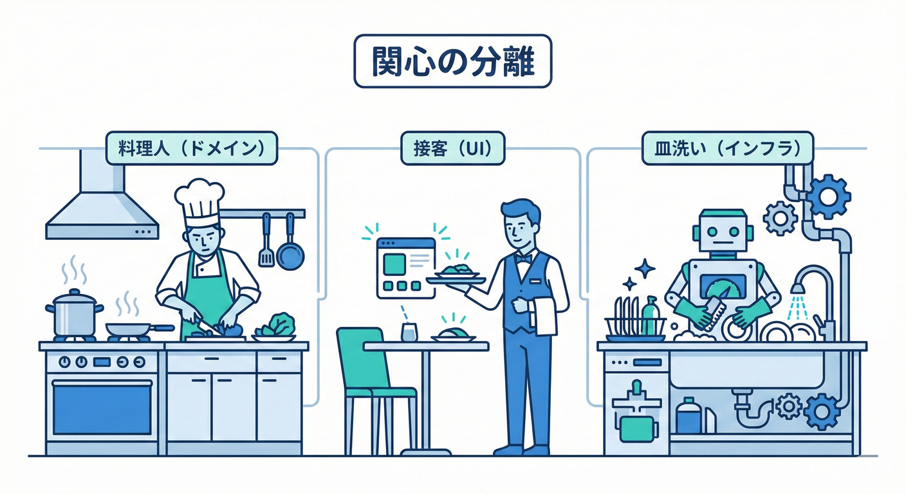
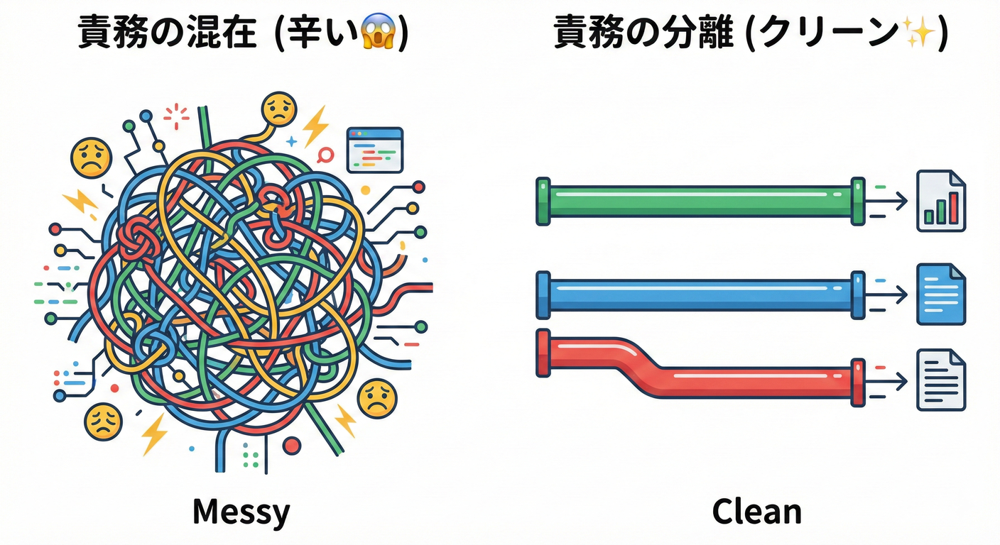

# 第04章：関心の分離（SoC）を最短で理解する✂️✨

## ねらい🎯

「注文確定」という1つの機能を題材に、**“混ぜると辛い”**を体感して、**分けるコツ（SoC）**を身につけるよ🧠✨

## 4.2 責務の分離（SoC）ってなに？🧼🍰



「SoC（Separation of Concerns）」といいます。
「関係ないことは、混ぜないで別々にしようぜ！」ということです😊
SoC（Separation of Concerns）は、ざっくり言うと **「やってる仕事の種類ごとに分けよう」**って考え方だよ🙂📦 ([Microsoft Learn][1])

---

## SoCってなに？超ざっくり🧩✨

### 「関心（Concern）」って？🤔

関心＝**コードが気にしていること（責務）**だよ。たとえば注文確定には、こんな“関心”が混ざりがち👇

* 🟩 **ドメイン（業務ルール）**：注文を確定できる条件は？合計金額は？ステータスは？
* 🟦 **永続化（DB）**：保存する？更新する？トランザクションは？
* 🟨 **通知**：メール送る？Slack？ポイント付与？
* 🟥 **表示/UI**：画面に何を返す？エラーメッセージは？

**変更理由が違うものは、分けないと地獄👻**になりがち💦
（メール文言の修正で注文確定が壊れたり、DB変更で画面が死んだり…😵‍💫）

---

## 混ぜると何が起きる？😱（“辛さ”の正体）



### 辛いポイントあるある🍂

* ✅ ちょい変更のつもりが、いろんな場所に波及🌊
* ✅ テストがしんどい（DBもメールも必要になって詰む）🧪💥
* ✅ 「どこが大事な業務ルール？」が見えない👀💦
* ✅ 未来の自分が読めない（＝事故る）🧠🌀

---

## まずは悪い例：ぜんぶ入り「注文確定」😵‍💫🧨

### 色分けルール🎨🖍️

* 🟩 ドメイン（業務ルール）
* 🟦 永続化（DBなど）
* 🟨 通知（メール/外部連携）
* 🟥 表示/UI（HTTPの返し方）

---

```csharp
using System;
using System.Collections.Generic;
using System.Linq;
using System.Threading.Tasks;

// ※わざと「ぜんぶ混ぜ」例だよ😵‍💫
public sealed class OrderControllerLike
{
    private readonly AppDbContext _db;             // 🟦
    private readonly EmailSender _emailSender;     // 🟨

    public OrderControllerLike(AppDbContext db, EmailSender emailSender)
    {
        _db = db;
        _emailSender = emailSender;
    }

    public async Task<ApiResponse> ConfirmOrderAsync(Guid orderId)
    {
        // 🟥 表示/UI：入力チェックや返し方
        if (orderId == Guid.Empty)
            return ApiResponse.BadRequest("orderIdが空です");

        // 🟦 DB：注文取得
        var order = await _db.FindOrderAsync(orderId);
        if (order == null)
            return ApiResponse.NotFound("注文が見つかりません");

        // 🟩 ドメイン：業務ルール（でも散らかってる）
        if (order.Status == "Confirmed")
            return ApiResponse.BadRequest("すでに確定済みです");

        if (order.Lines.Count == 0)
            return ApiResponse.BadRequest("明細が空の注文は確定できません");

        // 🟩 ドメイン：合計計算（本当はここが“核”）
        decimal total = 0m;
        foreach (var line in order.Lines)
        {
            if (line.Quantity <= 0) // 🟩 ルール
                return ApiResponse.BadRequest("数量が不正です");

            total += line.UnitPrice * line.Quantity;
        }

        // 🟩 ドメイン：状態変更
        order.Status = "Confirmed";
        order.ConfirmedAt = DateTimeOffset.UtcNow;
        order.Total = total;

        // 🟦 DB：保存
        await _db.SaveAsync(order);

        // 🟨 通知：メール送信（失敗したらどうする？が混ざる）
        await _emailSender.SendAsync(
            to: order.CustomerEmail,
            subject: "注文確定のお知らせ",
            body: $"注文が確定しました！合計: {total}円"
        );

        // 🟥 表示/UI：レスポンス整形
        return ApiResponse.Ok(new
        {
            order.Id,
            order.Status,
            order.Total
        });
    }
}

// ↓ 例を成立させるためのダミー型
public sealed class AppDbContext
{
    public Task<Order?> FindOrderAsync(Guid id) => Task.FromResult<Order?>(new Order(id));
    public Task SaveAsync(Order order) => Task.CompletedTask;
}

public sealed class EmailSender
{
    public Task SendAsync(string to, string subject, string body) => Task.CompletedTask;
}

public sealed class Order
{
    public Guid Id { get; }
    public string Status { get; set; } = "Draft";
    public DateTimeOffset? ConfirmedAt { get; set; }
    public decimal Total { get; set; }
    public string CustomerEmail { get; set; } = "customer@example.com";
    public List<OrderLine> Lines { get; } = new() { new OrderLine("SKU-1", 2, 500m) };

    public Order(Guid id) => Id = id;
}

public sealed record OrderLine(string Sku, int Quantity, decimal UnitPrice);

public sealed class ApiResponse
{
    public int StatusCode { get; }
    public object Body { get; }

    private ApiResponse(int statusCode, object body) { StatusCode = statusCode; Body = body; }

    public static ApiResponse Ok(object body) => new(200, body);
    public static ApiResponse BadRequest(string msg) => new(400, new { error = msg });
    public static ApiResponse NotFound(string msg) => new(404, new { error = msg });
}
```

### ここが「辛い」ポイント🔥

* 🟩の大事な業務ルールが、🟦🟨🟥に埋もれて見えない🙈
* メール仕様変更で、注文確定メソッドを触る羽目😇
* DBやメールが絡むから、単体テストが激ムズ🧪💥
* 「メール失敗したら注文確定も失敗？」みたいな判断が混ざって迷子🌀

---

## やってみよう🛠️：「関心ごと」で色分けしてみる🧠🖍️

### ステップ1：この4つに分類してみよう🎮✨

上のコードを見て、処理ごとにラベルを付けてみてね👇

* 🟩 業務ルール（ドメイン）
* 🟦 保存や取得（DB/Repository）
* 🟨 通知（メール/外部）
* 🟥 返し方（UI/HTTP）

### ステップ2：この質問に答える🙂💬

* 「注文確定の“核”はどれ？」🟩
* 「メール文言変更が来たら、どこを変えるべき？」🟨
* 「DBの都合（列追加など）が来たら、どこを変えるべき？」🟦

**答えが“全部”になったら、混ざってるサイン🚨**だよ！

---

## SoCの最短ルート：まず「核」を救出する🛟✨

### 合言葉📣

**ドメイン（核）を、I/O（DB・メール・HTTP）から引きはがす！**✂️✨

SoCの基本はこれ👇

* 🟩 ドメイン：**ルールと状態変更だけ**（なるべく純粋に）
* 🟦🟨🟥：ドメインの外（後で差し替えやすい場所）

---

## 改善版：3つに分ける（最小で効く！）🧩✨

ここでは、最小構成で「分ける」感覚を作るよ🙂

* 🟩 Order（業務ルールと状態変更）
* 🟦 Repository（保存/取得）
* 🟥 UseCase（流れの組み立て：どの順で呼ぶ？）

さらに、**“起きた事実”を外へ伝える**ために、イベント（事実）も軽く登場するよ🔔
（この段階では「配送」や「配信」はまだやらない！“事実”だけ作る✨）

---

### 🟩 ドメイン：Orderが「確定できるか」を知ってる🥋

```csharp
using System;
using System.Collections.Generic;

public interface IDomainEvent { }

public sealed record OrderConfirmed(Guid OrderId, decimal TotalYen, DateTimeOffset OccurredAt) : IDomainEvent;

public enum OrderStatus { Draft, Confirmed }

public sealed class Order
{
    private readonly List<OrderLine> _lines = new();
    private readonly List<IDomainEvent> _domainEvents = new();

    public Guid Id { get; }
    public OrderStatus Status { get; private set; } = OrderStatus.Draft;
    public DateTimeOffset? ConfirmedAt { get; private set; }
    public decimal TotalYen { get; private set; }

    public IReadOnlyList<OrderLine> Lines => _lines;
    public IReadOnlyCollection<IDomainEvent> DomainEvents => _domainEvents;

    public Order(Guid id) => Id = id;

    public void AddLine(string sku, int quantity, decimal unitPriceYen)
        => _lines.Add(new OrderLine(sku, quantity, unitPriceYen));

    public void Confirm(DateTimeOffset now)
    {
        // ✅ 不変条件（壊れた状態を作らない）
        if (Status == OrderStatus.Confirmed)
            throw new InvalidOperationException("すでに確定済みです");

        if (_lines.Count == 0)
            throw new InvalidOperationException("明細が空の注文は確定できません");

        decimal total = 0m;
        foreach (var line in _lines)
        {
            if (line.Quantity <= 0)
                throw new InvalidOperationException("数量が不正です");

            total += line.UnitPriceYen * line.Quantity;
        }

        // ✅ 状態変更（核）
        Status = OrderStatus.Confirmed;
        ConfirmedAt = now;
        TotalYen = total;

        // ✅ “起きた事実”を追加（配るのはまだ先！）
        _domainEvents.Add(new OrderConfirmed(Id, TotalYen, now));
    }

    public List<IDomainEvent> PullDomainEvents()
    {
        var copied = new List<IDomainEvent>(_domainEvents);
        _domainEvents.Clear();
        return copied;
    }
}

public sealed record OrderLine(string Sku, int Quantity, decimal UnitPriceYen);
```

ポイント💡

* 🟩 Orderは「DB」も「メール」も「HTTP」も知らない🙅‍♀️
* 🟩 Orderが知ってるのは「確定できる条件」と「確定した事実」だけ🔔✨
* これだけで、**テストが一気にラク**になるよ🧪🌸

---

### 🟦 永続化：Repositoryは「保存」を担当📦🗃️

```csharp
using System;
using System.Threading.Tasks;

public interface IOrderRepository
{
    Task<Order?> FindAsync(Guid orderId);
    Task SaveAsync(Order order);
}
```

---

### 🟥 アプリケーション（UseCase）：“順番”を組み立てる🧠🧩

```csharp
using System;
using System.Threading.Tasks;

public interface IClock
{
    DateTimeOffset Now { get; }
}

public sealed class SystemClock : IClock
{
    public DateTimeOffset Now => DateTimeOffset.UtcNow;
}

public sealed class ConfirmOrderUseCase
{
    private readonly IOrderRepository _orders;
    private readonly IClock _clock;

    public ConfirmOrderUseCase(IOrderRepository orders, IClock clock)
    {
        _orders = orders;
        _clock = clock;
    }

    public async Task<Result> ExecuteAsync(Guid orderId)
    {
        var order = await _orders.FindAsync(orderId);
        if (order == null)
            return Result.Fail("注文が見つかりません");

        try
        {
            order.Confirm(_clock.Now);        // 🟩 核（ルールと状態変更）
            await _orders.SaveAsync(order);   // 🟦 保存
        }
        catch (InvalidOperationException ex)
        {
            return Result.Fail(ex.Message);
        }

        // 🔔 ここで events を取り出せる（配信は後の章でやる！）
        var events = order.PullDomainEvents();

        return Result.Ok(new
        {
            order.Id,
            order.Status,
            order.TotalYen,
            EventCount = events.Count
        });
    }
}

public sealed class Result
{
    public bool Success { get; }
    public string? Error { get; }
    public object? Value { get; }

    private Result(bool success, string? error, object? value)
    {
        Success = success;
        Error = error;
        Value = value;
    }

    public static Result Ok(object value) => new(true, null, value);
    public static Result Fail(string error) => new(false, error, null);
}
```

ここでSoCが効いてるところ✨

* 🟩 ドメインは「確定できる？」だけに集中🙂
* 🟥 UseCaseは「どういう順で呼ぶ？」に集中🧠
* 🟦 保存はRepositoryに隔離📦
* そして🔔 **“起きた事実（イベント）”**が取り出せるようになって、後で拡張しやすい🌱

---

## これが「追加に強い」につながる理由💪✨

たとえば今後、こういう追加が来るとするよ👇

* 📧 注文確定メールを送る
* 🎁 ポイント付与する
* 🧾 監査ログを残す
* 📦 出荷のワークフローを起動する

悪い例だと、ConfirmOrderAsync がどんどん肥大化🐘💦
でも今の形なら、**注文確定（核）はそのまま**で、後処理を増やしやすい✨
この発想が、後の章の「イベントを配る（ディスパッチ）」に直結するよ🔔🚚

---

## AI拡張で爆速にするコツ🤖⚡（安全な使い方）

### 使いどころ3つ✨

1. 🧠 **関心ごとの抽出**（何が混ざってる？）
2. 🧩 **分割案のたたき台**（クラス/インターフェース）
3. 🧪 **テスト案の提案**（境界ケース）

### そのまま使えるプロンプト例📝💬

* 「このメソッドを SoC で分解したい。関心ごとを“ドメイン/永続化/通知/UI”に分類して箇条書きして」
* 「注文確定の業務ルールだけを Order クラスに移したい。例外メッセージも含めて提案して」
* 「Order.Confirm の単体テストで、境界ケース（明細ゼロ、数量ゼロ、二重確定）を列挙して」

---

## チェック✅（この章の合格ライン🎓✨）

### ✅ できてたらOK

* 「注文確定の核（業務ルール）」が、DBやメールから分離できてる🟩✂️
* どの変更が来たら、どの層を直すかイメージできる🧠🗺️
* ドメインが「I/O（DB/メール/HTTP）」を知らない状態になってる🙅‍♀️✨

### ❌ 危険サイン🚨

* 1つのメソッドに、保存・メール・レスポンス整形が同居してる🐘💥
* 仕様変更のたびに、注文確定の中心メソッドを毎回触ってる😇
* 単体テストを書こうとすると、DBやメールが必要になる🧪💦

---

## ミニクイズ🎮✨（3問）

1. 「メール送信」はどの関心？🟨🟦🟥🟩どれ？
2. 「確定できる条件（明細が空ならNG）」はどの関心？
3. 「注文確定後にポイント付与を追加したい」→核を壊さず増やすには何が欲しい？🔔🙂

---

## 今日の“最新版”メモ🧷🪟✨

* 現時点では、.NET 10 がLTSで、最新パッチは 10.0.2（2026-01-13）だよ🧩 ([Microsoft][2])
* C# の最新は C# 14 で、.NET 10 でサポートされてるよ✨ ([Microsoft Learn][3])
* Visual Studio 2026 は .NET 10 と C# 14 をフルサポートしてるよ🛠️✨ ([Microsoft Learn][4])

[1]: https://learn.microsoft.com/en-us/dotnet/architecture/modern-web-apps-azure/architectural-principles?utm_source=chatgpt.com "Architectural principles - .NET"
[2]: https://dotnet.microsoft.com/en-us/platform/support/policy/dotnet-core ".NET and .NET Core official support policy | .NET"
[3]: https://learn.microsoft.com/ja-jp/dotnet/csharp/whats-new/csharp-14 "C# 14 の新機能 | Microsoft Learn"
[4]: https://learn.microsoft.com/en-us/visualstudio/releases/2026/release-notes "Visual Studio 2026 Release Notes | Microsoft Learn"
