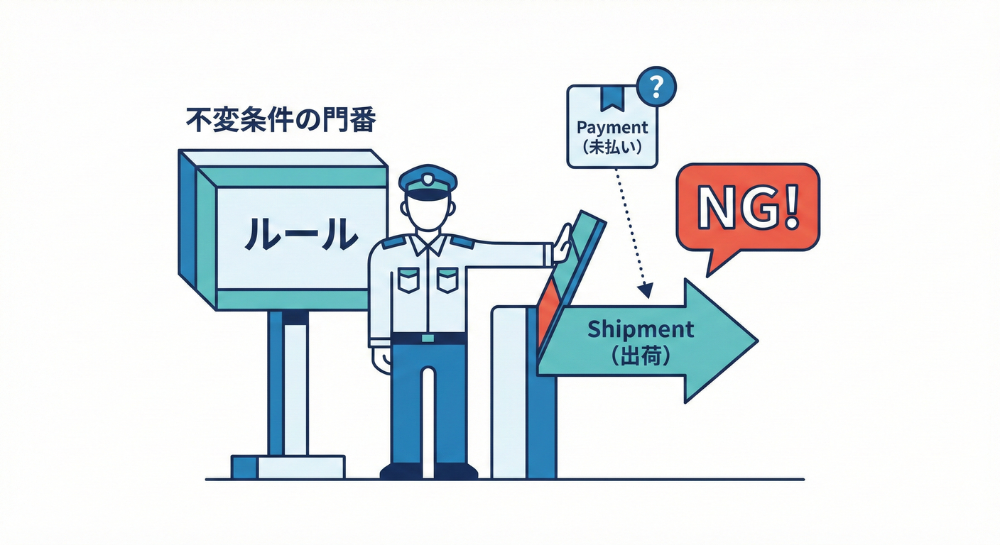
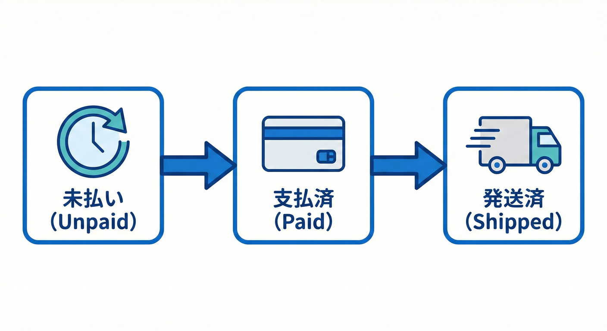

# 第05章：例題の全体像：ミニECのストーリー🛒📦

この章では、これからずっと使う「ミニEC」の世界を、地図みたいに整理します🗺️✨
ドメインイベントはまだ“本格導入”しないけど、**あとでイベントが自然に生まれる**ように、ストーリーと状態（Status）を先に固めます🔔💕

---

## 5.1 ミニECの主役は3つだけ🎭✨

ミニECの流れはこれだけ👇

**注文（Order）➡️ 支払い（Payment）➡️ 発送（Shipment）** 🛒💳📦

それぞれの役割はこんな感じです💡

* **Order（注文）**🛒
  「何を・いくつ・いくらで買う？」をまとめた“中心”
* **Payment（支払い）**💳
  「支払いが完了した？」という事実
* **Shipment（発送）**📦
  「商品を発送した？」という事実

ポイント：**Orderが主人公で、Payment/Shipmentは“Orderの進行に関わる出来事”**って感じです🙂✨

---

## 5.2 “状態（Status）”ってなに？🔁🙂

**状態（Status）＝いま注文がどこまで進んだか** を表すラベルです🏷️✨

この教材の最小セットはこれ👇

* **未払い（Unpaid）** 🕒
* **支払済（Paid）** ✅
* **発送済（Shipped）** 📦
* （おまけ）**キャンセル（Cancelled）** ❌

まずは矢印で、流れだけ掴みます👇

* **未払い** 🕒 → **支払済** ✅ → **発送済** 📦
* **未払い** 🕒 → **キャンセル** ❌
* **支払済** ✅ → **キャンセル** ❌（※現実には返金が絡むので、ここは“要追加ルール”になりやすい💦）

「状態遷移」って言うと難しそうだけど、要は **“次に進める条件”を決める**だけです🙂🎀

---

## 5.4 守らなきゃいけないルール（不変条件）🛡️🔐



「不変条件（Invariants）」といいます。
プログラムがどんなに動いても、**「絶対に壊しちゃいけないルール」**のことです。
ミニECでまず意識する不変条件（Invariants）はこれ👇✨

* **支払い前に発送しない** 📦🚫💳
* **未払い以外に“支払い”をもう一回しない** 💳🚫
* **発送済の注文は勝手にキャンセルしない** 📦🚫❌（返品・返金は別ルールになりがち）
* **注文は“壊れた状態”にならない**（例：合計金額がマイナス、など）💥🙅‍♀️

ここめっちゃ大事で、後のドメインイベントも
**「不変条件を守ったうえで状態が変わった瞬間」**に自然と生まれます🔔🌱

---

## 5.5 “やってみよう” 状態遷移を表にする📝✨



矢印だけだと曖昧になりやすいので、表にします🙂🎀

| いまの状態 | やりたい操作 | 次の状態   | OK? | ひとこと理由         |
| ----- | ------ | ------ | --- | -------------- |
| 未払い🕒 | 支払う💳  | 支払済✅   | ✅   | 正常ルート✨         |
| 未払い🕒 | 発送する📦 | 発送済📦  | ❌   | 支払い前発送はNG🙅‍♀️ |
| 支払済✅  | 発送する📦 | 発送済📦  | ✅   | 正常ルート✨         |
| 支払済✅  | 支払う💳  | 支払済✅   | ❌   | 二重請求になりがち😱    |
| 発送済📦 | キャンセル❌ | キャンセル❌ | ❌   | 返品・返金の世界へ🌪️   |

この表ができると、コードはめちゃ作りやすくなります🧩✨

---

## 5.6 “やってみよう” 状態をコードで持つ（最小）🧩💕

まずは `enum` で状態を表します👇

```csharp
public enum OrderStatus
{
    Unpaid = 0,     // 未払い🕒
    Paid = 1,       // 支払済✅
    Shipped = 2,    // 発送済📦
    Cancelled = 99  // キャンセル❌
}
```

次に、Orderの中で「状態を変える入口」を用意します🚪✨
（この“入口”があると、ルールが散らかりにくいです🧹）

```csharp
public sealed class Order
{
    public Guid Id { get; }
    public OrderStatus Status { get; private set; } = OrderStatus.Unpaid;

    public DateTimeOffset CreatedAt { get; }
    public DateTimeOffset? PaidAt { get; private set; }
    public DateTimeOffset? ShippedAt { get; private set; }

    public Order(Guid id, DateTimeOffset now)
    {
        Id = id;
        CreatedAt = now;
    }

    public void MarkAsPaid(DateTimeOffset now)
    {
        if (Status != OrderStatus.Unpaid)
            throw new InvalidOperationException($"支払いできるのは未払いのときだけだよ🙅‍♀️ 現在: {Status}");

        Status = OrderStatus.Paid;
        PaidAt = now;

        // ここで後々「OrderPaid」みたいなドメインイベントが発生するイメージ🔔✨（今はまだ実装しないよ）
    }

    public void MarkAsShipped(DateTimeOffset now)
    {
        if (Status != OrderStatus.Paid)
            throw new InvalidOperationException($"発送できるのは支払済のときだけだよ📦 現在: {Status}");

        Status = OrderStatus.Shipped;
        ShippedAt = now;
    }

    public void Cancel()
    {
        if (Status == OrderStatus.Shipped)
            throw new InvalidOperationException("発送済はキャンセルできないよ😢（返品・返金は別ルールになりがち）");

        if (Status == OrderStatus.Cancelled)
            return; // 2回呼ばれても安全（ちょい冪等っぽい）✨

        Status = OrderStatus.Cancelled;
    }
}
```

### ミニ実行（雰囲気つかむ用）🎮✨

```csharp
var order = new Order(Guid.NewGuid(), DateTimeOffset.Now);

order.MarkAsPaid(DateTimeOffset.Now);
order.MarkAsShipped(DateTimeOffset.Now);

Console.WriteLine(order.Status); // Shipped
```

---

## 5.7 よくある落とし穴（ここで回避しよ）🕳️😵‍💫

* **UI側で状態を直接いじる**（例：画面のボタンで `Status = Shipped` とか）🙅‍♀️
  → ルールが守れなくなって事故りやすい💥
* **“ついで処理”を混ぜる**（例：発送の中でメール送信までやる）📧🧨
  → ここは後の章で「イベントで分ける」方向に育てます🌱✨

---

## 5.8 AIに頼むならここが安全🤖🧠✨

この章の内容で、AIに頼みやすいのは「整理・変換」系です🙂🎀

* 状態遷移表 → `if` ガードに落とす🧩
* 例外メッセージの改善案を出してもらう📝
* “この状態遷移表からテストケース案を列挙して” と頼む🧪✨

（設計の判断＝どの状態が必要か／キャンセルをどう扱うか、は人が決めるのが安全です🎯）

---

## 5.9 チェック✅（この章のゴール）

* 注文が **未払い→支払済→発送済** って進むのを説明できる🛒💳📦
* **支払い前に発送しない** みたいな不変条件を言える🔐✨
* 状態遷移表を作って、コードに落とす入口を作れた🧩💕

---

## 参考（2026年1月の“いま”の .NET / C# メモ🗒️✨）

* .NET の配布ページでは **.NET 10** が最新系として案内され、2026年1月時点の更新（例：10.0.2 など）が掲載されています。([Microsoft][1])
* C# の最新情報として **C# 14** の新機能ページが公開されています。([Microsoft Learn][2])
* Visual Studio は **Visual Studio 2026** のリリースノートが更新されています。([Microsoft Learn][3])

[1]: https://dotnet.microsoft.com/ja-jp/download/dotnet?utm_source=chatgpt.com "ダウンロードするすべての .NET バージョンを参照する"
[2]: https://learn.microsoft.com/en-us/dotnet/csharp/whats-new/csharp-14?utm_source=chatgpt.com "What's new in C# 14"
[3]: https://learn.microsoft.com/en-us/visualstudio/releases/2026/release-notes?utm_source=chatgpt.com "Visual Studio 2026 Release Notes"
