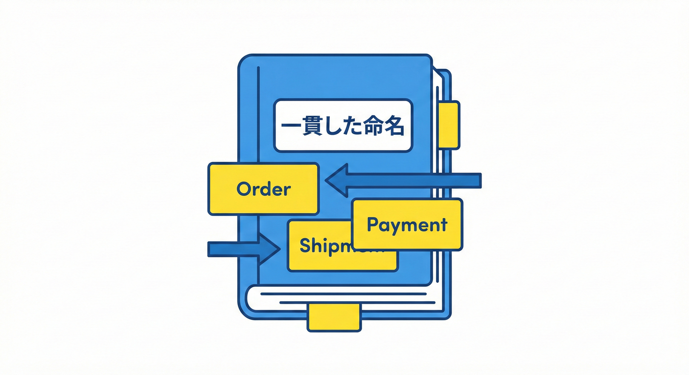

# 第06章：用語をそろえる：ユビキタス言語ごっこ🗣️🎀

## ねらい🎯

「同じ言葉で、同じものを指す」状態を作って、あとで **ドメインイベント名がブレない**ようにするよ🔔✨
（イベントって“言葉”だから、用語がグラつくと名前も設計も一緒にグラつくの…😵‍💫）

---

## 6.1 ユビキタス言語：言葉の壁を壊そう🧱✨


「Ubiquitous Language（ユビキタス言語）」といいます。
「エンジニアも、ビジネスの人も、みんな同じ言葉を使おうぜ！」ということです😊
会話だけじゃなく、**設計の文章・テスト・コードの命名まで**同じ言葉を使うのがポイント✨ ([martinfowler.com][1])

---

## なぜ第6章でやるの？（ドメインイベントへのつながり）🔗🔔

ドメインイベントは「起きた事実」だから、名前がこういう感じになるよね👇

* `OrderPaid`（注文が支払われた）
* `ShipmentCreated`（発送が作られた）

ここで “Paid” と “Settled” と “Captured” が混ざると…
同じ事実なのにイベントが **3種類に分裂**しがち😱💥
だから先に、**言葉の辞書（用語集）**を作って、揺れを止めるよ🧷✨

---

## この章のゴール🏁

ミニEC（Order → Payment → Shipment）で、**5〜10語の用語集**を作る📖✨
さらに、用語集の言葉で **イベント名の候補**も作っておく🔔📝

---

## 学ぶこと📚

### 1) Order / Payment / Shipment を“一言定義”する📌

「なんとなく分かる」じゃなくて、**一文で言える**ようにするのが勝ち🏆
（短くていい。短い方が強い💪✨）

例👇

* Order：お客さんが買いたい物を確定した“注文”🛒
* Payment：注文に対して代金が支払われた（または支払い処理が完了した）状態💳
* Shipment：注文の商品を発送する作業と、その結果の“発送情報”📦

※ここで「Paymentって、与信？入金？決済確定？」みたいなズレが出やすいよ⚠️
ズレは **今ここで潰す**のがコスパ最強🙂✨

---

### 2) “言葉の揺れ”を止める🧷

揺れの例👇

* Paid / Settled / Captured（どれを採用する？）
* Shipping / Shipment（作業？結果？）
* Order Confirmed / Order Placed（どっちが“注文確定”の事実？）

ここでやるのは「正解探し」じゃなくて、
**チーム内の“採用語”を決める**ことだよ🫶✨（採用したら、以後それで統一！）

---

## 6.2 用語辞典をつくろう（ユビキタス言語）📖🔍



共通の言葉を決めるために、ミニ用語辞典（用語集）を作ります。

### ステップ0：ルールを1つ決める🧼

おすすめの超ミニルール👇

* **同じ意味の言葉は、1つに絞る**（別名は禁止）🙅‍♀️
* どうしても別名が必要なら「別名→正規名」をメモする📝

---

### ステップ1：登場人物（概念）をまず並べる🧠📝

ミニECなら、まずこれくらいでOK👇（多すぎ厳禁⚠️）

* Order（注文）🛒
* Payment（支払い）💳
* Shipment（発送）📦
* OrderStatus（注文状態）🔁
* Money（金額）💰
* OrderId（注文ID）🪪

ここから **5〜10語に絞る**よ✂️✨
（全部定義しようとして疲れるの、あるある😵‍💫）

---

### ステップ2：各用語を“一言定義”する📌

コツは「境界」を入れること🙂✨

* いつからそれ？
* どこまでそれ？
* 何が含まれて、何が含まれない？

例：Payment（支払い）の一言定義案👇

* Payment：Orderに対して代金が支払われ、**支払済として扱える状態になったこと**💳✅
  （※「与信だけ」は含めない、みたいに決められると強い💪）

---

### ステップ3：禁止ワード（NG命名）リストを作る🙅‍♀️🧾

これはイベント名の事故を減らすのに超効くよ💥

NG例👇（技術に寄ってて、業務の事実じゃない）

* `SavedToDb`（DBに保存した）
* `EmailSent`（メール送った）
* `MessagePublished`（配信した）

こういうのは「事実」じゃなくて「実装」になりがち🥲
用語集にない言葉は、イベント名に入れない縛りがオススメ🔒✨

---

### ステップ4：用語集の言葉で“イベント名の候補”を作る🔔📝

イベントは基本「過去形」っぽい“起きた事実”にするよ🕒✨
（第2章の復習だね📣）

例👇

* `OrderPlaced`（注文が確定した）🛒✅
* `OrderPaid`（支払いが完了した）💳✅
* `ShipmentCreated`（発送情報が作られた）📦✨

この章では「候補を出せたらOK」🙆‍♀️
粒度や中身は後の章で磨くよ🔧✨

---

## ワーク：用語集テンプレ（コピペして埋めよう）📋✨

| 用語（英）       | 日本語  | 一言定義📌 | 別名（あるなら） | 例に出すイベント名🔔 |
| ----------- | ---- | ------ | -------- | ----------- |
| Order       | 注文   |        |          |             |
| Payment     | 支払い  |        |          |             |
| Shipment    | 発送   |        |          |             |
| Paid        | 支払済  |        |          |             |
| OrderStatus | 注文状態 |        |          |             |

※5〜10語に収まるなら、追加してOKだよ➕🙂

---

## 模範例（ミニECの用語集サンプル）📖✨

「こんな感じ」を見てイメージつかもう🙂💕

| 用語（英）       | 日本語  | 一言定義📌                       | 別名               | 例に出すイベント名🔔       |
| ----------- | ---- | ---------------------------- | ---------------- | ----------------- |
| Order       | 注文   | お客さんが購入する内容が確定した“注文”🛒       | Purchase（使わない）   | `OrderPlaced`     |
| Payment     | 支払い  | 注文に対して代金が支払われ、支払済として扱える状態💳✅ | Settlement（使わない） | `OrderPaid`       |
| Shipment    | 発送   | 注文の商品を送るための発送情報（配送番号など）📦    | Shipping（使わない）   | `ShipmentCreated` |
| Paid        | 支払済  | Orderが支払済である状態を表す言葉🔁        | Settled（使わない）    | `OrderPaid`       |
| OrderStatus | 注文状態 | 未払い/支払済/発送済などの状態分類🔁         | State（使わない）      | （イベントではなく状態）      |

「別名：使わない」を書いておくと、迷いが消えるよ🧷✨

---

## C# で“用語をコードに固定”する小ワザ🧩✨

ユビキタス言語は、**コード上の名前**で固定されると最強になるよ💪🙂
今は「雰囲気を掴む」が目的なので、軽くでOK🫶

```csharp
// ✅ 用語集で決めた言葉を、そのままクラス名にする
public sealed class Order { /* ... */ }
public sealed class Payment { /* ... */ }
public sealed class Shipment { /* ... */ }

// ✅ イベント名も用語集の言葉で作る（“起きた事実”）
public sealed record OrderPlaced(Guid OrderId, DateTimeOffset OccurredAt);
public sealed record OrderPaid(Guid OrderId, DateTimeOffset OccurredAt);
public sealed record ShipmentCreated(Guid OrderId, DateTimeOffset OccurredAt);
```

ちなみに、いまの最新C#は **C# 14**で、.NET 10上でサポートされているよ🆕✨ ([Microsoft Learn][2])
（この教材でも “新しめ前提”でOK👌）

---

## AI（Copilot / Codex）で爆速にするコツ🤖⚡

AIは「候補出し」と「揺れ検出」が得意だよ🙂✨
でも最後に決めるのは人間側だよ🎯（設計判断は目的から！）

### プロンプト例①：用語の揺れ候補を出させる🧠

* 「ミニEC（注文→支払い→発送）で、Paymentの意味がブレそうな同義語を列挙して。業務的な違いも一言で」

### プロンプト例②：一言定義を短く整える✂️

* 「この定義を“20文字〜40文字くらいの一文”に縮めて。境界が分かるように」

### プロンプト例③：イベント名案を出す🔔

* 「用語集（Order, Payment, Shipment, Paid）を使って、過去形のドメインイベント名を5個出して」

---

## よくある落とし穴😱（ここだけ注意！）

* **言葉を増やしすぎる**：用語集が辞書サイズになる📚💦 → まず5〜10語でOK
* **技術の言葉が混ざる**：`SavedToDb` みたいな実装語が入る🔌 → NGリストで止める🙅‍♀️
* **同じ言葉で別の意味を言う**：Paymentが「与信」と「入金確定」で揺れる💳😵‍💫 → 一言定義に境界を書く📌
* **イベント名に“別名”が混ざる**：`OrderSettled` と `OrderPaid` が共存しちゃう🔔💥 → 採用語を決めて一本化🧷

---

## チェック✅（この章の合格ライン）

* 用語集が **5〜10語**に収まっている📖✨
* 各用語に **一言定義**がある📌🙂
* 揺れそうな言葉（Paid/Settledなど）について、**採用語が決まっている**🧷
* イベント名の候補が、**用語集の言葉だけ**で作れている🔔✨

---

## おまけ：最新の土台メモ🆕🧩

* .NET 10はLTSとして提供され、2026年1月の更新（10.0.2など）も出ているよ🛠️✨ ([マイクロソフトサポート][3])
* Visual Studio 2026も提供されていて、.NET 10 SDKを含む案内がされているよ🪟✨ ([Microsoft Learn][2])

[1]: https://martinfowler.com/bliki/UbiquitousLanguage.html?utm_source=chatgpt.com "Ubiquitous Language"
[2]: https://learn.microsoft.com/en-us/dotnet/csharp/whats-new/csharp-14?utm_source=chatgpt.com "What's new in C# 14"
[3]: https://support.microsoft.com/en-us/topic/-net-10-0-update-january-13-2026-64f1e2a4-3eb6-499e-b067-e55852885ad5?utm_source=chatgpt.com ".NET 10.0 Update - January 13, 2026"
