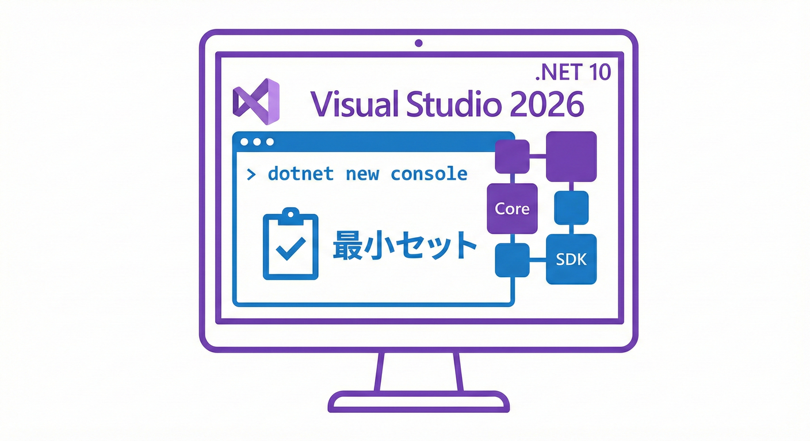
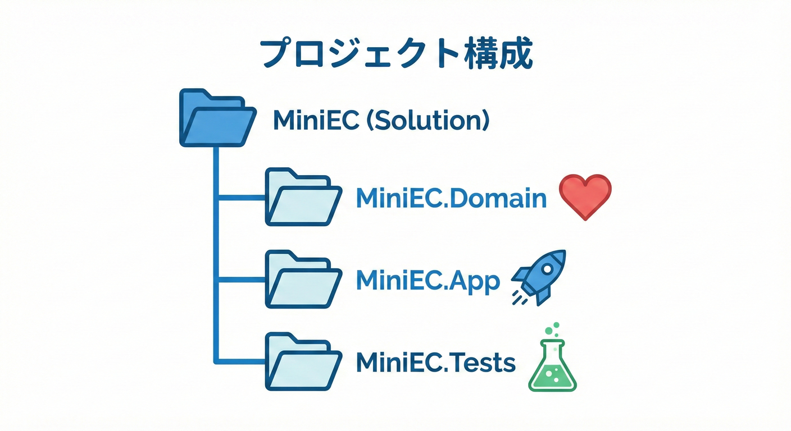

# 第7章 開発環境（Windows + Visual Studio）最小セット🪟🛠️

## この章でゴール🎯✨

* 迷わず **.NET 10（LTS）+ C# 14** でプロジェクトを作れる🙌 ([Microsoft Learn][1])
* **実行できる・デバッグできる・テストが動く** ところまで一気に到達🏁🧪
* 後の章でドメインイベントを学ぶための「土台」を完成させる🧱💕

---

## 1) 入れるものはコレだけ🧳✨

### 必須✅

* **Visual Studio 2026**（Community でOK）🧰 ([Microsoft Learn][2])
* **.NET 10 SDK**（Visual Studio 2026 に同梱されるので基本これでOK）🧩 ([Microsoft Learn][1])

### あると強い（でも後回しOK）💪

* **Git**（履歴管理）🗂️
* **GitHub Copilot**（AI相棒🤖✨：Visual Studio 2026 ではAI統合が強化されてるよ）([Microsoft Learn][2])

---

## 7.2 インストールするもの🛠️✨



まずは、以下の2つをインストールします。

### 2-1. インストーラーで選ぶもの（最小）🎛️

Visual Studio Installer を開いたら、ワークロードはこの2つだけでまずOK👇

* **.NET デスクトップ開発** 🧩（コンソール/クラスライブラリ/デバッガの土台）
* **ASP.NET と Web 開発** 🌐（後でWeb APIに広げたくなった時に便利）

「最小セット」なので、最初は **入れすぎない** のが正解🙆‍♀️✨
あとで追加できるから安心〜🎀

### 2-2. “.NET 10 が選べる” 状態になってるかチェック✅

.NET 10 をターゲットにするなら **Visual Studio 2026 が安心**（.NET 10 対応として案内されてる）🧩 ([Microsoft Learn][3])

---

## 3) 例題用ソリューションを作る🛒📦（まず動けば勝ち🏁）

ここでは「ミニEC」を進めやすい **最小の7.3 プロジェクトの構成（フォルダ構成）📂🧱



この教材では、以下のような構成で作成していきます。
3プロジェクト構成** にするよ✨

* `MiniEC.Domain`（ドメイン層）❤️
* `MiniEC.App`（動かす入口：Console）🏃‍♀️
* `MiniEC.Tests`（テスト）🧪

### 3-1. ソリューション作成📦

1. Visual Studio → **新しいプロジェクトの作成**
2. いったん **空のソリューション**（Blank Solution）を作成🗂️
3. ソリューション名：`MiniEC`（例）🛒✨

### 3-2. Domain（クラスライブラリ）を追加❤️

1. ソリューション右クリック → **追加** → **新しいプロジェクト**
2. **クラス ライブラリ** を選択
3. フレームワーク：**.NET 10**（`net10.0`）🧩✨

### 3-3. App（コンソール）を追加🏃‍♀️

1. 同じく **コンソール アプリ** を追加
2. フレームワーク：**.NET 10**
3. `MiniEC.App` から `MiniEC.Domain` を参照追加🔗

   * `MiniEC.App` 右クリック → **参照** → `MiniEC.Domain` にチェック✅

### 3-4. Tests（xUnit）を追加🧪

1. **xUnit テスト プロジェクト** を追加
2. フレームワーク：**.NET 10**
3. `MiniEC.Tests` から `MiniEC.Domain` を参照追加🔗✅

---

## 4) “動く”を最速で確認する🏁✨（1分チェック）

### 4-1. App を実行してみる▶️

`MiniEC.App` の `Program.cs` をこんな感じにして実行してみてね👇😊

```csharp
Console.WriteLine("MiniEC boot OK! 🛒✨");
```

* 実行：`Ctrl + F5`（デバッグなしで実行）▶️
* デバッグ：`F5`（ブレークポイントが効く）🐞

### 4-2. ブレークポイント体験🐞🧪

1. `Console.WriteLine(...)` の左をクリック → 赤い丸🔴
2. `F5` で実行
3. 止まったら

   * `F10`：1行進む（Step Over）👣
   * `F11`：中に入る（Step Into）🏊‍♀️
   * 変数を見る：`Autos / Locals` ウィンドウ👀✨

---

## 5) dotnet CLI でも環境チェックしておく⌨️✨（トラブル予防）

Visual Studio の **ターミナル**（表示→ターミナル）で実行してね🪄

### 5-1. SDKバージョンを見る🔎

```bash
dotnet --version
dotnet --list-sdks
```

.NET 10 の SDK は **10.0.102（2026-01-13 リリース）** などが表示されればOK🙆‍♀️✨ ([Microsoft][4])

---

## 6) “設計の学習が進みやすい” 最小設定🧼🎀

### 6-1. Null安全をONにする（バグ減る💥→😇）

`MiniEC.Domain` の `.csproj` にこれが入ってるか見てみてね👇（入ってなければ追加）

```xml
<PropertyGroup>
  <Nullable>enable</Nullable>
</PropertyGroup>
```

### 6-2. C# 14 を明示したい人向け（任意）📝✨

C# 14 は .NET 10 上でサポートされてるよ🧩 ([Microsoft Learn][1])
必要なら `.csproj` に👇

```xml
<PropertyGroup>
  <LangVersion>14</LangVersion>
</PropertyGroup>
```

---

## 7) AI相棒を “安全に” 使える状態にする🤖🧠✨（最小）

### 7-1. まずサインイン🔐

* Visual Studio 右上のアカウントから **Microsoft / GitHub** にサインイン🧑‍💻✨
* Copilot を使う場合は GitHub 側の契約状態もチェック✅

### 7-2. Copilot に頼むと楽なやつ（この章の範囲）🪄

* 「このソリューション構成、役割分担これで自然？」🧩
* 「xUnit のテスト雛形を作って」🧪
* 「命名案ちょうだい（Order/Payment/Shipment）」📝🎀

※ **業務ルールの判断（何が正しいか）** は人間が決めるのが一番安全だよ🎯（AIは提案役）🤝✨

---

## 8) つまずきポイント救急箱🚑💦

### 8-1. 「.NET 10 が選べない」😵‍💫

* Visual Studio のバージョンが古い可能性大💦
* .NET 10 を狙うなら **Visual Studio 2026** が公式案内として安全🧩 ([Microsoft Learn][3])

### 8-2. 「SDKは入ってるのに警告が出る」⚠️

* `dotnet --list-sdks` で .NET 10 が見えてるか確認🔎
* Visual Studio 側の更新（Installer の更新）も実施🧰✨
* Visual Studio 2026 の更新履歴も定期的に入るよ（例：18.2.0 が 2026-01-13）🆙 ([Microsoft Learn][5])

---

## 9) 章末チェック✅🏁（ここまでできたら合格💯）

* `MiniEC.App` が実行できる▶️✨
* ブレークポイントで止められる🐞
* `MiniEC.Tests` が動く🧪✅
* .NET 10 SDK が確認できた（例：10.0.102）⌨️ ([Microsoft][4])

次の章からは、同じ題材を VS Code でも動かせるようにして「環境が違っても学べる状態」にするよ💻✨

[1]: https://learn.microsoft.com/en-us/dotnet/csharp/whats-new/csharp-14?utm_source=chatgpt.com "What's new in C# 14"
[2]: https://learn.microsoft.com/en-us/visualstudio/releases/2026/release-notes?utm_source=chatgpt.com "Visual Studio 2026 Release Notes"
[3]: https://learn.microsoft.com/en-us/answers/questions/5628411/move-from-net-9-to-net-10?utm_source=chatgpt.com "Move from .Net 9 to .Net 10 - Visual Studio"
[4]: https://dotnet.microsoft.com/en-us/download?utm_source=chatgpt.com "Download .NET (Linux, macOS, and Windows) | .NET"
[5]: https://learn.microsoft.com/en-us/visualstudio/releases/2026/release-history?utm_source=chatgpt.com "Visual Studio Release History"
