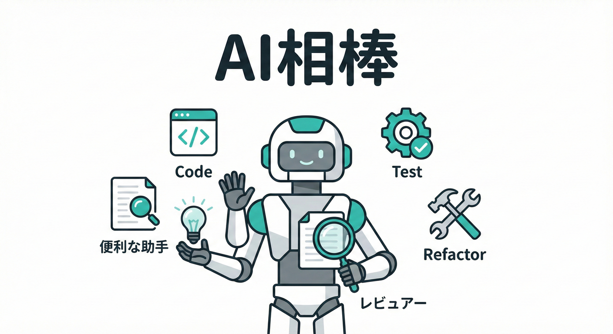

# 第09章：AI拡張を前提にした進め方🤖🧠

## この章でできるようになること🎓✨

* AIに「雛形作り🧩」「命名案📝」「テスト案🧪」「リファクタ案🧹」を手伝ってもらいながら、ドメインイベント学習を爆速に進める🚀
* でも「設計の判断🎯（何をイベントにする？粒度は？）」は人が握る感覚が身につく🤝
* 生成コードを“自分の言葉”で説明できるようにする💬✨（これが最強の安全装置🔒）

---

## 9.1 AIは“便利な相棒”🧑‍🤝‍🧑 但し、目的と判断は人が持つ🎯



AIが得意なのは、だいたいこのへん👇✨

* 形にする（雛形を早く作る）🏗️
* 候補を増やす（命名案・設計案をたくさん出す）🌱🌱🌱
* 抜け漏れを見つける（テスト観点・例外系）🔎
* 文章化する（コメント・README）📝

逆に、AIに丸投げしないほうがいいのは👇⚠️

* 「何を大事にする設計か」(変更に強い？厳密性？運用重視？) 🧭
* ドメイン用語の最終決定（用語のズレはバグの種🌰）
* “その業務として正しいか”の判断（ここは人間の仕事💡）

---

## 9.2 Visual StudioのCopilot：AskモードとAgentモードの使い分け🧠🧰

Visual StudioのCopilotには、ざっくり「安全に相談するモード」と「作業してくれるモード」があるよ🙂

### Askモード🗣️（安全第一✨）

* 相談・質問・案だし向き🙆‍♀️
* コード変更は「自分がApplyするまで勝手に入らない」感覚で使える💡 ([Microsoft Learn][1])

### Agentモード🤖（作業相棒✨）

* 「高レベルのタスク」を投げると、計画を立てて🗺️、複数ファイルを編集して🧩、コマンド実行も提案して⌨️、エラーやテスト失敗を見て直しにいく…みたいな動きができる🛠️ ([Microsoft Learn][1])
* ただし、ターミナルコマンド実行や追加ツール利用は“確認”を求める仕組みになってるので、そこはちゃんと目で見てOK/NGを出す✅ ([Microsoft Learn][1])
* 「Copilot Edits」の進化版として位置づけられてるよ📈 ([Microsoft Learn][1])

### どっちをいつ使う？🔁

* 命名や設計相談・理解の確認 → **Ask** が安心🫶 ([Microsoft Learn][1])
* ルールが固まって、雛形生成や機械作業を任せたい → **Agent** が強い💪 ([Microsoft Learn][1])

---

## 9.3 AIと安全に走るための“7つのルール”🏁🔒✨

1. **秘密は貼らない**🙅‍♀️🔑（APIキー、接続文字列、個人情報…）
2. **一回で全部やらせない**✂️（小さく依頼→小さくレビュー）
3. **差分レビュー前提**👀（「何が変わった？」を必ず見る）
4. **ドメイン層に“外の都合”を入れない**🚫🔌（DbContext/Http/EF属性など）
5. **テスト or 最低でもビルド**🧪🏗️（AIの“それっぽい”を落とす）
6. **定義（目的・制約・DoD）を先に書く**🧾（後述テンプレが超効く）
7. **最後は“自分の言葉で説明”**💬（説明できないものは採用しない）

---

## 9.4 ドメインイベント学習での“AIの使いどころ”5選🔔✨

ドメインイベント初心者だと、ここで詰まりやすいのね😵‍💫
だからAIをこう使うと気持ちよく進むよ👇🎀

1. **イベント候補を出してもらう**💡

* 例：「注文〜支払い〜発送」だと何が“起きた事実”？って候補を増やす🌱

2. **イベント名を整える**📝

* 過去形＋ドメイン語彙（OrderPaid / OrderPlaced みたいな）🔙

3. **イベントの“中身（ペイロード）”を絞る**📦✂️

* 「ID・発生時刻・必要最小限の値」だけにする練習🧘‍♀️

4. **雛形コード（インターフェース/クラス）を作る**🏗️

* 形があると理解が進むの、ほんとあるある🙂

5. **テスト観点を出してもらう**🧪

* 「何を確認すれば“仕様”になる？」を埋める🔎✨

---

## 9.5 “良いプロンプト”3種類（雛形/レビュー/テスト）📝🤖🧪

### 共通テンプレ（これだけで精度が上がる💎）

* **Goal（目的）**🎯
* **Context（状況）**🗺️（例：ミニEC、Order集約など）
* **Constraints（制約）**🧷（例：ドメイン層はI/O禁止、イベントは最小ペイロード）
* **Definition of Done（完成条件）**✅（例：ビルドOK、テスト1本、命名が過去形）

---

### ① 雛形生成プロンプト🏗️🧩

```text
Goal:
  ドメインイベントの最小構成の雛形をC#で用意したい。

Context:
  ミニECのOrder集約で、支払い完了時に OrderPaid というドメインイベントを発生させたい。
  Order は Aggregate Root として扱う想定。

Constraints:
  - Domain層はI/O禁止（DB/HTTP/EF属性/Logger等を入れない）
  - イベントは「起きた事実」。命令っぽい名前にしない
  - ペイロードは最小（OrderId, OccurredAt, Amount くらいまで）
  - 依存を増やさない（小さく）

Definition of Done:
  - IDomainEvent と OrderPaid の例
  - Order 側にイベントを溜める仕組み（Listなど）と、MarkAsPaid() 内で追加する例
  - コードはコンパイル可能な形
出力はコードだけでOK。
```

👉 ここでAIが出したコードは、“完成品”じゃなくて“土台”として使うのがコツだよ🧱✨

---

### ② レビュープロンプト🔎🧠

```text
次のC#コードをレビューしてね。

観点:
- ドメインイベントが「事実」になっている？（命令っぽくない？）
- ドメイン層がインフラ都合（DB/HTTP/EF/Logger）に汚染されてない？
- イベントのペイロードが太りすぎてない？
- メソッド名やクラス名がドメイン語彙として自然？
- 修正案があれば、変更理由つきで提案してね（差分が小さい順に）。
```

---

### ③ テスト案プロンプト🧪🧾

```text
Order.MarkAsPaid() のドメイン単体テスト観点を考えて。
前提:
- MarkAsPaid() が成功したら、OrderPaid イベントが追加される
- すでに支払い済みなら例外、または結果として失敗（どちらでも良いので案を2つ）

欲しい出力:
1) テストケース一覧（Given/When/Then）
2) その中で最重要の1本を、xUnitでテストコード例として提示
3) “テストが仕様になる”ように、意図をコメントで一言入れて
```

---

## 9.6 AIの出力を採用する前の“ドメインイベント用チェックリスト”✅🔔

### イベント設計チェック🔔

* [ ] 名前が**過去形の事実**になってる？（Paid / Placed / Shipped…）🕒
* [ ] 「〜しろ」っぽい命令が混ざってない？（PayOrder みたいなのは注意⚠️）
* [ ] ペイロードが**最小**？（集約まるごと入れてない？🐘💦）
* [ ] イベントが“通知の都合”だけで作られてない？（メール送信のためだけ…とか）📧→⚠️

### 層の分離チェック🏗️

* [ ] Domainに DB/HTTP/EF/外部SDK が入り込んでない？🚫
* [ ] Domainは「ルール」と「状態」と「事実」に集中してる？❤️

### 品質チェック🧪

* [ ] ビルドが通る🏗️
* [ ] 最低1本、イベント発生を確認するテストがある🧪
* [ ] 自分の言葉で「なぜこの設計？」が言える💬✨

---

## 9.7 15分ミニ演習⏱️🛒：「OrderPaid」まで一気に体験する✨

### Step 1：イベント候補を出す💡🔔

Askでこう聞く👇

* 「注文〜支払い〜発送」で“起きた事実”の候補を10個出して
* それぞれ、**誰にとって意味がある事実？**も一言添えて🙂

### 9.2 プロンプトのコツ（AIに伝える技術）✍️🪄


AIに良いコードを出してもらうには、「伝え方（プロンプト）」にコツがあります。
👉 出てきたコードは、まず **命名** と **ペイロード** だけ集中レビュー👀✨

### Step 3：テストを作る🧪

「テスト案プロンプト」で、最重要の1本を作る✅

* 例：`MarkAsPaid()` → `OrderPaid` が追加される
  ここができると「イベント＝仕様」感が出て、めっちゃ気持ちいいよ🥹✨

### Step 4：レビューさせる🔎

「レビュー観点」でAIに突っ込ませる

* 直すのは **差分が小さいもの**から✂️（大改造は後回し）

---

## 9.8 “エージェントに任せる”の発展：Cloud Agent / Copilot coding agent ☁️🤖

「複数ファイルの修正」「軽いリファクタ」「ドキュメント更新」みたいな“時間が溶ける作業”は、エージェント系が刺さる場面があるよ✨

### Visual StudioのCloud Agent（プレビュー）☁️

Visual Studio 2026では、Cloud Agent Preview を有効にして、反復作業をオフロードできる流れが案内されてるよ（設定場所も具体的に書かれてる）🧰✨ ([Microsoft for Developers][2])
ただし、**最終レビューは必須**👀（PRリンクで確認しやすくする方向性も言及あり）([Microsoft for Developers][2])

### GitHub側のCopilot coding agent🧑‍💻🤖

GitHub Copilotには、Issueを割り当てると変更を作ってPRまで作る「coding agent」も案内されてるよ📌 ([GitHub Docs][3])
教材の今段階だと、いきなり常用よりも「小さなタスク」で体験がちょうど良い🙂✨

---

## 9.9 VS Code派の補足：OpenAI Codex IDE extension🧩💻

VS Code系で進めるなら、OpenAIのCodex IDE extensionが「VS Code（やその派生）で動く」こと、入手元が案内されてるよ🛍️ ([OpenAI Developers][4])

* Cursor / Windsurf みたいな VS Code fork でも動く想定が明記されてる🧠 ([OpenAI Developers][4])

（どれを使っても、**ドメインの判断は人が握る🎯**だけは同じだよ🙂）

---

## 9.10 ちいさな理解チェック🎀✅

* Q1：イベントが「命令」っぽくなってるか、どこで見分ける？🕒
* Q2：AIに雛形を作らせたとき、まず最初にチェックするポイントは？🔎
* Q3：ドメインイベントの“ペイロード”が太ると何が困る？🐘💦
* Q4：AskモードとAgentモード、使い分けの基準は？🔁 ([Microsoft Learn][1])

---

## おまけ：C#の“最新”を意識する小メモ🪄

C# 13は .NET 9 でサポートされ、最新のVisual Studioで試せる流れが公式に案内されてるよ📌 ([Microsoft Learn][5])
（この章では文法新機能より「AIで学習と実装を加速する」が主役だよ🤖✨）

[1]: https://learn.microsoft.com/en-us/visualstudio/ide/copilot-agent-mode?view=visualstudio "Use Agent Mode - Visual Studio (Windows) | Microsoft Learn"
[2]: https://devblogs.microsoft.com/visualstudio/visual-studio-november-update-visual-studio-2026-cloud-agent-preview-and-more/ "Visual Studio 2026 November 2025 Update"
[3]: https://docs.github.com/en/copilot/get-started/features "GitHub Copilot features - GitHub Docs"
[4]: https://developers.openai.com/codex/ide/ "Codex IDE extension"
[5]: https://learn.microsoft.com/en-us/dotnet/csharp/whats-new/csharp-13 "What's new in C# 13 | Microsoft Learn"
