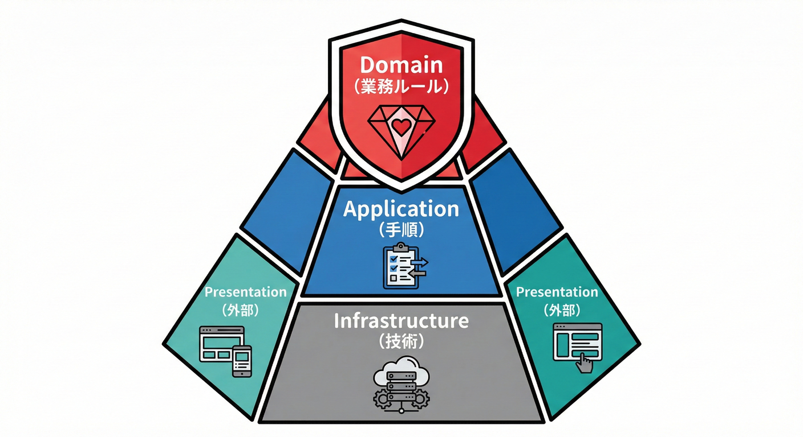
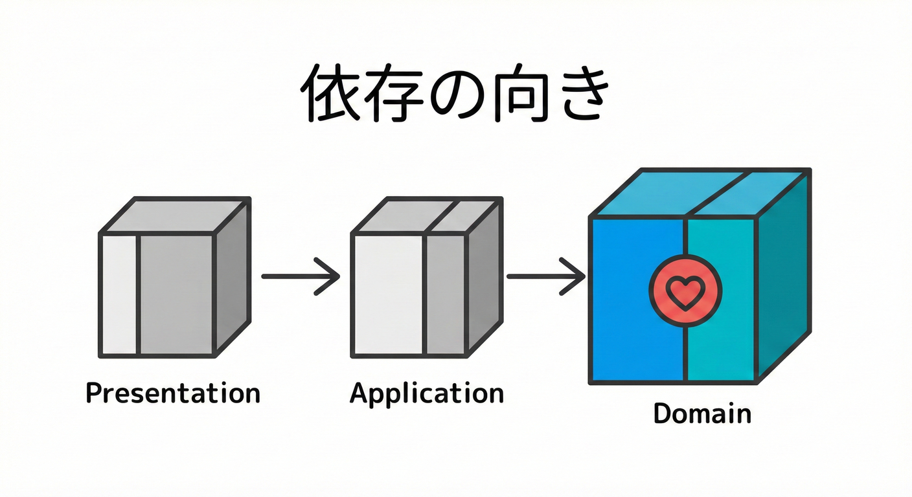
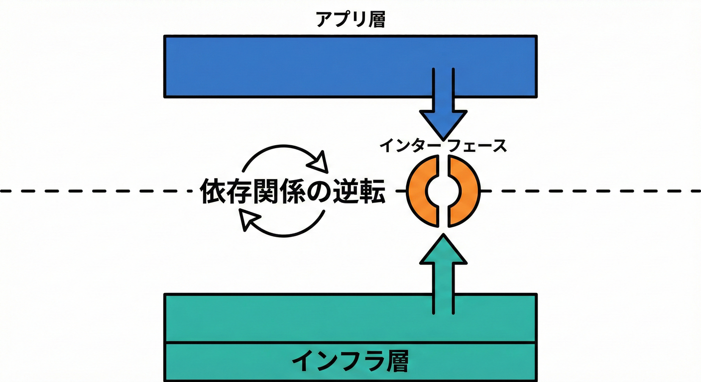

# 第10章：ソリューション構成：置き場所ルール🏠📦

## ねらい🎯

ドメインイベントを扱う前に、ソリューション（プロジェクト＆フォルダ）を「役割ごとに」分けて、**ごちゃ混ぜ地獄**を防げるようにします🧹✨
この章を終えると、次ができるようになります👇

* 「これは Domain？ Application？ Infrastructure？ Presentation？」を迷わず仕分けできる🗂️
* **ドメインにDBやHTTPの型が入り込む事故**を避けられる🙅‍♀️
* 後から機能追加しても壊れにくい“増築OKな家”になる🏡🔧

---

## 10.1 なぜ「置き場所」がそんなに大事？😵‍💫➡️😌

ドメインイベントって、「起きた事実」を表すキレイな仕組みなんだけど…
置き場所がバラバラだと、すぐこうなります👇

* **DomainがEF Coreに依存** → いつの間にか「業務ルール」がDB都合に引っ張られる🪤
* **UI（API）でビジネス判断** → 仕様変更のたびに画面やコントローラが肥大化🐘💦
* **どこに何があるか不明** → 追加機能のたびに探し物タイム🔍🕒

だから最初に、**“建物の間取り”を決める**のが最強です🏠✨

---

## 10.2 4つの階層（レイヤー）🧱🏰



この教材では、一般的に使われる以下の4つの層に分けて考えます。
（あとで微調整OK）🙂🎀

### Domain（ドメイン）❤️

**「業務のルール」そのもの**を置く場所

* Entity / ValueObject / Aggregate
* 不変条件（Invariants）🔐
* **Domain Events（起きた事実）🔔** ← ここが超重要！

✅ Domainの合言葉：
**「業務ルールだけ。技術の詳細は持ち込まない」**🙅‍♀️

---

### Application（アプリケーション）🧠

**「ユースケース（やりたいことの手順）」**を置く場所

* 注文を確定する、支払いを反映する…みたいな手順🛒➡️💳
* Domainを呼び出す
* “外部にお願いすること”の**インターフェース**（例：メール送信、決済、リポジトリ）📮

✅ Applicationの合言葉：
**「何をするか（手順）を書く。どうやるか（実装詳細）は知らない」**🎯

---

### Infrastructure（インフラ）🔌

**「どうやって実現するか（技術の詳細）」**を置く場所

* EF Core の DbContext 🗃️
* Repositoryの実装
* メール送信の実装📧
* イベントを配る仕組み（ディスパッチャ）の実装など📣

✅ Infrastructureの合言葉：
**「Applicationが決めた“お願いごと”を、現実の技術で叶える」**🛠️✨

---

### Presentation（プレゼンテーション）🖥️

**「ユーザーとの接点」**を置く場所

* Web API（Controller / Minimal API）🌐
* 画面（もし作るなら）
* リクエスト/レスポンスDTOなど📨

✅ Presentationの合言葉：
**「入力を受けて、Applicationのユースケースを呼ぶだけ」**📣➡️🧠

---

### 10.3 階層と依存関係のルール🧭📏



一番大事なルールはこれです👇

```text
Presentation  →  Application  →  Domain
      ↓               ↓
Infrastructure ───────┘
```

* **Domainは誰にも依存しない**（最強の中心）💎
* ApplicationはDomainに依存してOK
* InfrastructureとPresentationは外側なので、内側（Application/Domain）に依存してOK

この考え方は「依存関係ルール（Dependency Rule）」としてクリーンアーキテクチャ等で定番です🏛️✨（C#/.NETではプロジェクト参照で守りやすいよ〜）

---

## 10.4 “置き場所ルール” 7か条📜✨（迷ったらここ）

### ルール1：Domainに「EF Core」「ASP.NET」の型を入れない🙅‍♀️

* `DbContext` / `HttpContext` / `ControllerBase` とかはDomain禁止🈲
* Domainは **純粋なC#の型**だけで表現するのが理想✨

### ルール2：Domain EventsはDomainに置く🔔

* 例：`OrderPaid` / `OrderPlaced`
* 「起きた事実」は業務の中心だから❤️

### ルール3：Applicationは“手順”を書く🧠📋

* 例：`PayOrderUseCase` が `Order.MarkAsPaid()` を呼ぶ
* どのイベントが出たか回収して配る…みたいな「流れ」もここに置きやすい

### ルール4：Applicationは“お願い（I/F）”を定義する📮

* 例：`IEmailSender` / `IOrderRepository`
* 実装はInfrastructureへ✨

### ルール5：Infrastructureは実装の置き場🔌

* 例：`EfOrderRepository : IOrderRepository`
* 例：`SmtpEmailSender : IEmailSender`

### ルール6：Presentationは薄く！入力→ユースケース呼び出し🪶

* Controllerでif地獄を作らない🙅‍♀️
* 変換（DTO⇄コマンド）はOK、ビジネス判断はApplication/Domainへ🎯

### ルール7：プロジェクト参照で“物理的に”守る🧱



「気をつけます」より「参照できなくする」のが強い💪✨

* Domain：参照なし
* Application → Domain
* Infrastructure → Application / Domain
* Presentation → Application（必要ならDomainの参照は避けるのが無難🙂）

---

## 10.5 ミニECでの“置き場所”例🛒📦

### Domainに置くもの❤️

* `Order`（集約ルート）
* `OrderId` / `Money`（値オブジェクト）
* `OrderStatus`
* `OrderPaid`（ドメインイベント）🔔

### Applicationに置くもの🧠

* `PayOrderUseCase`（支払い反映のユースケース）
* `IOrderRepository`
* `IDomainEventDispatcher`（イベント配信の抽象）📣
* `OrderPaidHandler`（まずはアプリ層に置くのが学習しやすい🎀）

### Infrastructureに置くもの🔌

* `AppDbContext`（EF Core）
* `EfOrderRepository`
* `InProcessDomainEventDispatcher` の実装
* `EmailSender` の実装📧

### Presentationに置くもの🖥️

* `OrdersController` or Minimal API endpoints
* Request/Response DTO 📩

---

## 10.6 やってみよう🛠️：ソリューション＆プロジェクトを作る（最小構成）🏗️✨

ここは「型」を先に作って、あとで中身を埋めていくよ〜🙂🌸

### ① ソリューションと4プロジェクト（例：MiniECommerce）

```powershell
dotnet new sln -n MiniECommerce

dotnet new classlib -n MiniECommerce.Domain
dotnet new classlib -n MiniECommerce.Application
dotnet new classlib -n MiniECommerce.Infrastructure
dotnet new webapi  -n MiniECommerce.Presentation

dotnet sln MiniECommerce.sln add `
  MiniECommerce.Domain/MiniECommerce.Domain.csproj `
  MiniECommerce.Application/MiniECommerce.Application.csproj `
  MiniECommerce.Infrastructure/MiniECommerce.Infrastructure.csproj `
  MiniECommerce.Presentation/MiniECommerce.Presentation.csproj
```

### ② 参照（依存の向き）を固定する🧲

```powershell
dotnet add MiniECommerce.Application/MiniECommerce.Application.csproj reference `
  MiniECommerce.Domain/MiniECommerce.Domain.csproj

dotnet add MiniECommerce.Infrastructure/MiniECommerce.Infrastructure.csproj reference `
  MiniECommerce.Application/MiniECommerce.Application.csproj `
  MiniECommerce.Domain/MiniECommerce.Domain.csproj

dotnet add MiniECommerce.Presentation/MiniECommerce.Presentation.csproj reference `
  MiniECommerce.Application/MiniECommerce.Application.csproj
```

✅ これで「DomainがInfrastructureを参照しちゃう事故」が起きにくくなります🧯✨
（.NET 10 は 2025-11-11 にリリースされ、2026-01-13 時点で 10.0.2 が案内されています。）([Microsoft][1])

---

## 10.7 フォルダ構成の例🗂️✨（“どこに置くか”が一目でわかる）

### Domain

```text
MiniECommerce.Domain
├─ Orders
│  ├─ Order.cs
│  ├─ OrderId.cs
│  ├─ OrderStatus.cs
│  └─ Money.cs
└─ Events
   ├─ IDomainEvent.cs
   └─ OrderPaid.cs
```

### Application

```text
MiniECommerce.Application
├─ Orders
│  ├─ PayOrderUseCase.cs
│  └─ Dtos
├─ Abstractions
│  ├─ IOrderRepository.cs
│  └─ IDomainEventDispatcher.cs
└─ EventHandlers
   └─ OrderPaid
      ├─ SendReceiptEmailHandler.cs
      └─ AddPointsHandler.cs
```

### Infrastructure

```text
MiniECommerce.Infrastructure
├─ Persistence
│  ├─ AppDbContext.cs
│  └─ EfOrderRepository.cs
├─ Messaging
│  └─ InProcessDomainEventDispatcher.cs
└─ Email
   └─ SmtpEmailSender.cs
```

### Presentation

```text
MiniECommerce.Presentation
├─ Endpoints (or Controllers)
├─ Contracts (Request/Response DTO)
└─ Program.cs
```

---

## 10.8 迷ったらこの3問だけ🙂❓

1. **これは業務ルール？（不変条件・状態・意味）** → Domain❤️
2. **これは手順？（ユースケースの流れ）** → Application🧠
3. **これは技術詳細？（DB/HTTP/外部サービス）** → Infrastructure🔌 / Presentation🖥️

---

## 10.9 C# 14 / Visual Studio の“今”メモ🆕✨（作り方に影響するところだけ）

* **C# 14 は .NET 10 でサポート**されています。([Microsoft Learn][2])
* Visual Studio は **2026系のリリースノート**が提供されています（C#/.NETの最新追従に関係しやすい）。([Microsoft Learn][3])
* Visual Studio 2022 系のリリース履歴では、2026-01-13 時点で **17.14.24** が “Current” として案内されています。([Microsoft Learn][4])

---

## 10.10 AI拡張で“置き場所チェック”を自動化🤖✅

設計初心者ほど、AIに「分類」させるとミスが減ります✨
（ただし最終判断は“目的”から人が決めるのが大事🎯）

### 使えるプロンプト例📝

```text
次のクラス（またはファイル）は Domain / Application / Infrastructure / Presentation のどこに置くべき？
理由を「業務ルール」「手順」「技術詳細」「UI」の観点で短く説明して。

コード：
（ここに貼る）
```

```text
Domainに置いてはいけない依存（DbContext, HttpContext, Controller 等）が紛れてないかレビューして。
問題があるなら「移動先」と「置き換えるインターフェース案」も提案して。
```

---

## 10.11 チェック✅（ミニテスト🎮✨）

次の“置き場所”はどれ？（Domain / Application / Infrastructure / Presentation）

1. `OrderPaid`（支払い完了の事実）🔔
2. `PayOrderUseCase`（支払い反映の手順）🧠
3. `EfOrderRepository`（EF Coreで注文を保存）🗃️
4. `OrdersController`（APIで支払いリクエスト受付）🌐

**答え**👇

1. Domain ❤️　2) Application 🧠　3) Infrastructure 🔌　4) Presentation 🖥️

---

## まとめ🧁✨

* **4分割（Domain / Application / Infrastructure / Presentation）**で迷子を防ぐ🗺️
* **依存は外→内**、Domainは孤高の存在💎
* **ドメインイベントはDomain**、配り方や外部連携は外側へ📣🔌
* 置き場所は「気合」じゃなく **プロジェクト参照で物理ガード**が最強🧱💪

[1]: https://dotnet.microsoft.com/en-us/platform/support/policy?utm_source=chatgpt.com "The official .NET support policy"
[2]: https://learn.microsoft.com/en-us/dotnet/csharp/whats-new/csharp-14?utm_source=chatgpt.com "What's new in C# 14"
[3]: https://learn.microsoft.com/en-us/visualstudio/releases/2026/release-notes?utm_source=chatgpt.com "Visual Studio 2026 Release Notes"
[4]: https://learn.microsoft.com/en-us/visualstudio/releases/2022/release-history?utm_source=chatgpt.com "Visual Studio 2022 Release History"
