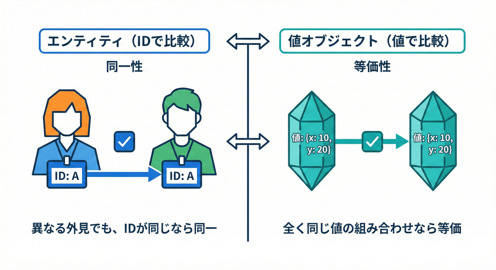
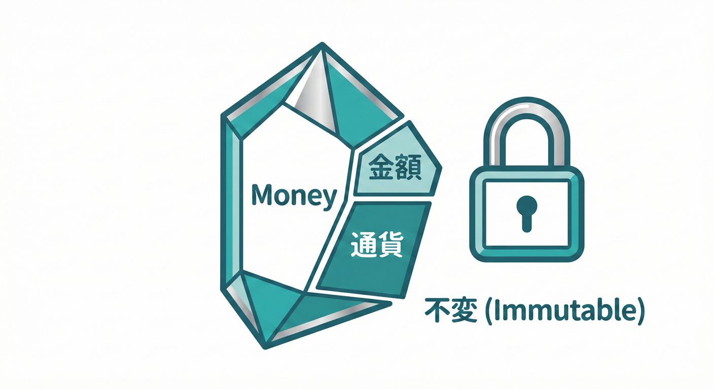

# 第11章：ドメインモデル入門：EntityとValueObject🌸

## この章のゴール🎯✨

* **Entity（エンティティ）**と**ValueObject（値オブジェクト）**を、迷わず区別できるようになる🧠💡
* ミニEC題材で **Order / OrderId / Money / Address** を「それっぽく」設計できるようになる🛒📦
* 次章以降の **ドメインイベント**に備えて、「モデルが崩れにくい土台」を作る🏗️🔔

> 例では **.NET 10（LTS）+ C# 14** を使うよ🪄（C# 14 は .NET 10 で利用できる） ([Microsoft][1])

---

## まず結論：Entity と ValueObject の違い🧩🤝

### 11.2 エンティティ（Entity）：IDが命🧬✨



エンティティは、**「ID（識別子）が同じなら、中身が多少変わっても同じもの」**として扱うオブジェクトです。

* 例：注文（Order）、ユーザー、商品、支払い など🛒👤
* 中身（住所や合計金額）が変わっても、**同じIDなら同じもの**
* ライフサイクル（生まれる→更新→消える）がある🌱➡️🔁➡️🗑️

✅ **合言葉**：**「あなたは誰？」→ ID で答える** 🪪✨

---

### 11.3 値オブジェクト（ValueObject）：中身がすべて💎✨



値オブジェクトは、**「中身（値）が同じなら、同じもの」**として扱うオブジェクトです。

* 例：金額（Money）、住所（Address）、メールアドレス、期間、座標 など💰🏠✉️
* **値が同じなら同じもの**（等価性）
* できるだけ **不変（immutable）** が基本🔒（作ったら変えない）

✅ **合言葉**：**「同じ値？」→ 値で答える** 💎✨

---

## 見分け方の超カンタン表💡📝

* **ID が必要**なら → Entity の可能性が高い🪪
* **値が同じなら同じ扱い**したい → ValueObject の可能性が高い💎
* **更新は “作り直し”** が自然 → ValueObject🔁
* **履歴や状態（Status）を持つ** → Entity🔁📌

---

## ミニECでの登場人物（第11章）🛒📦

### ここで作るモデルたち👩‍💻✨

* **Order（注文）**：Entity 🪪
* **OrderId（注文ID）**：ValueObject “っぽい” ID型（型安全にするやつ）🔖
* **Money（金額）**：ValueObject 💰
* **Address（住所）**：ValueObject 🏠

イメージはこんな感じ👇✨

* Order（Entity）

  * Id : OrderId（VO）
  * ShippingAddress : Address（VO）
  * Total : Money（VO）
  * Status : OrderStatus（状態）🔁

---

## 実装してみよう🛠️✨（OrderId / Money / Address / Order）

### 1) OrderId（“IDの取り違え”防止用）🔖✨

「Guid をそのまま渡す」だと、うっかり別IDを入れてもコンパイルが通っちゃう😱
だから **OrderId 専用の型**にして守るよ🛡️

```csharp
namespace MiniECommerce.Domain.Orders;

public readonly record struct OrderId(Guid Value)
{
    public static OrderId New() => new(Guid.NewGuid());

    public override string ToString() => Value.ToString("N");
}
```

ポイント✅

* `record struct` なので **値が同じなら同じ** になりやすい（等価性）💎
* `Guid` の生渡しより、読みやすく安全🧤✨

---

### 2) Money（値オブジェクトの王道💰✨）

金額は「ただの decimal」じゃなくて、**意味のある Money** にする🎀

```csharp
namespace MiniECommerce.Domain.Common;

public readonly record struct Money
{
    public decimal Amount { get; }
    public string Currency { get; }

    public Money(decimal amount, string currency)
    {
        if (amount < 0)
            throw new ArgumentOutOfRangeException(nameof(amount), "Amount must be >= 0.");

        if (string.IsNullOrWhiteSpace(currency))
            throw new ArgumentException("Currency is required.", nameof(currency));

        Amount = amount;
        Currency = currency.Trim().ToUpperInvariant();
    }

    public static Money Jpy(decimal amount) => new(amount, "JPY");

    public static Money operator +(Money a, Money b)
    {
        if (a.Currency != b.Currency)
            throw new InvalidOperationException("Currency mismatch.");

        return new Money(a.Amount + b.Amount, a.Currency);
    }

    public override string ToString() => $"{Amount} {Currency}";
}
```

チェック✅

* **マイナス金額は禁止**🙅‍♀️💥（不変条件）
* 通貨が違う足し算を防げる🧯（事故りやすいところ！）

---

### 3) Address（住所は「ひとまとまりの意味」🏠✨）

住所を `string` 4つでバラバラに持つと、渡し間違い・空文字・半端な状態が増える😵‍💫
だから Address にまとめる🧺✨

```csharp
namespace MiniECommerce.Domain.Common;

public sealed record Address
{
    public string PostalCode { get; }
    public string Prefecture { get; }
    public string City { get; }
    public string Line1 { get; }
    public string? Line2 { get; }

    private Address(string postalCode, string prefecture, string city, string line1, string? line2)
    {
        PostalCode = postalCode;
        Prefecture = prefecture;
        City = city;
        Line1 = line1;
        Line2 = line2;
    }

    public static Address Create(string postalCode, string prefecture, string city, string line1, string? line2 = null)
    {
        postalCode = (postalCode ?? "").Trim();
        prefecture = (prefecture ?? "").Trim();
        city = (city ?? "").Trim();
        line1 = (line1 ?? "").Trim();
        line2 = string.IsNullOrWhiteSpace(line2) ? null : line2.Trim();

        if (postalCode.Length == 0) throw new ArgumentException("PostalCode is required.", nameof(postalCode));
        if (prefecture.Length == 0) throw new ArgumentException("Prefecture is required.", nameof(prefecture));
        if (city.Length == 0) throw new ArgumentException("City is required.", nameof(city));
        if (line1.Length == 0) throw new ArgumentException("Line1 is required.", nameof(line1));

        return new Address(postalCode, prefecture, city, line1, line2);
    }

    public override string ToString()
        => Line2 is null
            ? $"{PostalCode} {Prefecture}{City}{Line1}"
            : $"{PostalCode} {Prefecture}{City}{Line1} {Line2}";
}
```

ポイント✅

* **中途半端な住所を作れない**🚫
* 変更したいときは「新しい Address を作って差し替え」しやすい🔁✨（不変っぽく扱える）

---

### 4) Order（エンティティ：IDで追う🪪✨）

Order は「状態が変わる」し「ライフサイクルがある」ので Entity ✅
（ドメインイベントは次の章で本格的にやるから、ここでは土台だけ💞）

```csharp
using MiniECommerce.Domain.Common;

namespace MiniECommerce.Domain.Orders;

public enum OrderStatus
{
    Draft,     // 下書き（カート状態）
    Placed,    // 注文確定
    Paid,      // 支払い完了
    Shipped    // 発送済み
}

public sealed class Order
{
    private readonly List<OrderLine> _lines = new();

    public OrderId Id { get; }
    public OrderStatus Status { get; private set; }
    public Address ShippingAddress { get; private set; }

    public IReadOnlyList<OrderLine> Lines => _lines;

    public Money Total
    {
        get
        {
            var sum = Money.Jpy(0);
            foreach (var line in _lines)
                sum += line.Subtotal;

            return sum;
        }
    }

    private Order(OrderId id, Address shippingAddress)
    {
        Id = id;
        ShippingAddress = shippingAddress;
        Status = OrderStatus.Draft;
    }

    public static Order Create(Address shippingAddress)
        => new(OrderId.New(), shippingAddress);

    public void AddItem(string sku, int quantity, Money unitPrice)
    {
        if (Status != OrderStatus.Draft)
            throw new InvalidOperationException("You can add items only while Draft.");

        sku = (sku ?? "").Trim();
        if (sku.Length == 0) throw new ArgumentException("SKU is required.", nameof(sku));
        if (quantity <= 0) throw new ArgumentOutOfRangeException(nameof(quantity), "Quantity must be >= 1.");

        _lines.Add(new OrderLine(sku, quantity, unitPrice));
    }

    public void Place()
    {
        if (Status != OrderStatus.Draft)
            throw new InvalidOperationException("Only Draft can be placed.");

        if (_lines.Count == 0)
            throw new InvalidOperationException("Order must have at least 1 line item.");

        Status = OrderStatus.Placed;
        // 第14章以降：ここで OrderPlaced イベントを “溜める/発火” できるようになるよ🔔✨
    }

    public void ChangeShippingAddress(Address newAddress)
    {
        if (Status != OrderStatus.Draft)
            throw new InvalidOperationException("Address can be changed only while Draft.");

        ShippingAddress = newAddress;
    }
}

public readonly record struct OrderLine(string Sku, int Quantity, Money UnitPrice)
{
    public Money Subtotal => new Money(UnitPrice.Amount * Quantity, UnitPrice.Currency);
}
```

チェック✅

* 更新の入口は **Order のメソッド**に寄せる🚪✨（散らすと壊れやすい）
* `Status` がある＝ Entity っぽい🔁
* `Money` / `Address` は ValueObject として **そのまま使い回せる**💎

---

## 体験：等価性がぜんぜん違うよ🧪✨

### ValueObject（Money）は「値が同じなら同じ」💎

```csharp
var a = Money.Jpy(1000);
var b = Money.Jpy(1000);

Console.WriteLine(a == b); // True ✅（値が同じ）
```

### Entity（Order）は「IDが同じなら同じ」🪪

`Order` は class なので、何もしないと参照比較になりがち。
DDDでは「同一性＝ID」を意識して、比較したいときは **Id を見る**のがシンプル🧠✨

```csharp
var order1 = Order.Create(Address.Create("100-0001", "東京都", "千代田区", "千代田1-1"));
var order2 = Order.Create(Address.Create("100-0001", "東京都", "千代田区", "千代田1-1"));

Console.WriteLine(order1.Id == order2.Id); // False（別の注文）
```

---

## 値オブジェクトを“不変に寄せる”コツ🔒✨（バグ減りがち！）

* `public set;` を作らない🙅‍♀️
* 変更が必要なら「新しいインスタンスを作って差し替え」🔁
* **生成時にバリデーション**（空文字・マイナス禁止など）✅
* 「とりあえず string」より **意味のある型**にする🎀

---

## よくある失敗あるある😵‍💫💥

1. **何でも Entity にしちゃう**

* Money に ID が生える→「同じ1000円なのに別物？」みたいに混乱しがち💦

2. **ValueObject が太る**🐘

* Address の中に「配送会社API呼び出し」みたいなのを入れるのはNG🙅‍♀️
* ValueObject は “値とルール” に集中しよう🎯

3. **UI/DB の都合で型を決める**📦➡️🧠

* 「DBが varchar だから string」だけで終わらない
* “意味” をコード側に置くのがドメインモデルの気持ち❤️

---

## やってみよう🛠️🎀（ミニ課題）

### 課題1：分類ゲーム🎮✨

次を **Entity / ValueObject** に分けてみてね👇

* Customer（顧客）👤
* EmailAddress（メール）✉️
* ProductId（商品ID）🔖
* DiscountRate（割引率）🏷️
* Shipment（発送）🚚
* Money（金額）💰
* OrderLine（注文明細）🧾
* Address（住所）🏠

✅ 目安：IDで追う？ 値が同じなら同じ？ を考える🧠✨

---

### 課題2：Money をちょい強化💰🛠️

* `Multiply(int n)` を追加（数量かけ算）
* `Currency` が違うときの足し算をテストで確認🧪

---

### 課題3：Order の不変条件を1つ追加🔐

例：

* `Total` が 0 のまま `Place()` できない（今でもできないけど、理由メッセージを改善するとか）🙂
* `Quantity` の上限（例：999）を決める📏

---

## すぐ書けるミニテスト（xUnit）🧪✨

```csharp
using MiniECommerce.Domain.Common;
using MiniECommerce.Domain.Orders;
using Xunit;

public class DomainModelTests
{
    [Fact]
    public void Money_WithSameAmountAndCurrency_IsEqual()
    {
        var a = Money.Jpy(1000);
        var b = Money.Jpy(1000);

        Assert.Equal(a, b);
    }

    [Fact]
    public void Money_Add_WithDifferentCurrency_Throws()
    {
        var jpy = new Money(1000, "JPY");
        var usd = new Money(10, "USD");

        Assert.Throws<InvalidOperationException>(() => _ = jpy + usd);
    }

    [Fact]
    public void Address_Create_WithBlank_Throws()
    {
        Assert.Throws<ArgumentException>(() =>
            Address.Create("", "東京都", "千代田区", "千代田1-1"));
    }

    [Fact]
    public void Order_Place_WithoutLines_Throws()
    {
        var address = Address.Create("100-0001", "東京都", "千代田区", "千代田1-1");
        var order = Order.Create(address);

        Assert.Throws<InvalidOperationException>(() => order.Place());
    }
}
```

チェック✅

* ドメイン層だけのテストは **爆速**🏃‍♀️💨
* 「仕様＝テスト」っぽくなって気持ちいいやつ✨

---

## この章のまとめ🌸✅

* **Entity**＝IDで追う（同一性）🪪
* **ValueObject**＝値で比べる（等価性）💎
* ValueObject を **不変に寄せる**と、バグが減りがち🔒✨
* Order（Entity）を“更新の入口”にして、次章以降の **イベント発生地点**を作る土台になる🔔🏗️

[1]: https://dotnet.microsoft.com/en-us/platform/support/policy/dotnet-core?utm_source=chatgpt.com ".NET and .NET Core official support policy | .NET"
