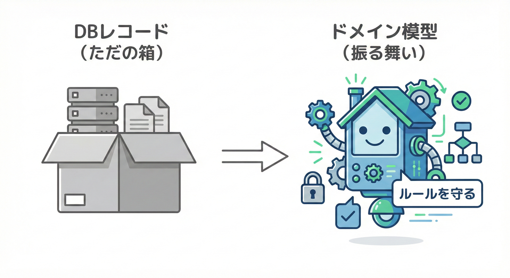
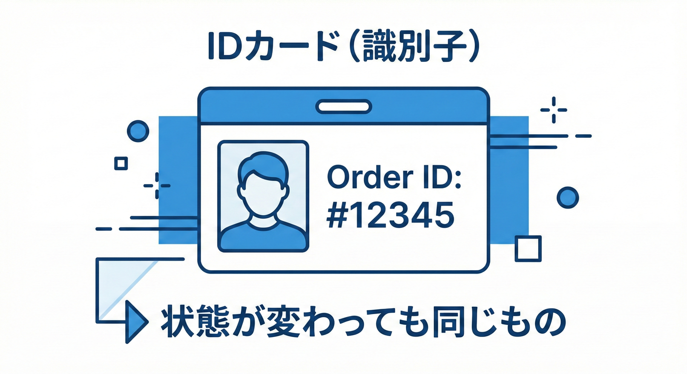

# 第12章 不変条件（Invariants）の置き方🔐✨

## 12.1 不変条件（Invariants）って何？🛡️🔐



ドメインモデルの中に、**「常に正しくなければならないルール」**（不変条件）を埋め込みます。
**不変条件（Invariant）**は、ドメインモデル（たとえば Order）が **いつ見ても必ず守っていてほしいルール** のことだよ💡
つまり、

* 「壊れた状態の Order を作れない」🙅‍♀️
* 「壊れた状態の Order に変化できない」🙅‍♀️

を保証するための“鍵”🔑✨

たとえばミニECだと…🛒

* 注文明細が0件の注文は存在しない🙅‍♀️
* 数量が0以下の明細は存在しない🙅‍♀️
* 支払い前に発送済みにはならない🙅‍♀️

こういうのが“不変条件”だよ🔐

---

## 12.2 不変条件を守る場所：モデルの入り口🚪✨



不変条件は、以下の場所でチェックして「不正な状態」になるのを防ぎます。

### ありがちな事故あるある🥲

* 画面からは防いだつもりなのに、別経路（API・バッチ・テスト）から壊れたデータが入る🚨
* 「DBには入ったのに、処理の途中で落ちて、注文が変な状態のまま残る」😵‍💫
* バグ調査で「この Order、どうやってこの状態になったの…？」ってなる🕵️‍♀️💦

だからこそ、**ドメインモデル自身が“自分の正しさ”を守る**のが大事なんだよ🛡️✨

---

## 12.3 置き場所の結論：不変条件は「入口」に寄せる🚪🧲

不変条件は、コードのあちこちに散らすと負けるよ…🐣💦
（if が増えて、抜け漏れが起きる…）

**結論はこれ👇**

### ✅ 不変条件の“入口”4点セット

1. **生成の入口（コンストラクタ / Factory）** 🍼
2. **更新の入口（状態変更メソッド）** 🔁
3. **値の入口（Value Object）** 💎
4. **更新の入口を1つに絞る（集約ルート）** 🧺🚪

> “とにかく入口に集約”がコツだよ🧠✨
> 中に入ったら「正しい世界」だけが広がるようにする🌏✅

ちなみに、2026年1月時点では **.NET 10（LTS）と C# 14 が最新世代**として整理されてるよ🪟✨ ([Microsoft Learn][1])
（この章の書き方も、最新のC#の流れに合わせてOKだよ🙂）

---

## 12.4 悪い置き方 vs 良い置き方（超大事）⚔️✨

### ❌ 悪い例：どこでも Order を壊せる😇💣

* public set が生えてる🌱
* いろんなサービスがそれぞれ if チェックしてる🧩
* しかも抜け漏れが出る😵‍💫

イメージ👇
「注文作る前にA画面はチェックするけど、B画面は忘れてた」みたいなやつ💥

### ✅ 良い例：Order が“自分のルール”を守る🛡️✨

* **外からは勝手に状態を変えられない** 🔒
* **Order のメソッドが、ルールを守った変更だけ許す** ✅
* チェックが “1箇所に寄る” から安全🌸

---

## 12.5 ミニECで作る：不変条件つき Order 🛒🔐

ここでは「注文を作るとき」の不変条件を **3つ**に絞って入れてみるよ✂️✨
（まず少なめに！KISSだよ🧼）

### 今回の不変条件（生成時）✅

1. **明細が1件以上** 🧾
2. **明細の数量が1以上** 🔢
3. **金額がマイナスじゃない** 💰🙅‍♀️

---

### 12.5.1 まずは Value Object：Money 💎💰

* 「金額がマイナス不可」は Money が入口で守るのがキレイ✨
* Order に “int price” を直置きすると、チェックが散りがち🥲

```csharp
namespace MiniEC.Domain;

public sealed class DomainRuleException : Exception
{
    public DomainRuleException(string message) : base(message) { }
}

public readonly record struct Money(decimal Amount, string Currency)
{
    public Money(decimal amount) : this(amount, "JPY")
    {
        if (amount < 0m)
            throw new DomainRuleException("金額はマイナスにできません💰🙅‍♀️");
    }

    public static Money Zero(string currency = "JPY") => new(0m, currency);

    public static Money operator +(Money a, Money b)
    {
        if (a.Currency != b.Currency)
            throw new DomainRuleException("通貨が違うMoneyは足せません💱🙅‍♀️");
        return new Money(a.Amount + b.Amount, a.Currency);
    }
}
```

ポイント👇🙂

* **不変条件を Money に閉じ込めた**から、他で金額チェックがほぼ要らなくなるよ🧠✨

---

### 12.5.2 OrderLine：数量チェックは“ここ”が入口🔢🧾

```csharp
namespace MiniEC.Domain;

public sealed class OrderLine
{
    public string ProductId { get; }
    public int Quantity { get; }
    public Money UnitPrice { get; }

    public OrderLine(string productId, int quantity, Money unitPrice)
    {
        if (string.IsNullOrWhiteSpace(productId))
            throw new DomainRuleException("商品IDは必須だよ🏷️");

        if (quantity <= 0)
            throw new DomainRuleException("数量は1以上だよ🔢✅");

        ProductId = productId;
        Quantity = quantity;
        UnitPrice = unitPrice;
    }

    public Money Subtotal() => new(UnitPrice.Amount * Quantity, UnitPrice.Currency);
}
```

---

### 12.5.3 Order：生成の入口で“壊れた注文”を禁止🚪🔒

ここがこの章の主役だよ🌟

```csharp
namespace MiniEC.Domain;

public enum OrderStatus
{
    Placed,   // 注文作成済み🛒
    Paid,     // 支払い済み💳
    Shipped   // 発送済み📦
}

public sealed class Order
{
    public string OrderId { get; }
    public string CustomerId { get; }
    public OrderStatus Status { get; private set; }
    private readonly List<OrderLine> _lines = new();
    public IReadOnlyList<OrderLine> Lines => _lines;

    private Order(string orderId, string customerId)
    {
        OrderId = orderId;
        CustomerId = customerId;
        Status = OrderStatus.Placed;
    }

    // ✅ 生成の入口はここだけ（Factory）🧺🚪
    public static Order Create(string orderId, string customerId, IEnumerable<OrderLine> lines)
    {
        if (string.IsNullOrWhiteSpace(orderId))
            throw new DomainRuleException("注文IDは必須だよ🪪");

        if (string.IsNullOrWhiteSpace(customerId))
            throw new DomainRuleException("顧客IDは必須だよ👤");

        var lineList = lines?.ToList() ?? new List<OrderLine>();
        if (lineList.Count == 0)
            throw new DomainRuleException("注文明細は1件以上必要だよ🧾✅");

        var order = new Order(orderId, customerId);
        order._lines.AddRange(lineList);

        // ここで「作った直後に正しい」状態になってる✅
        return order;
    }

    public Money Total()
    {
        var total = Money.Zero();
        foreach (var line in _lines)
            total += line.Subtotal();
        return total;
    }

    public void MarkAsPaid()
    {
        // ✅ 更新の入口で守る（状態遷移）🔁🔐
        if (Status != OrderStatus.Placed)
            throw new DomainRuleException("未払いの注文だけ支払い済みにできるよ💳✅");

        Status = OrderStatus.Paid;

        // 次章以降で、ここにドメインイベントを置けるようになるよ🔔✨
        // 例：AddDomainEvent(new OrderPaid(...));
    }
}
```

ここでやってること👇🙂

* **Create が唯一の生成入口**だから「明細0件」の注文が作れない🧾🙅‍♀️
* **Status は private set**だから外部から勝手に Paid にできない🔒
* **支払いのルールは MarkAsPaid の入口で守る**💳✅

---

## 12.6 “if を散らさない”ための小ワザ🧠✨

### ✅ ガード節（Guard Clause）に寄せる🚧

チェックは「先に弾く」ほうが読みやすいよ🙂
上のコードみたいに、冒頭でまとめて弾くのが◎

### ✅ “プリミティブ直置き”を減らす🧱➡️💎

* 金額 → Money
* 住所 → Address
* 注文ID → OrderId（慣れたら）

値の入口が増えるほど、モデルが強くなるよ💪✨

---

## 12.7 よくあるミス集（ここで回避！）🚨🐣

### ❌ ミス1：UIだけでチェックして安心する🙂💥

UIは“親切”のためのチェック
ドメインは“安全”のためのチェック
両方必要だよ🛡️✨

### ❌ ミス2：Order を public set だらけにする🧸💣

「どこからでも壊せる」になるよ😇

### ❌ ミス3：例外メッセージが技術っぽすぎる🤖💦

ドメイン例外は、のちのちUIに出すこともあるから
**業務の言葉**で書くと強いよ🗣️🎀

---

## 12.8 AIに手伝ってもらう（でも判断は自分）🤖🧠✨

### 使えるプロンプト例📝🌸

* 「この Order の不変条件を3〜5個、業務目線で提案して。粒度は“ユーザーが意味を感じる単位”で」🧾✨
* 「不変条件ごとに、成功ケース/失敗ケースのテスト観点を列挙して」🧪✅
* 「MarkAsPaid の状態遷移ルールを読みやすくするリファクタ案を出して」🧩✨
* 「例外メッセージを“女子大生にも伝わる日本語”に整えて」🎀🙂

※ 生成されたコードは、**不変条件が守れてるか**だけは必ず目で確認してね👀🔐

---

## 12.9 やってみよう🛠️（ミニ課題）🎮✨

### 課題1：生成時の不変条件を3つ決めよう✅🧾

次の候補から3つ選んで、Order.Create に入れてみよう🙂

* 明細は1件以上🧾
* 同じ商品IDの明細を重複させない（まとめる）🧺
* 合計金額が0円は不可（無料注文NG）💰🙅‍♀️
* 顧客IDは必須👤
* 1明細あたりの数量上限（例：99）🔢

### 課題2：更新時の不変条件を1つ追加🔁🔐

例：

* Shipped の後に Paid に戻せない📦🙅‍♀️
* Paid の前に Shipped にできない💳➡️📦（順番守る）✅

---

## 12.10 この章のチェック✅✨

* 不変条件は「モデルがいつでも守るルール」🔐
* 置き場所は **入口（生成・更新・値・集約ルート）** に寄せる🚪🧲
* public set を減らして、メソッド経由でしか変えられないようにする🔒
* こうしておくと、次章以降で **「不変条件を守った瞬間にイベントを出す」**が自然にできる🔔✨

（参考：C# 14 は .NET 10 でサポートされ、最新世代として整理されてるよ🧩✨ ([Microsoft Learn][2]) / Visual Studio 2026 でも .NET 10 / C# 14 のサポートが案内されてるよ🪟🛠️ ([Microsoft Learn][3])）

[1]: https://learn.microsoft.com/en-us/dotnet/core/whats-new/dotnet-10/overview?utm_source=chatgpt.com "What's new in .NET 10"
[2]: https://learn.microsoft.com/en-us/dotnet/csharp/whats-new/csharp-14?utm_source=chatgpt.com "What's new in C# 14"
[3]: https://learn.microsoft.com/en-us/visualstudio/releases/2026/release-notes?utm_source=chatgpt.com "Visual Studio 2026 Release Notes"
