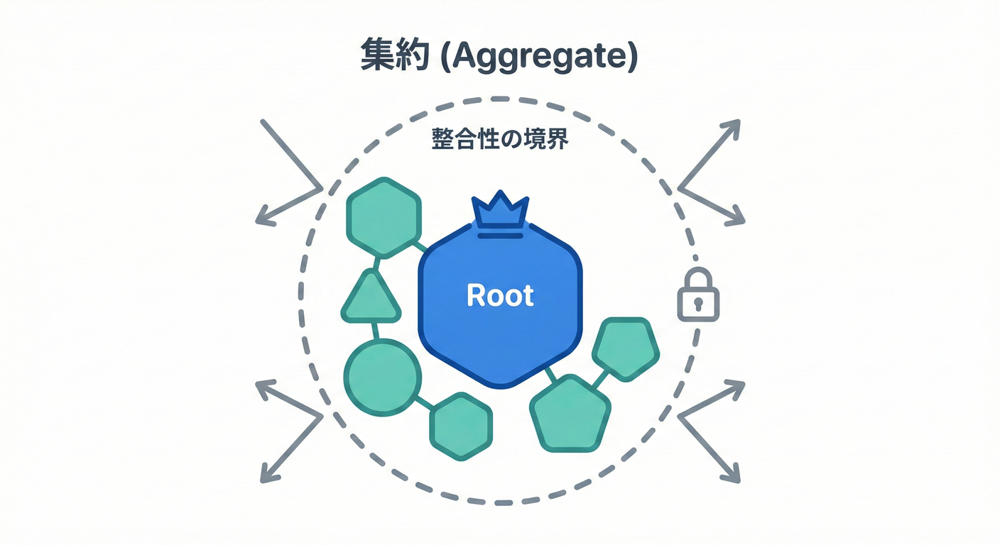
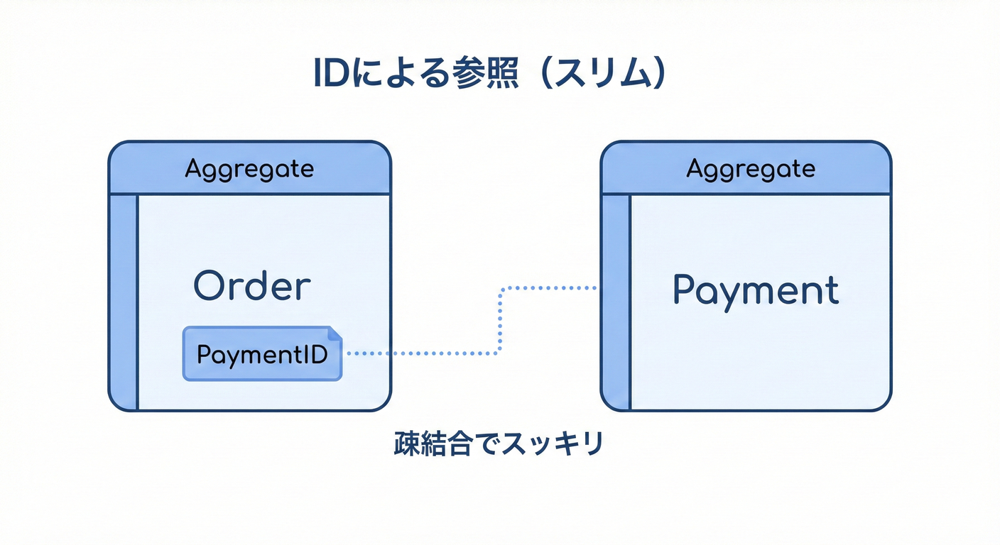

# 第13章 集約（Aggregate）と“更新の入口”🚪🧺

## この章でわかるようになること🎓✨

* 集約（Aggregate）が「何を守るための枠」なのかがわかる🧠🧺
* 「更新の入口（=集約ルートのメソッド）」を作れるようになる🚪🛠️
* ミニECの **Order集約** を設計して、イベントが起きる“場所”を固定できる🔔📍

---

## 13.1 集約（Aggregate）って何？🧱🔐



集約は、**「一つの固まりとして整合性を守るべきオブジェクトの集まり」**です。

**「この中は、必ず“いまこの瞬間”つじつまが合っててね（整合性）って守る範囲」** です🧺✨
この範囲を **整合性境界（Consistency Boundary）** と呼びます🧱🙂 ([Microsoft Learn][1])

### 13.2 集約ルート（Aggregate Root）：唯一の入り口🚪✨


集約の外部から直接いじれるのは、**「集約ルート（Aggregate Root）」**と呼ばれる親クラスだけです。
* **子エンティティ**：集約ルートの中にいる子たち👶
* **ルール**：外から更新できるのは **集約ルートだけ** 🚪✨

  * 集約ルートは、集約内の整合性を守る“門番”だよ🛡️ ([Microsoft Learn][2])

イメージはこんな感じ👇

* 🧺 = 集約（Order全体のカゴ）
* 👑 = 集約ルート（Order）
* 🍎🍞 = 子エンティティ（LineItem など）

---

## 2. なぜ集約が必要なの？（つらい未来を回避😵‍💫）

### つらい未来①：どこからでも更新できると壊れる💥

たとえば、外から `LineItem.Quantity` を直接いじれると…

* 合計金額が更新されない💸
* 割引条件が崩れる🎟️
* 「支払い済みなのに商品追加できた」みたいな事故が起きる😱

### つらい未来②：ルールが散らばって巨大メソッド化🐘

「注文確定」周りの if がアプリ全体に散って、どこが正しいかわからなくなる…😵‍💫

👉 だから集約は
**“更新の入口を1つにして”、不変条件（Invariants）をそこで守る** ためにあるんだよ🔐🚪✨

---

## 3. 集約の鉄板ルール3つ🧱✨（これだけ守ると強い！）

### ルール①：外から更新できるのは集約ルートだけ👑🚪

* ✅ `Order.AddItem(...)` はOK
* ❌ `order.LineItems[0].Quantity++` みたいな直いじりはNG🙅‍♀️

### ルール②：集約内の子は“内側”に閉じ込める🔒

* `List<LineItem>` を外にそのまま渡さない🧤
* 返すなら `IReadOnlyList` とかにする👀

### ルール③：別の集約は“ID参照”にする🪪🔗

たとえば `Order` から `Payment` を参照するとき、

* ✅ `PaymentId` を持つ
* ❌ `Payment` オブジェクトを丸ごと抱える（依存が太る🐘💦）

このルールは「集約をデカくしすぎない」ための命綱だよ🧠🪢

---

## 4. ミニECで集約を切ってみよう🛒📦

### まず、登場するもの🧩

* Order（注文）🛒
* Payment（支払い）💳
* Shipment（発送）📦

ここで大事なのは👇

**「同時に（いまこの瞬間に）守りたいルールは、同じ集約に入れる」** 🎯

---

## 5. Order集約の“守りたいルール（例）”🔐✅

Order集約で守りたいのは、たとえばこんな感じ：

* 注文は1件以上の商品がないと確定できない🧺❌
* 支払い済みの注文に商品追加できない💳🚫
* 合計金額は常に0以上💰✅
* 注文状態は変な遷移をしない（未払い→支払済→発送済）🔁🧭

👉 これらは **Order集約の中で必ず守る** のが気持ちいい✨

---

## 6. “更新の入口”＝集約ルートのメソッド🚪🛠️

集約を作るときのコツは、

### ✅ 更新は「状態を変えるメソッド」に閉じ込める

* `AddItem(...)`
* `RemoveItem(...)`
* `Place()`（注文確定）
* `MarkAsPaid(...)`（支払い完了）
* `MarkAsShipped(...)`（発送完了）

そしてそのメソッドの中で👇

* 不変条件チェック🔐
* 状態変更🔁
* （必要なら）ドメインイベント発生🔔

---

## 7. C#で作る：Order集約の最小サンプル🧩✨（イベントの“起きる場所”も固定！）

ここでは **C# 14 は .NET 10 上でサポート**されるので、その前提で書き方もモダン寄りにするね🪄✨ ([Microsoft Learn][3])
（Visual Studio 2026 には .NET 10 SDK が含まれるよ🧰） ([Microsoft Learn][3])

---

### 7.1 値オブジェクトたち（IDとお金）🪪💎

```csharp
public readonly record struct OrderId(Guid Value);
public readonly record struct ProductId(Guid Value);

public readonly record struct Money(decimal Amount, string Currency)
{
    public static Money Jpy(decimal amount) => new(amount, "JPY");

    public Money Add(Money other)
    {
        if (Currency != other.Currency) throw new InvalidOperationException("Currency mismatch.");
        return new Money(Amount + other.Amount, Currency);
    }

    public static Money operator *(Money money, int qty) => new(money.Amount * qty, money.Currency);
}
```

---

### 7.2 ドメインイベント（最小）🔔

「ドメインイベント＝起きた事実」だから、**集約のメソッド内で発行する**のが自然だよ🌱
（複数集約にまたがるルールを後で処理したいなら、イベントで“時間差”にする考え方が定番✨） ([Microsoft Learn][4])

```csharp
public interface IDomainEvent
{
    DateTimeOffset OccurredAt { get; }
}

public sealed record OrderPaid(OrderId OrderId, Money Total, DateTimeOffset OccurredAt) : IDomainEvent;
```

---

### 7.3 Order集約ルート（更新の入口👑🚪）

```csharp
public enum OrderStatus
{
    Draft,      // カート状態みたいなイメージ
    Placed,     // 注文確定
    Paid,       // 支払い済み
    Shipped     // 発送済み
}

public sealed class Order
{
    private readonly List<LineItem> _items = new();
    private readonly List<IDomainEvent> _events = new();

    public OrderId Id { get; }
    public OrderStatus Status { get; private set; } = OrderStatus.Draft;

    public IReadOnlyList<LineItem> Items => _items;
    public IReadOnlyList<IDomainEvent> DomainEvents => _events;

    public Money Total => _items
        .Select(x => x.UnitPrice * x.Quantity)
        .Aggregate(Money.Jpy(0), (acc, cur) => acc.Add(cur));

    public Order(OrderId id)
    {
        Id = id;
    }

    public void AddItem(ProductId productId, Money unitPrice, int quantity)
    {
        EnsureNotPaidOrLater();

        if (quantity <= 0) throw new ArgumentOutOfRangeException(nameof(quantity));
        if (unitPrice.Amount <= 0) throw new ArgumentOutOfRangeException(nameof(unitPrice));

        var existing = _items.SingleOrDefault(x => x.ProductId == productId);
        if (existing is null)
        {
            _items.Add(new LineItem(productId, unitPrice, quantity));
        }
        else
        {
            existing.Increase(quantity);
        }

        EnsureInvariant();
    }

    public void Place()
    {
        if (Status != OrderStatus.Draft) throw new InvalidOperationException("Order is not draft.");
        if (_items.Count == 0) throw new InvalidOperationException("Cannot place empty order.");

        Status = OrderStatus.Placed;
        EnsureInvariant();
    }

    public void MarkAsPaid(DateTimeOffset now)
    {
        if (Status != OrderStatus.Placed) throw new InvalidOperationException("Order must be placed before paying.");

        Status = OrderStatus.Paid;

        // ✅ “支払いが完了した”という事実をここで発行（=集約の中で起こす）
        _events.Add(new OrderPaid(Id, Total, now));

        EnsureInvariant();
    }

    private void EnsureNotPaidOrLater()
    {
        if (Status is OrderStatus.Paid or OrderStatus.Shipped)
            throw new InvalidOperationException("Cannot modify after payment.");
    }

    private void EnsureInvariant()
    {
        if (Total.Amount < 0) throw new InvalidOperationException("Total must not be negative.");
        // ここに「この集約で絶対守るルール」を足していく🧩✨
    }
}

public sealed class LineItem
{
    public ProductId ProductId { get; }
    public Money UnitPrice { get; }
    public int Quantity { get; private set; }

    public LineItem(ProductId productId, Money unitPrice, int quantity)
    {
        ProductId = productId;
        UnitPrice = unitPrice;
        Quantity = quantity;
    }

    public void Increase(int quantity)
    {
        if (quantity <= 0) throw new ArgumentOutOfRangeException(nameof(quantity));
        Quantity += quantity;
    }
}
```

### ここが“集約っぽい”ポイント🌟

* `LineItem` を外から直接いじれない（入口は `Order.AddItem`）🚪
* 状態変更のたびに `EnsureInvariant()` でルールを守る🔐
* `OrderPaid` は `Order.MarkAsPaid()` の中で発行される🔔

  * **イベントが起きる場所が固定**される📍✨

---

## 8. 集約を大きくしすぎないコツ🍱🧠

### 「同時に守らないといけない？」で仕分ける🎯



* ✅ Order集約内：明細・合計・注文状態
* ✅ Payment集約（別）：決済の詳細、決済サービス連携の結果など
* ✅ Shipment集約（別）：配送会社、追跡番号、発送ステータスなど

**OrderからPaymentを丸ごと抱えない**（ID参照でOK）🪪🔗
こうすると集約が太らず、変更に強い💪✨

---

## 9. ありがちな落とし穴（避けたい🙅‍♀️）

### 落とし穴①：子を public にして直いじりされる😱

* `public List<LineItem> Items { get; set; }` ← これ危険⚠️
  → 外から無限に壊される💥

### 落とし穴②：集約が巨大化して“毎回全部ロード”になる🐘

「Orderの画面表示のために、PaymentもShipmentも全部ナビゲーションで読み込む」
→ パフォーマンスも設計もツラい😵‍💫

### 落とし穴③：集約の外で不変条件を守ろうとして散る🌀

「アプリサービスのあちこちに if が増える」
→ いつか絶対漏れる🥲

---

## 10. ちいさな演習（手を動かす🖐️✨）

### 演習1：どれが同じ集約？🧺🔎

次のルールは、**Order集約の中で即時に守るべき？** それとも **別集約 or 後で整合？**

* 「支払い済みなら商品追加できない」
* 「在庫が足りないなら注文確定できない」
* 「注文確定したら、ポイント付与の対象になる」

ヒント💡：

* “いまこの瞬間”絶対に守る → 同じ集約になりやすい🧱
* 他システム/他集約が絡む → 後で（イベント等で）になりやすい🔔🕒 ([Microsoft Learn][4])

### 演習2：入口メソッドを1つ追加しよう🚪➕

`Order.Cancel()` を追加するとしたら、どんな条件が必要？
例：Paid になってたらキャンセル不可…とか💳🚫

### 演習3：直いじり禁止の設計に直す🔒

`LineItem.Quantity` を外から変更できる設計があったら、
`Order.ChangeQuantity(productId, newQty)` に移してみよう✍️✨

---

## 11. AI拡張でサクッと強くするプロンプト例🤖🧠✨

* 命名アイデア📝

  * 「Order集約の更新メソッド名候補を、ドメイン語彙で10個。状態遷移も自然に」
* 不変条件の洗い出し🔐

  * 「このOrder集約で守るべき不変条件を、初心者向けに箇条書きで提案して」
* テスト観点🧪

  * 「MarkAsPaid の単体テスト観点（正常/異常/境界）をリスト化して」

AIは“案出し”が得意、最終判断は“業務ルール”で人が決めるのが安全だよ🧭✨

---

## まとめ🎀✅

* 集約は **整合性境界**：この中は“いま整ってる”を守る🧺🧱 ([Microsoft Learn][1])
* 更新は **集約ルートだけ**：入口メソッドで不変条件を守る👑🚪 ([Microsoft Learn][2])
* ドメインイベントは **集約のメソッド内** で発行すると、設計がブレにくい🔔📍 ([Microsoft Learn][4])

[1]: https://learn.microsoft.com/en-us/azure/architecture/microservices/model/tactical-ddd?utm_source=chatgpt.com "Using tactical DDD to design microservices"
[2]: https://learn.microsoft.com/en-us/dotnet/architecture/microservices/microservice-ddd-cqrs-patterns/microservice-domain-model?utm_source=chatgpt.com "Designing a microservice domain model - .NET"
[3]: https://learn.microsoft.com/en-us/dotnet/csharp/whats-new/csharp-14?utm_source=chatgpt.com "What's new in C# 14"
[4]: https://learn.microsoft.com/en-us/dotnet/architecture/microservices/microservice-ddd-cqrs-patterns/domain-events-design-implementation?utm_source=chatgpt.com "Domain events: Design and implementation - .NET"
