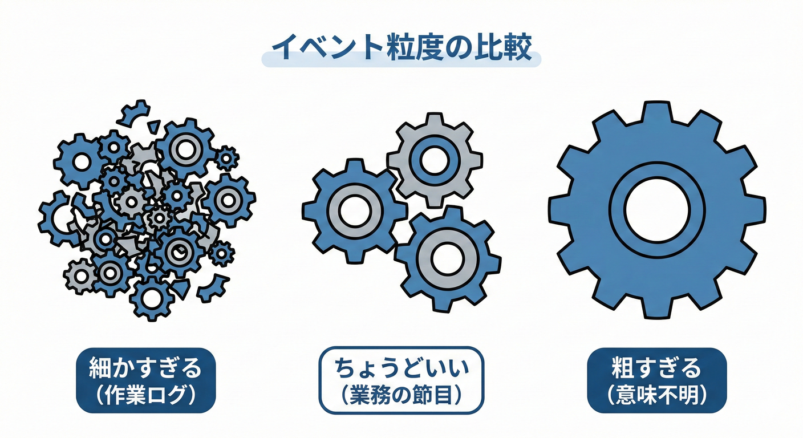
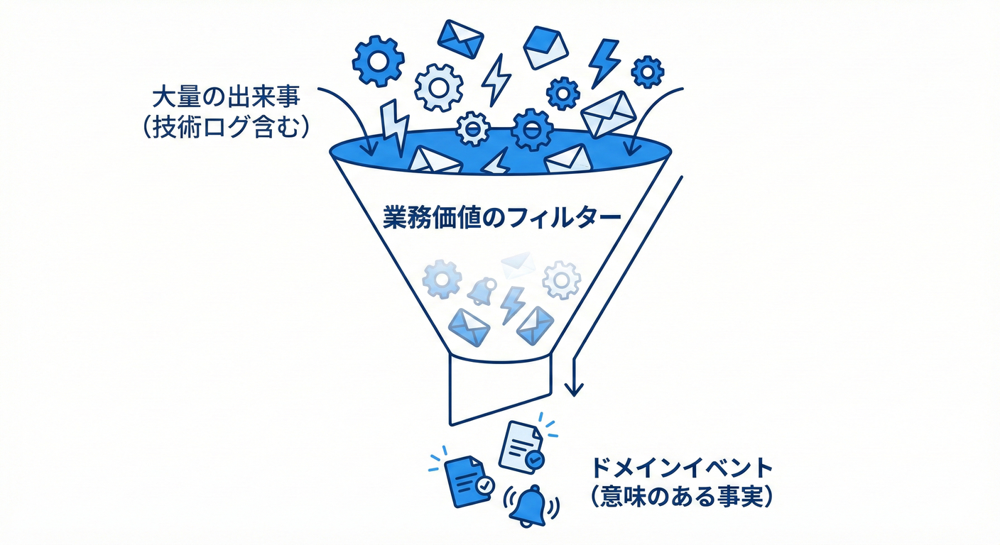

# 第16章 イベントの粒度：細かすぎ問題を避ける🔎🧠

## この章でわかること🎓✨

---

## 16.2 粒度のジレンマ：細かすぎ vs 粗すぎ😱💥

粒度を間違えると、システムが使いにくくなります。

* 「イベントの粒度（どれくらい細かく切るか）」の考え方🧩
* **細かすぎて地獄**😵‍💫 / **大きすぎて便利じゃない**🙃 を避ける判断基準🎯
* ミニEC（注文→支払い→発送）での “ちょうどいい例”🛒💳📦

---

## 16.1 適切な粒度ってどれくらい？🧭📏

ドメインイベントの粒度を決めるときの、一番の基準はこれです👇
**イベントの粒度＝そのイベントが表す“意味の大きさ”**だよ🙂✨

* 粒度が大きい（粗い）例：`OrderPaid`（注文の支払いが完了した）✅
* 粒度が小さい（細かい）例：`PaymentApiCalled`（支払いAPIを呼んだ）📡

ドメインイベントは「ドメイン（業務）のルール・意味」をはっきり表現するためのものだよ、ってMicrosoftのガイドでも言ってる🧠📘 ([Microsoft Learn][1])

---

## 2. 粒度をミスると何が起きる？😱

### 2-1. 細かすぎ問題（イベントが増殖する）🐜🐜🐜

ありがちな例👇

* `OrderSavedToDb`（DBに保存した）💾
* `EmailSentToCustomer`（メール送った）📧
* `PaymentHttpRequestCreated`（HTTPリクエスト作った）🧪

これ、**業務の出来事というより技術の作業ログ**になりがち😵
結果：

* イベントが多すぎて追えない👀💦
* 依存が増えて変更に弱くなる🧷
* 「結局どれが大事？」ってなる🌀

### 2-2. 大きすぎ問題（便利に使えない）🦣

例えば👇

* `OrderProcessed`（注文が処理された）🤷‍♀️

これ、**何が起きたのか曖昧**で、後から読む人が困る😇
「支払い完了？発送完了？在庫引当？」って毎回確認が必要になるよね🔍

---

## 3. まず覚える！粒度を決める“最強の合言葉”📣✨

### ✅ 合言葉：**「ユーザー的に意味ある？」**

ここでいうユーザーは「画面の人」だけじゃなくて、**業務の関係者（お客さん・運用・経理・CS）**も含むよ🙂🎀

イベント候補を見たら、こう聞く👇

* それって **業務の出来事**？（技術の作業じゃない？）🧠
* それって **後から説明できる事実**？（過去形で言える？）🕒
* それって **誰かが知る価値ある？**（通知・集計・監査など）📊

ドメインイベントは「起きた事実」を表すパターンとして整理されてるよ（Fowlerの解説も有名）📚 ([martinfowler.com][2])

---

## 4. 粒度の判断に使える「5つのフィルター」🧺✨

### フィルター①：業務の言葉で言える？🗣️💗

* ✅ `OrderPaid`（支払いが完了した）
* ❌ `DbTransactionCommitted`（トランザクションがコミットされた）

### フィルター②：状態がちゃんと変わった？🔁

イベントはだいたい「状態が変わった結果」と相性いいよ🙂

* 未払い → 支払済 ✅
* 未発送 → 発送済 ✅

### フィルター③：不変条件（守りたいルール）に関係ある？🔐

例：

* 「支払い前に発送しない」🚫📦
  このルールの境目になる出来事は、イベントにしやすい✨

### フィルター④：誰かが“別の責務”で反応する？🎯

例えば `OrderPaid` が起きたら…

* ポイント付与🎁
* 領収書発行🧾
* 発送準備📦
  みたいに、**別々の責務**が反応できる。これはイベント向き👍

### フィルター⑤：監査ログとして価値がある？🧾🔍

「後から追える」って超大事！
Fowlerも、ドメインイベントは記録して監査の足跡にできるよね、って話をしてる📜✨ ([martinfowler.com][3])

---

## 5. ミニECで粒度を決めてみよう🛒💳📦

### 5-1. まずは“ちょうどいい候補”から🍰

ミニECの基本ストーリー（超シンプル）👇

1. 注文した🛒
2. 支払いできた💳✅
3. 発送した📦
4. 届いた📬

この流れなら、イベント候補はこう👇

| ステップ | ちょうどいいイベント例         | なぜ良い？              |
| ---- | ------------------- | ------------------ |
| 注文   | `OrderPlaced`       | 業務の大事件🎉           |
| 支払い  | `OrderPaid`         | 状態が変わる＆後工程が動く🏃‍♀️ |
| 発送   | `ShipmentStarted`   | お客さん体験に直結📦✨       |
| 配達   | `ShipmentDelivered` | サポート・通知・評価に使える⭐    |

### 5-2. “細かすぎ候補”を混ぜるとこうなる🐜

例えば支払いで👇みたいなのを全部イベントにすると…

* `PaymentRequested`（支払い要求した）📣
* `PaymentApiCalled`（API呼んだ）📡
* `PaymentResponseReceived`（レスポンス来た）📩
* `PaymentDbSaved`（DB保存した）💾

これらは、**「支払い完了」という業務の事実を作るための内部手順**になりやすい💦
学習段階ではまず **`OrderPaid` に集約**するのがKISSで強い🧼✨

---

## 6. 迷ったときの“粒度ルール3段階”🥪

### ルール①：最初は少なめでOK🙂✅

まずは **「業務的に大きい節目」**だけ作る。
イベント乱発より、後から足す方がラク✨

### ルール②：必要になったら割る✂️

こんな状況が出たら分割を検討👇

* 「支払い完了」だけじゃ足りなくて、**“承認”と“確定”を分けたい**💳

  * 例：`PaymentAuthorized` と `PaymentCaptured`
* 反応する側が増えて、**欲しい情報が違いすぎる**📦🎁🧾
* 1イベントのペイロードが太ってきた🐘💦（次章の話にもつながる！）

### ルール③：分ける前に“名前”で解決できないか考える📝

大きすぎる時って、名前がふわっとしてるだけの場合があるよ🙂

* ❌ `OrderProcessed`
* ✅ `OrderPaid` / `ShipmentStarted` みたいに **事実を特定**する✨

---

## 7. “ちょうどいい粒度”チェックリスト✅🧠

イベント候補に対して、YESが多いほど採用しやすいよ🎀

* [ ] 過去形で言える（〜した）🕒
* [ ] 業務の言葉で言える🗣️
* [ ] 状態が変わる（または重要な事実が確定する）🔁
* [ ] それを知りたい人（処理）が別責務として存在する🎯
* [ ] 後から追跡・監査に役立つ🧾
* [ ] 技術詳細（DB/HTTP/フレームワーク）に寄ってない🔌
* [ ] 迷ったら少なめにできている（KISS）🧼

---

## 8. やってみよう🛠️✨（粒度判定ゲーム🎮）

次の候補を「ドメインイベントっぽい / 技術っぽい」で仕分けしてみてね🙂💕

1. `OrderPlaced`
2. `OrderSavedToDb`
3. `PaymentApiCalled`
4. `OrderPaid`
5. `ShipmentStarted`
6. `EmailSent`
7. `CustomerBecameBuyer`

ヒント💡：Microsoftの例でも、注文開始に合わせて「買い手になった」というような**ドメインの意味**をイベントで表現しているよ🛒👤✨ ([Microsoft Learn][1])

---

## 9. AIに手伝ってもらうプロンプト例🤖📝

コピペして使えるやつ👇✨

* 「ミニECの “注文→支払い→発送” で、業務的に意味のあるイベント候補を5個出して。技術イベントは混ぜないで」🧠
* 「このイベント名は曖昧？もっと具体的な過去形イベント名に直して：`OrderProcessed`」📝
* 「イベントを減らしたい。重要度が低い候補を理由つきで除外して」✂️

---

## 10. ミニ豆知識🫘（2026時点のC#の“今”）✨

* **C# 14 は .NET 10 上でサポート**されていて、最新のC#機能で書けるよ🧩 ([Microsoft Learn][4])
* **.NET 10 は 2025年11月11日に公開されたLTS**で、長期サポート対象になってる📅🛡️ ([Microsoft for Developers][5])

---

## チェック✅（この章のゴール達成！）🏁✨

* イベントは「業務的に意味のある事実」🔔
* 迷ったら **少なめ（KISS）**🧼
* 必要が出たときに **割る（分割）**✂️
* 技術ログに寄ったイベントは基本作らない🙅‍♀️🔌

[1]: https://learn.microsoft.com/en-us/dotnet/architecture/microservices/microservice-ddd-cqrs-patterns/domain-events-design-implementation?utm_source=chatgpt.com "Domain events: Design and implementation - .NET"
[2]: https://martinfowler.com/eaaDev/DomainEvent.html?utm_source=chatgpt.com "Domain Event"
[3]: https://martinfowler.com/eaaDev/EventNarrative.html?utm_source=chatgpt.com "Focusing on Events"
[4]: https://learn.microsoft.com/en-us/dotnet/csharp/whats-new/csharp-14?utm_source=chatgpt.com "What's new in C# 14"
[5]: https://devblogs.microsoft.com/dotnet/announcing-dotnet-10/?utm_source=chatgpt.com "Announcing .NET 10"
