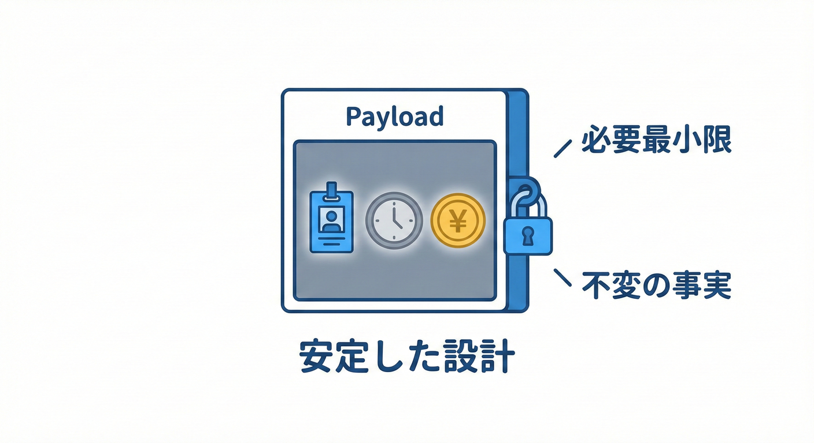
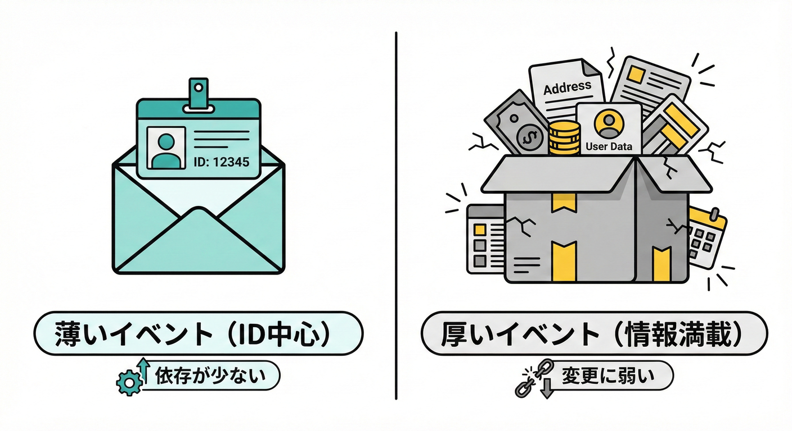

# 第17章：イベントの中身（ペイロード）設計📦✨

## この章のねらい🎯

ドメインイベントの「中身（ペイロード）」に **何を入れて／何を入れないか** を決められるようになるよ🙂✨
イベントが太ると依存が増えて、後から変更がつらくなるので…ここがめちゃ大事！💪🐘💦

---

## 17.1 イベントに何を載せるべき？📦❓



ドメインイベントのペイロード（中身）を設計する方針を決めます。ペイロードは、イベントが運ぶ「情報セット」のことだよ📩
たとえば `OrderPaid`（支払い完了）なら、「どの注文が」「いつ」「いくら」「どの支払いで」みたいな情報だね🔔🧾

---

## 17.2 2つの流派：Thin Event vs Full Snapshot📜⚖️



ドメインイベントの「重さ」には、大きく分けて2つの考え方があります。
ペイロードは、イベントが運ぶ「情報セット」のことだよ📩
たとえば `OrderPaid`（支払い完了）なら、「どの注文が」「いつ」「いくら」「どの支払いで」みたいな情報だね🔔🧾

---

## 17.3 なぜ“中身”が大事なの？🔥

イベントは、あとで誰か（ハンドラ）が読む前提の「事実メモ」📝✨
でも中身が重すぎると…

* 🔗 依存が増える（DBやHTTPの型が混ざる…）
* 🧨 変更に弱くなる（イベント変更が連鎖して壊れる）
* 🌀 シリアライズしにくい（循環参照・巨大オブジェクト）
* 😵‍💫 “何が起きたか”より“どう実装してるか”が漏れる

なので「必要最小限で安全」な中身にするのがコツだよ✂️✨

---

## 17.3 結論：イベントの中身は “薄く・小さく・安定” 🥗✨

まず迷ったらこれでOK🙂

* 🪪 **集約ID**（OrderId など）
* 🕒 **発生時刻**（OccurredAt）
* 🧾 **業務的に意味がある最小の値**（Amount など必要なものだけ）
* 🧵（余裕があれば）**相関ID**（CorrelationId）※あとで追跡しやすい

MicrosoftのDDD/CQRSガイドでも、ドメインイベントを同一トランザクション内で伝播させる例が紹介されていて、「事実を伝える」ことに集中するのが基本だよ📣 ([Microsoft Learn][1])

---

## 17.4 入れるもの✅ / 入れないもの🙅‍♀️（超重要！）

### 入れるもの✅（おすすめ）

* 🪪 **AggregateのID**（例：OrderId）
* 🕒 **OccurredAt（DateTimeOffset）**
* 💰 **必要なら金額などの値（ValueObject）**
* 🧾 **外部連携に必要な最小情報**（将来 Outbox するなら特に）

### 入れないもの🙅‍♀️（事故りやすい）

* 🗃️ DbContext / Repository / HttpContext などの「技術的な道具」
* 🧱 Entity丸ごと、集約丸ごと（Orderオブジェクトごと入れる等）
* 🧬 EFのナビゲーションプロパティ・遅延ロードが絡むもの
* 🧨 UI都合のデータ（画面表示用の文言とか）
* 🐘 巨大なコレクション全部（LineItems 全件！みたいな）

**イベントは“事実”であって、“状態のダンプ”じゃない**って覚えると強いよ🙂🔔

---

## 17.5 「薄いイベント」vs「スナップショット付きイベント」📸🥗

ペイロードの考え方は大きく2つあるよ👇

### A) 薄いイベント（Thin Event）🥗✨

**ID中心**で、必要な情報はハンドラ側で取りに行く方式。

* ✅ イベントが安定・小さい
* ✅ 依存が増えにくい
* ⚠️ ハンドラがDB参照することは増える（でも設計は綺麗になりやすい）

例）`OrderPaid { OrderId, PaymentId, OccurredAt }`

### B) スナップショット付き（Snapshot Event）📸✨

「その瞬間の重要な値」を少しだけ入れる方式。

* ✅ 後で見返した時に意味が取りやすい
* ✅ 外部連携やOutboxで便利なことがある
* ⚠️ 入れすぎるとすぐ太る🐘💦

例）`OrderPaid { OrderId, Amount, Currency, PaymentMethod, OccurredAt }`

迷ったら **A（薄い）寄り**で始めて、必要になった分だけBの方向へ足すのが安全だよ🙂🧩

---

## 17.6 ミニEC例：OrderPaid のペイロードを「3つに絞る」✂️🛒💳

ここでは練習として、いったん **3つ**に絞ろう🙂✨

### まず候補をいっぱい出す💡

* OrderId
* PaymentId
* Amount
* Currency
* PaidAt
* UserId
* Email（←危険！）
* Address（←支払いイベントには関係薄め）

### “3つ”に絞るなら（例）✅

* 🪪 `OrderId`（どれが？）
* 🧾 `PaymentId`（何の支払い？）
* 🕒 `OccurredAt`（いつ起きた？）

金額 `Amount` を入れるかはケース次第🙂
「ハンドラが金額を使う（ポイント計算など）」なら入れてもOK。
でも **“注文の合計”はOrderから取れる**なら、薄くする選択も全然アリだよ🥗✨

---

## 17.7 C#でのおすすめ表現：recordで“不変”にする🔒✨

イベントは「起きた事実」だから、**作った後に変更できない**形が相性いいよ🙂
C#はrecordで作ると読みやすい！🧩

```csharp
// ドメインイベントの最小インターフェース例
public interface IDomainEvent
{
    DateTimeOffset OccurredAt { get; }
}

// 例：強い型のID（ValueObject風）
public readonly record struct OrderId(Guid Value);
public readonly record struct PaymentId(Guid Value);

// 例：OrderPaid（薄め）
public sealed record OrderPaid(
    OrderId OrderId,
    PaymentId PaymentId,
    DateTimeOffset OccurredAt
) : IDomainEvent;
```

ポイント👇🙂✨

* `DateTimeOffset` はタイムゾーンを含めやすくて安全🕒🌍
* IDは `Guid` 直でもOKだけど、`OrderId` みたいにすると混ぜ事故が減る🪪✨

---

## 17.8 「値を少しだけ」入れたい場合（Moneyの例）💰✨

```csharp
public readonly record struct Money(decimal Amount, string Currency);

public sealed record OrderPaid(
    OrderId OrderId,
    PaymentId PaymentId,
    Money PaidAmount,
    DateTimeOffset OccurredAt
) : IDomainEvent;
```

✅ MoneyみたいなValueObjectはイベントに入れても比較的安全（小さくて意味があるから）🙂💎
🙅‍♀️ 逆に `Order` エンティティ丸ごとは危険（依存・肥大化・循環の温床）🐘💦

---

## 17.9 将来のOutboxや外部送信を見据える：JSON化できる形にしとく📮🗃️

今は「アプリ内で同期配信」でも、あとで Outbox（第31章）に進むと **イベントをJSONで保存**することが増えるよ📦➡️🗄️

そのとき強いのが `System.Text.Json` の **ソース生成**✨
（高速化・トリミング/Native AOT系でも安全になりやすい）
公式ドキュメントでもソース生成の使い方が案内されてるよ📘 ([Microsoft Learn][2])

```csharp
using System.Text.Json;
using System.Text.Json.Serialization;

[JsonSerializable(typeof(OrderPaid))]
internal partial class DomainEventJsonContext : JsonSerializerContext
{
}

// 使う側（Outbox保存などで）
public static class DomainEventSerializer
{
    public static string Serialize(OrderPaid e)
        => JsonSerializer.Serialize(e, DomainEventJsonContext.Default.OrderPaid);
}
```

ここまでやっておくと、イベントが「外へ出ても壊れにくい」方向に寄せられるよ🙂✨

---

## 17.10 よくある失敗あるある🐘💥（先に潰そう！）

* ❌ `OrderPaid` に `Order`（集約）を丸ごと入れる
  → 循環参照、依存爆増、イベントが“状態dump”化😵‍💫
* ❌ `DbContext` や `HttpClient` を入れる
  → ドメインがインフラに汚染される🧼🚫
* ❌ “画面表示用の文字列”を入れる
  → UI変更がイベント破壊につながる📱💥
* ❌ 何でも詰め込んで「便利イベント」にする
  → 後で修正できなくなる🐘💦

---

## 17.11 チェックリスト✅（迷ったらこれ！）

イベントのペイロードを決める時は、これを順にチェック🙂✅

1. 🧾 **これは「起きた事実」を表してる？（命令や実装じゃない？）**
2. 🪪 **IDだけで足りない？（足りるならIDだけ）**
3. 💎 **入れる値は“小さく・意味があり・安定”？**
4. 🔗 **DB/HTTP/フレームワーク型が混ざってない？**
5. 🧪 **JSONにしたくなっても困らない形？**（将来Outboxするなら特に📮）

---

## 17.12 やってみよう🛠️（3問）🎮✨

### 問1：3つに絞る✂️

`OrderPlaced`（注文作成）イベントの候補を10個出して、**3つに絞って**みよう🙂
ヒント：まずは `OrderId` + `OccurredAt` は鉄板🪪🕒

### 問2：太りすぎイベントをダイエット🐘➡️🥗

次のイベント、どこが危ない？どう直す？

* `OrderPaid { Order(Order丸ごと), DbContext, HttpContext, OccurredAt }`

### 問3：PII（個人情報）を避ける🕵️‍♀️🚫

「メール送信ハンドラ」が必要だとして、`OrderPaid` に `Email` を入れるのはアリ？
→ アリにしたいなら、どんなルールで安全にする？🙂

---

## 17.13 AI相棒に頼むときの“勝ちプロンプト”例🤖✨

CopilotやCodexに投げるなら、こうすると良い感じになりやすいよ🙂🧩

* 🧾 **設計相談**
  「`OrderPaid` のドメインイベントを設計したい。ペイロードは最小限にしたい。含めるべきフィールド候補と、入れてはいけないものを理由付きで提案して」

* 🐘➡️🥗 **ダイエット依頼**
  「このイベントが太りすぎ。依存を減らす方針で、薄いイベント案とスナップショット案の2案にリファクタして」

* 🧪 **テスト観点**
  「このイベントのペイロードで、将来のテストが楽になる点・難しくなる点をレビューして」

---

この章で「イベントが太るのを防ぐ型」が身につくと、次の章（第18章：どこでイベントを発生させる？）がめちゃスムーズになるよ🔔➡️❤️✨

[1]: https://learn.microsoft.com/en-us/dotnet/architecture/microservices/microservice-ddd-cqrs-patterns/domain-events-design-implementation?utm_source=chatgpt.com "Domain events: Design and implementation - .NET"
[2]: https://learn.microsoft.com/en-us/dotnet/standard/serialization/system-text-json/source-generation?utm_source=chatgpt.com "How to use source generation in System.Text.Json - .NET"
