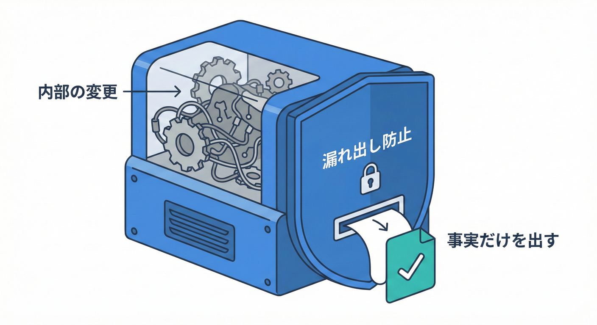
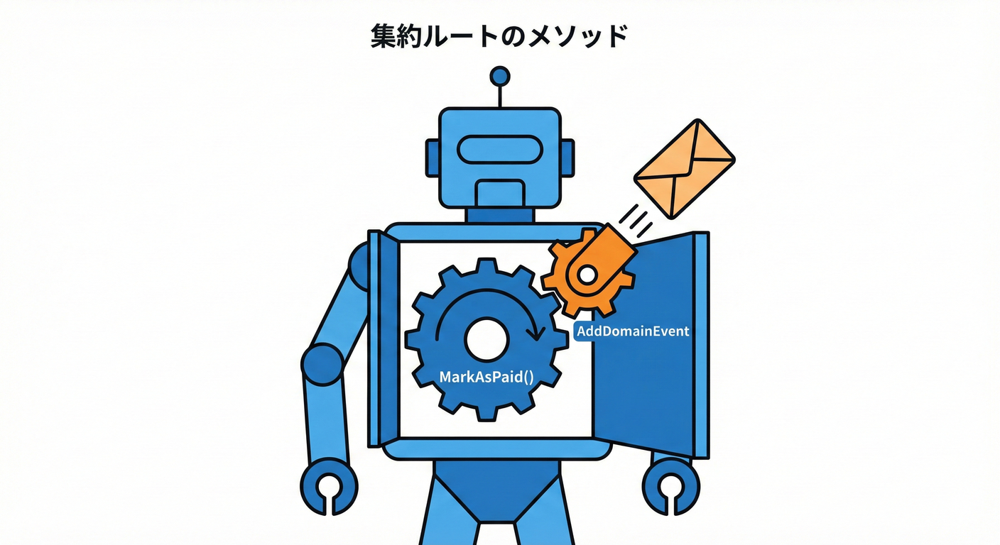

# 第18章 どこでイベントを発生させる？（集約ルート）❤️🔔

## 18.1 どこでイベントを作るべき？🏗️📍



ドメインイベントは、**「状態が変わるその瞬間」**に作成するのがベストです。
* 「ドメインイベントは **どこで作る（発生させる）** のが正しい？」が迷わなくなる🙂
* イベントを **集約ルート（Aggregate Root）** に集めて、設計がブレないようにできる🧺
* `Order.MarkAsPaid()` の中で `OrderPaid` を発生させる、いちばん基本形が組める🛒💳✅

---

## 1) まず結論：イベントは「集約ルートのメソッド内」で発生させる🎯

ドメインイベントは、基本こう覚えるとラクです👇

* **集約（Aggregate）**＝「整合性を守る境界」🧱
* **集約ルート**＝「その境界の代表（入口）」🚪
* **イベント**＝「境界の中で、ルールを守って状態が変わった“事実”」🔔🕒

つまり…

✅ **集約ルートのメソッドで状態が変わった直後に、イベントを追加する**
が基本です。
集約は「整合性の境界で、ルートが唯一の入口」なので、イベント発生場所もそこに寄せるのが自然です。([Microsoft Learn][1])

---

## 2) なぜ「集約ルート」発生が強いの？💪✨（初心者がハマりにくくなる理由）

### 理由①：不変条件（Invariants）を守った“あと”だから安心🔐

イベントは「起きた事実」なので、**失敗するかも**の途中で作ると事故りやすいです💥
集約ルートの中なら…

1. チェック（不変条件）✅
2. 状態変更🔁
3. イベント追加🔔

がセットで書けて、「成立した事実」だけが残ります🙂

### 理由②：「入口が1つ」になって、発生漏れ・二重発生が減る🧯

UIやアプリ層のあちこちでイベントを作り始めると、次が起きがち👇

* 片方の画面では発生するのに、別の経路だと発生しない😱
* 似た処理が2箇所にあって、イベントが2回飛ぶ😵‍💫

集約ルートに寄せると「ここを通ったら必ずイベントが出る」が作れます🚪✨

### 理由③：アプリ層は「使うだけ」で済む（透明になる）🫧

理想は、アプリ層（コマンドハンドラ）がこうなること👇

* 「集約を呼ぶ」→（中で勝手にイベントが溜まる）→「保存」
* イベント発生は **ドメイン内部の話** として“透明”になる

この考え方は Microsoft の DDD / マイクロサービス設計ガイドでも説明されています。([Microsoft Learn][2])

---

## 3) イベントを発生させる“タイミング”の鉄板ルール🧠🔔

迷ったらこのルール👇

✅ **「状態が変わった直後」かつ「不変条件チェックが全部通った後」**

やりがちなNG例も覚えておくと強いです🙅‍♀️

* ❌ 変更前にイベントを作る（あとで失敗して「起きてない事実」が残る）
* ❌ DB保存が終わってからイベントを作る（保存に成功したのにイベント出し忘れ…が起きる）
* ✅ 状態変更が成功した瞬間にイベントを追加（配るのは次章以降）📮

---

## 4) やってみよう：`Order.MarkAsPaid()` でイベントを発生させる🛒💳🔔

### 4-1) まずは「イベントの型」を作る（不変・軽量が正義）🧾✨

「イベント＝事実」なので、基本は **不変（immutable）** にします🔒
C# の `record` は相性バツグンです🙂

```csharp
public interface IDomainEvent
{
    DateTimeOffset OccurredAt { get; }
}

public sealed record OrderPaid(
    Guid OrderId,
    Guid PaymentId,
    DateTimeOffset OccurredAt
) : IDomainEvent;
```

ポイント👇

* ✅ **集約ID**（`OrderId`）はほぼ必須🪪
* ✅ 発生時刻（`OccurredAt`）もあると追跡しやすい🕒
* ✅ それ以外は「本当に必要？」で絞る（第17章の続き）✂️📦

---

### 4-2) 集約ルートに「イベントを溜める場所」を持たせる🧺📮

この章では「発生場所」がテーマなので、配信はまだしません🙂（次章でやる✨）

```csharp
public abstract class AggregateRoot
{
    private readonly List<IDomainEvent> _domainEvents = new();

    public IReadOnlyCollection<IDomainEvent> DomainEvents => _domainEvents.AsReadOnly();

    protected void AddDomainEvent(IDomainEvent @event) => _domainEvents.Add(@event);

    public void ClearDomainEvents() => _domainEvents.Clear();
}
```

---

### 18.2 集約からイベントを“発行”する🔔❤️



集約ルートの中で、状態を変更した後にドメインイベントを生成します。

### 4-3) `Order` 集約ルートで、状態変更とイベント追加をセットにする❤️🔁🔔

```csharp
public sealed class Order : AggregateRoot
{
    public Guid Id { get; }
    public OrderStatus Status { get; private set; } = OrderStatus.Unpaid;

    public Order(Guid id)
    {
        if (id == Guid.Empty) throw new ArgumentException("OrderId is required.", nameof(id));
        Id = id;
    }

    public void MarkAsPaid(Guid paymentId, DateTimeOffset paidAt)
    {
        // ① 不変条件チェック（守れないなら“事実”は発生しない）
        if (paymentId == Guid.Empty) throw new ArgumentException("PaymentId is required.", nameof(paymentId));

        // ② 二重支払いを防ぐ（例：すでに支払済みなら弾く）
        if (Status == OrderStatus.Paid)
            throw new InvalidOperationException("Order is already paid.");

        // ③ 状態変更（ここが「事実が成立した瞬間」）
        Status = OrderStatus.Paid;

        // ④ 直後にイベントを追加（これがこの章の主役！）
        AddDomainEvent(new OrderPaid(
            OrderId: Id,
            PaymentId: paymentId,
            OccurredAt: paidAt
        ));
    }
}

public enum OrderStatus
{
    Unpaid = 0,
    Paid = 1,
    Shipped = 2
}
```

ここが超大事👇✨

* ✅ **状態変更（Paid）とイベント追加（OrderPaid）が同じメソッドの中**
* ✅ だから「支払済みになったのにイベントが出ない」が起きにくい
* ✅ UI層・アプリ層は `MarkAsPaid()` を呼ぶだけでよくなる

---

## 5) よくある疑問💡

### Q1. 子エンティティ（OrderItem）でイベントを発生させてもいい？🧩

結論：**最終的には集約ルートに集める**のが安定です🙂
子が「小さな気づき」を出して、ルートが受け取って「集約としての事実」を確定させる、みたいな形もあります。([Microsoft Learn][3])

初心者向けのおすすめは👇

* まずは **ルートだけがイベントを追加**（シンプルで迷わない）🧼
* 慣れたら「子→ルート」も検討（必要になった時でOK）🌱

### Q2. アプリ層（コマンドハンドラ）でイベントを作ったらダメ？🤔

「完全にダメ」ではないけど、**ドメインイベント（内部の事実）**はドメイン内で起こすのが基本です❤️
アプリ層は「集約を呼ぶ」「保存する」までにして、イベント発生はドメイン内部で行うのが分かりやすいです。([Microsoft Learn][2])

---

## 6) あるある事故💥（ここだけ押さえれば強い）

* ❌ **UIでイベントを作る**：画面が増えたら漏れる😱
* ❌ **Repository/DBの中でイベントを作る**：技術都合のイベントになりやすい🧱
* ❌ **状態変更とイベント追加が別々**：片方だけ忘れる😵‍💫
* ❌ **イベントが「命令」になってる**：`SendEmailNow` みたいな名前はNG🙅‍♀️
* ✅ **集約ルートのメソッドで「状態変更→イベント追加」セット**🔁🔔

---

## 7) ミニ演習📝✨（手を動かすと定着する！）

### 演習1：発送イベントも同じノリで作る📦🚚

* `Order.MarkAsShipped()` を作る
* `OrderShipped` イベントを追加する
* 不変条件：「支払済みじゃないと発送できない」🔐

### 演習2：イベント発生の“入口”を1つにする🚪

* 支払い確定がどの経路（画面/API）から来ても、**必ず `MarkAsPaid()` を通す**ように整理してみる🧹

### 演習3：イベントの“最小ペイロード”を考える✂️📦

* `OrderPaid` に「合計金額」を入れる？入れない？
* 入れるなら「なぜ必要？」を1行で説明してみる🙂

---

## 8) チェック✅（ここまでOKなら合格💮）

* ✅ 集約ルートが「更新の入口」になっている🚪
* ✅ 不変条件チェック → 状態変更 → イベント追加 の順になっている🔐🔁🔔
* ✅ イベント名が“過去形の事実”になっている🕒
* ✅ UI/DB/外部APIの都合でイベントを作っていない🙅‍♀️
* ✅ イベントは軽量で、ドメインの言葉でできている🧾

---

## 9) 2026時点のミニ補足：この教材で扱う最新C#/.NET🆕✨

* .NET は年1回（主に11月）リリースで、2025年11月に **.NET 10** が一般提供されています。([Microsoft for Developers][4])
* **C# 14** は .NET 10 でサポートされる最新リリースとして案内されています。([Microsoft Learn][5])

[1]: https://learn.microsoft.com/en-us/azure/architecture/microservices/model/tactical-ddd?utm_source=chatgpt.com "Using tactical DDD to design microservices"
[2]: https://learn.microsoft.com/en-us/dotnet/architecture/microservices/microservice-ddd-cqrs-patterns/microservice-application-layer-implementation-web-api?utm_source=chatgpt.com "Implementing the microservice application layer using ..."
[3]: https://learn.microsoft.com/en-us/dotnet/architecture/microservices/microservice-ddd-cqrs-patterns/domain-events-design-implementation?utm_source=chatgpt.com "Domain events: Design and implementation - .NET"
[4]: https://devblogs.microsoft.com/dotnet/announcing-dotnet-10/?utm_source=chatgpt.com "Announcing .NET 10"
[5]: https://learn.microsoft.com/en-us/dotnet/csharp/whats-new/csharp-14?utm_source=chatgpt.com "What's new in C# 14 - Microsoft Learn"
