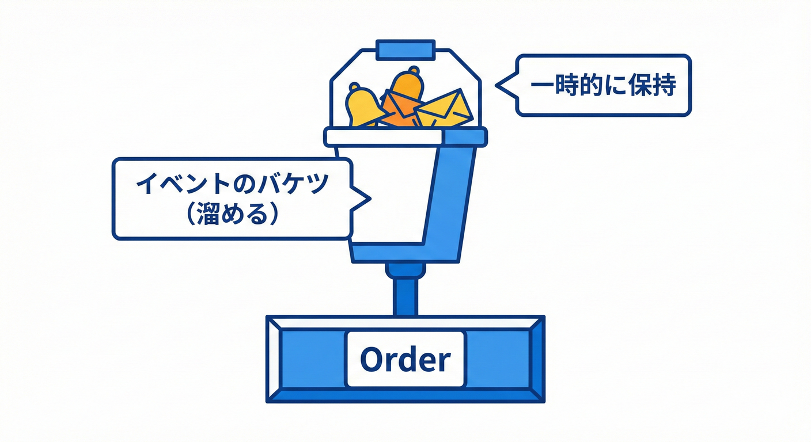
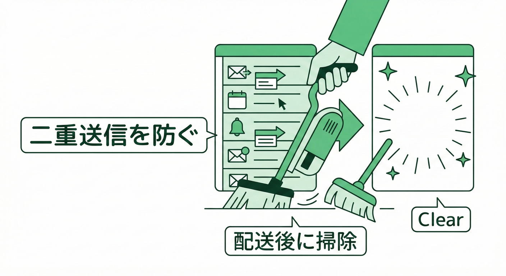

# 第19章 パターン①：ドメイン内にイベントを溜める 📮🧺

## 1. この章のゴール 🎯✨

この章が終わったら、次のことができるようになります🙂💪

* 集約ルート（Orderなど）の中に「起きた事実」イベントを溜められる 🧺🔔
* アプリケーション層でイベントを回収できる 📦➡️🙋‍♀️
* 配り終えたらイベントをクリアできる 🧹✨（二重送信を防ぐ！）

ドメインイベントは「業務ルールをはっきり表に出す」ための仕組みで、関心の分離にも効きます🌸🧠 ([Microsoft Learn][1])

---

## 2. まず結論 🧠💡

**ドメイン層では「イベントを配る」ことはしません。**
代わりに、

1. 集約の中でイベントを **追加して溜める** 🧺
2. アプリ層が **回収する** 📮
3. （次章で）ディスパッチャが **配る** 📣
4. 最後に **クリアする** 🧹

…この順番にします✅✨

---

## 3. なぜ「溜める」のが良いの？ 🤔🌷

### 3.1 ドメインが「配り方の詳細」を知らなくて済む 🙅‍♀️🔌

メール送信・ログ・外部APIなど、配信の詳細は変わりやすいです🌪️
でもドメインは「支払いが完了した」みたいな**事実**だけを言えればOK🙂🔔

### 3.2 “巨大メソッド化”を防ぐ ✂️✨

`MarkAsPaid()` の中で

* DB更新
* メール送信
* ポイント付与
* 監査ログ
  …全部やり始めると地獄です😵‍💫🔥
  イベントで切ると「主役（状態変更）」がスッキリします🧼✨

### 3.3 まず一番シンプルで学びやすい 🧸📘

いきなりメッセージキューやOutboxに行くと難易度が跳ね上がります🧗‍♀️💦
まずは **インプロセスで回る形** を作るのが王道です🏠✨

---

## 4. 全体の流れ図 🗺️🔁

### 19.3 「イベントを溜める」仕組みを作る🪣🧩



集約内にイベントを一時的に保持するための仕組みを導入します。

### 4.1 イベントを溜めるパターンの流れ 📮🧺

（矢印を追うだけでOK🙂）

* アプリ層：注文を取得する 🛒
  ⬇️
* ドメイン：`Order.MarkAsPaid()` を呼ぶ 💳
  ⬇️
* ドメイン：状態を変える（Paidへ）🔁
  ⬇️
* ドメイン：`OrderPaid` を **DomainEventsに追加** 🧺🔔
  ⬇️
* アプリ層：`order.DomainEvents` を **回収** 📦
  ⬇️
* （次章で）配る 📣
  ⬇️
* **Clear** する 🧹✨

---

## 5. 実装してみよう 🛠️✨

ここから「最小だけど実戦的」な形を作ります🙂🌸
ポイントは **集約ルートがイベントを持つ** ことです🧺

---

### 5.1 ドメインイベントの共通インターフェース 🔔🧾

* **OccurredAt（発生時刻）** はあると便利🕒
* 中身（ペイロード）は必要最小限（第17章の話）📦✂️

```csharp
namespace MiniEC.Domain.Events;

public interface IDomainEvent
{
    DateTimeOffset OccurredAt { get; }
}
```

---

### 5.2 集約ルートの基底クラス 🧺🏛️

ここが本章の主役です📮✨
**DomainEvents を溜める箱**を用意します🧺

```csharp
namespace MiniEC.Domain.SeedWork;

using MiniEC.Domain.Events;

public abstract class AggregateRoot
{
    private readonly List<IDomainEvent> _domainEvents = new();

    // 外からは読み取り専用で見せる（勝手に追加/削除されないように）🔒
    public IReadOnlyCollection<IDomainEvent> DomainEvents => _domainEvents.AsReadOnly();

    protected void AddDomainEvent(IDomainEvent domainEvent)
        => _domainEvents.Add(domainEvent);

    public void ClearDomainEvents()
        => _domainEvents.Clear();
}
```

✅ **よくある設計の選択**

* `AddDomainEvent` は `protected`：イベントは「集約の内側」で起こす🌱
* `ClearDomainEvents` は `public`：回収側が掃除できる🧹

---

### 5.3 例題イベント OrderPaid 🛒💳🔔

イベント名は過去形（第15章）でしたね🙂✨

```csharp
namespace MiniEC.Domain.Orders;

using MiniEC.Domain.Events;

public sealed record OrderPaid(
    Guid OrderId,
    DateTimeOffset OccurredAt
) : IDomainEvent;
```

---

### 5.4 Order 集約でイベントを溜める 🧺❤️

「支払い完了」によって状態が変わる瞬間にイベントを追加します🔔✨
**UI層でイベントを作らない**のが大事でした（第18章）🙅‍♀️

```csharp
namespace MiniEC.Domain.Orders;

using MiniEC.Domain.SeedWork;

public enum OrderStatus
{
    Draft,
    Placed,
    Paid,
    Shipped
}

public sealed class Order : AggregateRoot
{
    public Guid Id { get; }
    public OrderStatus Status { get; private set; }

    public Order(Guid id)
    {
        Id = id;
        Status = OrderStatus.Placed;
    }

    public void MarkAsPaid(DateTimeOffset now)
    {
        if (Status == OrderStatus.Paid)
            return; // 冪等っぽく（同じ操作を2回されても壊れない）🙂🔁

        if (Status != OrderStatus.Placed)
            throw new InvalidOperationException("支払いできるのはPlacedのときだけです🙅‍♀️");

        Status = OrderStatus.Paid;

        // ここで「起きた事実」を溜める🧺🔔
        AddDomainEvent(new OrderPaid(Id, now));
    }
}
```

🌟 `now` を引数で受けるのはテストしやすくするためです🧪✨（時間を固定できる！）

---

## 6. 回収してみよう 📦📮

次章で「配る」仕組みを作りますが、今章ではまず **回収** までやります🙂✨

### 6.1 回収の基本形 🧺➡️📦

アプリ層は「ドメインに命令する」だけ。
イベントはあとから拾います🧤✨

```csharp
namespace MiniEC.Application;

using MiniEC.Domain.Orders;

public sealed class PayOrderService
{
    // 本当はRepositoryなどが来るけど、ここでは最小でOK🙂
    public IReadOnlyCollection<object> Pay(Order order, DateTimeOffset now)
    {
        order.MarkAsPaid(now);

        // ここで回収📦
        var events = order.DomainEvents.ToArray();

        // 配るのは次章以降📣（いったん回収だけ）
        // foreach (var e in events) ...

        // 配った扱いにして掃除🧹✨
        order.ClearDomainEvents();

        return events.Cast<object>().ToArray();
    }
}
```

### 6.2 「配ったらクリア」の意味 🧹✨

クリアしないとこうなります😱💦

* 1回目：OrderPaid を配った
* 2回目：別の処理で同じOrderを触った
* **前のOrderPaidが残ってて、また配られる**（二重送信）🔁💥

だから、**回収したら掃除**が基本です🧹✨

---

## 7. どのやり方を選ぶ？静的クラス方式との違い 🤔🧩

「DomainEvents という静的クラスを用意して Raise する」方式も世の中にはあります📣🧱 ([Microsoft Learn][2])
でも学習＆保守の観点では、今章の **集約の中に溜める方式** がわかりやすいです🙂🧺

* 静的方式：どこからでも上げられて便利そう → でも追跡が難しくなりがち🌀
* 溜める方式：イベント発生源が **集約ルートに固定** されて追いやすい🔎✨

---

## 8. やってみよう課題 🛠️🎀

### 課題1 まずは図を書こう 🗺️🖍️

次の箱と矢印を紙に書いてください🙂
（手書きでOK！）

* `PayOrderService`
* `Order.MarkAsPaid()`
* `Order.DomainEvents`
*## 19.4 正しく掃除する（ClearDomainEvents）🧹✨



イベントが配送された後は、二重送信を防ぐためにリストを空にする必要があります。

---

### 課題2 追加イベントを1つ増やす 💡🔔

`OrderPaymentFailed` を作ってみましょう😢💥
条件は「Placed以外で支払いしようとした」などでOKです🙂
イベントに入れる情報は最小で！

* OrderId
* OccurredAt
* Reason（短い文字列）✍️

---

### 課題3 クリアし忘れバグを再現 😈🧪

わざと `ClearDomainEvents()` を消して、2回 `Pay()` を呼んでみましょう🔁
「同じイベントが残る」感覚を体で覚えると強いです💪✨

---

## 9. よくあるミス集 😵‍💫🚫

* **UI層やアプリ層でイベントを new しちゃう**
  → ドメインの「事実」じゃなくなりがち🙅‍♀️
* **イベントに巨大オブジェクトを詰め込む** 🐘📦
  → 依存が増えて壊れやすい（第17章の注意）
* **Clearし忘れ** 🧹❌
  → 二重送信の温床😱
* **イベント発生の場所がバラバラ**
  → 追えない・テストしづらい🌀

---

## 10. ミニテスト ✅🧠

### Q1 🙂

`Order.MarkAsPaid()` の中でやるべきことはどれ？

A. メール送信を直接呼ぶ📧
B. 支払い完了のイベントを DomainEvents に追加する🧺🔔
C. DBに直接保存する🗃️

→ 正解：**B** ✅✨

### Q2 🙂

DomainEvents を回収した後に必要なことは？

A. Clear する🧹
B. 何もしない🙂
C. もう一回 Add する🔁

→ 正解：**A** ✅✨

---

## 11. この章のまとめ 🧾✨

* ドメインイベントは「起きた事実」🔔
* 集約ルートの中に **DomainEvents を溜める** 🧺
* アプリ層が **回収** して、配り終えたら **Clear** 🧹
* この形は、ドメインを「配り方の詳細」から守ってくれる🛡️✨ ([Microsoft Learn][1])

---

## 付録 小ネタ 🪄🧩

C# 14 は Visual Studio 2026 と .NET 10 SDK で試せる機能として案内されています🧠✨（この教材の前提とも相性いいよ） ([Microsoft Learn][3])
また .NET 10 は 2026年1月の更新情報が公開されています📦🛠️ ([support.microsoft.com][4])

[1]: https://learn.microsoft.com/en-us/dotnet/architecture/microservices/microservice-ddd-cqrs-patterns/domain-events-design-implementation?utm_source=chatgpt.com "Domain events: Design and implementation - .NET"
[2]: https://learn.microsoft.com/ja-jp/dotnet/architecture/microservices/microservice-ddd-cqrs-patterns/domain-events-design-implementation?utm_source=chatgpt.com "ドメイン イベント: 設計と実装 - .NET"
[3]: https://learn.microsoft.com/ja-jp/dotnet/csharp/whats-new/csharp-14?utm_source=chatgpt.com "C# 14 の新機能"
[4]: https://support.microsoft.com/en-us/topic/-net-10-0-update-january-13-2026-64f1e2a4-3eb6-499e-b067-e55852885ad5?utm_source=chatgpt.com ".NET 10.0 Update - January 13, 2026"
