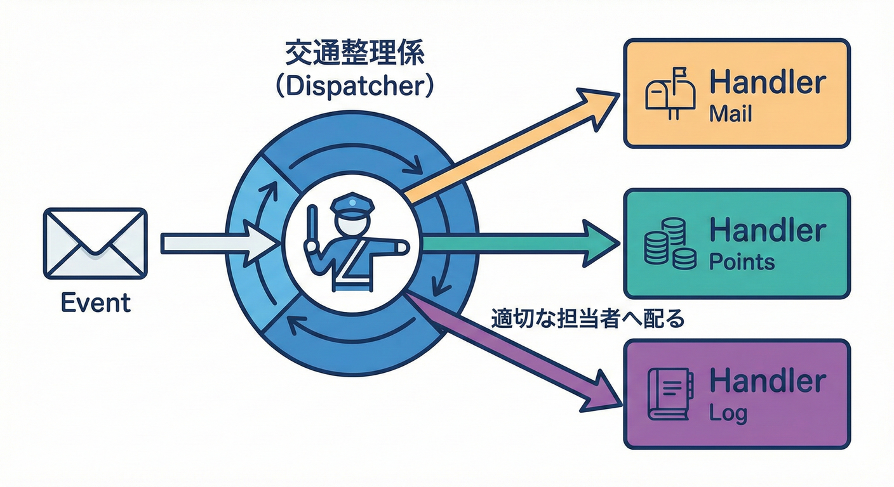
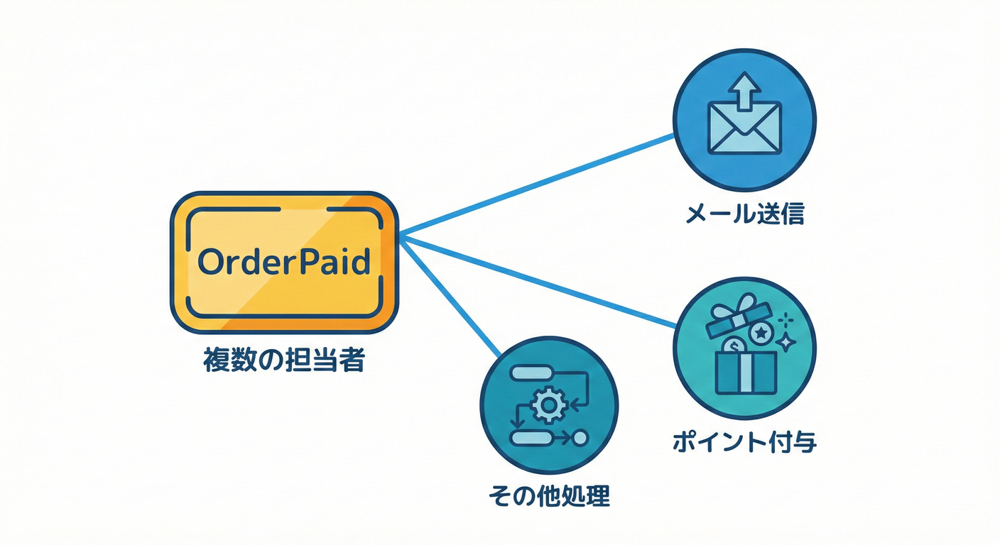

# 第20章：パターン②：インプロセス・ディスパッチャ入門🏠📣

## 20.1 ねらい🎯

「ドメイン内に溜めたイベント📮🧺」を、同じアプリの中（同一プロセス内）で、必要なハンドラへ配れるようにするよ〜！🔔➡️🎯✨

---

## 20.2 “インプロセス”ってなに？🏠🙂

**インプロセス（in-process）**は、ざっくり言うとこう👇

* ✅ **同じアプリの中で**イベントを配る（メモリの中で完結）🧠💫
* ✅ 外部のメッセージキュー（RabbitMQ / Service Bus など）は使わない🚚❌
* ✅ 「イベント → ハンドラを呼ぶ」を**メソッド呼び出し**でやる📞✨

学習には最高で、まずここをきれいに作ると、あとで Outbox や非同期に育てやすいよ〜🌱🚀

---

## 20.3 まず“何が困ってた？”を整理しよ😵‍💫➡️🙂

第19章の「溜める」だけだと、こんな状態👇

* Order の中に「OrderPaid」が溜まる📮
* でも…誰にも届かない😢（メールも送れない、ポイントも付かない）

つまり必要なのはこれ👇

> **イベントを、登録されているハンドラたちへ配る係**（＝ディスパッチャ）📣✨

---

## 20.4 ディスパッチャーの役割：交通整理係🚦🧭



ディスパッチャーは、どのイベントをどのハンドラーに渡すかを管理する「交通整理係」です。

* 🔔 イベントを受け取る
* 📚 「このイベントの担当者（ハンドラ）は誰？」を探す
* 🎯 見つけた担当者に渡して実行してもらう

そして大事なのがこれ👇

* ❤️ **ドメイン層は“配り方”を知らない**

  * 「起きた事実」を作って溜めるだけ🔔🧺
  * 「誰に届けるか」は外側で決める📦✨

---

## 20.5 （最新環境の前提）いまのC#/.NETの最新って？🆕🪟✨

2026時点の“最新ライン”はだいたいこんな感じだよ👇

* ✅ **.NET 10 は LTS**（長期サポート）🛡️✨ ([Microsoft for Developers][1])
* ✅ **C# 14 が最新**で、.NET 10 でサポートされるよ🧁✨ ([Microsoft Learn][2])

この章のコードは、難しい最新機能に寄せすぎず、**読みやすさ優先**でいくね🙂📘

---

## 20.6 最小構成の設計図🗺️✨

### ① ドメイン層（純粋）🧼❤️

* イベントの型（例：OrderPaid）を作る🔔
* 集約がイベントを溜める📮🧺
* **DI も IServiceProvider も知らない**🙅‍♀️

### ② アプリ層 or インフラ層（外側）🏗️🔌

* ディスパッチャ実装を置く📣
* DI でハンドラを集めて呼ぶ🧲🎯

---

## 20.7 コードで作る：インプロセス・ディスパッチャ最小セット🛠️✨

### 20.7.1 ドメインイベントの共通インターフェース🔔

```csharp
namespace MiniEC.Domain.Events;

public interface IDomainEvent
{
    DateTimeOffset OccurredAt { get; }
}
```

---

### 20.7.2 集約に「イベントを溜める箱📮」を用意（第19章の復習）🧺✨

```csharp
namespace MiniEC.Domain;

using MiniEC.Domain.Events;

public abstract class AggregateRoot
{
    private readonly List<IDomainEvent> _domainEvents = new();

    public IReadOnlyCollection<IDomainEvent> DomainEvents => _domainEvents.AsReadOnly();

    protected void RaiseDomainEvent(IDomainEvent domainEvent)
        => _domainEvents.Add(domainEvent);

    // 取り出したら空にする（超重要🧹✨）
    public IReadOnlyCollection<IDomainEvent> DequeueDomainEvents()
    {
        var events = _domainEvents.ToArray();
        _domainEvents.Clear();
        return events;
    }
}
```

---

### 20.7.3 例：支払い完了イベント「OrderPaid」💳🔔

```csharp
namespace MiniEC.Domain.Events;

public sealed class OrderPaid : IDomainEvent
{
    public Guid OrderId { get; }
    public int PaidAmountYen { get; }
    public DateTimeOffset OccurredAt { get; } = DateTimeOffset.UtcNow;

    public OrderPaid(Guid orderId, int paidAmountYen)
    {
        OrderId = orderId;
        PaidAmountYen = paidAmountYen;
    }
}
```

---

### 20.7.4 Order 集約で「支払い完了」を起こす🛒➡️💳✅

```csharp
namespace MiniEC.Domain;

using MiniEC.Domain.Events;

public sealed class Order : AggregateRoot
{
    public Guid Id { get; } = Guid.NewGuid();

    public string Status { get; private set; } = "AwaitingPayment";

    public void MarkAsPaid(int paidAmountYen)
    {
        if (Status != "AwaitingPayment")
            throw new InvalidOperationException("支払い待ちじゃないのに支払い完了にできないよ🥺");

        if (paidAmountYen <= 0)
            throw new InvalidOperationException("金額は1円以上ね💴✨");

        Status = "Paid";

        RaiseDomainEvent(new OrderPaid(Id, paidAmountYen)); // 🔔ここで“事実”が発生
    }
}
```

ここまでがドメイン側❤️
次から「配る係📣」に入るよ〜！

---

## 20.8 ハンドラとディスパッチャのインターフェース設計🧩✨

### 20.8.1 ハンドラ（受け取り係）🎯

```csharp
namespace MiniEC.Application.DomainEvents;

using MiniEC.Domain.Events;

public interface IDomainEventHandler<in TEvent> where TEvent : IDomainEvent
{
    Task HandleAsync(TEvent domainEvent, CancellationToken ct);
}
```

### 20.8.2 ディスパッチャ（配達係）📣

```csharp
namespace MiniEC.Application.DomainEvents;

using MiniEC.Domain.Events;

public interface IDomainEventDispatcher
{
    Task DispatchAsync(IEnumerable<IDomainEvent> events, CancellationToken ct = default);
}
```

---

## 20.9 ディスパッチャ実装：DIからハンドラを集めて呼ぶ🧲📣✨

ここは「外側」なので、DI を使ってOK🙆‍♀️✨
（.NET のDIは標準で強いよ〜） ([Microsoft Learn][3])

```csharp
namespace MiniEC.Infrastructure.DomainEvents;

using Microsoft.Extensions.DependencyInjection;
using MiniEC.Application.DomainEvents;
using MiniEC.Domain.Events;

public sealed class InProcessDomainEventDispatcher : IDomainEventDispatcher
{
    private readonly IServiceProvider _serviceProvider;

    public InProcessDomainEventDispatcher(IServiceProvider serviceProvider)
        => _serviceProvider = serviceProvider;

    public async Task DispatchAsync(IEnumerable<IDomainEvent> events, CancellationToken ct = default)
    {
        foreach (var ev in events)
        {
            await DispatchOneAsync(ev, ct);
        }
    }

    private async Task DispatchOneAsync(IDomainEvent ev, CancellationToken ct)
    {
        // ev の“実際の型”に対応するハンドラを全部取り出す
        var eventType = ev.GetType();
        var handlerType = typeof(IDomainEventHandler<>).MakeGenericType(eventType);

        var handlers = _serviceProvider.GetServices(handlerType);

        // 1個ずつ順番に呼ぶ（まずはシンプルに🙂）
        foreach (var handler in handlers)
        {
            var method = handlerType.GetMethod(nameof(IDomainEventHandler<IDomainEvent>.HandleAsync))!;
            var task = (Task)method.Invoke(handler, new object[] { ev, ct })!;
            await task;
        }
    }
}
```

### ✅ この実装のいいところ😍

* イベントが増えてもディスパッチャは基本そのまま👍
* 同じイベントにハンドラを何個でも付けられる（メール＋ポイント みたいに）📧🎁✨

---

## 20.10 ハンドラを2つ作ってみよう📧🎁✨

### 20.10.1 メール送信（例）📧

```csharp
namespace MiniEC.Application.DomainEvents.Handlers;

using MiniEC.Application.DomainEvents;
using MiniEC.Domain.Events;

public sealed class SendPaidMailHandler : IDomainEventHandler<OrderPaid>
{
    public Task HandleAsync(OrderPaid domainEvent, CancellationToken ct)
    {
        Console.WriteLine($"📧 支払い完了メール送信！ OrderId={domainEvent.OrderId}, 金額={domainEvent.PaidAmountYen}円");
        return Task.CompletedTask;
    }
}
```

### 20.10.2 ポイント付与（例）🎁

```csharp
namespace MiniEC.Application.DomainEvents.Handlers;

using MiniEC.Application.DomainEvents;
using MiniEC.Domain.Events;

public sealed class GrantPointsHandler : IDomainEventHandler<OrderPaid>
{
    public Task HandleAsync(OrderPaid domainEvent, CancellationToken ct)
    {
        var points = domainEvent.PaidAmountYen / 100; // 100円=1pt の雑な例🙂
        Console.WriteLine($"🎁 ポイント付与！ OrderId={domainEvent.OrderId}, +{points}pt");
        return Task.CompletedTask;
    }
}
```

---

## 20.11 どこで Dispatch するの？（超重要）🧠💥

おすすめは、だいたいこの流れ👇

1. ✅ 集約のメソッドで状態変更＋イベント発生（MarkAsPaid）
2. ✅ DBに保存（成功させる）💾
3. ✅ 溜まったイベントを取り出して Dispatch（Dequeue → Dispatch）📣

「保存に成功したのにメール失敗で全部なかったことに…😢」みたいな事故を避けるために、**まず保存→あと配信**が学習上も安心だよ🙂✨

---

## 20.12 アプリサービス例：支払い処理からイベント配信まで🛒💳🔔

```csharp
namespace MiniEC.Application;

using MiniEC.Application.DomainEvents;
using MiniEC.Domain;

public sealed class PayOrderService
{
    private readonly IDomainEventDispatcher _dispatcher;

    // ここでは簡単化のため、Orderを直接受け取る形にしてるよ🙂
    public PayOrderService(IDomainEventDispatcher dispatcher)
        => _dispatcher = dispatcher;

    public async Task PayAsync(Order order, int paidAmountYen, CancellationToken ct)
    {
        order.MarkAsPaid(paidAmountYen);

        // 本当はここでDBに保存（SaveChanges）する想定💾✨

        var events = order.DequeueDomainEvents(); // 📮➡️📤
        await _dispatcher.DispatchAsync(events, ct); // 📣➡️🎯
    }
}
```

---

## 20.13 DI登録（Program.cs のイメージ）🧱✨

ASP.NET Core / Minimal API でも、DI登録はこんな感じでOKだよ🙆‍♀️ ([Microsoft Learn][3])

```csharp
using MiniEC.Application;
using MiniEC.Application.DomainEvents;
using MiniEC.Application.DomainEvents.Handlers;
using MiniEC.Infrastructure.DomainEvents;

var builder = WebApplication.CreateBuilder(args);

// Dispatcher
builder.Services.AddScoped<IDomainEventDispatcher, InProcessDomainEventDispatcher>();

// Handlers（OrderPaid に2つ登録できるのがポイント✨）
builder.Services.AddScoped<IDomainEventHandler<MiniEC.Domain.Events.OrderPaid>, SendPaidMailHandler>();
builder.Services.AddScoped<IDomainEventHandler<MiniEC.Domain.Events.OrderPaid>, GrantPointsHandler>();

// App service
builder.Services.AddScoped<PayOrderService>();

var app = builder.Build();
app.Run();
```

---

## 20.14 実行イメージ（頭の中でOK）🧠💫

こんなログが出たら勝ち〜！🏁✨

* 📧 支払い完了メール送信！
* 🎁 ポイント付与！

同じ「OrderPaid」なのに、**2つの処理が別々のクラスで動く**のが気持ちいいポイントだよ🙂🌸

---

## 20.15 よくある落とし穴💥（ここ超大事）🧯✨

### 落とし穴①：イベントをクリアし忘れる🧺🗑️

* Dequeue で空にしないと、**次の処理でまた送っちゃう**😱
* 「配信したら掃除🧹」が合言葉！

### 落とし穴②：ドメイン層で DI を触っちゃう🙅‍♀️

* ドメインが IServiceProvider を知ると、設計がベタベタに…🫠
* “事実を作る”に集中❤️

### 落とし穴③：SingletonがScopedを抱える事故🧨

* たとえば Dispatcher を Singleton にすると危ないことがある😵‍💫
* DI の寿命（Singleton/Scoped/Transient）はちゃんと意識しよ〜🧠✨ ([Microsoft Learn][4])

---

## 20.16 やってみよう（演習）🛠️🎀

### 演習A：イベントを追加してみよう🔔✨

* 「OrderShipped（発送完了）」イベントを作る📦🚚
* Order に「MarkAsShipped」を追加する🛒➡️📦

### 演習B：ハンドラを3つ目追加🎯✨

* 「発送完了で通知（Console出力でOK）」📣🙂
* 1イベントに複数ハンドラの感覚を固める💪

### 演習C：順番が大事な処理を考える🧠

* 「ポイント付与→メール」みたいに順番が大事ならどうする？

  * ✅ 1つのハンドラにまとめる？
  * ✅ ディスパッチを直列にする？（今は直列）
  * ✅ そもそも業務的に順番必要？

---

## 20.17 届ける仕組み（同期ディスパッチ）📣📦



ドメインイベントが発生した後、それを適切なハンドラーに届ける仕組み（ディスパッチ）を作ります。

## 20.18 チェック問題✅📝（サクッと）

1. ドメインイベントは「命令」？「事実」？📣🕒
2. ディスパッチャの役割はなに？📣➡️🎯
3. 1つのイベントにハンドラを複数つけるメリットは？🎁📧
4. Dequeue でイベントを消すのはなぜ？🧹
5. ドメイン層がDIを知らないメリットは？❤️🧼

---

## 20.18 まとめ🌸✨

* 「溜める📮」の次は「配る📣」！
* インプロセス・ディスパッチャで、イベントをハンドラへルーティングできる🙂🎯
* ドメインは純粋に、配信の詳細は外側に✨

---

## 20.19 （おまけ）既製品を使うなら？📦🤖

「自作もいいけど、有名どころを使いたい！」なら **MediatR** が定番だよ〜（.NET 10 対応のリリースも出てる）📚✨ ([jimmybogard.com][5])

[1]: https://devblogs.microsoft.com/dotnet/announcing-dotnet-10/?utm_source=chatgpt.com "Announcing .NET 10"
[2]: https://learn.microsoft.com/en-us/dotnet/csharp/whats-new/csharp-14?utm_source=chatgpt.com "What's new in C# 14"
[3]: https://learn.microsoft.com/en-us/dotnet/core/extensions/dependency-injection?utm_source=chatgpt.com "Dependency injection - .NET"
[4]: https://learn.microsoft.com/en-us/dotnet/core/extensions/dependency-injection-guidelines?utm_source=chatgpt.com "Dependency injection guidelines - .NET"
[5]: https://www.jimmybogard.com/?utm_source=chatgpt.com "Jimmy Bogard"
