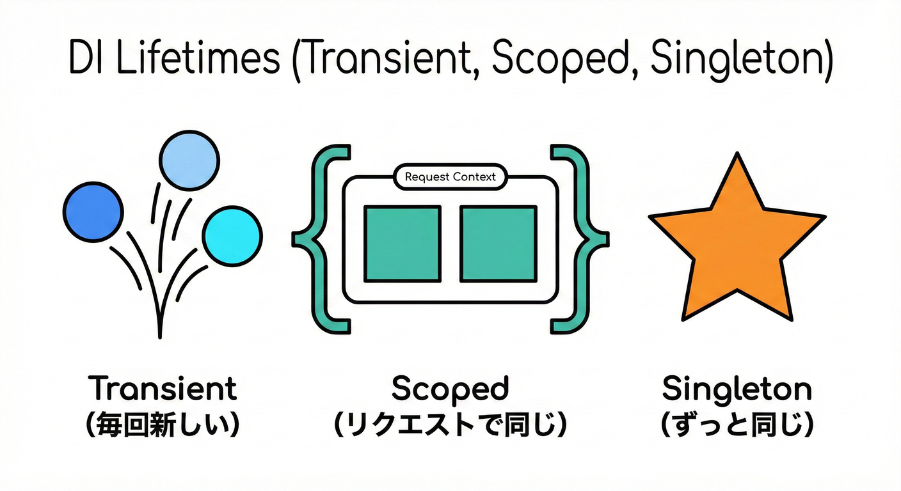

# 第21章 DI（依存性注入）超入門：ハンドラを差し替える🧱✨

## 21.1 ねらい🎯

ドメインイベントの**ハンドラ（処理する人）**を、あとから増やしたり差し替えたりしても、コードが壊れにくい形にします😊✨
ポイントはこれ👇

* ハンドラを **`new` で作らない** 🙅‍♀️
* 代わりに、**DIコンテナ**に「このインターフェースはこの実装ね！」って登録しておく🧺
* あとは **コンストラクタ注入**で受け取るだけ🧩

.NET には最初から DI の仕組み（`IServiceCollection` / `IServiceProvider`）が用意されています📦✨ ([Microsoft Learn][1])

---

## 21.2 DIコンテナと依存性の注入🧱🧰


DIコンテナは、必要なパーツ（サービス）を管理し、自動的に組み合わせてくれる「道具箱」のような存在です。

### ✅ DIがない世界（つらい）😵‍💫

「メール送る処理」を使いたいからって、クラスの中でこう書くと…

```csharp
public sealed class OrderPaidHandler
{
    public void Handle(OrderPaid e)
    {
        var sender = new SmtpEmailSender(); // ←ここで固定😱
        sender.Send("thanks!");
    }
}
```

* SMTP以外（SendGridとか、テスト用の偽物とか）に **差し替えにくい** 🙅‍♀️
* 依存が増えるほど、`new` が散らばって **修正が地獄** 🥲
* テストで「送信したことにしたい」みたいな **差し替えが困難** 🧪💥

「ハードコードされた依存（Hard-coded dependency）は問題だよ」ってのが公式ドキュメントにもはっきり書かれてます📝 ([Microsoft Learn][1])

---

### ✅ DIがある世界（ラク）😇✨

「メール送信は `IEmailSender` に頼る」って約束だけして…

```csharp
public sealed class OrderPaidHandler(IEmailSender sender)
{
    public Task HandleAsync(OrderPaid e)
        => sender.SendAsync("thanks!");
}
```

* SMTPでもSendGridでもテスト用でも、**登録を変えるだけ**で差し替えOK🔁✨
* この「作る責任」をクラスから取り上げて、外（DI）に渡すのが DI です🧩 ([Microsoft Learn][1])

---

## 21.3 今日の主役たち🧑‍🤝‍🧑✨

### 🧺 `IServiceCollection`（登録係）

アプリ起動時に「このインターフェースはこの実装！」を登録していく箱📦
登録の考え方・複数登録の挙動も公式にまとまってます📝 ([Microsoft Learn][2])

### 🏭 `IServiceProvider`（組み立て係）

登録された情報を元に、必要なオブジェクトを組み立てて渡してくれる人🤖✨ ([Microsoft Learn][1])

### 🧩 コンストラクタ注入（受け取り方）

依存を「引数でもらう」スタイル。
DI は「コンストラクタ選択ルール」まで仕様として説明されています📚 ([Microsoft Learn][1])

---

## 21.4 ドメインイベントとDIの接続イメージ🗺️🔔

今回のゴールはこの形👇

* **Order が支払済になる**（不変条件を守って状態が変わる）✅
* **OrderPaid イベントが発生**🔔
* **Dispatcher がイベントを配る**📣
* **複数ハンドラがそれぞれ1責務で動く**（メール📧、ポイント🎁、ログ🧾…）
* どのハンドラを動かすかは **DI登録で決める** 🧱✨

---

## 21.5 “動く最小例”でDIを体験しよう🏁🛒🔔

ここからは、**ミニECの「支払い完了（OrderPaid）」**を題材にします😊✨
構成は「イベント → ディスパッチャ → ハンドラ」の最小セットです🧩

### 21.5.1 イベントとハンドラのインターフェース📦🧩

```csharp
using Microsoft.Extensions.DependencyInjection;
using Microsoft.Extensions.Hosting;

public interface IDomainEvent
{
    DateTimeOffset OccurredAt { get; }
}

public sealed record OrderPaid(Guid OrderId, decimal Amount, DateTimeOffset OccurredAt) : IDomainEvent;

public interface IDomainEventHandler<in TEvent> where TEvent : IDomainEvent
{
    Task HandleAsync(TEvent @event, CancellationToken ct = default);
}

public interface IDomainEventDispatcher
{
    Task DispatchAsync<TEvent>(TEvent @event, CancellationToken ct = default)
        where TEvent : IDomainEvent;
}
```

---

### 21.5.2 Dispatcher：ハンドラ一覧をDIから取って配る📣📦➡️🎯

ここが「配達係」🚚✨
**同じイベントに複数ハンドラ**をぶら下げたいので、`IEnumerable<...>` を使います💡
複数登録して `IEnumerable<T>` で解決できる挙動は公式に説明があります📚 ([Microsoft Learn][2])

```csharp
public sealed class InProcessDomainEventDispatcher(IServiceProvider provider) : IDomainEventDispatcher
{
    public async Task DispatchAsync<TEvent>(TEvent @event, CancellationToken ct = default)
        where TEvent : IDomainEvent
    {
        // 同じTEvent向けのハンドラを全部集める✨
        var handlers = provider.GetServices<IDomainEventHandler<TEvent>>();

        foreach (var handler in handlers)
        {
            await handler.HandleAsync(@event, ct);
        }
    }
}
```

> 💡ここで `IServiceProvider` を使ってるけど、これは「アプリ境界（配信の仕組み側）」なのでOKにしやすいポイントです🙂
> ドメイン層に `IServiceProvider` を持ち込むのは避けたい（依存の向きが逆になる）🙅‍♀️✨

---

### 21.5.3 “差し替えたい依存” をインターフェースにする📧🎭

今回はメール送信を差し替え対象にします🔁✨

```csharp
public interface IEmailSender
{
    Task SendAsync(string message, CancellationToken ct = default);
}

public sealed class ConsoleEmailSender : IEmailSender
{
    public Task SendAsync(string message, CancellationToken ct = default)
    {
        Console.WriteLine($"📧 SEND: {message}");
        return Task.CompletedTask;
    }
}

// テスト用とか、開発中に便利な“送ったことにする”版😎
public sealed class NoopEmailSender : IEmailSender
{
    public Task SendAsync(string message, CancellationToken ct = default)
        => Task.CompletedTask;
}
```

---

### 21.5.4 ハンドラ：依存は“newしない”で受け取る🧩🙅‍♀️

```csharp
public sealed class SendThanksEmailOnOrderPaid(IEmailSender sender)
    : IDomainEventHandler<OrderPaid>
{
    public Task HandleAsync(OrderPaid @event, CancellationToken ct = default)
        => sender.SendAsync($"Thanks! orderId={@event.OrderId} amount={@event.Amount}", ct);
}

public sealed class GrantPointsOnOrderPaid
    : IDomainEventHandler<OrderPaid>
{
    public Task HandleAsync(OrderPaid @event, CancellationToken ct = default)
    {
        Console.WriteLine($"🎁 POINTS: orderId={@event.OrderId} (+{(int)@event.Amount}pt)");
        return Task.CompletedTask;
    }
}

public sealed class LogOnOrderPaid
    : IDomainEventHandler<OrderPaid>
{
    public Task HandleAsync(OrderPaid @event, CancellationToken ct = default)
    {
        Console.WriteLine($"🧾 LOG: OrderPaid occurredAt={@event.OccurredAt:O}");
        return Task.CompletedTask;
    }
}
```

✅ それぞれ “1つの役割” だけしてます🎯✨（第22章につながる感じ💐）

---

### 21.5.5 DI登録：差し替えは「ここを変えるだけ」🧱✨

公式のDIは「起動時に `IServiceCollection` に登録して、コンテナが組み立てる」方式です📦 ([Microsoft Learn][1])

```csharp
using Microsoft.Extensions.DependencyInjection;
using Microsoft.Extensions.Hosting;

public static class Program
{
    public static async Task Main(string[] args)
    {
        var builder = Host.CreateApplicationBuilder(args);

        // Dispatcher
        builder.Services.AddTransient<IDomainEventDispatcher, InProcessDomainEventDispatcher>();

        // 差し替え対象（ここを変えるだけで挙動が変わる✨）
        builder.Services.AddSingleton<IEmailSender, ConsoleEmailSender>();
        // builder.Services.AddSingleton<IEmailSender, NoopEmailSender>(); // ←差し替え例🎭

        // OrderPaid ハンドラを複数登録（全部動く💪）
        builder.Services.AddTransient<IDomainEventHandler<OrderPaid>, SendThanksEmailOnOrderPaid>();
        builder.Services.AddTransient<IDomainEventHandler<OrderPaid>, GrantPointsOnOrderPaid>();
        builder.Services.AddTransient<IDomainEventHandler<OrderPaid>, LogOnOrderPaid>();

        using var host = builder.Build();

        // デモ：イベントを発行して配ってみる🔔📣
        var dispatcher = host.Services.GetRequiredService<IDomainEventDispatcher>();

        var e = new OrderPaid(
            OrderId: Guid.NewGuid(),
            Amount: 1200m,
            OccurredAt: DateTimeOffset.UtcNow);

        await dispatcher.DispatchAsync(e);

        await host.StopAsync();
    }
}
```

💡「同じサービス型を複数登録したら、`IEnumerable<T>` として全部取れる」っていうのがキモです🧠✨ ([Microsoft Learn][2])

---

## 21.6 3つのライフタイム（超要点）⏳✨



DI登録には寿命（ライフタイム）があって、基本はこの3つ👇

* `AddTransient`：呼ばれるたびに新しい🌀
* `AddScoped`：スコープ内で同じ（Webだと“リクエスト内で同じ”のイメージ）🧵
* `AddSingleton`：アプリ全体で1つ🗿

そして「シングルトンがスコープ付きサービスを抱え込む」みたいな事故を防ぐために、**スコープ検証**を検討してね、ってガイドラインがあります🧯✨ ([Microsoft Learn][3])

### 🧪 早めにミスを見つける設定（検証モード）🔍

```csharp
using Microsoft.Extensions.DependencyInjection;

var services = new ServiceCollection();
// ... services.AddXXX()

var provider = services.BuildServiceProvider(new ServiceProviderOptions
{
    ValidateOnBuild = true,
    ValidateScopes = true
});
```

`ValidateScopes` は API としても説明があります📚 ([Microsoft Learn][4])

---

## 21.7 “差し替え”の実感ワーク🔁🎀

### ワーク1🛠️：メール送信をNoopに変える🎭

上の `Program` のこの1行だけ変えてみる👇

```csharp
builder.Services.AddSingleton<IEmailSender, NoopEmailSender>();
```

* 📧の出力が消える（＝送ったことにする）
* でもハンドラ側は一切変更なし✨
  これが DI の「差し替え」の気持ちよさです😊💕

---

### ワーク2🛠️：OrderPaidに「監査用ログ」を追加する🧾➕

新しいハンドラを1個作って登録するだけ👇
（Dispatcherも既存ハンドラも変更なし✨）

```csharp
public sealed class AuditOnOrderPaid : IDomainEventHandler<OrderPaid>
{
    public Task HandleAsync(OrderPaid @event, CancellationToken ct = default)
    {
        Console.WriteLine($"🕵️ AUDIT: orderId={@event.OrderId}");
        return Task.CompletedTask;
    }
}
```

```csharp
builder.Services.AddTransient<IDomainEventHandler<OrderPaid>, AuditOnOrderPaid>();
```

---

## 21.8 よくある落とし穴あるある😵‍💫💥（先に回避！）

### ❶ 登録し忘れで起動時に落ちる🧱

* `IEmailSender` を注入してるのに登録してない
  → `InvalidOperationException` になりがち💥

### ❷ 依存が循環してる🔁

* AがBを要る、BがAを要る、みたいなやつ🙃
  → 設計の分解ポイントの合図🚦

### ❸ ライフタイムの組み合わせミス🧨

* `Singleton` が `Scoped` を抱えると危険⚠️
  → 検証（`ValidateScopes`）で早期発見が大事🧯✨ ([Microsoft Learn][3])

---

## 21.9 理解チェック✅💖（ミニクイズ）

### Q1️⃣

「ハンドラの中で `new SmtpEmailSender()` する」問題点を2つ言ってみよう🙂💭

### Q2️⃣

同じ `IDomainEventHandler<OrderPaid>` を3つ登録したとき、全部動かすにはどう取る？🧠
（ヒント：`IEnumerable<...>`）

### Q3️⃣

「差し替え」を実現するために、変える場所は基本どこ？🔁✨
（ヒント：`builder.Services.Add...` の行）

---

## 21.10 （おまけ）“キーで差し替える”＝Keyed Services🔑✨

「A版メール送信」「B版メール送信」みたいに、同じインターフェースの実装を**キー付きで登録**できる仕組みもあります🔑
ASP.NET Core のDIドキュメントに **Keyed services** として載っていて、`AddKeyedSingleton / AddKeyedScoped / AddKeyedTransient` を使う説明があります📚 ([Microsoft Learn][5])

> ただし、まずはこの章の「登録1行を差し替える」だけで十分気持ちよく学べます😊✨

[1]: https://learn.microsoft.com/en-us/dotnet/core/extensions/dependency-injection "Dependency injection - .NET | Microsoft Learn"
[2]: https://learn.microsoft.com/en-us/dotnet/core/extensions/dependency-injection/service-registration "Service registration (dependency injection) - .NET | Microsoft Learn"
[3]: https://learn.microsoft.com/ja-jp/dotnet/core/extensions/dependency-injection-guidelines?utm_source=chatgpt.com "依存関係の挿入のガイドライン - .NET"
[4]: https://learn.microsoft.com/ja-jp/dotnet/api/microsoft.extensions.dependencyinjection.serviceprovideroptions?view=net-8.0&utm_source=chatgpt.com "ServiceProviderOptions クラス"
[5]: https://learn.microsoft.com/en-us/aspnet/core/fundamentals/dependency-injection?view=aspnetcore-10.0&utm_source=chatgpt.com "Dependency injection in ASP.NET Core"
