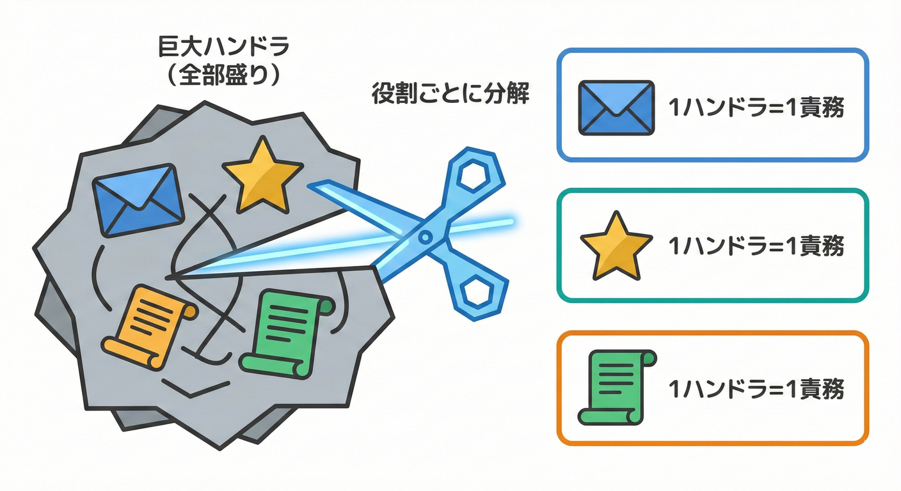

# 第22章：ハンドラ設計：1ハンドラ＝1責務🎯🌸

## 22.1 この章でできるようになること🎓✨

この章のゴールはこれ👇
**「OrderPaid（支払い完了）」のドメインイベント**に対して、やりたいことを **小さなハンドラに分解**して、増えても破綻しない形にすることです🧩💕

* ✅ 1ハンドラ＝1つの責務（役割）に分けられる
* ✅ ハンドラ名だけで「何をするか」が読める
* ✅ DIでハンドラを追加しても壊れにくい
* ✅ テストも書きやすくなる🧪✨

---

## 22.2 「巨大ハンドラ」は第2の巨大メソッド😵‍💫💥

ドメインイベントを導入しても、ハンドラがこうなると危険です👇

* 1つのハンドラが
  📧メール送信 + 🎁ポイント付与 + 🧾監査ログ + 📊分析送信 + …
  を全部やる
* 変更が入るたびに、同じファイルをいじることになる
* 「関係ない改修」で壊れやすくなる（事故りやすい）🌀

これって結局、**“イベントで分割したのに、付随処理が1箇所に再集合しただけ”**なんです😭

だからルールはシンプル👇
**🌟 1つのハンドラは、1つの理由でしか変更されないようにする（1責務）**

---

## 22.3 届いてから先を「疎結合」に保つ🔗🧼



イベントが配送された後、それぞれの処理が互いに影響を与えず、独立して動けるように設計します。

### ✅ 責務が1つかチェック

* 「このハンドラが変更される理由」は **1つ**？

  * 📧メール仕様変更 → メール用ハンドラだけ直す
  * 🎁ポイント計算変更 → ポイント用ハンドラだけ直す
  * 🧾監査ログ項目変更 → 監査ログ用ハンドラだけ直す
    ✅ これが理想✨

### ✅ 名前が“やること”を言い切ってる？

おすすめ命名パターン👇

* `SendReceiptEmailOnOrderPaid` 📧
* `GrantRewardPointsOnOrderPaid` 🎁
* `WriteAuditLogOnOrderPaid` 🧾

**「いつ（OnOrderPaid）」「何を（SendReceiptEmail）」**が読めると強いです💪✨

### ✅ 1つのハンドラの中で“役割分岐”してない？

こういうのは危険サイン⚠️

* `if (isVip) { VIPメール } else { 通常メール }`（※メールの中の分岐はOKだけど、責務が増える方向は注意）
* `if (featureFlag) { ポイント付与 }`（機能ON/OFFが増えると巨大化しやすい）

---

## 22.4 例題：OrderPaid でやりたいことを分解しよう🛒💳➡️🧩

ミニECで「支払い完了（OrderPaid）」が起きたとき、よくある付随処理はこんな感じ👇

1. 📧 レシートメールを送る
2. 🎁 購入ポイントを付与する
3. 🧾 監査ログ（後追いできるログ）を書く

ここで大事なのは👇
**「3つやりたい」なら、ハンドラも3つ作る**ことです🌸

---

## 22.5 実装：イベントとハンドラの最小セット🧩✨

### 22.5.1 ドメインイベント（OrderPaid）を用意🔔

イベントは「起きた事実」なので、**必要最小限の情報**だけ入れます📦✨

```csharp
public sealed record OrderPaid(
    Guid OrderId,
    decimal PaidAmount,
    DateTimeOffset OccurredAt
);
```

---

### 22.5.2 ハンドラ用インターフェースを用意🧱

```csharp
public interface IDomainEventHandler<in TEvent>
{
    Task HandleAsync(TEvent ev, CancellationToken ct);
}
```

---

## 22.6 3つのハンドラに分けて作る🎯🌸

### 22.6.1 📧 レシートメール送信ハンドラ

```csharp
public interface IEmailSender
{
    Task SendReceiptAsync(Guid orderId, CancellationToken ct);
}

public sealed class SendReceiptEmailOnOrderPaid : IDomainEventHandler<OrderPaid>
{
    private readonly IEmailSender _emailSender;
    private readonly ILogger<SendReceiptEmailOnOrderPaid> _logger;

    public SendReceiptEmailOnOrderPaid(
        IEmailSender emailSender,
        ILogger<SendReceiptEmailOnOrderPaid> logger)
    {
        _emailSender = emailSender;
        _logger = logger;
    }

    public async Task HandleAsync(OrderPaid ev, CancellationToken ct)
    {
        _logger.LogInformation("Sending receipt email. OrderId={OrderId}", ev.OrderId);
        await _emailSender.SendReceiptAsync(ev.OrderId, ct);
    }
}
```

---

### 22.6.2 🎁 ポイント付与ハンドラ

```csharp
public interface IRewardPointService
{
    Task GrantForPurchaseAsync(Guid orderId, decimal paidAmount, CancellationToken ct);
}

public sealed class GrantRewardPointsOnOrderPaid : IDomainEventHandler<OrderPaid>
{
    private readonly IRewardPointService _rewardPointService;
    private readonly ILogger<GrantRewardPointsOnOrderPaid> _logger;

    public GrantRewardPointsOnOrderPaid(
        IRewardPointService rewardPointService,
        ILogger<GrantRewardPointsOnOrderPaid> logger)
    {
        _rewardPointService = rewardPointService;
        _logger = logger;
    }

    public async Task HandleAsync(OrderPaid ev, CancellationToken ct)
    {
        _logger.LogInformation("Granting reward points. OrderId={OrderId}", ev.OrderId);
        await _rewardPointService.GrantForPurchaseAsync(ev.OrderId, ev.PaidAmount, ct);
    }
}
```

---

### 22.6.3 🧾 監査ログ（監査証跡）ハンドラ

```csharp
public interface IAuditLogWriter
{
    Task WriteAsync(string eventName, Guid aggregateId, DateTimeOffset occurredAt, CancellationToken ct);
}

public sealed class WriteAuditLogOnOrderPaid : IDomainEventHandler<OrderPaid>
{
    private readonly IAuditLogWriter _auditLogWriter;

    public WriteAuditLogOnOrderPaid(IAuditLogWriter auditLogWriter)
    {
        _auditLogWriter = auditLogWriter;
    }

    public Task HandleAsync(OrderPaid ev, CancellationToken ct)
    {
        return _auditLogWriter.WriteAsync(
            eventName: nameof(OrderPaid),
            aggregateId: ev.OrderId,
            occurredAt: ev.OccurredAt,
            ct: ct
        );
    }
}
```

🌟 ここまでで「3つのやりたいこと＝3ハンドラ」が完成です👏✨

---

## 22.7 DI登録：ハンドラは“追加するだけ”にする🧱➕

DIに登録して、**イベントディスパッチャがまとめて呼べる**ようにします🔁✨

```csharp
using Microsoft.Extensions.DependencyInjection;

public static class DomainEventHandlersRegistration
{
    public static IServiceCollection AddOrderPaidHandlers(this IServiceCollection services)
    {
        services.AddTransient<IDomainEventHandler<OrderPaid>, SendReceiptEmailOnOrderPaid>();
        services.AddTransient<IDomainEventHandler<OrderPaid>, GrantRewardPointsOnOrderPaid>();
        services.AddTransient<IDomainEventHandler<OrderPaid>, WriteAuditLogOnOrderPaid>();
        return services;
    }
}
```

💡 メモ：DIの寿命（Transient/Scoped/Singleton）は雑にやると事故りやすいです⚠️
特に **Singleton が Scoped（例：DbContext）を抱える**のは危険なので、基本は Transient/Scoped を中心に使うのが安全寄りです🧯✨ ([Microsoft Learn][1])

---

## 22.8 悪い例→良い例：巨大ハンドラを分割リファクタ✂️✨

### 😵‍💫 悪い例（全部入りハンドラ）

```csharp
public sealed class OrderPaidAllInOneHandler : IDomainEventHandler<OrderPaid>
{
    private readonly IEmailSender _emailSender;
    private readonly IRewardPointService _rewardPointService;
    private readonly IAuditLogWriter _auditLogWriter;

    public OrderPaidAllInOneHandler(
        IEmailSender emailSender,
        IRewardPointService rewardPointService,
        IAuditLogWriter auditLogWriter)
    {
        _emailSender = emailSender;
        _rewardPointService = rewardPointService;
        _auditLogWriter = auditLogWriter;
    }

    public async Task HandleAsync(OrderPaid ev, CancellationToken ct)
    {
        await _emailSender.SendReceiptAsync(ev.OrderId, ct);
        await _rewardPointService.GrantForPurchaseAsync(ev.OrderId, ev.PaidAmount, ct);
        await _auditLogWriter.WriteAsync(nameof(OrderPaid), ev.OrderId, ev.OccurredAt, ct);
    }
}
```

一見きれいでも、ここに

* メール文面改修📧
* ポイント仕様改修🎁
* 監査ログ項目追加🧾
  が全部集まって、育つと地獄です😇💦

### 🌸 良い例（3ハンドラに分割）

すでに作った👇

* `SendReceiptEmailOnOrderPaid`
* `GrantRewardPointsOnOrderPaid`
* `WriteAuditLogOnOrderPaid`

✅ 変更の影響範囲が小さくなって、事故りにくいです🛡️✨

---

## 22.9 テストもしやすくなる🧪💖（超ミニ例）

「メール送った？」だけをテストできるのが強みです💪✨

```csharp
public sealed class FakeEmailSender : IEmailSender
{
    public Guid? LastOrderId { get; private set; }

    public Task SendReceiptAsync(Guid orderId, CancellationToken ct)
    {
        LastOrderId = orderId;
        return Task.CompletedTask;
    }
}
```

---

## 22.10 AI相棒の使い方（ハンドラ分割が速くなる🤖💨）

AIには「分割」「命名」「テスト案」が得意です🧠✨
使いやすいプロンプト例👇

* 🧩 分割案
  「OrderPaidでやりたい処理が *メール/ポイント/監査ログ/分析* です。1ハンドラ1責務でクラス分割案と命名案を出して」

* ✍️ 雛形生成
  「`IDomainEventHandler<OrderPaid>` を実装する `SendReceiptEmailOnOrderPaid` の雛形を、依存はインターフェースにして作って」

* 🧪 テスト案
  「`GrantRewardPointsOnOrderPaid` の単体テスト観点を3つ、フェイク実装例も含めて提案して」

✅ ただし、**“何を責務に分けるか”の判断は人が決める**のが安全です🎯✨（そこが設計のキモ！）

---

## 22.11 章末チェック✅🌸

* ✅ OrderPaidでやりたいことを3つに分解できた？
* ✅ 1ハンドラが1つの理由でしか変更されない形になってる？
* ✅ ハンドラ名だけで「何をするか」読める？
* ✅ DI登録は「追加するだけ」になってる？

---

## 参考（2026時点の公式情報）📚✨

* .NET は毎年11月にメジャーが出て、LTS/STSでサポート期間が分かれる（LTS=3年、STS=2年）([Microsoft][2])
* .NET 10/9/8 の開始日・終了日（ライフサイクル一覧）([Microsoft Learn][3])
* .NET 9 から STS が 24か月サポートになり、終了日が明確化された（例：2026-11-10）([Microsoft for Developers][4])
* 依存性注入（DI）のガイドライン（Singletonの注意など）([Microsoft Learn][1])

[1]: https://learn.microsoft.com/en-us/dotnet/core/extensions/dependency-injection-guidelines?utm_source=chatgpt.com "Dependency injection guidelines - .NET | Microsoft Learn"
[2]: https://dotnet.microsoft.com/en-us/platform/support/policy/dotnet-core?utm_source=chatgpt.com ".NET and .NET Core official support policy | .NET"
[3]: https://learn.microsoft.com/en-us/lifecycle/products/microsoft-net-and-net-core?utm_source=chatgpt.com "Microsoft .NET and .NET Core - Microsoft Lifecycle"
[4]: https://devblogs.microsoft.com/dotnet/dotnet-sts-releases-supported-for-24-months/?utm_source=chatgpt.com ".NET STS releases supported for 24 months"
