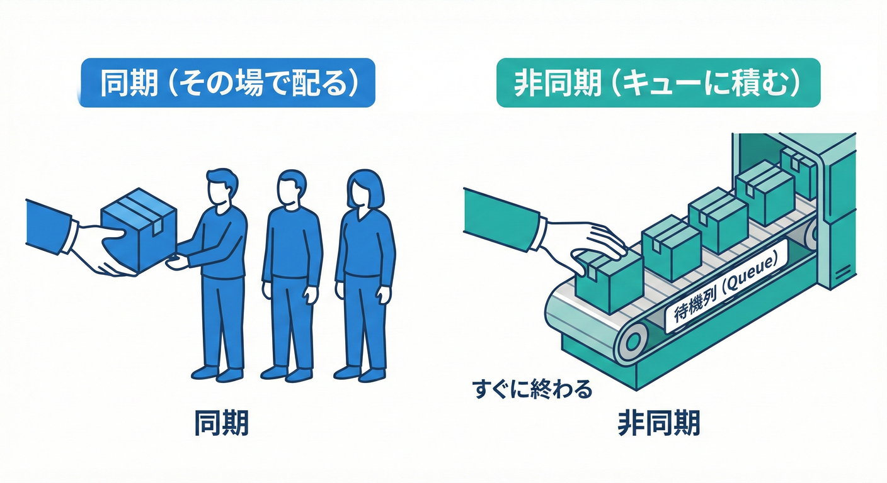
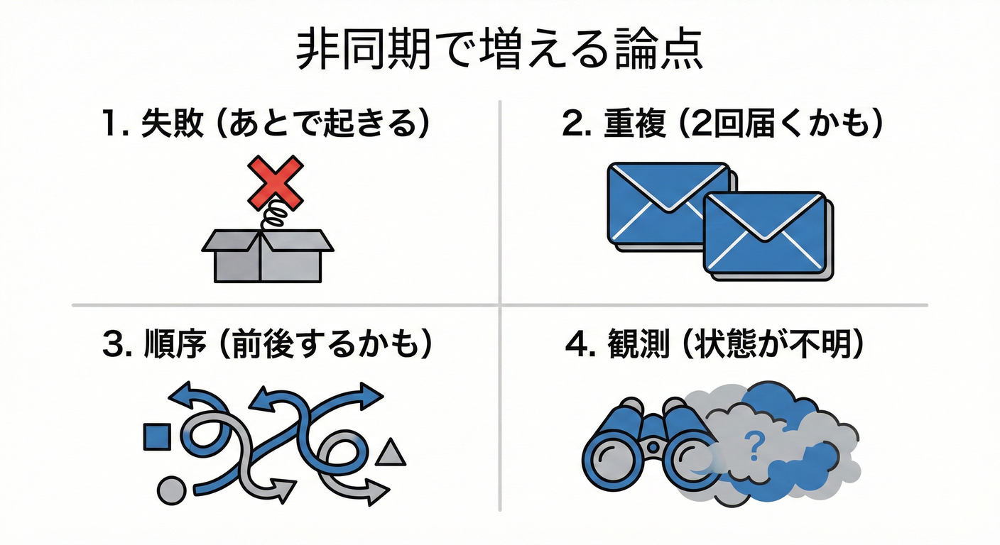
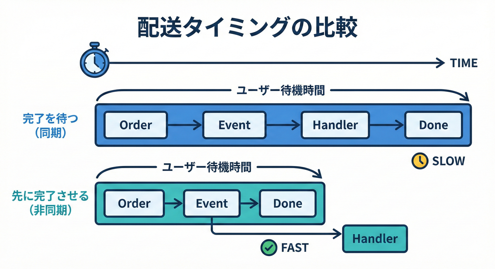

# 第23章：同期と非同期：まず同期でOK、その後に発展🔁🙂

## 23.1 ドメインイベントの同期 vs 非同期⚖️🕒



イベントを「今すぐその場で処理するか」と「後で誰かに任せるか」には、それぞれメリットとデメリットがあります。
* ドメインイベントを **まず同期で安全に完成**させる手順がわかる🧩
* 非同期にした瞬間に増える「失敗・重複・順序・観測」の論点が整理できる⚠️🔭
* “ミニEC”の `OrderPaid` を例に、同期→非同期へ発展させるイメージが持てる🛒💳📦

---

## 23.5 非同期（あとで実行）にすると、何が増える？📦⚠️



非同期は運用向きだけど、急にむずかしくなる😵‍💫

## 23.2 まず言葉の整理：「async/await」と「非同期（あとで実行）」は別モノ🍓🤔

初心者がいちばん混乱しがちポイント！✨

### A) `async/await`（= 途中で待てる書き方）⌛

* “同じリクエスト/同じ処理の流れ”の中で、I/O待ち（DB/HTTPなど）を **いい感じに待つ**ための仕組み🙂
* たとえば「支払い登録→DB保存をawait→次へ」みたいなやつ💾

### B) 非同期（= あとで/別の流れで実行する）📨

* “いまの処理”とは切り離して、**後から別のタイミングで実行**する考え方⏭️
* たとえば「注文は確定した。メール送信はあとでまとめて送る」📧

この章の「同期/非同期」は **Bの意味（あとで実行）** が中心だよ🙂✨

---

## 23.3 同期ディスパッチ（その場で配る）って何？🏠📣

ドメインイベントを起こした直後に、イベントハンドラを **その場で呼ぶ**スタイル🎯

### ざっくり図🗺️

* 例：支払い完了（`OrderPaid`）が起きた直後に…

1. 注文の状態が変わる
2. `OrderPaid` を発生
3. ディスパッチャが **すぐ** ハンドラを呼ぶ
4. 呼び終わったら処理完了🏁

### 同期が嬉しいところ😊

* **デバッグが簡単**（ブレークポイントが追える）🧷
* **学習向き**（設計の形が頭に入りやすい）🧠
* 失敗したら「どこで失敗したか」がすぐ分かる🔎

MicrosoftのDDD/マイクロサービス解説でも、ドメインイベントは（同一ドメイン内で）すぐ発生して扱うケースが多く、同期/非同期どちらもあり得る、と整理されてるよ📚([Microsoft Learn][1])

---

## 23.4 まず同期でOKな場面チェック✅🙂

次に当てはまるなら、まず同期で作るのが超おすすめ🧁

* そのイベントの副作用が **軽い**（ログ1行、メモリ上の更新など）🪶
* **同じ画面/同じAPI呼び出しの中で結果が必要**（例：合計金額の再計算）🧮
* 失敗したら、その場でユーザーにエラーを返したい🙅‍♀️
* まだ運用で「取りこぼし」や「再送」を本気で考えなくてOK（学習段階）🙂

---

## 23.3 非同期実行（Background Processing）🔁🏃‍♀️



メインの流れとは別に、バックグラウンドで処理を進める方法について学びます。
第23章は「増える論点」を先に見える化しておく章だよ✨

### 非同期で増える4点セット🧨

1. **失敗**：あとで実行するから、その場で失敗が見えない😶
2. **重複**：リトライすると“同じイベント”が複数回来るかも🔁
3. **順序**：`OrderPaid` と `OrderShipped` の順番が前後するかも🌀
4. **観測**：どこで止まったか追える仕組み（ログ/相関ID）が必要🔭

さらに、非同期で外部通信（HTTP/メール）をやるなら **一時的エラー（transient fault）** を前提にして、リトライや待ち（バックオフ）を設計するのが推奨されるよ🌧️([Microsoft Learn][2])
.NETでは Polly 系のガイドも定番の読み物📘([Microsoft Learn][3])

---

## 23.6 ミニECで比較：`OrderPaid` を「同期→非同期」で見比べる🛒💳

題材：支払いが完了したら…

* ポイント付与🎁
* お礼メール送信📧
* 監査ログ🧾

### まず同期（学習向き）🏠

* `Pay()` が終わるまでに、ハンドラも全部動く
* メール送信が遅いと、`Pay()` 全体が遅くなる🐢

### 次に非同期（運用向き）📨

* `Pay()` は「支払い完了」までで返す
* ポイント/メール/ログは後で処理
* ただし「メール失敗」「再送」「二重付与」などが現実問題になる⚠️

---

## 23.7 実装例①：同期ディスパッチ（インプロセス）🧩🏠

ここでは「イベントを溜める（第19章）」→「ディスパッチャで配る（第20章）」を、同期で完成させるよ🙂

### ドメイン側：イベントを溜める📮

```csharp
using System;
using System.Collections.Generic;

public interface IDomainEvent
{
    DateTimeOffset OccurredAt { get; }
}

public abstract class AggregateRoot
{
    private readonly List<IDomainEvent> _domainEvents = new();
    public IReadOnlyList<IDomainEvent> DomainEvents => _domainEvents;

    protected void AddDomainEvent(IDomainEvent ev) => _domainEvents.Add(ev);

    public List<IDomainEvent> PullDomainEvents()
    {
        var list = new List<IDomainEvent>(_domainEvents);
        _domainEvents.Clear();
        return list;
    }
}

public sealed record OrderPaid(Guid OrderId, DateTimeOffset OccurredAt) : IDomainEvent;

public sealed class Order : AggregateRoot
{
    public Guid Id { get; }
    public bool IsPaid { get; private set; }

    public Order(Guid id) => Id = id;

    public void MarkAsPaid()
    {
        if (IsPaid) return; // ここは後で「冪等性」の話につながるよ🙂
        IsPaid = true;

        AddDomainEvent(new OrderPaid(Id, DateTimeOffset.UtcNow));
    }
}
```

### アプリ側：イベントハンドラとディスパッチャ📣

```csharp
using System;
using System.Linq;
using System.Threading;
using System.Threading.Tasks;
using Microsoft.Extensions.DependencyInjection;

public interface IDomainEventHandler<in TEvent> where TEvent : IDomainEvent
{
    Task HandleAsync(TEvent ev, CancellationToken ct);
}

public sealed class DomainEventDispatcher
{
    private readonly IServiceProvider _sp;

    public DomainEventDispatcher(IServiceProvider sp) => _sp = sp;

    public async Task DispatchAsync(IDomainEvent ev, CancellationToken ct)
    {
        var handlerType = typeof(IDomainEventHandler<>).MakeGenericType(ev.GetType());
        var handlers = _sp.GetServices(handlerType);

        foreach (var h in handlers)
        {
            // dynamicは初心者にやさしくないけど「最小の仕組み」を見せるために採用🙂
            await ((dynamic)h).HandleAsync((dynamic)ev, ct);
        }
    }
}

public sealed class GivePointsOnOrderPaid : IDomainEventHandler<OrderPaid>
{
    public Task HandleAsync(OrderPaid ev, CancellationToken ct)
    {
        Console.WriteLine($"🎁 points granted for order={ev.OrderId}");
        return Task.CompletedTask;
    }
}

public sealed class SendThanksEmailOnOrderPaid : IDomainEventHandler<OrderPaid>
{
    public Task HandleAsync(OrderPaid ev, CancellationToken ct)
    {
        Console.WriteLine($"📧 thanks email sent for order={ev.OrderId}");
        return Task.CompletedTask;
    }
}
```

### 使う側（アプリサービスのイメージ）🛠️

```csharp
using System.Threading;
using System.Threading.Tasks;

public sealed class PaymentService
{
    private readonly DomainEventDispatcher _dispatcher;

    public PaymentService(DomainEventDispatcher dispatcher)
        => _dispatcher = dispatcher;

    public async Task PayAsync(Order order, CancellationToken ct)
    {
        // ① ドメイン操作
        order.MarkAsPaid();

        // ② （本来はここでDB保存…💾）

        // ③ ドメインイベント回収→同期ディスパッチ
        var events = order.PullDomainEvents();
        foreach (var ev in events)
            await _dispatcher.DispatchAsync(ev, ct);
    }
}
```

✅ これで「同期で完成」！
まずはこの形を100%理解できるようにするのが最強だよ🙂✨

---

## 23.8 実装例②：非同期っぽくする最小形（インメモリキュー＋HostedService）📨🏃‍♀️

「あとでやる」を体験するための **最小形** を作るよ🧪
ASP.NET Core では、バックグラウンド処理は Hosted Service（`IHostedService` / `BackgroundService`）で実装できるよ📦([Microsoft Learn][4])

> ⚠️ 注意：インメモリキューはアプリが落ちたら消えるよ😱
> 取りこぼし対策（Outboxなど）は第30〜31章でやる！🗃️🚚
> Outboxは「確実に届けたい」時の定番としてMicrosoftの解説もあるよ📘([Microsoft Learn][5])

### キュー（後で実行する仕事を積む）📮

```csharp
using System;
using System.Threading;
using System.Threading.Channels;
using System.Threading.Tasks;

public interface IBackgroundTaskQueue
{
    ValueTask QueueAsync(Func<CancellationToken, Task> workItem);
    ValueTask<Func<CancellationToken, Task>> DequeueAsync(CancellationToken ct);
}

public sealed class BackgroundTaskQueue : IBackgroundTaskQueue
{
    private readonly Channel<Func<CancellationToken, Task>> _queue =
        Channel.CreateUnbounded<Func<CancellationToken, Task>>();

    public ValueTask QueueAsync(Func<CancellationToken, Task> workItem)
        => _queue.Writer.WriteAsync(workItem);

    public ValueTask<Func<CancellationToken, Task>> DequeueAsync(CancellationToken ct)
        => _queue.Reader.ReadAsync(ct);
}
```

### ワーカー（キューを順番に実行する）🏃‍♀️💨

```csharp
using System;
using System.Threading;
using System.Threading.Tasks;
using Microsoft.Extensions.Hosting;

public sealed class QueuedWorker : BackgroundService
{
    private readonly IBackgroundTaskQueue _queue;

    public QueuedWorker(IBackgroundTaskQueue queue) => _queue = queue;

    protected override async Task ExecuteAsync(CancellationToken stoppingToken)
    {
        while (!stoppingToken.IsCancellationRequested)
        {
            var workItem = await _queue.DequeueAsync(stoppingToken);

            try
            {
                await workItem(stoppingToken);
            }
            catch (Exception ex)
            {
                Console.WriteLine($"💥 background task failed: {ex.Message}");
                // 本当はログやリトライ方針が必要（次章以降につながるよ🙂）
            }
        }
    }
}
```

### アプリサービス側：同期ディスパッチ→「キューに積む」に変更📨

```csharp
using System.Threading;
using System.Threading.Tasks;

public sealed class PaymentServiceAsyncStyle
{
    private readonly DomainEventDispatcher _dispatcher;
    private readonly IBackgroundTaskQueue _queue;

    public PaymentServiceAsyncStyle(DomainEventDispatcher dispatcher, IBackgroundTaskQueue queue)
    {
        _dispatcher = dispatcher;
        _queue = queue;
    }

    public async Task PayAsync(Order order, CancellationToken ct)
    {
        order.MarkAsPaid();

        // （本来はここでDB保存…💾）

        var events = order.PullDomainEvents();

        // ✅「あとで」ディスパッチする
        await _queue.QueueAsync(async bgCt =>
        {
            foreach (var ev in events)
                await _dispatcher.DispatchAsync(ev, bgCt);
        });
    }
}
```

これで「Payの処理」と「ハンドラ処理」が分離できた🙂✨
でも、ここから先は「失敗」「重複」「順序」「観測」が本気で必要になるよ⚠️

---

## 23.9 失敗の扱い：同期 vs 非同期（超大事）💥🧠

例：「メール送信が失敗した！」📧❌

### 同期だと…🏠

* `Pay()` の中で失敗
* その場で例外 → 画面にも失敗が返る
* “主処理まで巻き戻すか？”で悩みがち（次章のテーマ）🙂

### 非同期だと…📨

* `Pay()` は成功したことになって返る
* その後どこかでメールが失敗する
* だから必要になる👇

  * リトライ（間隔を空けて再実行）🔁
  * 何回やったかの記録🧾
  * 二重送信・二重付与を防ぐ冪等性🧷
  * 監視・アラート🔭

一時的な障害（ネットワーク等）は普通に起きる前提で設計しよう、というガイドもあるよ🌧️([Microsoft Learn][2])
リトライなどの実装パターンはPolly系のガイドが定番📘([Microsoft Learn][3])

---

## 23.10 「同期で完成→非同期へ」判断フローチャート🧭🙂

* まず同期でOK？

  * 副作用が軽い？🪶
  * その場で結果が必要？📣
  * 失敗を即通知したい？🙅‍♀️
    → YESなら同期で完成🏁

* 非同期にする理由がある？

  * 外部連携で遅い/不安定（メール・API）📧🌧️
  * ユーザー応答を速くしたい⚡
  * “確実に届けたい”要件が出た📦
    → 非同期へ。ただし Outbox 等が必要になりやすい🗃️([Microsoft Learn][5])

---

## 23.11 やってみよう🛠️（演習）🎀

### 演習1：同期版で「追える幸せ」を体験🧷

1. `Order.MarkAsPaid()` にブレークポイント
2. `PullDomainEvents()` → `DispatchAsync()` の流れをステップ実行👣
3. 「イベントが“仕様”として見える」感覚をメモ📝

### 演習2：非同期版で「見えなくなる」を体験😵‍💫

1. キュー版に切り替える
2. `PayAsync()` が先に終わるのを確認
3. ワーカー側で例外を投げて、どこで失敗が出るか観察👀💥

### 演習3：AI相棒プロンプト（雛形づくり）🤖✨

* 「`OrderPaid` のハンドラを3種類（ポイント付与/メール/ログ）で作って。責務は1つずつ。例外時のログも入れて。」
* 「同期と非同期で、失敗をどう扱うべきか“ビジネス判断”の質問リストを作って。」

---

## 23.12 章末チェック✅🙂

* 「`async/await`」と「あとで実行（非同期）」の違いを言える？🍓
* 同期ディスパッチのメリット（学習・デバッグ）を説明できる？🏠
* 非同期にした瞬間に増える4点（失敗/重複/順序/観測）を言える？⚠️
* インメモリキューが落ちたら消える＝取りこぼし問題が起きるのを理解した？😱
* “確実に届けたい”が出たらOutboxなどが必要、という流れを把握した？🗃️([Microsoft Learn][5])

---

次章（第24章）では、「失敗したとき、主処理まで失敗扱いにする？」を、業務ルールとしてスッキリ整理するよ💥🧠

[1]: https://learn.microsoft.com/en-us/dotnet/architecture/microservices/microservice-ddd-cqrs-patterns/domain-events-design-implementation?utm_source=chatgpt.com "Domain events: Design and implementation - .NET"
[2]: https://learn.microsoft.com/en-us/azure/well-architected/design-guides/handle-transient-faults?utm_source=chatgpt.com "Recommendations for handling transient faults"
[3]: https://learn.microsoft.com/en-us/dotnet/architecture/microservices/implement-resilient-applications/implement-http-call-retries-exponential-backoff-polly?utm_source=chatgpt.com "Implement HTTP call retries with exponential backoff ..."
[4]: https://learn.microsoft.com/en-us/aspnet/core/fundamentals/host/hosted-services?view=aspnetcore-10.0&utm_source=chatgpt.com "Background tasks with hosted services in ASP.NET Core"
[5]: https://learn.microsoft.com/en-us/azure/architecture/databases/guide/transactional-outbox-cosmos?utm_source=chatgpt.com "Transactional Outbox pattern with Azure Cosmos DB"
