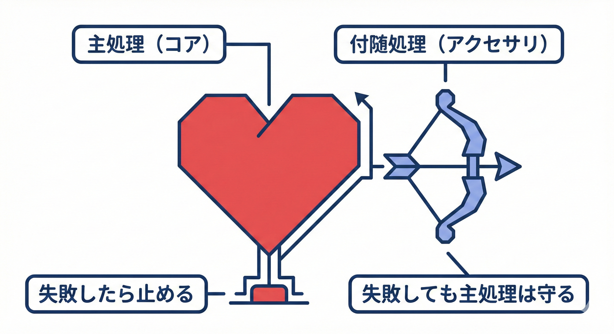
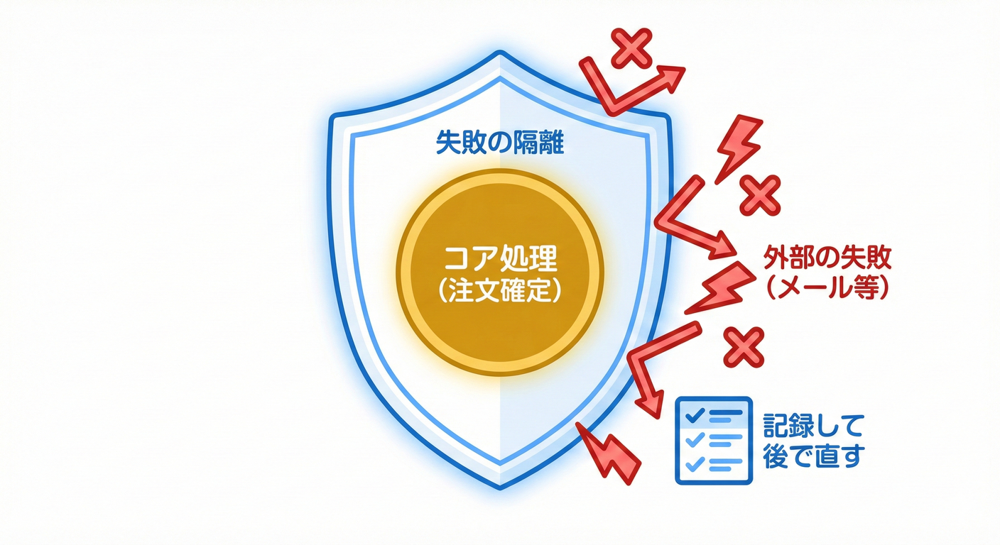

# 第24章 例外と失敗の考え方：主処理と付随処理を分ける💥🧠

## この章でわかるようになること🎓✨

* 「**主処理**（例：支払い確定）」と「**付随処理**（例：メール送信）」を分けて考えられる🙂📌
* 付随処理が失敗しても、主処理を**巻き戻さない**設計ができる🔁🧩
* 例外（Exception）を「投げるべき/握るべき」の判断ができるようになる🙆‍♀️🙅‍♀️
* 失敗を「**記録して、あとで直せる**」状態にできる🧾🛟

---

## 1. まず結論：失敗の“重さ”が違う⚖️😵‍💫

同じ「失敗」でも、重さが違うんだよね🙂

* ✅ **主処理の失敗**：注文確定できない、支払い確定できない → これはユーザー体験・業務ルールに直撃💥
* ⚠️ **付随処理の失敗**：メール送信できない、ログが一部残らない → “困るけど、注文は成立していい”ことが多い📧💦

ここを混ぜると…
**「メールが送れなかったから支払いも無かったことにします」**みたいな悲劇が起きがち😱🌀

---

## 24.2 メイン処理（Primary）と付随処理（Secondary）❤️🎗️



ビジネスとして絶対に成功させたい「メインの仕事」と、失敗しても致命的ではない「脇役の仕事」を分けて考えます。

### 主処理（ドメインの中心）❤️🔥

「それが成立しないなら、ユースケース自体が失敗」なもの。

例：

* 支払い確定（Paidにする）💳✅
* 発送確定（Shippedにする）📦✅
* 在庫引当（引当できないなら売れない）📉❌

👉 主処理は **不変条件（Invariants）** を守りながら状態を変える💎🔐
失敗したら **例外 or 失敗結果** を返して止めてOK🙆‍♀️

### 24.1 例外を投げるかどうか？🤔💥



エラーが起きたとき、呼び出し元に例外を伝えて全体の処理を止めるべきか、ログだけ残して進めるべきかを判断します。

### 付随処理（あとから付いてくるやつ）🎀🧩

「できると嬉しいけど、できなくても主処理は成立していい」ことが多い。

例：

* 支払い完了メール📧
* ポイント付与🎁
* 分析ログ送信📊
* 通知（Slack/Push）🔔

👉 付随処理は **ドメインイベントのハンドラ側** に寄せるのが基本🙂🔔

---

## 3. 例外（Exception）って“何のため”？🧨🤔

.NETは「失敗」を例外で表す仕組みを持ってるよね。で、例外は**乱用すると地獄**😇🔥
Microsoftの例外ベストプラクティスでも「例外で通常フローを作らない」「回復できないならキャッチしない」などが整理されてるよ📘✨ ([Microsoft Learn][1])

この教材では、まずこう決めるのがラク👇

### ✅ 例外を投げていい場面（主処理寄り）💥

* 不変条件違反（支払い前に発送しようとした、金額が不正など）🔐
* 依存してる処理が失敗したらユースケース続行不可（決済APIが落ちた等）💳❌

### ⚠️ 例外を“握っていい”場面（付随処理寄り）🧤

* メールが送れない📧💦
* ログ送信が失敗📊💦
* 外部通知が失敗🔔💦

握る＝「無視」じゃないよ！！
**記録して、あとで復旧できる形にする**のがセット🧾🛟

---

## 4. “主処理が成功したあと”にイベントを配るのが基本🏁🔔

ここ、超だいじ🙂✨

1. 主処理で状態変更（例：OrderをPaidにする）
2. 保存して主処理を確定（DBコミット相当）
3. そのあとにイベントを配信して付随処理を実行

これにすると、付随処理が失敗しても
**「支払いは確定してる」**を守れる👍✨

ちなみに2026年1月時点では .NET 10 がLTSで、1/13に 10.0.2 パッチが出てるよ（運用はLTSが無難になりがち）🧩🪟 ([Microsoft][2])
そして .NET 10 系の既定C#は C# 14 だよ🧠✨ ([Microsoft Learn][3])

---

## 5. 実装例：PayOrder（主処理）→ OrderPaid（イベント）→ 付随処理📦➡️🔔➡️📧

### 5.1 ドメインイベントの最小形🔔

```csharp
public interface IDomainEvent
{
    DateTimeOffset OccurredAt { get; }
}

public sealed record OrderPaid(Guid OrderId, DateTimeOffset OccurredAt) : IDomainEvent;
```

### 5.2 集約ルートに「イベントを溜める」📮🧺（第19章の形）

```csharp
public abstract class AggregateRoot
{
    private readonly List<IDomainEvent> _domainEvents = new();

    public IReadOnlyList<IDomainEvent> DomainEvents => _domainEvents;

    protected void AddDomainEvent(IDomainEvent ev) => _domainEvents.Add(ev);

    public void ClearDomainEvents() => _domainEvents.Clear();
}
```

### 5.3 Order（主処理の中心）💳🛒

```csharp
public sealed class Order : AggregateRoot
{
    public Guid Id { get; }
    public bool IsPaid { get; private set; }

    public Order(Guid id)
    {
        Id = id;
    }

    public void MarkAsPaid(DateTimeOffset now)
    {
        if (IsPaid) return; // 2重払い防止（簡易）

        IsPaid = true;

        // 「起きた事実」をイベントにする🔔
        AddDomainEvent(new OrderPaid(Id, now));
    }
}
```

---

## 6. アプリケーション層：主処理は“失敗したら止めていい”🛑✅

ここが主処理の責任者🙂✨
主処理がダメなら、イベント以前にユースケース失敗でOK。

```csharp
public interface IOrderRepository
{
    Task<Order?> FindAsync(Guid orderId, CancellationToken ct);
    Task SaveAsync(Order order, CancellationToken ct);
}

public interface IDomainEventDispatcher
{
    Task DispatchAsync(IEnumerable<IDomainEvent> events, CancellationToken ct);
}

public sealed class PayOrderService
{
    private readonly IOrderRepository _orders;
    private readonly IDomainEventDispatcher _dispatcher;

    public PayOrderService(IOrderRepository orders, IDomainEventDispatcher dispatcher)
    {
        _orders = orders;
        _dispatcher = dispatcher;
    }

    public async Task PayAsync(Guid orderId, DateTimeOffset now, CancellationToken ct)
    {
        var order = await _orders.FindAsync(orderId, ct)
                   ?? throw new InvalidOperationException("Order not found.");

        // 主処理：状態変更（ここが失敗するならユースケース失敗でOK）✅
        order.MarkAsPaid(now);

        // 主処理：保存（ここが失敗したらユースケース失敗）✅
        await _orders.SaveAsync(order, ct);

        // 付随処理：イベント配信（主処理の確定“後”）🔔
        await _dispatcher.DispatchAsync(order.DomainEvents, ct);

        // 配り終わったら掃除🧹
        order.ClearDomainEvents();
    }
}
```

ポイントはここ👇🙂

* 保存（主処理確定）が終わってからイベント配信してる🏁
* これで「メール失敗で支払いが無かったことになる」を防ぎやすい📧💦➡️🙅‍♀️

---

## 7. ディスパッチャ側：付随処理は“まとめて巻き戻さない”🧯🔁

付随処理で例外が起きても、主処理まで巻き戻す必要がないケースが多いよね🙂
だからディスパッチャ側はこういう発想になる👇

* ハンドラ1個が失敗しても、他のハンドラは実行してOK（ケース多い）🎯
* 失敗は記録して、あとで再実行できるようにする🧾🛟

```csharp
public interface IDomainEventHandler<in TEvent> where TEvent : IDomainEvent
{
    Task HandleAsync(TEvent ev, CancellationToken ct);
}

public interface IFailureStore
{
    Task SaveAsync(string eventType, string payloadJson, string reason, DateTimeOffset occurredAt, CancellationToken ct);
}

public sealed class InProcessDomainEventDispatcher : IDomainEventDispatcher
{
    private readonly IServiceProvider _sp;
    private readonly IFailureStore _failures;

    public InProcessDomainEventDispatcher(IServiceProvider sp, IFailureStore failures)
    {
        _sp = sp;
        _failures = failures;
    }

    public async Task DispatchAsync(IEnumerable<IDomainEvent> events, CancellationToken ct)
    {
        foreach (var ev in events)
        {
            // ここはシンプルに：型ごとにハンドラを全部呼ぶ（DIで取る想定）🧩
            var handlers = ResolveHandlers(ev);

            foreach (var handler in handlers)
            {
                try
                {
                    await handler(ev, ct);
                }
                catch (OperationCanceledException)
                {
                    // キャンセルは“失敗”というより中断扱いが多いので、そのまま投げ直しが無難🙂🛑
                    throw;
                }
                catch (Exception ex)
                {
                    // ✅ 付随処理の失敗：ここで“主処理を壊さない”判断ができる✨
                    // でも“無視”ではなく、記録して救えるようにする🧾🛟
                    await _failures.SaveAsync(
                        eventType: ev.GetType().FullName ?? "Unknown",
                        payloadJson: System.Text.Json.JsonSerializer.Serialize(ev),
                        reason: ex.ToString(),
                        occurredAt: ev.OccurredAt,
                        ct: ct
                    );

                    // ここでは飲み込む（ベストエフォート）🧤
                }
            }
        }
    }

    private List<Func<IDomainEvent, CancellationToken, Task>> ResolveHandlers(IDomainEvent ev)
    {
        // 実装はDI/反射/ジェネリック等いろいろだけど、この章では概念優先🙂
        // 例：IEnumerable<IDomainEventHandler<OrderPaid>> を取ってラップする…など
        return new();
    }
}
```

---

## 8. 「メール失敗で注文も失敗？」の判断フローチャート🧭📧

付随処理が失敗したときの判断、これで迷いが減るよ🙂✨

### Q1：それができないと“不変条件が壊れる”？🔐

* YES → **主処理に寄せる**（イベントじゃなく主処理の一部）
* NO → 次へ🙂

### Q2：ユーザーに即時の保証が必要？（例：画面で「送信完了」表示が必要）🖥️

* YES → 付随処理でも「成功/失敗」を返す設計を検討（ただし運用は難しくなる）⚠️
* NO → 次へ🙂

### Q3：失敗しても“あとで復旧”できる？🛟

* YES → **失敗を記録**して後で再実行（第25章・第31章に接続）🔁
* NO → そもそも要件・業務側の設計見直しが必要かも🤝💬

---

## 9. “一時的エラー”はリトライ候補🌧️🔁（ミニ入門）

メール送信や外部APIは **一時的に落ちる**のが普通😇
.NET のレジリエンス（耐障害）では Polly を基盤にした公式のガイド/パッケージも用意されてるよ🧩🛡️ ([Microsoft Learn][4])

ここでは超ミニで「再試行」を雰囲気だけ👇（本格運用は第25章で育てる）

```csharp
public static class Retry
{
    public static async Task RunAsync(Func<Task> action, int maxRetry, TimeSpan delay, CancellationToken ct)
    {
        for (int i = 0; ; i++)
        {
            try
            {
                await action();
                return;
            }
            catch when (i < maxRetry)
            {
                await Task.Delay(delay, ct);
            }
        }
    }
}
```

ハンドラ側で：

```csharp
public sealed class SendPaidEmailHandler : IDomainEventHandler<OrderPaid>
{
    private readonly IEmailSender _email;

    public SendPaidEmailHandler(IEmailSender email) => _email = email;

    public async Task HandleAsync(OrderPaid ev, CancellationToken ct)
    {
        await Retry.RunAsync(
            action: () => _email.SendPaidAsync(ev.OrderId, ct),
            maxRetry: 3,
            delay: TimeSpan.FromSeconds(2),
            ct: ct
        );
    }
}
```

※「何でもかんでもリトライ」は危険だよ⚠️
“恒久的に無理”（宛先不正など）までリトライすると地獄👻
ここを次章（第25章）で整理する🧯✨

---

## 10. よくある地雷🔥（踏むとつらい）

### 地雷①：イベント配信を“保存前”にやる💣

* メール送れた✅
* でも保存が失敗して注文は存在しない❌
  → 「送ったのに無い」事故😱

👉 保存→配信 の順が基本🏁🔔

### 地雷②：付随処理の例外で主処理まで失敗にする💥

* メール失敗📧💦
* 支払い確定も無かったことに…💳❌
  → ユーザー混乱🌀

👉 付随処理は原則 “記録して後で復旧”🧾🛟

### 地雷③：catchして何もしない（闇に葬る）🕳️

* 失敗が起きたことすら分からない🙂💦

👉 「最低限のログ＋失敗保存」はセット🧾✨

---

## 11. Webアプリの例外処理（参考）🌐🧯

Web（ASP.NET Core）では、最終的には例外をまとめてハンドリングして、適切なレスポンスにするよね。最新のASP.NET Core 10 系のエラーハンドリング（UseExceptionHandler など）も更新されてるよ🧩🪟 ([Microsoft Learn][5])
ただしこの章の主役は「ドメインイベントで付随処理を巻き戻さない」だから、Webの話は“外側でまとめて受ける”くらいの位置づけでOK🙂👍

---

## 12. AIに頼むときのプロンプト例🤖📝✨

* 「OrderPaid のイベントハンドラを3つ（メール、ポイント、監査ログ）に分けて雛形を書いて」📧🎁🧾
* 「付随処理の例外を握りつつ、失敗を FailureStore に保存する実装案を出して」🧤🛟
* 「OperationCanceledException は投げ直す理由も含めてレビューして」🛑🔍

---

## 13. 演習🧪🎮✨

### 演習1：分類ゲーム（主処理？付随処理？）🧠

次を分類してね👇

1. 支払い確定 💳
2. 支払い完了メール 📧
3. 在庫引当 📦
4. ポイント付与 🎁
5. 分析ログ送信 📊

### 演習2：設計判断⚖️

「メールが送れないとき、注文は失敗扱い？」

* YES/NO を決めて
* 理由を “不変条件/ユーザー保証/復旧可否” の3観点で書く📝✨

### 演習3：コード改造🛠️

SendPaidEmailHandler に

* リトライ（最大3回）🔁
* 失敗したら FailureStore 保存🧾
  を入れてみよう🙂

---

## まとめ🎀✅

* **主処理**は「成立しないなら止めてOK」✅🛑
* **付随処理**は「失敗しても主処理を壊さない」設計が基本📧💦➡️🙂
* ただし「握る＝無視」じゃない！ **記録して復旧できる形**にする🧾🛟
* 一時的エラーはリトライ候補🌧️🔁（でも次章で“やりすぎ防止”を学ぶ🧯✨）

[1]: https://learn.microsoft.com/en-us/dotnet/standard/exceptions/best-practices-for-exceptions?utm_source=chatgpt.com "Best practices for exceptions - .NET"
[2]: https://dotnet.microsoft.com/en-us/platform/support/policy/dotnet-core ".NET and .NET Core official support policy | .NET"
[3]: https://learn.microsoft.com/en-us/dotnet/csharp/language-reference/language-versioning "Language versioning - C# reference | Microsoft Learn"
[4]: https://learn.microsoft.com/en-us/dotnet/core/resilience/?utm_source=chatgpt.com "Introduction to resilient app development - .NET"
[5]: https://learn.microsoft.com/en-us/aspnet/core/fundamentals/error-handling?view=aspnetcore-10.0&utm_source=chatgpt.com "Handle errors in ASP.NET Core"
